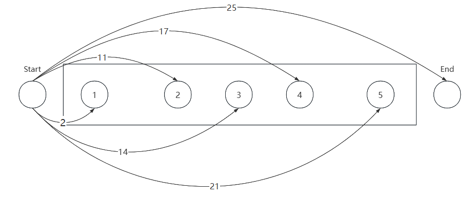

```cpp
Algorithm篇（C++），配合LeetCode和Luogu使用，所以在正式阅读本文之前，请先注册属于自己的账号，并且熟悉两个平台的用法。
请在学习C++基础篇以及数据结构后阅读本文，本文重点教你如何刷题，以及部分常见算法题的思路。
在学习每一章节之前，请先预习各个章节的第一部分，也就是至少先将题看一遍，且有自己大概的思路，再来学习本笔记。切记笔记中的所有思路解仅供参考，每个人写代码的风格都不一样，而且思路或多或少都会有差异，以自己理解为准。
本笔记旨在整理课程内容，其目标如下：
1、学会做题——分析题意，寻找思路/确定算法，把思路转换成代码
2、巩固《数据结构》课程中的算法
3、学习一些《数据结构》课程中没有涉及到，但常用的算法：在算法比赛中（不包含ACM），春秋招笔试，考研复试（上机）中常出现的算法
4、课程结束后，希望大家都可以独立的在oj上刷题练习
```

## Chapter 0 序言

再次提醒，在学习对应的章节时，请务必确定自己学习了相应的数据结构，以及复习了相应的STL语法（可见《算法笔记》第6章）

1. 在本文中所使用的语言为C/C++，在学习以及自行做题时可以选用自己的主语言，并且添加到本文中以完善属于自己的笔记；
2. 本文中的例题均选自洛谷和Leetcode，自行做题时可以使用任意刷题网站（OJ）；
3. 对参加ACM（ICPC/CCPC）有帮助嘛？有，但远远不够，本文涉及到的算法只覆盖了蓝桥杯等比赛的**大部分**出题范围；
4. 在刷题时遇到不会的题，请**参照**题解（不要**照抄**），通过看题解中的思路转换为自己的思路，并自行完成代码的编写，如果一个题解看不懂，不要犹豫，换一个题解继续看，总会遇到适合你的题解，使用AI进行适当的辅助学习是事半功倍的。

在各平台提交题解时，请不要使用各平台网站自带的编译器，使用自己的编译器在本地通过测试用例后，再复制到网页中，在提交时你可能会遇到如下提示：

1. 答案正确 (Accepted, AC)：单点测试，每通过一组数据，就会返回一个AC；多点测试只有通过所有的数据之后才回返回一个AC
2. 编译错误(Compile Error, CE)：代码没有通过编译，看本地编译器是否能正常编译后，修改后重新提交
3. 答案错误(Wrong Answer, WA)：代码有漏洞或者是使用了错误的算法导致结果错误
4. 运行超时(Time Limit Exceeded, TLE)：运行时间超过允许上限，**死循环**的情况最常见
5. 运行错误(Running Error, RE)：造成这一错误的可能性很多：非法访问内存，浮点错误，递归爆栈等
6. 内存超限(Memory Limit Exceeded, MLE)：一般数组太大会导致这个问题
7. 格式错误(Presentation Error, PE)：最接近Accepted的错误，一般由多输出空格或者换行导致
8. 输出超限(Output Limit Exceeded, OLE)：一般由输出了大量调试信息或者特殊数据导致死循环输出导致


## Chapter 1 枚举&暴力

- 枚举：是基于已有知识来猜测答案的一种问题求解策略。枚举的思想是不断地猜测，从可能的答案集合中一一尝试，然后再判断题目的条件是否成立，枚举每一种可能性。
- 暴力：直接模拟题目中要求的操作来求解。模拟题目通常具有码量大、操作多的特点，由于它码量大，经常会出现难以查错的情况，如果在考试中写错是相当浪费时间的，但是其思路一般较为简单；还有一种搜索方式叫暴力搜索（暴搜）

:exclamation:枚举和暴力不做严格区分。


做题步骤：读题面，分析题意 -> 看示例，分析样例 -> 看数据范围，确定时间复杂度(1s = 10^8^) -> 找思路，写代码，本地运行测试，提交

### P1003 [NOIP 2011 提高组] 铺地毯

https://www.luogu.com.cn/problem/P1003

**题目描述**

为了准备一个独特的颁奖典礼，组织者在会场的一片矩形区域（可看做是平面直角坐标系的第一象限）铺上一些矩形地毯。一共有 $n$ 张地毯，编号从 $1$ 到 $n$。现在将这些地毯按照编号从小到大的顺序平行于坐标轴先后铺设，后铺的地毯覆盖在前面已经铺好的地毯之上。

地毯铺设完成后，组织者想知道覆盖地面某个点的最上面的那张地毯的编号。注意：在矩形地毯边界和四个顶点上的点也算被地毯覆盖。

**输入格式**

输入共 $n + 2$ 行。

第一行，一个整数 $n$，表示总共有 $n$ 张地毯。

接下来的 $n$ 行中，第 $i+1$ 行表示编号 $i$ 的地毯的信息，包含四个整数 $a ,b ,g ,k$，每两个整数之间用一个空格隔开，分别表示铺设地毯的左下角的坐标 $(a, b)$ 以及地毯在 $x$ 轴和 $y$ 轴方向的长度。

第 $n + 2$ 行包含两个整数 $x$ 和 $y$，表示所求的地面的点的坐标 $(x, y)$。

**输出格式**

输出共 $1$ 行，一个整数，表示所求的地毯的编号；若此处没有被地毯覆盖则输出 `-1`。

**输入输出样例 #1**

**输入 #1**

```
3
1 0 2 3
0 2 3 3
2 1 3 3
2 2
```

**输出 #1**

```
3
```

**输入输出样例 #2**

**输入 #2**

```
3
1 0 2 3
0 2 3 3
2 1 3 3
4 5
```

**输出 #2**

```
-1
```

**说明/提示**

【样例解释 1】

如下图，$1$ 号地毯用实线表示，$2$ 号地毯用虚线表示，$3$ 号用双实线表示，覆盖点 $(2,2)$ 的最上面一张地毯是 $3$ 号地毯。


【数据范围】

对于 $100\%$ 的数据，有 $0 \le n \le 10^4$, $0 \le a, b, g, k \le {10}^5$。   

**思路**

从后往前枚举地毯，如果有一个地毯满足条件则直接输出，并退出；如果没有地毯满足则返回-1。(满足条件：点的坐标在地毯的覆盖范围内)

思路解：[P1003.cpp](source codes\Part I 枚举&暴力\P1003.cpp) 


### LC59. 螺旋矩阵II

给你一个正整数 `n` ，生成一个包含 `1` 到 n^2^ 所有元素，且元素按顺时针顺序螺旋排列的 `n x n` 正方形矩阵 `matrix` 。

 https://leetcode.cn/problems/spiral-matrix-ii/description/

**示例 1：**


```
输入：n = 3
输出：[[1,2,3],[8,9,4],[7,6,5]]
```

**示例 2：**

```
输入：n = 1
输出：[[1]]
```

**数据范围：**

- `1 <= n <= 20`

**思路：**

生成一个n × n的空矩阵mat，随后模拟整个向内环绕的填入过程：定义当前左右上下边界`left`, `right`, `top`, `bottom`，当num <= n * n时，始终按照从左到右、从上到下、从右到左、从下到上，填入顺序循环，每次填入后：
执行num += 1：得到下一个需要填入的数字；
更新边界：例如第一轮从左到右填完以后，上边界`top += 1`，相当于上边界向内缩1,
最终返回mat。

思路解： [LC59.cpp](source codes\Part I 枚举&暴力\LC59.cpp)


### P1328 [NOIP 2014 提高组] 生活大爆炸版石头剪刀布

https://www.luogu.com.cn/problem/P1328

**题目背景**

NOIP2014 提高组 D1T1

**题目描述**

石头剪刀布是常见的猜拳游戏：石头胜剪刀，剪刀胜布，布胜石头。如果两个人出拳一样，则不分胜负。在《生活大爆炸》第二季第 8 集中出现了一种石头剪刀布的升级版游戏。

升级版游戏在传统的石头剪刀布游戏的基础上，增加了两个新手势：

斯波克:《星际迷航》主角之一。

蜥蜴人:《星际迷航》中的反面角色。

这五种手势的胜负关系如表一所示,表中列出的是甲对乙的游戏结果。


现在，小 A 和小 B 尝试玩这种升级版的猜拳游戏。已知他们的出拳都是有周期性规律的，但周期长度不一定相等。例如：如果小 A 以 `石头-布-石头-剪刀-蜥蜴人-斯波克` 长度为 $6$ 的周期出拳,那么他的出拳序列就是 `石头-布-石头-剪刀-蜥蜴人-斯波克-石头-布-石头-剪刀-蜥蜴人-斯波克-...`，而如果小 B 以 `剪刀-石头-布-斯波克-蜥蜴人` 长度为 $5$ 的周期出拳,那么他出拳的序列就是 `剪刀-石头-布-斯波克-蜥蜴人-剪刀-石头-布-斯波克-蜥蜴人-...`。

已知小 A 和小 B 一共进行 $N$ 次猜拳。每一次赢的人得 $1$ 分，输的得 $0$ 分；平局两人都得 $0$ 分。现请你统计 $N$ 次猜拳结束之后两人的得分。

**输入格式**

第一行包含三个整数：$N,N_A,N_B$，分别表示共进行 $N$ 次猜拳、小 A 出拳的周期长度，小 B 出拳的周期长度。数与数之间以一个空格分隔。

第二行包含 $N_A$ 个整数,表示小 A 出拳的规律,第三行包含 $N_B$ 个整数，表示小 B 出拳的规律。其中，$0$ 表示 `剪刀`，$1$ 表示 `石头`，$2$ 表示 `布`，$3$ 表示 `蜥蜴人`，$4$ 表示 `斯波克`。数与数之间以一个空格分隔。

**输出格式**

输出一行，包含两个整数，以一个空格分隔，分别表示小 A、小 B 的得分。

**输入输出样例 #1**

**输入 #1**

```
10 5 6
0 1 2 3 4
0 3 4 2 1 0
```

**输出 #1**

```
6 2
```

**输入输出样例 #2**

**输入 #2**

```
9 5 5
0 1 2 3 4
1 0 3 2 4
```

**输出 #2**

```
4 4
```

**说明/提示**

对于 $100\%$ 的数据，$0 < N \leq 200, 0 < N_A \leq 200, 0 < N_B \leq 200$ 。

**思路：**

我们可以将题目中所展示的游戏结果转换为得分表，整理成一个整数型的二维数组，我们在查看结果时只要将取这个数组的(`a[i]`, `b[j]`)便可以知道结果。出拳都是有周期性规律的，其周期长度不一定一致。

思路解：[P1328.cpp](source codes\Part I 枚举&暴力\P1328.cpp) 


## Chapter 2 前缀和&差分

前缀和可以简单理解为 "数列的前i项的和" ，是一种重要的**预处理**方式。
**一维**：有N个的正整数放到数组A里，现在要求一个新的数组B，新数组的第`i`个数`B[i]`是原数组A第0到第`i`个数的和。
**二维**：有$n*m$个的正整数$n*m$的二维数组A中，现在要求一个新的二维数组数组B，新数组的`B[i][j]`是原数组`A[0][0]`到`A[i][j]`的和。（矩形范围）

多维前缀和的普通求解方法几乎都是基于<u>**容斥原理**</u>：在计数时，必须注意没有重复，没有遗漏。为了使重叠部分不被重复计算，人们研究出一种计数方法，这种方法的基本思想是：先不考虑重叠的情况，把包含于某内容中的所有对象的数目先计算出来，然后再把计数时重复计数的数目排斥出去，使得计算的结果既无遗漏又无重复，这种计数的方法称为容斥原理。

比如我们有这样一个数组$a$，可以视为二维数组：

```
1 2 4 3
5 1 2 4
6 3 5 9
```

我们定义一个矩阵$sum$使得$sum_{z,y} = \sum^z_{i=1}\sum^y_{j=1}a_{i,j}$，那么这个矩阵长这样：

```
1  3  7  10
6  9  15 22
12 18 29 45
```

第一个问题就是递推求$sum$的过程，$sum_{i,j}=sum_{i-1,j}+sum_{i,j-1}-sum_{i-1,j-1}+a_{i,j} $ 因为同时加了$sum_{i-1,j}$和$sum_{i,j-1}$，重复了$sum_{i-1,j-1}$，减去，计算以及重叠区域如下所示：


第二个问题就是如何应用，譬如求$(x_1,y_1)-(x_2,y_2)$子矩阵的和，那么，根据类似的思考过程，易得答案为：$sum_{x_2,y_2}-sum_{x_1-1,y_2}-sum_{x_2,y_1-1}+sum_{x_1-1,y_1-1}$


:question:如果要求中间子矩阵（非对角线）的和，可以用以下的方法：

差分是一种和前缀相对的策略，可以当做是求和的逆运算。

$$ b_i=\begin{cases}   a_i-a_{i-1} & i\in[2,n] \\ a_1 & i=1 \end{cases} $$

**差分标记数组**：可以维护<u>多次</u>、<u>多对</u>和<u>序列</u>的一个区间加上一个数，并在最后询问某一位的数，<u>其修改操作一定要在查询操作之前</u>。

如果有$n$个数，其前缀和为`sum[]`，现在求`[l, r]`的和其公式为：`ans = sum[r] - sum[l-1]`，其推导如下：
`sum[r] = a[1] + a[2] + ... + a[l-1] + a[l] + ... + a[r]`①
`sum[l-1] = a[1] + a[2] + ... +a[l-1]`②
由$①-②$得`ans = sum[r] - sum[l-1]`

上述问题如果在二维中（如下图所示），求`(x1, y1) -> (x2, y2)`的值


其计算结果：$ans = sum[x_2][y_2]-sum[x_2][y_1-1]-sum[x_1-1][y_2]+sum[x_1-1][y_1-1]$

 差分标记数组的目的是解决**元素变化**，为了区间修改而生的，只改变两个端点的值，就能在$O(1)$的时间内给一整段区间加减数值，如下在一维中有$m$个操作:
`l, r, q`：在区间`[l, r]`内的元素增加`q`，如1,4,1的演示如下图所示


```cpp
//一维的伪代码实现
int b[105];		//差分标记数组
int sum[b];
while(m > 0){
    cin >> l >> r >> q;
    b[l] += q;
    b[r + l] -= q;
}
for(int i = 1; i <= n; i++){
    sumb[i] = sum[i - 1] + b[i];
    cout << a[i] + sumb[i];
}
```

当$m=3$ $l_1=3,r_1=6,q_1=-2\\ l_2=1,r_2=4,q_2=3\\ l_3=5,r_3=7,q_3=-1$时，如下图所示


在二维中有如下m个操作：
$x_1,x_2,y_1,y_2,q$：在区间$[(x_1,y_1)(x_2,y_2)]$内的元素增加$q$，如下图操作所示：


### B3612 【深进1.例1】求区间和

https://www.luogu.com.cn/problem/B3612

**题目描述**

给定 $n$ 个正整数组成的数列 $a_1, a_2, \cdots, a_n$ 和 $m$ 个区间 $[l_i,r_i]$，分别求这 $m$ 个区间的区间和。

**输入格式**

第一行包含一个正整数 $n$，表示序列的长度。

第二行包含 $n$ 个正整数 $a_1,a_2, \cdots ,a_n$。

第三行包含一个正整数 $m$，表示区间的数量。

接下来 $m$ 行，每行包含两个正整数 $l_i,r_i$，满足 $1\le l_i\le r_i\le n$。

**输出格式**

共 $m$ 行，其中第 $i$ 行包含一个正整数，表示第 $i$ 组答案的询问。

**输入输出样例** #1

**输入 #1**

```
4
4 3 2 1
2
1 4
2 3
```

**输出 #1**

```
10
5
```

**说明/提示**

**样例解释**

第 $1$ 到第 $4$ 个数加起来和为 $10$。第 $2$ 个数到第 $3$ 个数加起来和为 $5$。

**数据范围**

对于 $50 \%$ 的数据：$n,m\le 1000$；

对于 $100 \%$ 的数据：$1 \le n, m\le 10^5$，$1 \le a_i\le 10^4$。

**思路**

同上前缀和和差分

[][]

思路解：[B3612.cpp](source codes\Part II 前缀和&差分\B3612.cpp)


### P1387 最大正方形

https://www.luogu.com.cn/problem/P1387

**题目描述**

在一个 $n\times m$ 的只包含 $0$ 和 $1$ 的矩阵里找出一个不包含 $0$ 的最大正方形，输出边长。

保证矩阵里有至少一个 $1$。

**输入格式**

输入文件第一行为两个整数 $n,m(1\leq n,m\leq 100)$，接下来 $n$ 行，每行 $m$ 个数字，用空格隔开，$0$ 或 $1$。

**输出格式**

一个整数，最大正方形的边长。

**输入输出样例 #1**

**输入 #1**

```
4 4
0 1 1 1
1 1 1 0
0 1 1 0
1 1 0 1
```

**输出 #1**

```
2
```

**思路**

枚举边从大到小，当矩阵和与面积相等时满足条件，则输出。矩阵和需要用到前缀和，前缀和就要使用到差分，用flag标记0和1，只需要关注右下角的坐标以及向上和向左延伸遍历边的长度范围内的矩阵和是否与面积相等即可。

思路解：[P1387.cpp](source codes\Part II 前缀和&差分\P1387.cpp)


### P3397 地毯

https://www.luogu.com.cn/problem/P3397

**题目背景**

[原题](/problem/P13787)

**题目描述**

在 $n\times n$ 的格子上有 $m$ 个地毯。

给出这些地毯的信息，问每个点被多少个地毯覆盖。

**输入格式**

第一行，两个正整数 $n,m$。意义如题所述。

接下来 $m$ 行，每行两个坐标 $(x_1,y_1)$ 和 $(x_2,y_2)$，代表一块地毯，左上角是 $(x_1,y_1)$，右下角是 $(x_2,y_2)$。

**输出格式**

输出 $n$ 行，每行 $n$ 个正整数。

第 $i$ 行第 $j$ 列的正整数表示 $(i,j)$ 这个格子被多少个地毯覆盖。

**输入输出样例 #1**

**输入 #1**

```
5 3
2 2 3 3
3 3 5 5
1 2 1 4
```

**输出 #1**

```
0 1 1 1 0
0 1 1 0 0
0 1 2 1 1
0 0 1 1 1
0 0 1 1 1
```

**说明/提示**

**样例解释**

覆盖第一个地毯后：

| $0$  | $0$  | $0$  | $0$  | $0$  |
| :--: | :--: | :--: | :--: | :--: |
| $0$  | $1$  | $1$  | $0$  | $0$  |
| $0$  | $1$  | $1$  | $0$  | $0$  |
| $0$  | $0$  | $0$  | $0$  | $0$  |
| $0$  | $0$  | $0$  | $0$  | $0$  |

覆盖第一、二个地毯后：

| $0$  | $0$  | $0$  | $0$  | $0$  |
| :--: | :--: | :--: | :--: | :--: |
| $0$  | $1$  | $1$  | $0$  | $0$  |
| $0$  | $1$  | $2$  | $1$  | $1$  |
| $0$  | $0$  | $1$  | $1$  | $1$  |
| $0$  | $0$  | $1$  | $1$  | $1$  |

覆盖所有地毯后：

| $0$  | $1$  | $1$  | $1$  | $0$  |
| :--: | :--: | :--: | :--: | :--: |
| $0$  | $1$  | $1$  | $0$  | $0$  |
| $0$  | $1$  | $2$  | $1$  | $1$  |
| $0$  | $0$  | $1$  | $1$  | $1$  |
| $0$  | $0$  | $1$  | $1$  | $1$  |

---

**数据范围**

对于 $20\%$ 的数据，有 $n\le 50$，$m\le 100$。

对于 $100\%$ 的数据，有 $n,m\le 1000$。

**思路**

纯公式，无

思路解：[P3397.cpp](source codes\Part II 前缀和&差分\P3397.cpp)


## Chapter 3 尺取法/滑动窗口

尺取法：一种利用双指针遍历获取满足条件的区间（滑动窗口）的算法。为一种线性算法，过程为：枚举$r$，不断得到合法区间。记$(l,r)$为一个序列内以$r$为终点的合法区间，然后枚举$l$，随着$l$的增大，区间不断缩小，直至不合法为止，时间复杂度为$O(n)$。

尺取法需要满足的条件：区间权值大小满足随区间长度**单调变化**，即区间越长区间权值越小或者越大；其优点是：<u>不会去枚举到一定不满足条件的区间，同时也不会去枚举符合条件但一定不是答案的区间</u>。

尺取法比直接暴力枚举区间的效率高很多，尤其是数据量大的时候，所以尺取法是一种高效的枚举区间的方法，是一种**技巧**（涉及技巧就一定不是通解，使用的时候一定要注意条件），<u>一般用于求取有一定限制的区间个数或最短的区间</u>等，任何技巧都存在其不足的地方，在一些情况下尺取法不可行，无法得出正确答案，所以要先判断是否可以使用尺取法再进行计算。

### LCR 008. 长度最小的子数组

https://leetcode.cn/problems/2VG8Kg/

给定一个含有 `n` 个正整数的数组和一个正整数 `target` **。**

找出该数组中满足其和 `≥ target` 的长度最小的 **连续子数组** `[numsl, numsl+1, ..., numsr-1, numsr]` ，并返回其长度**。**如果不存在符合条件的子数组，返回 `0` 。

**示例 1：**

```
输入：target = 7, nums = [2,3,1,2,4,3]
输出：2
解释：子数组 [4,3] 是该条件下的长度最小的子数组。
```

**示例 2：**

```
输入：target = 4, nums = [1,4,4]
输出：1
```

**示例 3：**

```
输入：target = 11, nums = [1,1,1,1,1,1,1,1]
输出：0
```

**数据范围**：

- `1 <= target <= 109`
- `1 <= nums.length <= 105`
- `1 <= nums[i] <= 105`

**思路**

尺取法的题目主要是如何把握边界情况，若`nums`中所有的元素和`<target`，答案则为0；用指针`left`确定窗口的左边界，指针`right`确定窗口的右边界，因为数组`nums`中的元素均为正数$nums[i]\in[1,1e5]$，所以当窗口扩大时，连续子数组之和`sum`也增大。

- 当`sum<target`时，通过右移指针`right`来扩大窗口
- 当`sum>target`时，右移指针`left`，尽可能的吐出数组元素。

思路解：[LCR 008.cpp](source codes\Part III 尺取法(滑动窗口)\LCR 008.cpp)


### 713. 乘积小于 K 的子数组

https://leetcode.cn/problems/subarray-product-less-than-k/

给你一个整数数组 `nums` 和一个整数 `k` ，请你返回子数组内所有元素的乘积严格小于 `k` 的连续子数组的数目。

**示例 1：**

```
输入：nums = [10,5,2,6], k = 100
输出：8
解释：8 个乘积小于 100 的子数组分别为：[10]、[5]、[2]、[6]、[10,5]、[5,2]、[2,6]、[5,2,6]。
需要注意的是 [10,5,2] 并不是乘积小于 100 的子数组。
```

**示例 2：**

```
输入：nums = [1,2,3], k = 0
输出：0
```

**数据范围:** 

- `1 <= nums.length <= 3 * 104`
- `1 <= nums[i] <= 1000`
- `0 <= k <= 106`

**思路**

本题只需要记录以每个数字为右边界所形成的有效子数组的个数：

1. 初始化`left`和`right`两个指针，我们计算$[left,right]$区间内的数字组成的乘积。
2. 每次循环、移动`right`指针，`right`每划过一个数，我们就该将数字与前面的乘积进行累乘。
3. 如果当前乘积>=k，我们就开始移动`left`来减少累乘的结果。
4. 计算以`right`为右边界所形成的有效子数组的个数$(right - left + 1)$

思路解：[713.cpp](source codes\Part III 尺取法(滑动窗口)\713.cpp)


### 2379. 得到 K 个黑块的最少涂色次数

https://leetcode.cn/problems/minimum-recolors-to-get-k-consecutive-black-blocks/

给你一个长度为 `n` 下标从 **0** 开始的字符串 `blocks` ，`blocks[i]` 要么是 `'W'` 要么是 `'B'` ，表示第 `i` 块的颜色。字符 `'W'` 和 `'B'` 分别表示白色和黑色。

给你一个整数 `k` ，表示想要 **连续** 黑色块的数目。

每一次操作中，你可以选择一个白色块将它 **涂成** 黑色块。

请你返回至少出现 **一次** 连续 `k` 个黑色块的 **最少** 操作次数。

**示例 1：**

```
输入：blocks = "WBBWWBBWBW", k = 7
输出：3
解释：
一种得到 7 个连续黑色块的方法是把第 0 ，3 和 4 个块涂成黑色。
得到 blocks = "BBBBBBBWBW" 。
可以证明无法用少于 3 次操作得到 7 个连续的黑块。
所以我们返回 3 。
```

**示例 2：**

```
输入：blocks = "WBWBBBW", k = 2
输出：0
解释：
不需要任何操作，因为已经有 2 个连续的黑块。
所以我们返回 0 。
```

**数据范围：**

- `n == blocks.length`
- `1 <= n <= 100`
- `blocks[i]` 要么是 `'W'` ，要么是 `'B'` 。
- `1 <= k <= n`

**思路**：

由题目所示，虽然题目本身是问最少的操作次数，但我们可以转换为在区间长度为k的前提下找到最少'W'(白色块)数量的区间段，且输出有几个'W'即可，这道题是固定长度的区间，所以在遍历时需要同时移动左右指针。

思路解：[2379.cpp](source codes\Part III 尺取法(滑动窗口)\2379.cpp)


## Chapter 4 二分查找

每次在考察数组当前部分的中间元素，如果中间元素刚好是要找的，就结束搜索过程；如果中间元素小于所查找的值，那么左侧的值只会更小，不会有需要查找的元素，只需到右侧查找；如果中间元素大于所查找的值同理，只需到左侧查找。但使用二分查找一定要保证数组是**有序**的。


```cpp
//其伪代码是这样的，其中n就是.size()
int bs(int a[], int n, int target){
    int left = 0; right = n - 1;
    while(left <= right){
        int mid = (left + right) / 2;
        if(a[mid] == target) return mid;
        else if(a[mid] > target) right = mid - 1;
        else left = mid + 1;
    }
    return -1;
}
```


### P2678 [NOIP 2015 提高组] 跳石头

**题目背景**

NOIP2015 Day2T1

https://www.luogu.com.cn/problem/P2678

**题目描述**

一年一度的“跳石头”比赛又要开始了！

这项比赛将在一条笔直的河道中进行，河道中分布着一些巨大岩石。组委会已经选择好了两块岩石作为比赛起点和终点。在起点和终点之间，有 $N$ 块岩石（不含起点和终点的岩石）。在比赛过程中，选手们将从起点出发，每一步跳向相邻的岩石，直至到达终点。

为了提高比赛难度，组委会计划移走一些岩石，使得选手们在比赛过程中的最短跳跃距离尽可能长。由于预算限制，组委会至多从起点和终点之间移走 $M$ 块岩石（不能移走起点和终点的岩石）。

**输入格式**

第一行包含三个整数 $L,N,M$，分别表示起点到终点的距离，起点和终点之间的岩石数，以及组委会至多移走的岩石数。保证 $L \geq 1$ 且 $N \geq M \geq 0$。

接下来 $N$ 行，每行一个整数，第 $i$ 行的整数 $D_i\,( 0 < D_i < L)$， 表示第 $i$ 块岩石与起点的距离。这些岩石按与起点距离从小到大的顺序给出，且不会有两个岩石出现在同一个位置。

**输出格式**

一个整数，即最短跳跃距离的最大值。

**输入输出样例 #1**

**输入 #1**

```
25 5 2 
2
11
14
17 
21
```

**输出 #1**

```
4
```

**说明/提示**

**输入输出样例 1 说明**

将与起点距离为 $2$ 和 $14$ 的两个岩石移走后，最短的跳跃距离为 $4$（从与起点距离 $17$ 的岩石跳到距离 $21$ 的岩石，或者从距离 $21$ 的岩石跳到终点）。

**数据规模与约定**

对于 $20\%$的数据，$0 \le M \le N \le 10$。    
对于 $50\%$ 的数据，$0 \le M \le N \le 100$。  
对于 $100\%$ 的数据，$0 \le M \le N \le 50000,1 \le L 
 \le 10^9$。

**思路**

求谁就二分谁，同时$mid$就是谁，用多余的条件去做判断，二分找最短距离：$left=1,right = L,mid=(left+right)/2$
当$x>M$，说明此时移动石头个数多了，$mid$太大，往小的一半找答案，$r=m-1$
当$x<=M$，此时至少满足题设的条件，$mid$可能是答案，但需要往大的一半找更优答案，同时记录$mid$的值，$ans=mid，left=mid+1$
注：上述$x$指实际计算过程中要搬走的石头个数

如输入/输出说明所示，其图像及逻辑如下所示：



由题意得，$M=2$
初始：$left=1,right=25,mid=13\rightarrow x=4$(需要搬走1、2、4、5)，$x>M$不符合题意，继续
step1:$left=1,right=12,mid=6\rightarrow x=3$(需要搬走1、3、5)，$x>M$不符合题意，继续
step2:$left=1,right=5,mid=3\rightarrow x=1$(需要搬走1)，$x<M$符合题意，先记录答案$ans=3$，此时继续寻找最优解
step3:$left=4,right=5,mid=4\rightarrow x=2$(需要搬走1、3)，$x=M$符合题意，更新答案$ans=4$，此时继续寻找最优解
step4:$left=5,right=5,mid=5\rightarrow x=3$(需要搬走1、3、5)$x>M$不符合题意，继续
step5:$left=5,right=4$，此时$left>right$，循环结束，得出答案$ans=4$

思路解：[P2678.cpp](source codes\Part IV 二分查找\P2678.cpp)


### LCR 073. 爱吃香蕉的狒狒

https://leetcode.cn/problems/nZZqjQ

狒狒喜欢吃香蕉。这里有 `N` 堆香蕉，第 `i` 堆中有 `piles[i]` 根香蕉。警卫已经离开了，将在 `H` 小时后回来。

狒狒可以决定她吃香蕉的速度 `K` （单位：根/小时）。每个小时，她将会选择一堆香蕉，从中吃掉 `K` 根。如果这堆香蕉少于 `K` 根，她将吃掉这堆的所有香蕉，然后这一小时内不会再吃更多的香蕉，下一个小时才会开始吃另一堆的香蕉。 

狒狒喜欢慢慢吃，但仍然想在警卫回来前吃掉所有的香蕉。

返回她可以在 `H` 小时内吃掉所有香蕉的最小速度 `K`（`K` 为整数）。

**示例 1：**

```
输入: piles = [3,6,7,11], H = 8
输出: 4
```

**示例 2：**

```
输入: piles = [30,11,23,4,20], H = 5
输出: 30
```

**示例 3：**

```
输入: piles = [30,11,23,4,20], H = 6
输出: 23
```

**数据范围**

- `1 <= piles.length <= 10^4`
- `piles.length <= H <= 10^9`
- `1 <= piles[i] <= 10^9`

**思路**


思路解：[LCR 073.cpp](source codes\Part IV 二分查找\LCR 073.cpp)


## Chapter 5 质数筛法

质数概念：质数，又称素数，即约数只有1以及它本身的数，0和1既不是质数也不是合数。
筛质数：将0~n之间的质数筛选出来，并保存到一个数组中或者直接输出。
方法：（1）朴素筛法；（2）埃氏筛法；（3）欧拉筛法

### 5.1 朴素筛法

根据定义，因为质数除了1和本身之外没有其他约数，所以判断$n$是否为质数，直接判断从2到$n-1$是否存在$n$的约数即可，其时间复杂度为$O(n^2)$

```cpp
bool isPrime(int n){
	if (n < 2) return 0;
    int tmp = n - 1;
    for(int i = 2; i <= tmp; i++){
        if(n % i == 0){
            return 0;	//n与比它小的数相除，除尽的则不是质数
        }
        return 1;	//都除不尽，是质数
    }
}
for(int i = 2; i <= n; i++){
    if(isPrime(i) == 1){
        printf("%d", i);
    }
}
```

一个数若可以进行因数分解，那么分解时得到的两个数一定是一个小于等于$\sqrt{n}$，一个大于等于$\sqrt{n}$，上述的代码则无需遍历到$n-1$，遍历到$\sqrt{n}$即可，因为若$\sqrt{n}$左侧找不到约数，那么右侧也一定找不到约数，因此只要从2枚举到$\sqrt{n}$即可，此时优化到的时间复杂度为$O(n^{\frac{3}2)}$。代码如下：

```cpp
bool isPrime(int n){
	if (n < 2) return 0;
    int tmp = sqrt(n);		//使用需包含头文件<cmath>,sqrt()是计算一个非负实数的平方根
    for(int i = 2; i <= tmp; i++){
        if(n % i == 0){
            return 0;	//n与比它小的数相除，除尽的则不是质数
        }
        return 1;	//都除不尽，是质数
    }
}
for(int i = 2; i <= n; i++){
    if(isPrime(i) == 1){
        printf("%d", i);
    }
}
```

### 5.2 埃氏筛法

埃拉托色尼选筛法(the Sieve of Eratosthenes)简称埃氏筛法，是古希腊数学家埃拉托色尼选提出的一种筛数法。

基本原理：**一个合数总是可以分解成若干个质数的乘积**，那么如果把质数（最初只知道2是质数）的倍数都去掉，那么剩下的就是质数

基本步骤：

1. 先把1删除（1既不是质数也不是合数）（删去是指将状态设置为`false`）
2. 读取数组中当前最小的数2，将其和其的倍数删去
3. 读取数组中当前最小的数3，将其和其的倍数删去
4. 读取数组中当前最小的数5，将其和其的倍数删去
5. ...
6. 读取数组中当前最小的且状态为`true`的数，将其和其的倍数删去

算数基本定理（唯一分解定理）：<u>任何合数都能表示为若干质数的乘积</u>，且该分解因式是唯一的。（不考虑顺序性），代码如下：

```cpp
int n, x;
int prime[100005], k = 0;
bool isPrime[100005];	//isPrime[i] = 1 就是质数
int main() {
	cin >> n;
	for (int i = 2; i <= n; i++) {
		isPrime[i] = 1;	//初始化全部为质数
	}
	for (int i = 2; i <= n; i++) {
		if (isPrime[i] == 1){
			k++;
			prime[k] = i;
			for (int j = i * 2; j <= n; j += 1) {
				isPrime[j] = 0;	//
			}
		}
	}
	cin >> x;
	if (isPrime[x] == 1) cout << 'Y' << endl;
	else cout << 'N' << endl;
	return 0;
}
```

埃氏做了许多的无用功，其时间复杂度为$O(nloglogn)$，一个合数会被筛到好几次（如：6是2、3的倍数，则被筛到2次），如果我们在筛选时对每一个数只筛选一遍，这个时间复杂度会怎样变化呢。

### 5.3 欧拉筛法

算数基本定理（唯一分解定理）：<u>任何合数都能表示为若干质数的乘积</u>，<u>且该分解因式是唯一的</u>。（不考虑顺序性），在埃氏中只用了这句话的前半段，在欧拉中我们用整句话。

原理：规定每个合数只会被它最小的质因数筛去（后面的质因数直接跳过），这个最小的质因式必定小于它的本身。

| i(枚举倍数) |      素数表      |     筛除的数     |  i   |            素数表            |   筛除的数    |
| :---------: | :--------------: | :--------------: | :--: | :--------------------------: | :-----------: |
|      2      |       {2}        |       {4}        |  13  |     {2, 3, 5, 7, 11, 13}     | {26, 39, ...} |
|      3      |      {2, 3}      |      {6, 9}      |  14  |     {2, 3, 5, 7, 11, 13}     |     {28}      |
|      4      |      {2, 3}      |       {8}        |  15  |     {2, 3, 5, 7, 11, 13}     |   {30, 45}    |
|      5      |    {2, 3, 5}     |   {10, 15, 25}   |  16  |     {2, 3, 5, 7, 11, 13}     |     {32}      |
|      6      |    {2, 3, 5}     |       {12}       |  17  |   {2, 3, 5, 7, 11, 13, 17}   |   {34, ...}   |
|      7      |   {2, 3, 5, 7}   | {14, 21, 35, 49} |  18  |   {2, 3, 5, 7, 11, 13, 17}   |     {36}      |
|      8      |   {2, 3, 5, 7}   |       {16}       |  19  | {2, 3, 5, 7, 11, 13, 17, 19} |   {38, ...}   |
|      9      |   {2, 3, 5, 7}   |     {18, 27}     |  20  | {2, 3, 5, 7, 11, 13, 17, 19} |     {40}      |
|     10      |   {2, 3, 5, 7}   |       {20}       |  21  | {2, 3, 5, 7, 11, 13, 17, 19} |   {42, 63}    |
|     11      | {2, 3, 5, 7, 11} |  {22, 33, ...}   |  22  | {2, 3, 5, 7, 11, 13, 17, 19} |     {44}      |
|     12      | {2, 3, 5, 7, 11} |       {24}       |  -   |              -               |       -       |

我们假定$x$是$i$的倍数，需要保证一个前提：$i$得是$x$的最小质因数

```cpp
int n, x;
int prime[100005], k = 0;
bool isPrime[100005];	//isPrime[i] = 1 就是质数
int main() {
	cin >> n;
	for (int i = 2; i <= n; i++) {
		isPrime[i] = 1;
	}
	for (int i = 2; i <= n; i++) {
		if (isPrime[i] == 1) {
			k++;
			prime[k] = i;
			//枚举质数表-----质数表中的数据是升序的
			for (int j = 1; j <= k; j++) {	
				//超过范围，跳出循环
				x = i * prime[j];
				if (x > n) {
					break;
				}
				isPrime[x] = 0;	//把x标记成合数
				//保证只筛选到以prime[j]为最小质因数的数
				if (i % prime[j] == 0) {
					break;
				}//保证了只筛选到以prime[j]为最小质因数的数，如果继续循环，让i乘上后面的质数，得到的合数就不是被prime[j]筛选掉的
			}
		}
	}
	cin >> x;
	if (isPrime[x] == 1) cout << 'Y' << endl;
	else cout << 'N' << endl;

	return 0;
}
```

时间复杂度为$O(n)$，是线性的时间复杂度，我们也称欧拉筛法叫做线性筛。


### P3383 【模板题】线性筛素数

**题目背景**

本题已更新，从判断素数改为了查询第 $k$ 小的素数。  

提示：本题输入输出、运算数据量较大。

- 对于 C++ 语言，如果你使用 `cin` 来输入输出，建议使用 `std::ios::sync_with_stdio(0)` 来加速，同时使用 `'\n'` 换行输出。
- 对于 Java 语言，使用线性筛并且优化输入输出，也可以在规定时限内通过本题，但是时限可能较紧张。
- 对于 Python 语言，语言性能差异较大，需要使用到 `numpy` 库的数组以替代列表，且使用埃氏筛法，依然可以在合适的时间和内存消耗下通过本题。

**题目描述**

如题，给定一个范围 $n$，有 $q$ 个询问，每次输出第 $k$ 小的素数。

**输入格式**

第一行包含两个正整数 $n,q$，分别表示查询的范围和查询的个数。

接下来 $q$ 行每行一个正整数 $k$，表示查询第 $k$ 小的素数。

**输出格式**

输出 $q$ 行，每行一个正整数表示答案。

**输入输出样例 #1**

**输入 #1**

```
100 5
1
2
3
4
5
```

**输出 #1**

```
2
3
5
7
11
```

**数据范围**

对于 $100\%$ 的数据，$n = 10^8$，$1 \le q \le 10^6$，保证查询的素数不大于 $n$。

```cpp

```


## Chapter X 附录

注：这里记录实际做题中遇到的一些问题，且X不代表10.

### X.1 std::ios::sync_with_stdio(0)

在P3383中的提示中提到了`std::ios::sync_with_stdio(0)`用于`cin`的加速，这里简单介绍一下如何使用以及为什么会加速的原因，
在使用这个函数的时候我们一般将其置于`main()`函数的最前面，它的作用是**解除C++标准流与C标准流之间的同步**。

```cpp
#include <iostream>
int main() {
    // 1. 关闭同步
    std::ios::sync_with_stdio(0); // 或者写成 sync_with_stdio(false)
    // 2. 解除 cin 和 cout 的绑定（进阶加速）
    std::cin.tie(NULL); 
    // 你的业务代码
    int x;
    std::cin >> x;
    std::cout << x << "\n";
    return 0;
}
```

那为什么它能加速呢:question:

在默认的情况下，C++的`cin/cout`会和C语言的`scanf/printf`保持**同步**，这样意味着你在代码中混用两者是被允许的，而不会导致输入输出顺序错乱。

- **代价**：为了维持这种同步，C++ 必须在每次 `cin` 或 `cout` 时去检查 C 的缓冲区状态，这会带来巨大的时间开销。
- **结果：** 调用 `sync_with_stdio(0)` 后，C++ 拥有了独立的缓冲区，不再理会 C 的标准流，读写效率会大幅提升，甚至接近或超过 `scanf`/`printf`。

但仅仅只是关闭同步不足以让其加速，还需要做以下操作：

**A. 解除 `cin.tie(NULL)`**

默认情况下，`cin` 与 `cout` 是**绑定**的。每当你尝试从 `cin` 读取数据时，程序会自动刷新（flush）`cout` 的缓冲区，确保用户在输入前能看到之前的提示。 在程序内部处理大量数据时，这种频繁的自动刷新非常耗时。使用 `std::cin.tie(NULL);`（或 `tie(0)`）可以断开这种联系。

**B. 使用 `\n` 代替 `std::endl`**

- `std::endl`：输出换行符并**强制刷新缓冲区**。
- `\n`：只输出换行符，不刷新缓冲区。 在循环中使用 `endl` 会让前面的加速效果几乎抵消，所以请务必使用 `\n`。

**⚠ 注意事项（必看）**

一旦开启了 `sync_with_stdio(0)`，你必须遵守以下规则：

1. **不可混用：** 不能在同一个程序中同时使用 `cin`/`cout` 和 `scanf`/`printf`。否则，输出顺序可能会发生不可预测的错乱。
2. **不可混用 C 函数：** 同样要避免混用 `gets()`、`puts()` 或 `getchar()`。
3. **线程安全性：** 在多线程环境下，关闭同步可能会导致竞争风险（但在普通的算法竞赛中这不是问题）。
