数据类型反应了一个数据的取值范围

数据结构的本质是抽象数据类型（ADT）------>为了描述一件我们可以观测到的物体

用基本数据类型抽象出一个结构体，由各种基本数据类型组成 <万物皆对象>------->归一化处理

对于数据的抽象--->数据集合，对于操作的抽象--->操作集合

## 一、线性结构

线性结构：第一个元素没有前驱，最后一个元素没有后继，中间的元素有且仅有一个前驱和后继

### 1.顺序表

数组：被开辟出来的时候就一定是一串连续的地址空间（地址连续），问题是长度在开辟出来的时候就已经固定了，数组在做删除的时候并不是真正的将值删除，而是表面上的移动；方便在于通过下标即可得到所要的值，在一般场景使用时，可以用数组标记状态。

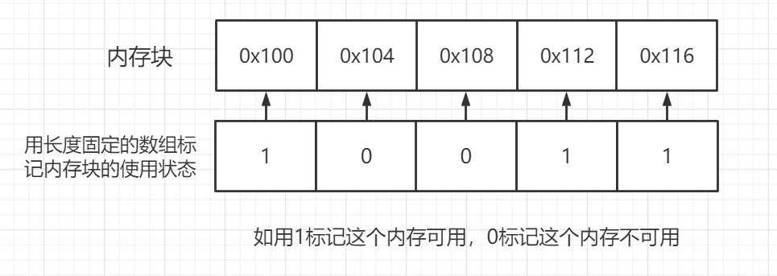

<不要因为数据结构相对应的缺点而不去使用，而是根据应用场景来选择最适合的一种数据结构>

优点：查找    特性：固定的大小

#### 1.1 数组的扩容

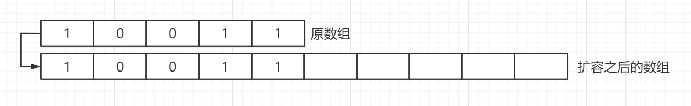

建立一个长度比原数组长的新数组，将原数组的值一一复制到新数组中，将指向原数组的指针指向新数组，最后把原数组释放掉即可

（扩容的大小其实也是固定的，是根据编写时来定义的，常见的情况是扩容一倍或是添加5、10等整数个的情况）

##### 数组的缩容：扩大多少，就缩容多少

#### 1.2 顺序表的实现

```C
#include<stdio.h>
#include<stdlib.h>
//顺序表------>数组（本质）
typedef struct ArrayList
{
    int *list;//数组
    int maxSize;//总容量
    int count;//记录当前元素个数
}List;

List* InitList();
void insert(int key, List* list);
int find(List* list, int key);
void insert_index(int key,List* list,int data);//函数重名
void printfList(List* list);
void delete_list(int key,List* list);

int main()//这里是为了调用自己的函数检查是否有问题
{
    List* list = InitList();
    insert(1,list);
    insert(2,list);
    insert(3,list);
    insert(4,list);
    printfList(list);
    insert_index(5,list,3);//在3的前面打印5
    printfList(list);
    delete_list(5,list);
    printfList(list);
}

//初始化
List* InitList()
{
    List* list = (List*)malloc(sizeof(List));
    list->count = 0;
    list->maxSize = 5;
    list->list = (int*)malloc(sizeof(int) * 5);
    return list;
}

//顺着插入
void insert(int key, List* list)
 
int find(List* list, int key)//要得到返回值的下标，返回类型为int
{
    for (int i =0 ; i < list->count; i++)
    {
        if (list->list[i] == key)
        {
            return i;
        }
    }
    return -1;//没找到，返回-1
}

//在某个元素之前插入
/*
1.插入什么元素
2.在哪个顺序表里插入
3.在哪个元素之前插入--->要先行判断是否有这个元素
*/
void insert_index(int key,List* list,int data)
{
    if (list->count < list->maxSize) {
        int index = find(list, data);
        if (index == -1) {
            //没有这个元素 提示 退出
            return;
        } else {
            //先移动位置
            for (int i = list->count; i > index; i--)//从最后一个元素开始往后移动一个
            {
                list->list[i] = list->list[i - 1];
            }
            list->list[index] = key;
            list->count++;
        }
    }
}

void printfList(List* list)//此函数用来输出
{
    for (int i = 0; i < list->count; i++)
    {
        printf("%d", list->list[i]);
    }

    printf("\n");
}
//不同的插入考虑元素的移动以及其下标就好

void delete_list(int key,List* list)
{
    if (list->count == 0)
    {
        return;
        //这里要报错或提示
    }
    else
    {
        int index = find(list,key);
        if(index == -1)
        {
            return;
            //无元素可删除，返回
        }
        else  //从当前下表为止往后走，若是从后往前则会覆盖原来的元素，注意这里跟插入的顺序区别！
        {
            for (int i = index; i < list->count; i++)
            {
                list->list[i] = list->list[i + 1];
            }
            list->count--;//这里说明数组的删除是伪删除，实际效果是输出不到最后的元素位置，但其实元素还存在，只不过count--了
        }
    }
}
```

#### 1.3 扩容的实现且对顺序表实现的影响

```C
//扩容
void enlargement(List* list)
{
    //第一步创建一个更大的数组
    int* temp = (int*)malloc(sizeof(int)*(list->maxSize + 5));
    //然后将原先的数据拷贝进去
    for (int i = 0; i < list->maxSize; i++)
    {
        temp[i] = list->list[i];
    }
    int* arrytemp = list->list;//这里是为了保留原先数组的指针，若没有这一行，则下行运行后原数组位置丢失无法free
    list->list = temp;
    //现在的list已经是新数组了，要修改其最大容量个数
    list->maxSize = list->maxSize + 5;
    free(arrytemp);
}

//对insert函数的变化
void insert(int key, List* list)
{
    //先判断能不能插入
    if (list->count < list->maxSize)//当当前元素个数小于总个数的时候可以插入
    {
        list->list[list->count] = key;//初始化后的第一个元素[0]插入
        list->count++;//当前元素个数递增
    }
    else
    {
        enlargement(list);
        list->list[list->count] = key;
        list->count++;
    }
}
//增加扩容之后，删除元素有可能会浪费空间，要考虑缩小空间
```


### 2.链表

链表：在物理上是不连续的，但逻辑上是连续的


数据域存放的是真实存储的数据，指针域存储的是指向下一个结点的指针

优点：长度不固定，更适合增删操作   特性：灵活

#### 2.1 单向链表

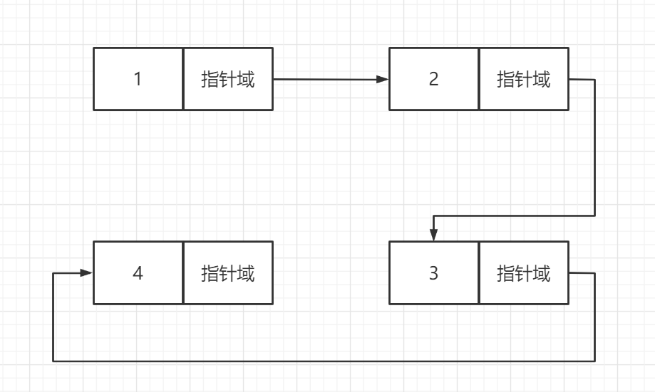

单向链表的结构如上图所示

##### 2.1.1 头指针

指向第一个位置的指针称之为<u>头指针</u>，一般来说，任何一个结构都需要头指针（除图），其作用就是指明第一个元素的位置。

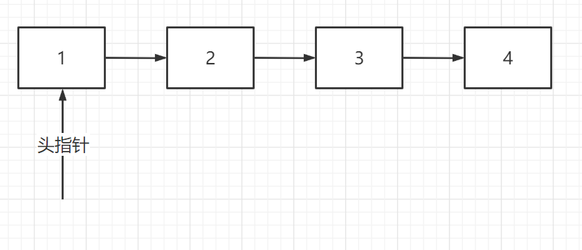

特性：头指针要永远指向第一个元素！！！！

##### 2.1.2 头结点

在如上图所示中，若要在1处前插一个元素，则头结点不在指向第一个元素，所以需要更改头指针所指向的位置，而要是一直前插，则头指针会一直变化


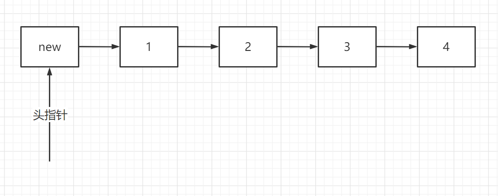

为了防止前插带来的头指针频繁变化，这里定义了一个头结点，头指针永远指向头结点，头结点指向的元素永远是第一个元素。

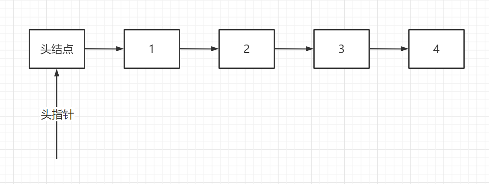

头结点可以省略一些步骤

##### 2.1.3 插入操作

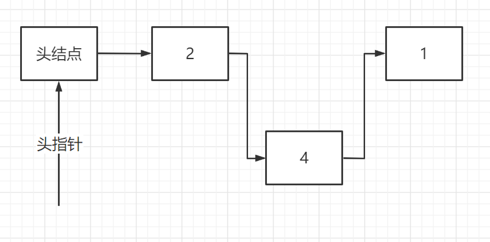

在2、1之间插入元素4，首先将4的指针指向1，再将2的指针指向4即可

带头结点的前插和插入会统一成一个步骤

有头结点也可以有尾结点，一般尾结点出现在双向链表中

头结点只是为了统一操作，其数据域是没有数据的，但是不代表不能使用，如：可以输入当前链表长度或者其他......

##### 2.1.4 删除操作

见图2-8（上上图）这里要删除元素3，只需要将元素2的指针指向4，释放掉元素3即可

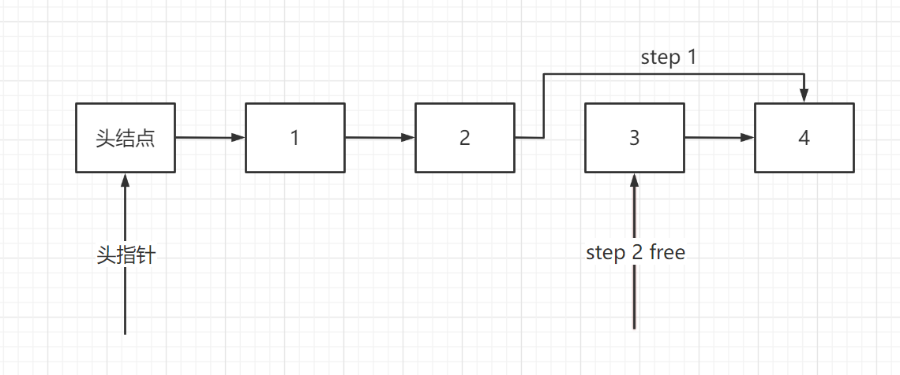

先删再指会导致无法找到后继元素，**操作顺序非常重要！！！**

##### 2.1.5 带头结点的单向链表实现

```C
#include <stdio.h>
#include <stdlib.h>
//带头结点的单向链表
//数据集合 结点
typedef struct NodeList
{
    int element;        //存储具体的数组，这里也可以是结构体
    struct NodeList* next;     //用来指向下一个结点的指针
    int count;//这里记录重复数据的个数，如果重复则+1，而且这里考虑的是在相同数值处插入，利用count的值和循环输出
    //如果是尾插、头插则按照逻辑顺序编写即可
    //考虑实际意义，重复的行为允不允许出现；在实际意义中是不允许出现的，在系统设计里，主键(primary key)是不允许重复的，其它的可以重复
}Node;
//操作集合
//初始化一个结点
Node* InitList(Node* node)
{
    node = (Node*)malloc(sizeof(Node));
    if(node == NULL)
    {
        printf("分配失败！");//分配失败  初始化失败
    }
    else
    {
        node->next = NULL;//要改成单向循环列表只需要将指针指向自己，即node->next = node;
    }
    return node;
}
//查找
int find(Node* node,int key)
{
    Node* temp;
    temp = node->next;
    int i = 0;
    while(temp != NULL)
    {
        if (temp->element == key)
        {
            return i;
        }
        temp = temp->next;
        i++;
    }
    return -1;
}

/*
向单链表中插入一个数据 头插
1.插入的具体数据是什么
2.往哪个单链表里面插入
 */
void head_insert(Node* node,int key)
{
    Node* temp = (Node*)malloc(sizeof(Node));//创建新结点,这里还是要判断创建是否成功
    temp->next = node->next;
    node->next = temp;
    temp->element = key;
}

/*
1.在哪个链表里删除
2.删除的数据是什么
 */
void delete(Node* node,int key)
{
    //先查找元素是否存在
    int index = find(node,key);
    if (index == -1)
    {
        //没找到
    }
    else
    {
        Node* temp;
        temp = node;
        int i = 0;
        while(i < index)
        {
            temp = temp->next;
            i++;
        }
        Node* free_node = temp->next;
        temp->next = temp->next->next;
        free(free_node);
    }
}

```


#### 2.2 单向循环链表

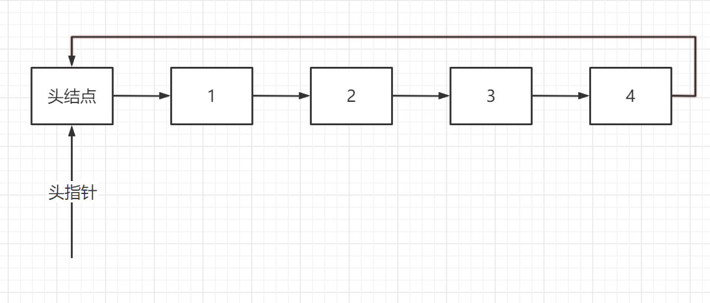

将单向链表中的最后一个元素指向头结点就是单向循环链表

#### 2.3 双向链表

结点的ADT


##### 插入操作

双向链表的插入操作有多种实现方法<以下1、2步和3、4步之间的顺序不影响，**但1、2必须在3、4操作之前**>

step1.将带插入元素的后指针指向插入位置的后元素

step2.将带插入元素的前指针指向插入位置的前元素

step3.把插入位置的前元素的后指针指向带插入元素

step4.把插入位置的后元素的前指针指向带插入元素

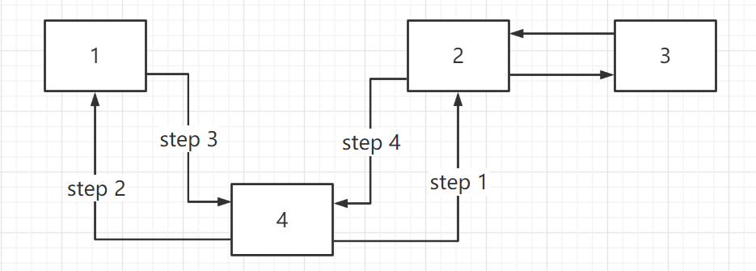

##### 删除操作


step1.将待删除元素的前元素的后指针指向后元素

step2.将待删除元素的后元素的前指针指向前元素

step3.将待删除元素释放掉

#### 2.4 双向循环链表

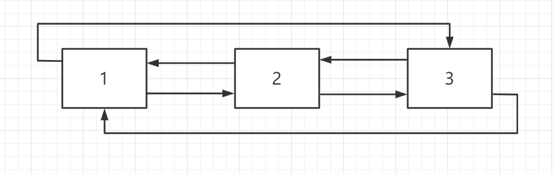

将第一个元素的前指针指向最后一个元素，最后一个元素的后指针指向第一个元素就可以从双向链表变成双向循环链表

此时，尾结点就可以有作用了，同单向链表一致，头尾结点的作用就是可以省略一些步骤<如：插入>

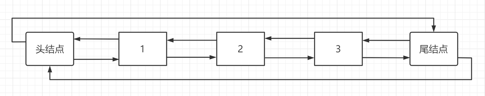

（机哥语录：没有坏的数据结构，只有用不好的数据结构，根据场景、需求选择相适应的数据结构才是正确的选择！）

##### 双向循环列表的实现

```C
#include <stdio.h>
#include <stdlib.h>

typedef struct DoubleList
{
    struct DoubleList* front;   //前指针
    int element;                //数据域
    struct DoubleList* next;    //后指针
}List;
List* head;     //头结点，这里可以思考全局变量和静态变量的区别

//初始化
void InitList()
{
    head = (List*)malloc(sizeof(List));//malloc分配空间
    //让两个指针指向自己
    head->next = head;
    head->front = head;
}

//头插
void head_insert(int key)
{
    List* new_node = (List*)malloc(sizeof(List));
    new_node->element = key;        //先让数据域内的值为key
    new_node->next = head->next;    //将新结点的后指针指向头结点的后指针
    new_node->front = head;         //将新结点的前指针指向头指针
    head->next->front = new_node;   //将头结点的后指针(下一个元素)的前指针指向新结点
    head->next = new_node;          //将头结点的后指针指向新结点
}

//查询
int find(int key)
{
    List* temp = head->next;
    int i = 0;
    while (temp != head)        //循环链表遍历到head处结束
    {
        if(temp->element == key)
        {
            return i;
        }
        i++;
        temp = temp->next;
    }
    return -1;//没有找到
}

void delete_node(int key)
{
    if (head == NULL)
    {
        printf("无法删除元素，因为想要删除列表里的元素为null");
    }
    else
    {
        int index = find(key);
        if(index == -1)
        {
            printf("没有找到待删除元素！！");
        }
        else
        {
            List* temp = head;
            int i = 0;
            while (i < index)
            {
                temp = temp->next;
                i++;
            }
            List* free_node = temp->next;//先保存住需要释放元素的位置
            temp->next->next->front = temp;//让待删除元素的后一个元素(B)的前指针指向待删除元素的前一个元素(A)
            temp->next = temp->next->next;//让待删除元素的前一个元素A指向待删除元素的后一个元素B
            free(free_node);
        }
    }
}
```

### 3.栈

栈的全名是堆栈(stack)，而堆就是堆(heap)，这是两个不同的东西

计算机在进行运算时（如：1+1=2），是使用CPU中的算术逻辑单元（ALU）进行运算，但遇到多个（如：1+1+1）运算时，计算机会先将前一次运算产生的临时值存到寄存器中，当寄存器无法存下临时值时，需要从CPU外部寻找一个“帮手”------>内存，在内存中临时存放结果的区域-->堆栈（物理上的）

堆栈存取算数的过程是先进后出，后进先出

对于栈来说，一般不考虑扩容


#### 3.1 用数组实现栈


#### 3.2 用链表实现栈


### 4.队列

先进先出，后进后出；队列一般来说类似于缓存的作用，

主要解决：1.多用户竞争统一资源的问题<例：双十一的抢购>；

​		   2.速度不匹配（CPU是很快的，但是比如计算机和打印机是比较慢的，两边速度不一致）

- ##### LRU缓存淘汰机制(淘汰最近最久未使用的)


当缓存区域为满时，此时要想在添加一个内容进入缓存则需要在原有的缓存区删除一个内容来添加新的内容，这时使用的淘汰机制为LRU缓存淘汰机制，通过辨别缓存区中某一个内容有多长时间没有被使用过来进行排序删除，这里就可以用队列的思想。

- ##### Redis


根据次数来判断的

- ##### 延迟队列


比如网购付款机制，下单但是没有付款的就会后进队列，依据付款的时间来进行排队，过一段时间不付款就会清空出队

- ##### 阻塞队列


任何的请求都是由CPU执行的


队列也不考虑扩容

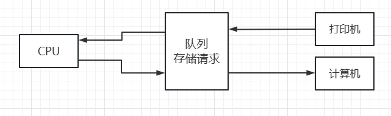

#### 4.1 队列的实现

用两个指针就可以实现顺序队列的操作

##### 4.1.1 假溢出

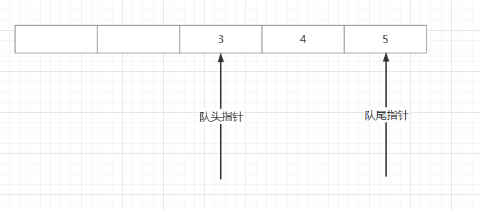

为了解决假溢出的情况，就要使用循环队列-->模运算(rear + 1 % maxSize)-->就需要进行判断空与满，空与满的时候队头指针和队尾指针都相等，无法辨别，所以可以少使用一个空间-->当队列为空时，头尾相等；当队列为满时，(队尾 + 1) % maxSize = 队头

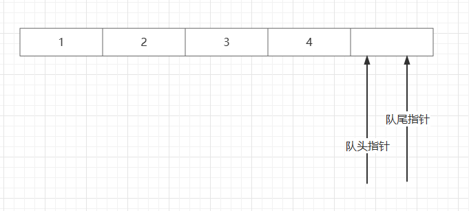

##### 4.1.2 队列的实现

```c
#include <stdio.h>
#include <stdlib.h>

typedef struct Queue
{
    int* queue; //队列数组
    int rear;   //队尾指针
    int front;  //队头指针
    int maxSize;//最大长度
}queue;

queue* initQueue()
{
    queue* list = (queue*)malloc(sizeof(queue));
    list->queue = (int*)malloc(sizeof(int) * 5);
    list->rear = list->front = 0;
    list->maxSize = 5;
    return list;
}

//插入队列
void insert_queue(int key,queue* list)//int key 待插入的元素；queue* list 需要插入到哪个队列
{
    //判断不满，不满才能插入
    if ((list->rear + 1) % list->maxSize != list->front)
    {
        list->queue[list->rear] = key;
        list->rear = ((list->rear) + 1) % list->maxSize;
    }
    else
    {
        printf("队列已满，无法插入");
    }
}

void delete_queue(queue* list)
{
    //只要不为空就可以删，所以先判断队列是否为空
    if (list->front != list->rear)
    {
        list->front = ((list->front) + 1) % list->maxSize;
    }
    else
    {
        printf("队列为空，不能删除！");
    }
}

//进行输出
void printf_queue(queue* list)
{
    //先拿到队头和队尾的指针
    int temp_front = list->front;
    int temp_rear = list->rear;
    //输出从队头开始到队尾结束
    for (int i = temp_front; i != temp_rear; i = (i + 1) % list->maxSize)//队头指针只需要往后一直移动就好了
    {
        printf("%d",list->queue[i]);
    }
}
```


#### 4.2 双向队列

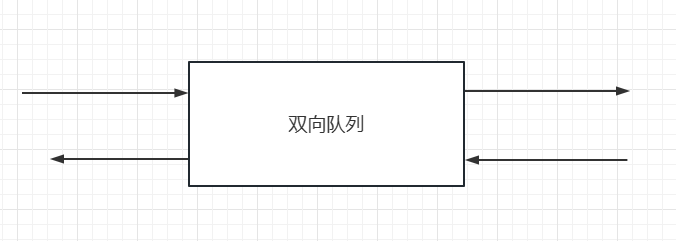

不允许随便进随便出，一共只有四种情况，左进左出，右进右出，左进右出，右进左出；

所有的栈和队列的底层就是双向队列，由双向队列衍生出栈和队列

从底层逻辑来说，<u>**用链表表示双向队列**</u>更好

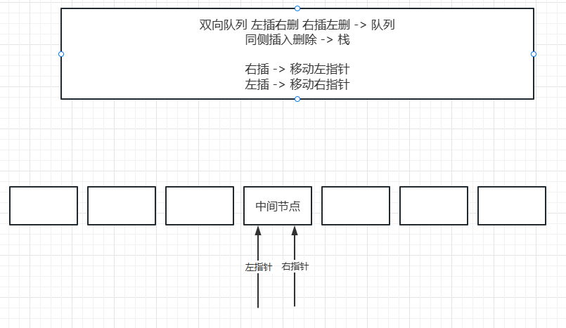

以上图为规定（右插 -> 移动左指针[尾插]）

此时，左插左删只需要移动右指针即可，其原理为栈（先进后出，后进先出）

​	    左插右删，插入时移动右指针，删除时移动左指针，其原理为队列（先进先出，后进后出）

​	    右插右删只需要移动左指针即可，其原理为栈（先进后出，后进先出）

​	    右插左删，插入时移动左指针，删除时移动右指针，其原理为队列（先进先出，后进后出）

##### 4.2.1 用链表表示双向队列

```C
#include <stdio.h>
#include <stdlib.h>

typedef struct LinkQueue
{
    int element;//可以拿来记录中间结点的数据，这里可以记录双向队列中的个数，增加时++，删减时--
    struct LinkQueue* pre;
    struct LinkQueue* next;
}Node;

Node* middle;//中间结点
Node* left;
Node* right;

void InitQueue()
{
    middle = (Node*)malloc(sizeof(Node));
    middle->next = NULL;
    middle->pre = NULL;
    left = middle;
    right = middle;
}

void left_insert(int key)
{
    Node* new_node = (Node*)malloc(sizeof(Node));
    new_node->element = key;
    right->next = new_node;
    new_node->pre = right;
    new_node->next = NULL;
    right = right->next;
}

void left_delete()
{
    //判断双向队列是否为空
    if (left == middle && right == middle)
    {
        printf("队列为空，不能进行删除操作！\n");
    }
    else
    {
        //判断右指针是否指向中间结点
        //如果没有指向中间结点->代表右插左删形成队列；如果指向中间结点->代表左插左删形成栈
        if (right == middle)
        {
            Node* temp = right->pre;
            right->pre = right->pre->pre;
            right->pre->next = right;
            free(temp);
        }
        else
        {
            Node* temp = right->pre;
            right = right->pre;
            right->next = NULL;
            free(temp);
        }
    }
}

void right_insert(int key)
{
    Node* new_node = (Node*)malloc(sizeof(Node));
    new_node->element = key;
    left->pre = new_node;
    new_node->next = left;
    new_node->pre = NULL;
    left = left->pre;
}

void right_delete()
{
//判断双向队列是否为空
    if (left == middle && right == middle)
    {
        printf("队列为空，不能进行删除操作！\n");
    }
    else
    {
        //判断左指针是否指向中间结点
        //如果没有指向中间结点->代表左插右删形成队列；如果指向中间结点->代表右插右删形成栈
        if(left == middle)
        {
            Node* temp = left->next;
            left->next = left->next->next;
            left->next->pre = left;
            free(temp);
        }
        else
        {
            Node* temp = left;
            left = left->next;
            left->pre = NULL;
            free(temp);
        }
    }
}
```

如何判断双向队列是否为空 -> 左右指针都指向中间结点时为空


##### 4.2.2 用数组表示双向队列

四个操作依旧是独立的，依据4.2.1中的逻辑，左侧插入是从数组的右边向左边插入

那么则有左侧插入 -> 下标-- -> 左指针移动；右侧插入 -> 下标++ -> 右指针移动；左侧删除 -> 左指针++；右侧删除 -> 右指针--。

```c
#include <stdio.h>
#include <stdlib.h>
#define Size 5 //定义数组的长度

//这里使用全局变量，也可以封装成结构体
int* queue;	//队列的顺序表
int left;	//左指针
int right;	//右指针
int maxSize;//当前最大元素个数
int size;	//当前元素个数

void InitQueue()
{
	queue = (int*)malloc(sizeof(int));
	maxSize = Size;
	size = 0;
	//这里指针不会被初始化，会跟着四种情况不同而不同
}

//判断队列是否为空
int isEmpty()
{
	if (size == 0)
	{
		return 1;
	}
	else
	{
		return 0;
	}
}

//判断队列是否为满
int isFull()
{
	if (size == maxSize)
	{
		return 1;
	}
	else
	{
		return 0;
	}
}

void left_insert(int key)
{
	if (isFull())
	{
		printf("队列已满，无法继续插入！\n");
	}
	else
	{
		if (isEmpty())
		{
			left = right = 0;
			queue[left] = key;
		}
		else
		{
			if (left == 0)
			{
				left = maxSize;
			}
			queue[--left] = key;
		}
		size++;
	}
}

void left_delete()
{
	if (isEmpty())
	{
		printf("队列为空，无法进行删除操作！\n");
	}
	else
	{
		if (left == maxSize - 1)
		{
			printf("被删除的元素为%d\n", queue[left]);
			left = 0;
			size--;
		}
		else
		{
			printf("被删除的元素为%d\n", queue[left]);
			left++;
			size--;
		}
	}
}

void right_insert(int key)
{
	if (isFull())
	{
		printf("队列已满，无法继续插入！\n");
	}
	else
	{
		if (isEmpty())
		{
			left = right = 0;
			queue[right] = key;
		}
		else
		{
			if (right = maxSize - 1)
			{
				right = -1;	//因为下行代码的逻辑为right++，实际上插入到下标为0的位置上，所以根据逻辑，这里的right要归位到-1
			}
			right++;
			queue[right] = key;
		}
		size++;
	}
}

void right_delete()
{
	if (isEmpty())
	{
		printf("队列为空，无法进行删除操作！\n");
	}
	else
	{
		if (right == 0)
		{
			printf("被删除的元素为%d\n", queue[right]);
			right = maxSize - 1;
			size--;
		}
		else
		{
			printf("被删除的元素为%d\n", queue[right]);
			right--;
			size--;
		}
	}
}

void printf_queue()
{
	//通过一个不动的指针，来进行遍历，这里是左插的遍历
	int temp_front = right;
	int temp_rear = left;
	int count = 0;
	while (count < size)
	{
		if (temp_front < 0)
		{
			temp_front = maxSize - 1;
		}
		printf("%d", queue[temp_front]);
		temp_front--;
		count++;
	}
}
```

判断底层逻辑是链表还是数组，可以看是否可以随意左插右插，可以（但是是无意义的操作）的是链表，不可以的是数组


## 二、非线性结构

### 1.树（一对多的数据集合）

#### 1.1 基本概念

结点：树里面的某一个数据元素或者是某一个结点里的数据集合
根结点：唯一一个没有前驱的结点，是第一个结点
父结点：一个结点的上一级结点被称为它的父结点，父结点也被称为双亲结点
子结点：一个结点的下一级结点被称为它的子结点
兄弟结点：拥有同一个父结点的结点互称为兄弟结点
叶子结点：没有任何子结点的结点
结点的度：结点拥有的子树个数
树的度：在一棵树中，最大的结点的度就是树的度
树的高度/深度：根据根结点的定义是0还是1开始算的（一般来说是从1开始）

#### 1.2 树的表示

Q：如何表示一棵树

##### 1.2.1 双亲表示法

存储当前的父结点是什么（只需要指向父结点就好）


##### 1.2.2 孩子表达法

存储当前的子结点是什么


用数组和链表一起去表达，如果只用数组会非常浪费空间

##### 1.2.3 孩子兄弟表示法

存储孩子结点以及其兄弟结点的数据   


因为D、E都是B的孩子，而B的孩子指针只有一个，所以表示E时，就用D的兄弟指针指向E，同理B、C也是

<孩子兄弟表示法的本质就是二叉树>

有两个指针称为二叉树，三个指针称为三叉树......，游戏行业一般使用八叉树


#### 1.3 树的表达

##### 1.3.1 孩子表达法

```C
//
// Created by Philosophy_Mifan on 2023/1/6.
//
#include <stdio.h>
#include <stdlib.h>

//孩子表示法-->当前结点对应的孩子是谁
//一对多-->数组+链表，所以数组应该为结构体数组

typedef struct Child
{
	int data;	//存放数据域
	struct Child* next;	//指向下一个结点，指向孩子
}Node;

    Node* node_array[20];
    int size;	//当前元素个数

//初始化，给出根结点的值（int key）
void Init(int key)
{
	size = 1;
	node_array[size] = (Node*)malloc(sizeof(int));
	node_array[size]->data = key;
	node_array[size]->next = NULL;
	size++;
}

//构建树，这里要给出一个父结点(int parent)，以及该结点的孩子是谁(int key)
void Great_Tree(int parent, int key)
{
	//找父结点是否存在（下标）
	int index = find_parent(parent);
	{
		if (index == -1)
		{
			printf("父结点不存在，无法操作\n");
		}
		else
		{
			//把孩子结点作为新的结点加入到数组当中
			node_array[size] = (Node*)malloc(sizeof(int));
			node_array[size]->data = key;
			node_array[size]->next = NULL;
			size++;

			Node* new_node = (Node*)malloc(sizeof(Node));
			new_node->data = key;
			new_node->next = node_array[index]->next;
			node_array[index]->next = new_node;
		}
	}
}

int find_parent(int parent)
{
	for (int i = 0; i < size; i++)
	{
		if (node_array[i]->data == parent)
		{
			return i;
		}
	}
	return -1;
}

void printf()
{
	for (int i = 0; i < size; i++)
	{
		printf("父结点为%d", node_array[i]->next);
		Node* temp = node_array[i]->next;
		while (temp != NULL)
		{
			printf("子结点为%d", temp->data);
			temp = temp->next;
		}
		printf("\n");
	}
}
```

##### 1.3.2 父亲表达法

```c
#include <stdio.h>
#include <stdlib.h>
//父亲表达法->当前结点对应的父结点是什么
//数据关系是一对一

typedef struct TreeNode
{
	int data;	//树中存放的数据
	int parent;	//当前数据对应的父结点是谁
}Node;

Node* node[5];
int size;	//当前元素个数

void Init(int key)
{
	size = 0;
	Node* new_node = (Node*)malloc(sizeof(Node));
	new_node->data = key;
	new_node->parent = -1;
	node[size] = new_node;
	size++;
}

//当前结点是谁（int key），当前结点的父亲结点是谁（int parent_node）
void insert_child(int key, int parent_node)
{
	if (size == 5)
	{
		printf("树已满，无法进行插入操作！\n");
	}
	else
	{
		int parent_index = find_parent(parent_node);
		if (parent_index == -1)
		{
			printf("找不到父结点，无法进行操作！\n");
		}
		else
		{
			Node* new_node = (Node*)maloc(sizeof(Node));
			new_node->data = key;
			new_node->parent = parent_index;
			node[size] = new_node;
			size++;
		}
	}
}

int find_parent(int parent)
{
	for (int i = 0; i < size; i++)
	{
		if (node[i]->data == parent)
		{
			return i;
		}
	}
	return -1;
}

```

##### 1.3.3 孩子兄弟表示法

```C
#include <stdio.h>
#include <stdlib.h>

typedef struct ChildBro
{
	struct ChildBro* child;		//孩子指针
	struct ChildBro* sibiling;	//兄弟指针
	int key;	//数据
}Node;
Node* root;	//根结点

void Init(int Key)
{
	root = (Node*)malloc(sizeof(Node));
	root->key = Key;
	root->child = NULL;
	root->sibiling = NULL;
}


//当前结点（int key），当前结点的父亲（int parent）
void insert(int key, int parent)
{
	Node* tempNode;	//先定位到父结点是谁
	//查找父结点的位置
	get_node(root, parent, &tempNode);
	if (tempNode == NULL)
	{
		printf("父结点没找到，不进行操作！\n");
	}
	else
	{
		if (tempNode->child == NULL)
		{
			Node* node = (Node*)malloc(sizeof(Node));
			node->key = key;
			node->child = NULL;
			node->sibiling = NULL;
			tempNode->child = node;
		}
		else
		{
			tempNode = tempNode->child;
			Node* node = (Node*)malloc(sizeof(Node));
			node->key = key;
			node->child = NULL;
			node->sibiling = NULL;
			node->sibiling = tempNode->sibiling;
			tempNode->sibiling = node;
		}
	}
}

void printf_tree(Node* node)
{
	printf("%d", node->key);
	if (node->child != NULL)
	{
		printf_tree(node->child);
	}
	if (node->sibiling != NULL)
	{
		printf_tree(node->sibiling);
	}
}

void get_node(Node* node, int key, Node** tempNode)
{
	if (node->key == key)
	{
		*tempNode = node;
	}
	if (node->child != NULL)
	{
		get_node(node->child, key, tempNode);
	}
	if (node->sibiling != NULL)
	{
		get_node(node->sibiling, key, tempNode);
	}
}
```

### 2.递归

递归调用，就是函数调用函数自己本身；所有被调用的函数都会创建一个副本-->为调用者所服务，最终会回到被调用的函数，不受其他函数的影响

```c
#include <stdio.h>
//计算1+2+3+4+...+n的值
int add(int n)
{
    if (n == 1)
    {
		return n;
    }
    else
    {
        return add(n - 1) + n;
    }
}
```


#### 2.1 边界条件

什么时候跳出函数，结束递归


#### 2.2 递归条件

递归体

不要滥用递归，但是递归在某些条件下非常方便，必须需要注意递归的边界条件！！

**工程当中，代码的阅读性非常重要**

递归其实就是在等待副本的结果，将副本全部得到后才会跳出递归


#### 2.3 尾递归

函数在尾部位置调用自身（是一种递归的特殊形式）

```c
#include <stdio.h>
//计算1+2+3+4+...+n的值
int add(int n, int sum)
{
    if (n == 1)
    {
        return n;
    }
    else
    {
        return add(n - 1, sum + n);//这里就不会创建副本，而是结束一个函数，继续一个新的函数，也不会出现栈不够用的情况
    }
}
```

尾递归的优化跟环境有关，所以优化尾递归跟编译器有关，只能靠编译器自身来优化，如果编译器不进行优化那也就是一个普通的递归


#### 2.4 斐波那契数列(Fibonacci)

$F(n)=f(n-2)+f(n-1)$	$f(0)=0$,  $f(1)=1$


通过图示的调用过程，发现其本质就是一颗二叉树，所以对树的遍历就是用递归方法去遍历（递归树）


### 3.二叉树

要求结点的度不能大于2的树，所以有很多种情况

#### 3.1 性质<考研使用>

在二叉树的第i层，最多有多少个结点？  ->   $2^{(i - 1)}$个结点

深度为k的二叉树最多有$2^k - 1$个结点

在一棵二叉树中，除了叶子结点之外，只剩下度为2和度为1的结点

树的结点总数 $T=n_0+n_1+n_2$

一棵树的连线数是$T-1$

$n_0+n_1+n_2-1=2*n_2+n_1$

$n_0=n_2+1$

具有$n$个结点的完全二叉树，其深度为$log_2n$向下取整 + 1

#### 3.2 空集合（空树）


#### 3.3 只有一个根的树


#### 3.4 根+左子树


#### 3.5 根+右子树


#### 3.6 二叉树


#### 3.7 特殊的树

##### 3.7.1 满二叉树

其结点的度要不是2，要不是0，且其叶子结点全部都在同一层


##### 3.7.2 完全二叉树

结点的度不限，但顺序必须是从上到下，从左到右


##### 3.7.3 扩展二叉树

为了补全一棵树使其为二叉树，从逻辑上将NULL指针也算进去的树被叫做扩展二叉树


#### 3.8 存储

##### 3.8.1 顺序存储

树一般不用顺序存储（满二叉树和完全二叉树可以用，并不浪费空间），但是对于一般的树会过于浪费空间

##### 3.8.2 链式存储

从本质来说，树的链式存储表达跟双向链表的结点一致（指针的说法改为了左子树+右子树）


#### 3.9 二叉树的遍历

根据遍历的顺序不同而区分为前序、中序、后序、层序遍历


##### 3.9.1 前序遍历

先访问根结点，然后访问左子树，再访问右子树。若如上图所示，则前序遍历的输出应该为6、2、4、5、3、7

##### 3.9.2 中序遍历

先访问左子树，再访问根结点，最后访问右子树。若如上图所示，则中序遍历的输出应该为4、2、5、6、3、7<最先访问的一定是最左边的>

##### 3.9.3 后序遍历

先访问左子树，再访问右子树，最后访问根结点。若如上图所示，则后序遍历的输出应该为4、5、2、7、3、6

##### 3.9.4 层序遍历

从上到下，从左到右依次遍历。若如上图所示，则层序遍历的输出应该为6、2、3、4、5、7

层序遍历的输出可以使用队列的入队、出队进行输出操作


根据上述分析，发现遍历二叉树（不包括层序）需要两个递归，一个是向左，一个是向右

输出语句的位置不同就能实现前、中、后序遍历的输出，当输出语句在最前时，则为前序；在中间时，为后序；在最后时，为后序。(图示为中序遍历)


##### 3.9.5  层序遍历的部分代码实现

```c
//这里用的是队列的操作+孩子兄弟表示法
void levelOrder(Node* root)
{
	initQueue();
	if (root != NULL)
	{
		insert_queue(root->key);
	}
	while (!isEmpty())
	{
		int temp = delete_queue();
		get_node(root, temp, &tempNode);
		printf("%d", temp);
		if (tempNode->child != NULL)
		{
			insert_queue(tempNode->child->key);
		}
		if (tempNode->sibling != NULL)
		{
			insert_queue(tempNode->sibling->key);
		}
	}
}
```


#### 3.10 二叉排序树（二叉搜索树、二叉查找树）

1、如果左子树不空，左子树的结点均小于根结点

2、如果右子树不空，右子树的结点均大于根结点


当按照顺序输入由小到大的时候，构建二叉排序树会完全的退化成一个链表，会形成斜树，导致查询的效率很低，树的高度决定其效率

##### 3.10.1 二叉排序树的删除

删除操作时，要保证数据删除后不能改变二叉排序树的性质

1、被删除结点是叶子结点，直接删除即可

2、被删除的结点有一个孩子，无论是左孩子还是右孩子，直接移上去即可

3、被删除的结点有两个孩子，先做周围元素的替换（如上图的3，用1或者4替换掉3），替换的元素为叶子结点（1、4）或者是包含着一个孩子的结点，然后直接删除该叶子结点或是第二步操作即可

##### 3.10.2 二叉排序树的实现

```c
#include<stdio.h>
#include<stdlib.h>

typedef struct SortTree
{
	struct SortTree* left, * right;
	int key;//存放数据
}Node;

/*全局变量*/
Node* root;
void show(Node* root);
void Init(int key);
void insert(int key);
void delete_node(Node* node, int key);
Node* prev_node(Node* root, Node* node, int key);


int main()
{
	Init(3);
	insert(1);
	insert(2);
	show(root);
	delete_node(root, 3);
	show(root);
}
//初始化一个根结点
void Init(int key)
{
	root = (Node*)malloc(sizeof(Node));
	root->key = key;
	root->left = NULL;
	root->right = NULL;
}

/*
二叉排序树的插入永远是插入在叶子
要先找到应该在哪个结点的孩子进行插入
然后判断这个孩子是左孩子还是右孩子
*/
void insert(int key)
{
	Node* temp = root;//定义一个临时指针方便移动
	Node* prev = NULL;//指向temp的前一个结点
	while (temp != NULL)
	{
		prev = temp;
		if (key < temp->key)
		{
			temp = temp->left;
		}
		else if (key > temp->key)
		{
			temp = temp->right;
		}
		else
		{
			return;
		}
	}
	if (key < prev->key)
	{
		prev->left = (Node*)malloc(sizeof(Node));
		prev->left->key = key;
		prev->left->left = NULL;
		prev->left->right = NULL;
	}
	if (key > prev->key)
	{
		prev->right = (Node*)malloc(sizeof(Node));
		prev->right->key = key;
		prev->right->left = NULL;
		prev->right->right = NULL;
	}
}

void delete_node(Node* node, int key)
{
	if (node == NULL)
	{
		return -1;
	}
	else
	{
		if (node->key == key)
		{
			//当找到待删除结点的时候，要先找到它的前一个结点是谁
			Node* tempNode = prev_node(root, node, key);
			Node* temp;
			/*
			如果右子树为空，则只需要冲重新连接结点
			如果是叶子结点，直接删除
			*/
			if (node->right == NULL)
			{
				temp = node;
				node = node->left;
				if (temp == root)
				{
					temp->left = NULL;
					free(temp);
					root = node;
				}
				//待删除结点是父亲结点的左孩子还是右孩子
				else if (tempNode->left != NULL && (tempNode->left->key == temp->key))
				{
					Node* free_node = temp;
					tempNode->left = node;
					free(free_node);
					free_node = NULL;
				}
				else
				{
					Node* free_node = temp;
					tempNode->right = node;
					free(free_node);
					free_node = NULL;
				}
			}
			else if (node->left == NULL)
			{
				temp = node;
				node = node->right;//要么指向右子树，要么指向NULL
				if (temp == root)
				{
					temp->right = NULL;
					free(temp);
					root = node;
				}
				else if (tempNode->left != NULL && (tempNode->left->key == temp->key))
				{
					Node* free_node = temp;
					tempNode->right = node;
					free(free_node);
					free_node = NULL;
				}
				else
				{
					Node* free_node = temp;
					tempNode->left = node;
					free(free_node);
					free_node = NULL;
				}
			}
			else//左右子树都不为空的情况
			{
				temp = node;
				Node* s = node;//移动，找替换结点
				//找左子树的最大值
				s = s->left;
				while (s->right != NULL)
				{
					temp = s;
					s = s->right;
				}
				node->key = s->key;
				if (temp != node)
				{
					temp->right = s->left;
					free(s);
				}
				else
				{
					temp->left = s->left;
					free(s);
				}
			}
		}
		else if (key < node->key)
		{
			delete_node(node->left, key);
		}
		else
		{
			delete_node(node->right, key);
		}
	}
}

/*
找到待删除的前一个结点
Node* root 根结点开始 起点
Node* node 待删除的结点 终点
int key 具体的值
*/
Node* prev_node(Node* root, Node* node, int key)
{
	if (root == NULL || root == node)
	{
		return node;
	}
	else
	{
		if (root->right != NULL && root->right->key == key)
		{
			return root;
		}
		else if (root->left != NULL && root->left->key == key)
		{
			return root;
		}
		else if (key < root->key)
		{
			return prev_node(root->left, node, key);
		}
		else
		{
			return prev_node(root->right, node, key);
		}
	}
}

void show(Node* root)
{
	if (root == NULL)
	{
		return;
	}
	if (root->left != NULL)
	{
		show(root->left);
	}
	printf("%d", root->key);
	if (root->right != NULL)
	{
		show(root->right);
	}
}
```


#### 3.11 平衡二叉树

基于二叉排序树，具有自平衡性的树，将每个结点的左右子树的高度差(平衡因子)都不超过1的树成为平衡二叉树——查找效率最高(对于任意数据均是左右均衡的)

一旦树出现失衡的情况，只有一个结点会失衡，通过旋转可以让失衡的结点平衡

平衡树的查找性能其实是牺牲了插入和删除的性能，而且是较为大量的牺牲，平衡树为了平衡牺牲了过多的性能，但得到了绝对平衡状态

红黑树权衡的是平衡的状态——不强调绝对平衡，而是相对平衡

旋转的目的是为了降低树的高度，根据所谓的方向不同，分为左旋和右旋

##### 3.11.1 左旋

如下图所示操作为左旋（左子树低，右子树高）


Step I. 将失衡结点的右孩子代替失衡结点的位置(图中的失衡结点为55，则表示将55的位置让给77)


Step II. 右孩子的左子树变成失衡结点的右子树(将66变为失衡结点55的右子树)


Step III. 失衡结点本身变成右孩子的左子树(55变为77的左子树)


##### 3.11.2 右旋

如下图所示操作为右旋（左子树高，右子树低）


Step I. 将失衡结点的左孩子代替失衡结点的位置(图中的失衡结点为5，则表示将5的位置让给3)


Step II. 左孩子的右子树变成失衡结点的左子树(将4变为失衡结点5的左子树)


Step III. 失衡结点本身变成左孩子的右子树(5变为3的右子树)


##### 3.11.3 插入

###### 3.11.3.1 插入到左孩子的左子树

同3.11.1 右旋

###### 3.11.3.2 插入到右孩子的右子树

同3.11.2 左旋

###### 3.11.3.3 插入到左孩子的右子树

先对左孩子进行左旋(3.11.1)，然后再对失衡结点进行右旋


Part I. 先对左孩子进行左旋(将3进行左旋操作) <降高>

step I. 将原结点的右孩子代替原结点(将3的位置让给4)


step II. 原结点变为替换位置后的左子树，将替换位置的结点变为原结点的父结点的左子树(将3变为4的左子树，将4变为6的左子树)


Part II. 对失衡结点6进行右旋操作(略，同3.11.2 右旋)


###### 3.11.3.4 插入到右孩子的左子树

先对右孩子进行右旋(3.11.2)，然后再对失衡结点进行左旋


Part I. 先对右孩子进行右旋(将6进行右旋操作) <降高>

Step I. 将原结点的左孩子代替原结点(将6的位置让给5)


Step II. 原结点变为替换位置后的右子树，将替换位置的结点变为原结点的父结点的右子树(将6变为5的右子树，将5变为3的右子树)


Part II. 对失衡结点3进行左旋操作(略，同3.11.1 左旋)


##### 3.11.4 删除

平衡二叉树的删除跟二叉排序树差不多，只不过需要在删除后要重新检查平衡并且修正，要修正的是所有的失衡结点，而非像插入中的一个失衡结点

###### 3.11.4.1 被删除结点是叶子结点

step I. 将该结点直接删除

step II. 找点父结点，检查高度是否发生了变化，如果没有失衡则继续向上检索；如果失衡，则判断是哪种失衡类型

###### 3.11.4.2 被删除的结点只有左子树或者右子树

step I. 将左子树/右子树代替原有结点的位置

step II. 将待删除结点删除，删除以后向上进行检索，判断是否失衡，直到根结点

###### 3.11.4.3 被删除的结点有两个孩子

step I. 找到替换结点

step II. 替换以后，将替换结点删除

step III. 从后替换结点开始，向上检索，判断是否失衡，直到根结点


##### 3.11.5 平衡二叉树的实现

```c
#include <stdio.h>
#include <stdlib.h>
#define HEIGHT(node) ((node == NULL) ? 0 : (((avlnode*)(node))->height))
#define MAX(a,b) ((a) > (b) ? (a) : (b))

typedef struct node
{
	int key;
	struct node* left;
	struct node* right;
	int height;//每个结点都需要有自己的高度，以方便查验
}avlnode, * avltree;

avlnode* create_node(int key, avlnode* left, avlnode* right);
avltree left_left_rotation(avltree tree);
avltree right_right_rotation(avltree tree);
avltree left_right_rotation(avltree tree);
avltree right_left_rotation(avltree tree);
avltree avltree_insertNode(int key, avltree tree);
void pre_order_avltree(avltree tree);
void in_order_avltree(avltree tree);
avlnode* search_node(avltree tree, int key);
avltree avltree_deleteNode(avltree tree, int key);
avlnode* minimun_node(avltree tree);

int main()
{
	avltree tree = NULL;
	int a[] = { 50,30,70,25,40,60,80,20,28,39,41,90,42 };
	for (int i = 0; i < 13; i++)
	{
		tree = avltree_insertNode(a[i], tree);
	}
	pre_order_avltree(tree);
	printf("\n");
	in_order_avltree(tree);
	tree = avltree_deleteNode(tree, 40);
	printf("\n");
	pre_order_avltree(tree);
	printf("\n");
	in_order_avltree(tree);
}

void pre_order_avltree(avltree tree)
{
	if (tree)
	{
		printf("%d ", tree->key);
		pre_order_avltree(tree->left);
		pre_order_avltree(tree->right);
	}
}

void in_order_avltree(avltree tree)
{
	if (tree)
	{
		in_order_avltree(tree->left);
		printf("%d ", tree->key);
		in_order_avltree(tree->right);
	}
}

avlnode* create_node(int key, avlnode* left, avlnode* right)
{
	avlnode* node = (avlnode*)malloc(sizeof(avlnode));
	node->key = key;
	node->left = left;
	node->right = right;
	node->height = 0;
}

avltree left_left_rotation(avltree tree)//k2的演示在图3.11.5-1中
{
	avlnode* k2 = tree->left;
	tree->left = k2->right;
	k2->right = tree;
	//旋转完以后重新调整高度
	tree->height = MAX(HEIGHT(tree->left), HEIGHT(tree->right)) + 1;
	k2->height = MAX(HEIGHT(k2->left), HEIGHT(k2->right)) + 1;
	return k2;
}

avltree right_right_rotation(avltree tree)//k3的演示在图3.11.5-2中
{
	avlnode* k3 = tree->right;
	tree->right = k3->left;
	k3->left = tree;
	//旋转完以后重新调整高度
	tree->height = MAX(HEIGHT(tree->left), HEIGHT(tree->right)) + 1;
	k3->height = MAX(HEIGHT(k3->left), HEIGHT(k3->right)) + 1;
	return k3;
}

avltree left_right_rotation(avltree tree)
{
	tree->left = right_right_rotation(tree->left);
	tree = left_left_rotation(tree);
	return tree;
}

avltree right_left_rotation(avltree tree)
{
	tree->right = left_left_rotation(tree->right);
	tree = right_right_rotation(tree);
	return tree;
}

/*
平衡树的插入操作类似于二叉排序树，主要在于插入新结点以后保证平衡
*/
avltree avltree_insertNode(int key, avltree tree)
{
	if (tree == NULL)
	{
		avlnode* node = create_node(key, NULL, NULL);
		tree = node;
	}
	else if (key < tree->key)//如果存在，那就要去找左子树或者右子树
	{
		//递归寻找插入结点的位置
		tree->left = avltree_insertNode(key, tree->left);//tree->left是上一个的结点
		//判断二叉树是否平衡,如果left - right == 2，则要进行旋转
		if (HEIGHT(tree->left) - HEIGHT(tree->right) == 2)
		{
			//旋转
			if (key < tree->left->key)
			{
				//左边的左边-->右旋
				tree = left_left_rotation(tree);
			}
			else
			{
				//左边的右边-->先左旋再右旋
				tree = left_right_rotation(tree);
			}
		}

	}
	else if (key > tree->key)//在右子树插入结点
	{
		tree->right = avltree_insertNode(key, tree->right);
		if (HEIGHT(tree->right) - HEIGHT(tree->left) == 2)
		{
			if (key > tree->right->key)
			{
				//左旋
				tree = right_right_rotation(tree);
			}
			else
			{
				//先右旋再左旋
				tree = right_left_rotation(tree);
			}
		}
	}
	else
	{
		//不允许插入
	}

	//对结点进行高度的更新
	tree->height = MAX(HEIGHT(tree->left), HEIGHT(tree->right)) + 1;
	return tree;
}

avlnode* search_node(avltree tree, int key)
{
	if (tree == NULL || tree->key == key)
	{
		return tree;
	}
	else if (key < tree->key)
	{
		search_node(tree->left, key);
	}
	else
	{
		search_node(tree->right, key);
	}
}

avltree avltree_deleteNode(avltree tree, int key)
{
	//先查找元素
	avlnode* node = search_node(tree, key);
	if (tree == NULL || node == NULL)
	{
		return tree;
	}
	if (key < tree->key)//如果要删除的结点在左子树
	{
		//就先递归找到删除的点
		tree->left = avltree_deleteNode(tree->left, key);
		if (HEIGHT(tree->right) - HEIGHT(tree->left) == 2)
		{
			if (key < tree->right->key)
			{
				tree = right_left_rotation(tree);
			}
			else
			{
				tree = right_right_rotation(tree);
			}
		}

	}
	else if (key > tree->key)
	{
		tree->right = avltree_deleteNode(tree->right, key);
		if (HEIGHT(tree->left) - HEIGHT(tree->right) == 2)
		{
			if (key < tree->left->key)
			{
				tree = left_left_rotation(tree);
			}
			else
			{
				tree = left_right_rotation(tree);
			}
		}
	}
	else//找到待删除结点的时候，需要正经进行删除
	{
		//执行删除操作
		if (tree->right && tree->left)
		{
			avlnode* min_node = minimun_node(tree->right);
			tree->key = min_node->key;
			tree->right = avltree_deleteNode(tree->right, min_node->key);
		}
		else
		{
			//独子(把左孩子或者是右孩子提上来)或是无子(直接删除，NULL)
			tree = tree->left ? tree->left : tree->right;
		}
	}
	if (tree)
	{
		tree->height = MAX(HEIGHT(tree->left), HEIGHT(tree->right)) + 1;
	}
	return tree;
}

avlnode* minimun_node(avltree tree)
{
	if (tree == NULL)
	{
		return NULL;
	}

	while (tree->left)
	{
		tree = tree->left;
	}
	return tree;
}
```


图3.11.5-1 对73-82行代码起注释作用


图3.11.5-2 对84-93行代码起注释作用


#### 3.12 哈夫曼树

哈夫曼树是对数据进行压缩，还解决了数据的二义性(二义性：同一个数据描绘出了两种不同的意义)

##### 3.12.1 基本概念


1、结点的路径长度：连线数

如：从A->K，路径长度为3

2、树的路径长度，每个叶子结点的路径长度之和

如上图：3+2+2+2+2+2 = 13，为该树的路径长度

3、结点的带权路径长度  权值（结点权值）

如求K的结点的带权路径长度(其中若A的权值为3，B的权值为2，E的权值为1，K的权值为4)为路径长度×该结点的权值 = 3 × 4 =12，与路径上的其他结点的权值无关系

4、树的带权路径长度：也就是每个叶子结点的带权路径长度之和

##### 3.12.2 构建过程


如上图所示，哈夫曼树的构造过程就是将两个权重最小的树构建成一个新的二叉树，其新树的根结点则为两个子树的权值的和

第一步：将C和D进行构建，形成的根结点值为6，新根结点继续放在待查找序列当中


第二步：将6和B进行构建，形成的根结点的值为11，新根结点继续放在待查找序列当中


第三步：将11和A进行构建，形成的根结点的值为18


通过构建过程发现，我们一开始所需要查询的结点(A、B、C、D)都处在叶子结点上，而新增加的点均在过程中


##### 3.12.3 定长编码

ASCII码、Unicode码，这两种编码都比较浪费空间，而且Unicode浪费的是ASCII的两倍，对于纯文本消息来说非常浪费空间，如：abbcddeeefgg，通过定长编码均能表示，但重复的字符都占8位


##### 3.12.4 变长编码

每个字符编码所占的位置不一样，可以根据字符出现的频率来进行编码，频率高的就可以使用短一点的编码，起到节省空间，可是编码有长有短，不能确定一个数据的开始和结束

###### 前缀属性

如：现在假设(P->0; Q->1; R->01; S->10; T->11)，则P变为了R的前缀，Q变成了S和T的前缀

现有一组数据1110，根据上述假设其可以表现为：QQQP、TQP、TS、QQS、QTP，这也是数据的二义性的体现

所以我们的编码要避免其前缀的重复，是较为困难的

###### 前缀码

没有任何的编码是另外一种编码的前缀，这种编码就能达到所有的编码之间互不影响，一定是唯一一一对应的


所以哈夫曼树就是构造这么一种前缀码，左子树上的路径标记为0，右子树的路径标记为1；


这里再将叶子结点的权重表示为字符所出现的频率，会发现路径越短的就是出现频率越高的字符，同时其编码就越短，反之亦然，这种就是哈夫曼树的编码


##### 3.12.5 哈夫曼树的性能

能够把数据压缩的越小，其性能也就越好，这也是所有压缩代码的性能指标，所以，每个叶子结点的带权路径长度之和越小，哈夫曼树的性能越好；一般来说，左小右大，依次往上垒就可以了


##### 3.12.6 哈夫曼树的实现

```c
#include<stdio.h>
#include<stdlib.h>
//哈夫曼树
//1、构建哈夫曼树使用数组还是链表，还是两者都用？
//编码重要，但结构在哈夫曼树中不重要，所以结构上可以不那么的规矩
//如果是链表，每次都要先定位，在从下往上循环判断编码是0或1，简单但效率慢
//如果是数组，就不需要定位了，新增加就一直往后添加即可，较复杂但效率快
typedef char* HuffmanCode;
typedef struct
{
	int weight;//权值
	//存下标即可
	int parent;//父结点
	int lchild;//左子树
	int rchild;//右子树
	//可以加一个真实的数据值
}Node, * HuffmanTree;

void select(int n, HuffmanTree* huffmanTree, int* s1, int* s2)
{
	int min;//用来记录最小的权值
	for (int i = 1; i <= n; i++)
	{
		//先找到没父亲的那个结点
		if ((*huffmanTree)[i].parent == 0)
		{
			min = i;
			break;
		}
	}
	//遍历全部的结点
	for (int i = 1; i <= n; i++)
	{
		//先找到没父亲的那个结点
		if ((*huffmanTree)[i].parent == 0)
		{
			if ((*huffmanTree)[i].weight < (*huffmanTree)[min].weight)
			{
				min = i;
			}
		}
	}
	*s1 = min;
	for (int i = 1; i <= n; i++)
	{
		//先找到没父亲的那个结点
		if ((*huffmanTree)[i].parent == 0 && i != (*s1))
		{
			min = i;
			break;
		}
	}
	//遍历全部的结点
	for (int i = 1; i <= n; i++)
	{
		//先找到没父亲的那个结点
		if ((*huffmanTree)[i].parent == 0 && i != (*s1))
		{
			if ((*huffmanTree)[i].weight < (*huffmanTree)[min].weight)
			{
				min = i;
			}
		}
	}
	*s2 = min;
}

//int weight[] 权重数组，int n 个数
void createHuffmanTree(int weight[], int n, HuffmanTree* huffmanTree)
{
	//用数组的方式构建哈夫曼树
	//这个数组要多长，只有度为2和度为0的树
	int m = 2 * n - 1;
	int s1, s2;
	*huffmanTree = (HuffmanTree)malloc((m + 1) * sizeof(Node));//编号从1开始，从0开始m即可
	//存放叶子结点
	for (int i = 1; i <= n; i++)
	{
		(*huffmanTree)[i].weight = weight[i];
		(*huffmanTree)[i].lchild = 0;//若为0，则 = -1
		(*huffmanTree)[i].rchild = 0;
		(*huffmanTree)[i].parent = 0;
	}
	//先初始化非叶子结点
	for (int i = n + 1; i <= m; i++)
	{
		(*huffmanTree)[i].weight = 0;
		(*huffmanTree)[i].lchild = 0;//若为0，则 = -1
		(*huffmanTree)[i].rchild = 0;
		(*huffmanTree)[i].parent = 0;
	}
	//构建哈夫曼树
	for (int i = n + 1; i <= m; i++)
	{
		//先找两个最小的权值的叶子，组成一个新的二叉树
		//从第1个到第i - 1个去找
		select(i - 1, huffmanTree, &s1, &s2);
		//选出了权值最小的两个点，组成了一个新的二叉树，新的结点跟放在i的位置
		(*huffmanTree)[s1].parent = i;
		(*huffmanTree)[s2].parent = i;
		(*huffmanTree)[i].lchild = s1;
		(*huffmanTree)[i].rchild = s2;
		(*huffmanTree)[i].weight = (*huffmanTree)[s1].weight + (*huffmanTree)[s2].weight;
	}
}

//哈夫曼树构建完毕，从叶子结点到根结点，逆向求每个叶子的编码
void createHuffmanCode(int n, HuffmanTree* huffmanTree, HuffmanCode* huffmanCode)
{
	int c;
	int	p;//c作为开始的地方，当前结点的父亲结点
	//分配n个编码的头指针
	huffmanCode = (HuffmanCode*)malloc((n + 1) * sizeof(char*));
	//具体的编码的工作空间
	char* cd = (char*)malloc(n * sizeof(char));
	//编码空间的起始位置
	int start;

	//字符串的结束符 '\0'
	cd[n - 1] = '\0';//从右往左逐位存放编码，首先就放结束符
	//求n个叶子结点对应的编码
	for (int i = 1; i <= n; i++)
	{
		start = n - 1;
		//从叶子结点到根结点的循环
		for (c = i, p = (*huffmanTree)[i].parent; p != 0; c = p, p = (*huffmanTree)[p].parent)
		{
			if ((*huffmanTree)[p].lchild == c)//??????
			{
				cd[--start] = '0';
			}
			else
			{
				cd[--start] = '1';
			}
		}

		//为第i个编码分配空间
		huffmanCode[i] = (char*)malloc(sizeof(char) * (n - start));
		strcpy(huffmanCode[i], &cd[start]);
	}
	free(cd);
	for (int i = 1; i <= n; i++)
	{
		printf("当前权值为 %3d 的编码是 %s\n", (*huffmanTree)[i].weight, huffmanCode[i]);
	}
}
int main()
{
	HuffmanTree HT;
	HuffmanCode HC;
	int n;
	int wei;
	scanf_s("%d", &n);
	int* w = (int*)malloc((n + 1) * sizeof(int));
	for (int i = 1; i <= n; i++)
	{
		printf("%d: ", i);
		fflush(stdin);
		scanf_s("%d", &wei);
		w[i] = wei;
	}

	createHuffmanTree(w, n, &HT);
	createHuffmanCode(n, &HT, &HC);
}
```


#### 3.13 线索二叉树

##### 3.13.1 逻辑


利用了空链域，将图示所有的NULL指针加以利用，因为它们本来就被malloc(C语言)或new(Java)出来了，空着也是一部分空间

利用空链域解决了某种顺序遍历的递归——节省时间、空间

现如图所示进行中序遍历，结果为DBEAC，将空链域依次利用，如下图（虚线代表空链域指向）


问题是一旦一颗二叉树变为了线索二叉树，那么怎么样区分哪一个是真实的树杈(实线所示)，哪一个是线索(虚线所示)

添加两个变量就可以解决这个问题，添加左标记、右标记，如右标记为0，则可以说明右指针指向的是右孩子，为1，则说明右指针为线索

带头结点的线索二叉树，就是将线索化后的两个空指针指回头结点，如下图


线索二叉树的**核心目的**是<u>快速的找到前驱和后继</u>，当数据量很大时，这个优点才会明显，其中一个应用场景是路由器——转发分组


##### 3.13.2 二叉树的线索化代码

```c
typedef struct ThreadTree
{
	int data;
	struct	ThreadTree* left_node, * right_node;
	int left_type;//限定'1'为线索，'0'为树杈
	int right_type;
}Node;

Node* pre = NULL;

//线索化根据添加线索的位置不同 先序、中序、后序的线索化
void inOrderThreadTree(Node* node)
{
	//假设为中序，其第一个数字是没有前驱的，所以这里前驱结点应该放在后面
	inOrderThreadTree(node->left_node);
	if (node->left_node == NULL)
	{
		node->left_node = pre;
		node->left_type = 1;
	}
	//处理后继
	if (pre != NULL && pre->right_node == NULL)
	{
		pre->right_node = node;
		pre->right_type = 1;
	}
	//前驱结点要跟着走，在函数调用之前跟着走
	pre = node;
	inOrderThreadTree(node->right_node);
}
```


#### 3.14 并查集

研究的是不相交的集合问题，处理合并以及查询，查询不单单是能够找到元素，还能要找到该元素之前是属于哪一个集合的，且其查询的时间复杂度T(n) = O(1)

表现形式：用树来表示一个集合，结点就是集合的元素，根结点就是集合的代表

##### 3.14.1 逻辑

假设现在有1,2,3,4 4个数据需要合并，且每一个数据单独为一个森林(指向自己)


依次按照4与3、3与2、2与1的顺序进行两两合并，且依据集合需要指针朝上，便有了下图奇怪的形状


但并查集真正需要的是路径压缩，其真正的示意图如下图所示


如果遇到两个集合需要做并查集操作，如下图


此时发现4的代表可能成为第二颗树的5，就用数组来做，如果用链表就会导致指针混乱，找不到原来的树


##### 3.14.2 并查集的实现

```c
//并查集->处理不相交集合（合并和查找）
//1、无论数据是什么，都要对这些数据进行编号，数组的下标来代表编号，数组的值用来指向代表
int fa[20];
//int n 有几个待处理的结点
void init(int n)
{
	for (int i = 1; i <= n; i++)
	{
		fa[i] = i;
	}
}

//查询
int find(int x)
{
	if (fa[x] == x)
	{
		return x;
	}
	else
	{
		fa[x] = find(fa[x]);//在查询的途中更改结点，做成路径压缩
		//如果无上行代码则会使得一串长链
		return find(fa[x]);//传回的值应该是具体的值
	}
}

void merge(int i, int j)
{
	int x = find(i);//先找到两个代表元素
	int y = find(j);
	fa[x] = y;//让前面指向后面，也可以fa[y] = x
}
```

###### 按秩合并的代码实现

```c
//秩  按秩合并(另一种思路，图论，按照树的深度来做合并，指向深度小的)
//并查集->处理不相交集合（合并和查找）
//1、无论数据是什么，都要对这些数据进行编号，数组的下标来代表编号，数组的值用来指向代表
int fa[20];

int rank[20];//记录当前结点的深度
//int n 有几个待处理的结点
void init(int n)
{
	for (int i = 1; i <= n; i++)
	{
		fa[i] = i;
		rank[i] = 1;
	}
}

//查询
int find(int x)
{
	if (fa[x] == x)
	{
		return x;
	}
	else
	{
		fa[x] = find(fa[x]);//在查询的途中更改结点，做成路径压缩
		//如果无上行代码则会使得一串长链
		return find(fa[x]);//传回的值应该是具体的值
	}
}

void merge(int i, int j)
{
	int x = find(i);//先找到两个代表元素
	int y = find(j);
	if (rank[x] <= rank[y])
	{
		fa[x] = y;
	}
	else
	{
		fa[y] = x;
	}
	//如果深度相同 有新的根结点的时候，深度需要增加
	if (rank[x] == rank[y] && x != y)
	{
		rank[y]++;//如果上个条件为rank[x] < rank[y]，则需要将x++
	}
}
```


#### 3.15 树的转换

树的转换就是普通树、二叉树、森林之间的转换，没有任何使用场景只是一种逻辑，也不存在代码的实现

一颗普通树转成二叉树：在所有的兄弟之间加一条线，就可以变成二叉树

森林转成二叉树：每颗树的兄弟之间加一条连线，把根结点之间再加一条连线

二叉树如何转成普通树、森林：如果x是我的左孩子，那么就把x的右孩子，右孩子的右孩子...都跟自己连接一根线


### 4.图(多对多的复杂模型)

图由两个集合构成，一个是结点集，另一个是边集(主要用来表达位置关系)

一个叫有向图、另一个叫无向图，在工程中，有向图使用的频率较多

#### 4.1 图的数学表达方式

G(图)：{V, E}

V(点) = {V1, V2, ...}

E(边) = {e1, e2, ...}

e1 = (V1, V2)(无向) 或者<V1, V2>(有向)


#### 4.2 图的基本概念


##### 4.2.1 简单图

如果不存在顶点到其自身的边，且同一条边不会重复出现（无向图的任何一个点都可以是结点）与结点数量无关(示例图是有向图)


##### 4.2.2 有向图、无向图

有向图就是有指向，无向图就是无指向


##### 4.2.3 完全图

图中的任意两个顶点都存在一条边


完全有向图的边数：$n(n-1)$    完全无向图的边数：$n(n-1)\over2$   (其中n代表顶点个数)


##### 4.2.4 混合图(无任何意义)

既有有向边，又有无向边，但不论从工程还是做题亦或是实际中无任何意义，略过就好


##### 4.2.5 端点和邻接点


如上图可称，A是B的端点，B也是A的端点，A、B互为邻接点(注：可以把端点看做线的关系，邻接点就是点之间的关系)


##### 4.2.6 顶点的度、入度、出度

一个顶点具有边的数目就是顶点的度

入度(针对有向图)：有几条边是指向自己的个数

出度(针对有向图)：有几条边是指向外部的个数


##### 4.2.7 子图

图的一部分都叫做子图，单独一个顶点也可以叫做这个图的子图


##### 4.2.8 路径和路径长度


路径：从某一个顶点到另一个顶点的顶点序列

如上图，路径有<B, A, D>、<D, C, A>等等

路径长度：在这条路径经过的边的数目就是该路径的路径长度

如上例<B, A, D>就为2

简单路径：除了开始和结束点一样以外，其余点均不能是重复的


##### 4.2.9 回路(也被称为环)

一条路径，其开始和结束顶点是同一个顶点(如图4.2.8 A. B也可以叫做回路)

###### 4.2.9.1 简单回路

除了开始和结束点相同，其他点均不相同

###### 4.2.9.2 欧拉回路(针对于边)

经过图中各边一次且恰好一次，也就是说其长度和边的总数相同 （c, a, b, a, d, c, d, b, c）

###### 4.2.9.3 哈密顿回路(针对于顶点)

经过图中的各顶点一次且恰好一次 (c, a, d, b, c)


##### 4.2.10 连通、连通图、连通分量(针对无向图)

连通：有路径就被称为连通

连通图：任意两个顶点都有路径就被称为连通图


连通分量：在无向图中，其极大连通子图被称为连通分量

极大连通子图：只要再加上任意一个结点，这个图就不再连通

###### 强连通图和强连通分量

在有向图中，要连通必须要两条线


上图只能被称为从1到2被连通，不能说成2到1连通；强连通图就是两个点之间均有路径(如下图)

强连通分量：在有向图中，其极大强连通子图被称为强连通分量


##### 4.2.11 稠密图、稀疏图

一个图的边比较多叫做稠密图，一个图的边比较少就叫做稀疏图，边的多少并没有一个确切的说法


#### 4.3 图的存储方式

邻接矩阵、邻接表、逆邻接表、十字链表、邻接多重表、边集数组

##### 4.3.1 邻接矩阵


可以发现，其矩阵为对称矩阵；根据二维数组可知，能判断：1、两个顶点之间的边是否存在；2、判断顶点的度(如：V1的度 = 1+0+1+0 = 2)

对于一个有向图，其二维数组就可以代表出度和入度，从行看为入度、从列看为出度；边一般是带有权值的，一般也把带权值的图也叫网。


在带权图中，我们一般把'1'(即有边)的位置改为其权值大小，把'0'(即无边)的位置赋予无穷大(指在真实数据当中不存在的值，如：-1，int_max等等等)

###### 邻接矩阵的实现

```c
//一个数组代表顶点集合
//一个二维数组来代表边集
#define MaxVertices 100
#define MaxWeight 32767 //带权图，点不连接时，无穷大（一个很大的值）
typedef struct{
	int Vertices[MaxVertices];	//顶点的数组信息
	int Edge[MaxVertices][MaxVertices];	//边的信息
	int numV;		//顶点的个数
	int numE;		//边的个数
}AdjMartix;

void CreateGraph(AdjMartix* G) {
	int n, e;	//n为顶点个数，e为边的个数
	int vi, vj, w;	//w为权值
	scanf_s("%d,%d", &n, &e);
	G->numV = n; G->numE = e;
	for (int i = 0; i < n; i++) {
		for (int j = 0; j < n; j++) {
			if (i == j) {
				G->Edge[i][j] = 0;
			 }
			else {
				G->Edge[i][j] = MaxWeight;
			}
		}
	}
	//把顶点放在数组中
	for (int i = 0; i < G->numV; i++) {
		//输入顶点的信息
		scanf("%d", &G->Vertices[i]);
	}
	for (int i = 0; i < G->numE; i++) {
		//输入边的信息(邻接点的两端，如果是带权图，还需要输入权值)
		scanf_s("%d%d%d", &vi, &vj, &w);
		//还要在查找，找到对应的下标
		G->Edge[vi][vj] = w;
		//若为无向图，则 G->Edge[vj][vi] = w;  是对称矩阵
	}
}
```


##### 4.3.2 邻接表

邻接表的表示是数组+链表的形式，数组用来表示顶点集，边集用链表来表示，这里展示无向邻接表。


###### 邻接表的逻辑实现

```c
#include <stdio.h>
#include <stdlib.h>
#pragma warning(disable:4996)

//边表结点
typedef struct EdgeNode
{
	int	adjvex;//邻接的结点
	struct EdgeNode* next;
	int weight;//如果是带权图则需要一个权值
}EdgeNode;
//顶点信息
typedef struct VertexNode
{
	char data;//基本的数据，顶点域存放顶点信息
	struct EdgeNode* firstedge;
}VertexNode, AdjList[100];
//邻接表的结构
typedef struct GraphadjList
{
	AdjList adjlist;//顶点表的结点数组
	int numV, numE;//顶点个数和边的个数
}GraphadjList;
//无向图的邻接表的创建
void CreatALGraph(GraphadjList* G)
{
	int vi, vj;
	EdgeNode* e;
	//先输入顶点信息和边的信息
	scanf("%d%d", &G->numV, &G->numE);
	//初始化结点信息
	for (int i = 0; i < G->numV; i++)
	{
		scanf("%d", &G->adjlist[i].data);
		getchar();	//清空缓冲区
		G->adjlist[i].firstedge = NULL;
	}
	//建立边表
	for (int i = 0; i < G->numE; i++)
	{
		//输入每条边邻接的两个顶点
		scanf("%d%d", &vi, &vj);
		//如果输入的是真实的数据，还是需要去查找下标
		e = (EdgeNode*)malloc(sizeof(EdgeNode));
		e->adjvex = vj;
		e->next = G->adjlist[vi].firstedge;
		G->adjlist[vi].firstedge = e;
		//无向图来两次
		e = (EdgeNode*)malloc(sizeof(EdgeNode));
		e->adjvex = vi;
		e->next = G->adjlist[vj].firstedge;
		G->adjlist[vj].firstedge = e;
	}
}
```


#####  4.3.3 逆邻接表(只针对有向图)

有向邻接表的边也被称为弧，带箭头的结点叫做弧尾，不带箭头的结点叫做弧头。


如果是带权值的逆邻接表，就需要把链表增加一条属性，也就是代表结点的结构体中增加一个权值的属性即可


##### 4.3.4 十字链表

把邻接表和逆链接表组合起来就是十字链表。


###### 十字链表的逻辑实现

```c
#include <stdio.h>
#include <stdlib.h>
#pragma warning(disable:4996)

//边集的数据
typedef struct ArcBox
{
	int tailvex, headvex;//弧尾、弧头所在的位置
	struct ArcBox* hlink, * tlink;//弧尾相同、弧头相同的下一个弧
	int weight;
}ArcBox;
//顶点的数据
typedef struct VexNode
{
	int data;//真实的数据
	ArcBox* firstin, * firstout;//入度指针、出度指针
}VexNode;
typedef struct
{
	VexNode xlist[20];
	int numV, numE;//顶点的个数和边的个数
}OLGraph;

void CreateDG(OLGraph* G)
{
	//输入顶点数和边数
	scanf("%d%d", &(G->numV), &(G->numE));
	for (int i = 0; i < G->numV; i++)
	{
		//先输入顶点的集合		
		scanf("%d", &G->xlist[i].data);
		G->xlist[i].firstin = NULL;
		G->xlist[i].firstout = NULL;
	}
	//构建十字链表
	for (int i = 0; i < G->numE; i++)
	{
		int v1, v2;//弧尾是v1，弧头是v2
		scanf("%d%d", &v1, &v2);
		//查找相对应的下标
		ArcBox* p = (ArcBox*)malloc(sizeof(ArcBox));
		p->tailvex = v1;
		p->headvex = v2;
		//采用头插法插入新的p结点
		p->hlink = G->xlist[v2].firstin;
		p->tlink = G->xlist[v1].firstout;
		G->xlist[v2].firstin = G->xlist[v1].firstout = p;
	}
}
```


##### 4.3.5 邻接多重表

基于邻接表的无向图，对边进行操作时非常麻烦；邻接多重表就是在无向图的基础上对边进行频繁操作，它只改造了十字链表中的边集合


###### 邻接多重表的逻辑实现

```c
#include <stdio.h>
#include <stdlib.h>
#pragma warning(disable:4996)
//邻接多重表，仿造十字链表只改造了边，点是没有变化的
//边表集合
typedef struct node
{
	int ivex, jvex;
	struct node* vi, * vj;
}ArcNode;
//结点
typedef struct
{
	char vertex;

	ArcNode* firstEdge;
}VNode;

typedef struct
{
	VNode Dvex[50];
	int numV, numE;
}Graph;

void create(Graph* G)
{
	//先输入顶点数和边数
	scanf("%d%d", &(G->numV), &(G->numE));
	ArcNode* new_node;
	for (int i = 0; i < G->numV; i++)
	{
		scanf("%d", &G->Dvex[i].vertex);
		G->Dvex[i].firstEdge = NULL;
	}
	for (int i = 0; i < G->numE; i++)
	{
		//输入边对应的下标
		int vi, vj;
		new_node = (ArcNode*)malloc(sizeof(ArcNode));
		new_node->ivex = vi;
		new_node->jvex = vj;
		new_node->vi = G->Dvex[vi].firstEdge;
		G->Dvex[vi].firstEdge = new_node;
		new_node->vj = G->Dvex[vj].firstEdge;
		G->Dvex[vj].firstEdge = new_node;
	}
}
```


##### 4.3.6 边集数组

结构体数组：包含开始结点、结束结点和权值（非必要）；两个一维数组，一个表示顶点，一个表示边


#### 4.4 图的遍历

##### 4.4.1 深度优先搜索

就类似于树的先序、中序、后序遍历，归结于栈，递归；有两个原则：左手原则、右手原则


以上图、右手原则(原则任选一个即可)以及A开始(图没有所谓的起点，任意一点开始均可)为示例进行递归搜索操作

递的顺序为：A->B->C->D->H->E->F(->A，但A已被搜索过了，就要找F的下一个右手边没被访问过的)->G->H，此时H周边的所有点均被访问过，此时递过程结束，继续归过程

归的顺序为：H->G->F->E->D(此时发现D的邻接点有一个没有被访问，就直接访问这个邻接点)->I(I周围的全被访问过了就继续归)->D->C->B->A

综上，搜索的顺序为：A->B->C->D->H->E->F->G->I

深度优先搜索适用于求解所有的可能性

```c
/*
 * 创建无向图并深度优先搜索
 */

#include <stdlib.h>
#include <stdio.h>
#define MAXN 100

typedef struct ArcCell
{
    char vexnum[MAXN];      //顶点
    int arcnum[MAXN][MAXN]; //弧
    int n, e;               //顶点数，弧数
}Graph;
int Visit[MAXN] = {0};      //定义Visit来判断顶点是否被访问，并初始化

void CreateGraph(Graph* G)  //创建图，此处注意要&G
{
    int s, t;
    scanf("%d %d", &G->n, &G->e);
    getchar();
    for (int i = 0; i < G->n; i++)
    {
        scanf("%c", &G->vexnum[i]);
        getchar();
    }
    for (int i = 0; i < G->n; i++)              //初始化数据
    {
        for (int j = 0; j < G->n; j++)
        {
            G->arcnum[i][j] = 0;
        }
    }
    for (int i = 0; i < G->e; i++)
    {
        scanf("%d %d", &s, &t);         //创建图的邻接矩阵
        G->arcnum[s][t] = 1;
        G->arcnum[t][s] = 1;
    }
}

//开始搜索 需要找一个开始结点
/*
 * 开始结点是人定义的
 * Graph G 需要遍历哪一个图
 * int i遍历的起始结点从哪里开始
 * 标记结点
 * 1、遍历未被标记的结点
 * 2、如果遍历到某一个邻接点是已被标记 要继续找到相邻的另一个结点
 */
void DFSTraverse(Graph G,int i)//找邻接点
{
    printf("%c", G.vexnum[i]);

    for (int j = 0; j < G.n; j++)
    {
        if (G.arcnum[i][j] && !Visit[j])
        {
            Visit[j] = 1;
            DFSTraverse(G, j);
        }
    }
}

void DFS(Graph G)//遍历
{
    for (int i = 0; i < G.n; i++)//对整个图的结点进行深搜
    {
        if (!Visit[i])
        {
            Visit[i] = 1;
            DFSTraverse(G, i);
        }
    }
}

int main()
{
    Graph G;
    CreateGraph(&G);
    DFS(G);
}
```


##### 4.4.2 广度优先搜索

类似于树的层序遍历，**需要队列的帮助**

以上图、从A开始

遍历顺序为：

第一步A，将A所有的邻接点全部放进队列中，也就是B、F，这里先访问B [此时队列中为B、F]

第二步B，然后将B的所有邻接点放到队列中(C、I、G) [队列：F、C、I、G]

第三步F，将F的所有邻接点放到队列中(E) [队列：C、I、G、E]

第四步C，将C的所有邻接点放进队列中(D) [队列：I、G、E、D]

第五步I [队列：G、E、D]

第六步G ，将G的所有未在队列中的邻接点放入队列中(H) [队列：E、D、H]

第七步，此时队列中的所有点的邻接点均被访问或已在队列中，全部输出即可

综上，搜索的顺序为A->B->F->C->I->G->E->D->H

广度优先搜索适合最优解，因为其本身就是一层层搜索出来的，但需要保留过程中的数据以方便判重，对空间有要求的话深搜要用广搜

```c
#include <stdio.h>
#include <stdlib.h>
#define MAX_VERtEX_NUM 20                   //顶点的最大个数
#define VRType int                          //表示顶点之间的关系的变量类型
#define InfoType char                       //存储弧或者边额外信息的指针变量类型
#define VertexType int                      //图中顶点的数据类型
typedef enum { false, true }bool;               //定义bool型常量
bool visited[MAX_VERtEX_NUM];               //设置全局数组，记录标记顶点是否被访问过
typedef struct Queue
{
    VertexType data;
    struct Queue* next;
}Queue;
typedef struct
{
    VRType adj;                             //对于无权图，用 1 或 0 表示是否相邻；对于带权图，直接为权值。
    InfoType* info;                        //弧或边额外含有的信息指针
}ArcCell, AdjMatrix[MAX_VERtEX_NUM][MAX_VERtEX_NUM];
typedef struct
{
    VertexType vexs[MAX_VERtEX_NUM];        //存储图中顶点数据
    AdjMatrix arcs;                         //二维数组，记录顶点之间的关系
    int vexnum, arcnum;                      //记录图的顶点数和弧（边）数
}MGraph;
//定位，返回一个for循环的值，判断这个值在数组当中的位置
int LocateVex(MGraph* G, int v)
{
    for (int i = 0; i < G->vexnum; i++)
    {
        if (G->vexs[i] == v)
        {
            return i;
        }
    }

    return -1;
}

//构造无向图
void CreateDN(MGraph* G)
{
    scanf_s("%d,%d", &(G->vexnum), &(G->arcnum));
    for (int i = 0; i < G->vexnum; i++)
    {
        scanf_s("%d", &(G->vexs[i]));
    }
    for (int i = 0; i < G->vexnum; i++)
    {
        for (int j = 0; j < G->vexnum; j++)
        {
            G->arcs[i][j].adj = 0;
            G->arcs[i][j].info = NULL;
        }
    }
    for (int i = 0; i < G->arcnum; i++)
    {
        int v1, v2;
        scanf_s("%d,%d", &v1, &v2);
        int n = LocateVex(G, v1);
        int m = LocateVex(G, v2);
        if (m == -1 || n == -1)
        {
            printf("no this vertex\n");
            return;
        }
        G->arcs[n][m].adj = 1;
        G->arcs[m][n].adj = 1;//无向图的二阶矩阵沿主对角线对称
    }
}

//操作顶点的函数
void visitVex(MGraph G, int v)
{
    printf("%d ", G.vexs[v]);
}
//初始化队列
void InitQueue(Queue** Q)
{
    (*Q) = (Queue*)malloc(sizeof(Queue));
    (*Q)->next = NULL;
}
//顶点元素v进队列
void EnQueue(Queue** Q, VertexType v)
{
    Queue* element = (Queue*)malloc(sizeof(Queue));
    element->data = v;
    element->next = NULL;
    Queue* temp = (*Q);
    while (temp->next != NULL)
    {
        temp = temp->next;
    }
    temp->next = element;
}
//队头元素出队列
void DeQueue(Queue** Q, int* u)
{
    (*u) = (*Q)->next->data;
    (*Q)->next = (*Q)->next->next;
}
//判断队列是否为空
bool QueueEmpty(Queue* Q)
{
    if (Q->next == NULL)
    {
        return true;
    }
    return false;
}

int FirstAdjVex(MGraph G, int v)
{
    for (int i = 0; i < G.vexnum; i++)
    {
        if(G.arcs[v][i].adj)//如果是1，则返回，代表其为邻接点
        {
            return i;
        }
    }
    //找不到，没有邻接点
    return -1;
}
//寻找下一个点
int NextAdjVex(MGraph G, int v, int w)
{
    for (int i = w + 1; i < G.vexnum; i++)
    {
        if(G.arcs[v][i].adj)//如果是1，则返回，代表其为邻接点
        {
            return i;
        }
    }
    return -1;
}

void BFSTraverse(MGraph G)
{
    for (int i = 0; i < G.vexnum; i++)
    {
        visited[i] = 0;
    }
    Queue* Q;
    InitQueue(&Q);
    for (int i = 0; i < G.vexnum; i++)
    {
        if (!visited[i])
        {
            visited[i] = 1;//如果没有被标记，就先将其标记
            printf("%d",G.vexs[i]);//先输出顶点
            EnQueue(&Q, G.vexs[i]);//把这个顶点入队
            while (!QueueEmpty(Q))//只要队列不为空，就保持一个出队/入队的操作
            {
                int u;
                DeQueue(&Q, &u);//将顶点出队
                u = LocateVex(&G, u);//如果传出的是值，则需要先定位其下标
                //从第一个和下标u有关的顶点位置开始，到下一个跟我有关系的点
                for (int w = FirstAdjVex(G, u); w >= 0; w = NextAdjVex(G, u, w))
                {
                    if(!visited[w])
                    {
                        visited[w] = 1;//做标记
                        printf("%d", G.vexs[w]);
                        EnQueue(&Q, G.vexs[w]);
                    }
                }
            }
        }
    }
}
```


#### 4.5 最小（权值）生成树（极小连通子图）

1、一个连通图可以有多个生成树
2、所有的生成树顶点和边的个数一致
3、生成树不成环
4、n个顶点的无向图最多包含n$^{(n-2)}$棵生成树

最小生成树针对的是带权图，假设图的顶点是城市，则边可带权为两个城市之间的距离、也可以应用在密码学中的人脸识别中等等。

##### 4.5.1 克鲁斯卡尔 Kruskal（贪心/贪婪）


每添加一条边X——Y，判断X和Y的终点是否一致，且顶点的终点就是连通的最大顶点，按照权值最小的原则可以算出下列图及数组，类似并查集


贪心算法：总是做出在当前看来最好的那个选择，但它永远都不是从整体考虑的，也就是局部最优，从局部最优推演到整体最优，所以贪心有一定的限制性，但是可以通过贪心寻找一个近似解。一般来说，贪心是一个自顶向下的方式，而动态规划是自底向上的方式。不适合数据量很大的时候，是一种暴力解法。

```c
#include<stdio.h>
#include<stdlib.h>
/*
克鲁斯卡尔
1、排序 权值 边 先建立好边集数组
*/
#define MAXEDGE 20
#define MAXVEX 20
#define INFINITY 65535

typedef struct
{
	int arc[MAXVEX][MAXVEX];
	int numVertexes, numEdges;
}MGraph;
typedef struct {

	int begin;
	int end;
	int weight;
}Edge;

/* 构造图 邻接矩阵 */
void CreateMGraph(MGraph* G)
{
	int i, j;

	/* printf("请输入边数和顶点数:"); */
	G->numEdges = 15;
	G->numVertexes = 9;

	for (i = 0; i < G->numVertexes; i++)/* 初始化图 */
	{
		for (j = 0; j < G->numVertexes; j++)
		{
			if (i == j)
				G->arc[i][j] = 0;
			else
				G->arc[i][j] = G->arc[j][i] = INFINITY;
		}
	}

	G->arc[0][1] = 10;
	G->arc[0][5] = 11;
	G->arc[1][2] = 18;
	G->arc[1][8] = 12;
	G->arc[1][6] = 16;
	G->arc[2][8] = 8;
	G->arc[2][3] = 22;
	G->arc[3][8] = 21;
	G->arc[3][6] = 24;
	G->arc[3][7] = 16;
	G->arc[3][4] = 20;
	G->arc[4][7] = 7;
	G->arc[4][5] = 26;
	G->arc[5][6] = 17;
	G->arc[6][7] = 19;

	for (i = 0; i < G->numVertexes; i++)
	{
		for (j = i; j < G->numVertexes; j++)
		{
			G->arc[j][i] = G->arc[i][j];
		}
	}

}

/* 交换权值 以及头和尾 */
void Swapn(Edge* edges, int i, int j)
{
	int temp;
	temp = edges[i].begin;
	edges[i].begin = edges[j].begin;
	edges[j].begin = temp;
	temp = edges[i].end;
	edges[i].end = edges[j].end;
	edges[j].end = temp;
	temp = edges[i].weight;
	edges[i].weight = edges[j].weight;
	edges[j].weight = temp;
}

/* 对权值进行排序 */
void sort(Edge edges[], MGraph* G)
{
	int i, j;
	for (i = 0; i < G->numEdges; i++)
	{
		for (j = i + 1; j < G->numEdges; j++)
		{
			if (edges[i].weight > edges[j].weight)
			{
				Swapn(edges, i, j);
			}
		}
	}
	printf("权排序之后的为:\n");
	for (i = 0; i < G->numEdges; i++)
	{
		printf("(%d, %d) %d\n", edges[i].begin, edges[i].end, edges[i].weight);
	}

}

int find(int* parent, int t)
{
	while (parent[t] > 0)
	{
		t = parent[t];
	}
	return t;
}

void Kruskal(MGraph G)
{
	Edge edges[MAXEDGE];//边集数组
	int parent[MAXVEX];//用来判断是否成环 并查集
	int k = 0;//充当边集数组的下标
	//遍历邻接矩阵 构建边集数组
	for (int i = 0; i < G.numVertexes - 1; i++)
	{
		for (int j = i + 1; j < G.numVertexes; j++)
		{
			if (G.arc[i][j] < INFINITY)
			{
				edges[k].begin = i;
				edges[k].end = j;
				edges[k].weight = G.arc[i][j];
				k++;
			}

		}
	}
	//排序
	sort(edges, &G);
	for (int i = 0; i < G.numVertexes; i++)
	{
		parent[i] = 0;
	}
	printf("最小生成树\n");
	//循环的找每一条边
	for (int i = 0; i < G.numEdges; i++)
	{
		//判断这条件进来以后是否成环 并查集
		int n = find(parent, edges[i].begin);
		int m = find(parent, edges[i].end);

		if (n != m || n == m == 0)
		{
			parent[n] = m;
			//将边加入到最小生成树当中
			printf("(%d  %d)  %d\n", edges[i].begin, edges[i].end, edges[i].weight);
		}

	}

}

int main()
{
	MGraph G;
	CreateMGraph(&G);
	Kruskal(G);
	return 0;
}
```


##### 4.5.2 普里姆 Prim

以随便一个点为起点（图没有起点，所有点都可以是起点），选择周围权值最小的边，然后把所对应的顶点一起找出，将这两点周围权值最小的边找出，以此类推，如4.5.1例图为例


根据普里姆算法可得出最小生成树为


```c
#include "stdio.h"    
#include "stdlib.h"   

#define OK 1
#define ERROR 0
#define TRUE 1
#define FALSE 0

#define MAXEDGE 20
#define MAXVEX 20
#define INFINITY 65535

typedef struct
{
	int arc[MAXVEX][MAXVEX];
	int numVertexes, numEdges;
}MGraph;

void CreateMGraph(MGraph* G)/* 构件图 */
{
	int i, j;

	/* printf("请输入边数和顶点数:"); */
	G->numEdges = 15;
	G->numVertexes = 9;

	for (i = 0; i < G->numVertexes; i++)/* 初始化图 */
	{
		for (j = 0; j < G->numVertexes; j++)
		{
			if (i == j)
				G->arc[i][j] = 0;
			else
				G->arc[i][j] = G->arc[j][i] = INFINITY;
		}
	}

	G->arc[0][1] = 10;
	G->arc[0][5] = 11;
	G->arc[1][2] = 18;
	G->arc[1][8] = 12;
	G->arc[1][6] = 16;
	G->arc[2][8] = 8;
	G->arc[2][3] = 22;
	G->arc[3][8] = 21;
	G->arc[3][6] = 24;
	G->arc[3][7] = 16;
	G->arc[3][4] = 20;
	G->arc[4][7] = 7;
	G->arc[4][5] = 26;
	G->arc[5][6] = 17;
	G->arc[6][7] = 19;

	for (i = 0; i < G->numVertexes; i++)
	{
		for (j = i; j < G->numVertexes; j++)
		{
			G->arc[j][i] = G->arc[i][j];
		}
	}

}

void prim(MGraph G)
{
	int adjvex[MAXVEX];//用来保存相关顶点的下标
	int lowcast[MAXVEX];//用来保存顶点相关的权值
	adjvex[0] = 0;//将顶一个顶线下标为0
	lowcast[0] = 0;//第一个权值设置为0 就表示顶点v0加入到生成树当中
	for (int i = 1; i < G.numVertexes; i++)
	{
		lowcast[i] = G.arc[0][i];
		adjvex[i] = 0;
	}
	for (int i = 0; i < G.numVertexes; i++)
	{
		int min = INFINITY;//初始化最小权值变量为最大值
		//循环全部的结点
		int j = 1;//充当循环变量
		int k = 0;//记录和当前结点相邻的权值最小的点的下标
		while (j < G.numVertexes)
		{
			if (lowcast[j] != 0 && lowcast[j] < min)
			{
				min = lowcast[j];
				k = j;
			}
			j++;
		}
		printf("(%d  %d)", adjvex[k], k);

		lowcast[k] = 0;//代表完成任务 纳入到最小生成树当中 权值归0

		for (int i = 0; i < G.numVertexes; i++)
		{
			if (lowcast[i] != 0 && G.arc[k][i] < lowcast[i])
			{
				lowcast[j] = G.arc[k][i];
				adjvex[i] = k;
			}
		}

	}
}
```


#### 4.6 拓扑排序

1、有向无环图：拓扑排序针对于有向图
2、活动：在图论中，活动是一个个的小阶段
3、AOV网：用顶点表示活动，用弧来表示活动之间的优先级关系
4、拓扑序列：表示一个活动之间关系的序列

思路：在有向图中选择一个没有前驱的结点并且将其输出，可以用来判断一个有向图是否成环，一旦成环，拓扑序列直接结束

```c
#include <stdio.h>
#include <stdlib.h> 
#define OK 1
#define ERROR 0
#define MVNum 100
typedef int Status;
typedef char VerTexType;
typedef char OtherInfo;
int indegree[MVNum] = { 0 };//结点的入度个数

//创建栈 
typedef struct StackNode {
	int data;
	struct StackNode* next;
}StackNode, * StackList;
//出栈函数 
StackList Pop(StackList S, int* e)
{
	StackList p;
	p = S;
	if (!p)
		return ERROR;
	*e = p->data;
	S = S->next;
	free(p);
	return S;
}
//入栈函数： 
StackList Push(StackList S, int e)
{
	StackList p;
	p = (StackNode*)malloc(sizeof(StackNode));
	p->data = e;
	p->next = S;
	S = p;
	return S;
}

//邻接表创建有向图的实现
//边结点 
typedef struct ArcNode {    //链表结点
	int adjvex;           //邻接表创建无向网的实现
	struct ArcNode* nextarc;    //指向下一条边的指针
	OtherInfo info;       //和边相关的信息
}ArcNode;

//顶点信息 
typedef struct VNode {   //头结点
	VerTexType data;   //顶点信息
	ArcNode* firstarc;//指向第一条依附该顶点的边的指针
}VNode, AdjList[MVNum];//AdjList 表示邻接表类型

typedef struct {
	AdjList vertices;     //邻接表头结点数组
	int vexnum, arcnum;   //图的顶点数和弧数
}ALGraph;
//创建有向图：

int LocateVex(ALGraph* G, VerTexType v)  //G带操作的图；v要在图中定位的顶点
{
	int i;
	for (i = 0; i < (G->vexnum); i++)
	{
		if (v == G->vertices[i].data)
			return i;               //顶点存在则返回在头结点数组中的下标；否则返回
	}
}

void CreateUDG(ALGraph* G)
{
	int i, j, k;
	VerTexType v1, v2;
	ArcNode* p1;
	printf("输入总结点数和弧数："); //G带操作的图；v要在图中定位的顶点
	scanf_s("%d %d", &G->vexnum, &G->arcnum);
	//fflush(stdin);    //是清空输入缓冲区的
	getchar();
	printf("输入各个结点的值：");
	for (i = 0; i < G->vexnum; i++)   //邻接表初始化

	{
		scanf_s("%c", &G->vertices[i].data);
		getchar();
		G->vertices[i].firstarc = NULL;
	}

	for (k = 0; k < G->arcnum; k++)
	{
		fflush(stdin);   //是清空输入缓冲区的
		printf("弧度的两个点两个结点：");
		scanf_s("%c", &v1);
		getchar();
		scanf_s("%c", &v2);
		getchar();
		i = LocateVex(G, v1);   //返回这两个顶点在顶点数组中的位置
		j = LocateVex(G, v2);
		p1 = (ArcNode*)malloc(sizeof(ArcNode));   //给邻接表指针分配空间
		p1->adjvex = j;                          //赋值给p->adjvex指向的顶点域
		p1->nextarc = G->vertices[i].firstarc; //nextarc指针域指向i结点的firstarc指针域  
		G->vertices[i].firstarc = p1;    //将点i的第一条指针指向
		indegree[j]++;
	}
}

int TopoSort(ALGraph G, int* topo)
{
	StackList S;//声明一个栈指针
	ArcNode* p;
	int index;
	int m = 0;//下标 用于存储拓扑序列
	S = NULL;
	for (int i = 0; i < G.vexnum; i++)
	{
		if (indegree[i] == 0) 
		{
			S = Push(S, i);
		}

	}

	while (S)//栈不为空 就继续跑
	{
		S = Pop(S, &index);
		topo[m] = index;
		m++;
		//删边 index相邻的点的入度-1
		p = G.vertices[index].firstarc;
		while (p != NULL)
		{
			--indegree[p->adjvex];
			if (indegree[p->adjvex] == 0)
			{
				S = Push(S, p->adjvex);
			}
			p = p->nextarc;

		}

	}
	topo[m] = -1;//-1代表结尾
	//判断一下是否成环
	if (m < G.vexnum)
	{
		//成环
		return 0;
	}
	else
	{
		//不成环
		return 1;
	}
}

int main()
{
	ALGraph G;
	int topo[99] = { 0 };
	CreateUDG(&G);
	if (TopoSort(G,topo))
	{
		for (int i = 0; topo[i] != -1; i++)
		{
			printf("%c", G.vertices[topo[i]].data);
		}
	}

	return 0;
}
```

#### 4.7 最短路径

路径必然要有起点和终点，起点被称为源点，是路径的第一个顶点；终点是路径的最后一个顶点。如果要求无权值的最短路径，使用广度优先搜索即可。

##### 4.7.1 迪杰斯特拉(*Dijkstra*)算法

单源点的最短路径：从某一个顶点开始，到其他所有顶点的最短路径；给出一个辅助数组(D)用来记录最短路径长度、给出一个辅助数组(P)用来记录路径、给出一个辅助数组(final)记录，全部初始化为0，将纳入路径的结点标为1。

先把V0（源点）周围的路径权值记录一遍，要注意，在初始化权值的时候一定是inf（无穷大），若初始化为0则与求最短路径冲突，是一种不合理的行为。将V0相邻的最小权值的点纳入路径中，并在final数组里标为1


然后开始计算拐点，此时V0->V1->V2的权值为1+3=4，比原先的记录要小，更新表中数据，以下同理，如图所示过程。


经过以上步骤后，通过观察数组P得到最短路径，如现在需要找到到V6的最短路径，为6<-3<-4<-2<-1<-0（反推得出）

###### 代码实现

```cpp
#include "stdio.h"    
#include "stdlib.h"   

#define OK 1
#define ERROR 0
#define TRUE 1
#define FALSE 0

#define MAXEDGE 20
#define MAXVEX 20
#define INFINITY 65535

typedef struct{
	int vexs[MAXVEX];
	int arc[MAXVEX][MAXVEX];
	int numVertexes, numEdges;
}MGraph;

typedef int Status;	//Status是函数类型，其值是函数结果状态代码

typedef int Patharc[MAXVEX];//表示最短路径下标
typedef int ShortPathTable[MAXVEX];//标识最短路径权值

void CreateMGraph(MGraph* G)/* 构建图 */{
	int i, j;

	/* printf("请输入边数和顶点数:"); */
	G->numEdges = 16;
	G->numVertexes = 9;

	//初始化顶点数组
	for (int i = 0; i < G->numVertexes; i++) {
		G->vexs[i] = i;
	}

	for (i = 0; i < G->numVertexes; i++)/* 初始化图 */{
		for (j = 0; j < G->numVertexes; j++){
			if (i == j)
				G->arc[i][j] = 0;
			else
				G->arc[i][j] = G->arc[j][i] = INFINITY;
		}
	}

	G->arc[0][1] = 1;
	G->arc[0][2] = 5;
	G->arc[1][2] = 3;
	G->arc[1][3] = 7;
	G->arc[1][4] = 5;
	G->arc[2][4] = 1;
	G->arc[2][5] = 7;
	G->arc[3][4] = 2;
	G->arc[4][5] = 3;
	G->arc[3][6] = 3;
	G->arc[4][6] = 6;
	G->arc[4][7] = 9;
	G->arc[5][7] = 5;
	G->arc[6][7] = 2;
	G->arc[6][8] = 7;
	G->arc[7][8] = 4;
	
	for (i = 0; i < G->numVertexes; i++){
		for (j = i; j < G->numVertexes; j++){
			G->arc[j][i] = G->arc[i][j];
		}
	}
}

/*求一个有向图中的某一点到其余点的最短路径
路径向量 P
权值向量 B
辅助数组 final 用于记录最短路径是否以求到
*/
void Dijkstra(MGraph G, int v, Patharc* P,ShortPathTable* D) {
	int k;	//存放最小权值的下标
	int min = INFINITY;
	int final[MAXVEX];
	//初始化 initial
	for (int i = 0; i < G.numVertexes; i++) {
		final[i] = 0;
		(*D)[i] = G.arc[v][i];
		(*P)[i] = -1;
	}
	//源点为v，从v到v的路径设定为0
	(*D)[v] = 0;
	final[v] = 1;

	//主循环，不需要循环v本身这个点，循环次数就是结点的个数，找路径
	for (int i = 1; i < G.numVertexes; i++) {
		min = INFINITY;	//每次循环需要重置min的值
		
		//选取有权值，且权值最小的值
		for (int w = 0; w < G.numVertexes; w++) {
			if (!final[w] && (*D)[w] < min) {
				min = (*D)[w];
				k = w;
			}
		}
		final[k] = 1;
		//开始修正最短路径和其距离
		for (int w = 0; w < G.numVertexes; w++) {
			if (!final[w] && (min + G.arc[k][w]) < (*D)[w]) {
				(*D)[w] = min + G.arc[k][w];
				(*P)[w] = k;
			}
		}
	}
}

int main() {
	MGraph G;
	Patharc P;
	ShortPathTable D;
	int v = 0;
	int tmp;
	CreateMGraph(&G);
	Dijkstra(G, v, &P, &D);

	//最短路径，需要考虑倒序输出
	for (int i = 1; i < G.numVertexes; i++) {
		printf("%d -> %d", v, i);
		tmp = i;
		while (P[tmp] != -1) {
			printf("->%d", P[tmp]);
			tmp = P[tmp];
		}
		printf("\n");
	}
	//输出从源点到各个顶点的最短路径
	for (int i = 1; i < G.numVertexes; i++) {
		printf("%d->%d:%d\n", G.vexs[0],G.vexs[i],D[i]);
	}
}
```


##### 4.7.2 弗洛伊德(*Floyd*)算法

为了计算任意结点之间的最短路径，在Dijkstra算法上扩展为一个$n×n$的数组，基于数学的角度做归纳总结，得出公式（下图为初始状态）


D^0^[i]\[j]=min(\[D^-1^\[i][j],[D^-1^\[i][mid]+D^-1^[mid]\[j]])\(注：^0^是指新状态、^-1^是上一个状态)，是在迪杰斯特拉算法的基础上多做几个辅助向量

示例初始状态如图所示：


注：还应该有一个辅助数组来记录最短路径（如同Dijkstra算法中的final列）

演示如下：

step 1 如图所示，以V1为拐点，根据上述公式可得D^0^[0]\[2]=min(\[D^-1^\[0][2],[D^-1^\[0][1]+D^-1^[1]\[2]])(注：此处只举例一种)更新表中数据，将表转换为从V0经过V1到能到达的其余点(inf无法达到)


更新如下，继续上述操作


step 2 以V2为拐点，重复上述操作


step 3 以V3为拐点


最终结果如下：


对于归纳、总结、推演的思想被叫做动态规划。

###### 代码实现

```cpp
#include <stdio.h>    
#include <stdlib.h>   

#define OK 1
#define ERROR 0
#define TRUE 1
#define FALSE 0

#define MAXEDGE 20
#define MAXVEX 20
#define INFINITY 65535

typedef struct {
	int vexs[MAXVEX];
	int arc[MAXVEX][MAXVEX];
	int numVertexes, numEdges;
}MGraph;

typedef int Status;	//Status是函数类型，其值是函数结果状态代码

typedef int Patharc[MAXVEX];//表示最短路径下标
typedef int ShortPathTable[MAXVEX];//用来表示权值数组

void CreateMGraph(MGraph* G)/* 构建图 */ {
	int i, j;

	/* printf("请输入边数和顶点数:"); */
	G->numEdges = 16;
	G->numVertexes = 9;

	//初始化顶点数组
	for (int i = 0; i < G->numVertexes; i++) {
		G->vexs[i] = i;
	}

	for (i = 0; i < G->numVertexes; i++)/* 初始化图 */ {
		for (j = 0; j < G->numVertexes; j++) {
			if (i == j)
				G->arc[i][j] = 0;
			else
				G->arc[i][j] = G->arc[j][i] = INFINITY;
		}
	}

	G->arc[0][1] = 1;
	G->arc[0][2] = 5;
	G->arc[1][2] = 3;
	G->arc[1][3] = 7;
	G->arc[1][4] = 5;
	G->arc[2][4] = 1;
	G->arc[2][5] = 7;
	G->arc[3][4] = 2;
	G->arc[4][5] = 3;
	G->arc[3][6] = 3;
	G->arc[4][6] = 6;
	G->arc[4][7] = 9;
	G->arc[5][7] = 5;
	G->arc[6][7] = 2;
	G->arc[6][8] = 7;
	G->arc[7][8] = 4;

	for (i = 0; i < G->numVertexes; i++) {
		for (j = i; j < G->numVertexes; j++) {
			G->arc[j][i] = G->arc[i][j];
		}
	}
}

//floyd算法
void floyd(MGraph G,int path[][MAXVEX],int dist[][MAXVEX]) {
	int temp;
	//初始化
	for (int i = 0; i < G.numVertexes; i++) {
		for (int j = 0; j < G.numVertexes; j++) {
			dist[i][j] = G.arc[i][j];
			path[i][j] = j;
		}
	}

	//计算最短路径
	for (int k = 0; k < G.numVertexes; k++) {
		for (int i = 0; i < G.numVertexes; i++) {
			for (int j = 0; j < G.numVertexes; j++) {
				//如果经过下标为k的顶点的路径比原先两点间的路径更短，则更新两个数组
				temp = (dist[i][k] == INFINITY || dist[k][j] == INFINITY) ? INFINITY : (dist[i][k] + dist[k][j]);
				if (dist[i][j] > temp) {
					dist[i][j] = temp;
					path[i][j] = path[i][k];
				}
			}
		}
	}
}

void PrintPath(int v, int w, int path[][MAXVEX]) {
	printf("%d -> ", v);
	int k = path[v][w];
	while (k != w) {
		printf("%d -> ", k);
		k = path[k][w];
	}
	printf("%d", w);
}

int main() {
	MGraph G;
	int path[MAXVEX][MAXVEX];
	int dist[MAXVEX][MAXVEX];
	int i, j;

	CreateMGraph(&G);
	floyd(G, path, dist);

	printf("Floyd算法结果:\n");
	printf("距离矩阵:\n");
	for (i = 0; i < G.numVertexes; i++) {
		for (j = 0; j < G.numVertexes; j++) {
			if (dist[i][j] == INFINITY)
				printf("INF ");
			else
				printf("%3d ", dist[i][j]);
		}
		printf("\n");
	}
	printf("\n路径信息:\n");
	for (i = 0; i < G.numVertexes; i++) {
		for (j = 0; j < G.numVertexes; j++) {
			if (i != j && dist[i][j] != INFINITY) {
				printf("%d 的 %d 最短路径: ", i, j);
				PrintPath(i, j, path);
				printf(", 距离: %d\n", dist[i][j]);
			}
		}
	}
	return 0;
}
```


## 三、字符串模式匹配 KMP

KMP没有太多的思想，不算是一种解决方案。

普通的BF算法过于暴力，且时间复杂度较高，KMP就是对BF的优化。进行普通的模式匹配，使用两个回溯指针一起移动，所有的时间基本用于比较，所以为了减小时间复杂度，就对其比较的次数进行减少得到优化。对于KMP的回溯指针来说，主串的指针就不再移动，子串的指针进行回溯，回溯到前缀相同的地方。

### 1、前缀和后缀

对于一组abcdefg，其前缀为a/ab/abc/...，后缀为g/fg/efg/...；前缀和就是前缀所有的子串的集合，后缀和同理。

### 2、next数组

next数组的作用就是找到需要回溯的位置。`next[j] = j`，next[j]就是表示对于子串而言，前j - 1个字符的前后缀相同的最大长度+1，规定next数组第一个位置为0。

构建next数组就跟KMP一样，只不过是用子串匹配子串的本身，同时对其进行错位匹配。两个指针一个代表前缀，另一个则代表后缀。

```c
//构建next数组
void getnext(char* chars) {
	char* chars;
	int* next;
	next[0] = 0;
	int j = 0;
	for (int i = 1; i < 10; i++) {
		while (j > 0 && chars[i] != chars[j]) {
			j = next[j - 1];	//指针回溯，next数组主要就是自己跟自己比较。
			//next数组求解，i代表后缀，j代表前缀
		}
		if (chars[i] == chars[j]) {
			j++;
		}
		next[i] = j;
	}
}
```

### 3、KMP的改进

当`p[j] != s[i]`;	下一次匹配应该为p[j] = p[next[j]];

如果p[j] = p[next[j]]，若需要再次回溯的话，就令next[j] = next[next[j]]，也就是失败匹配的时候直接将next数组设定为下一个的下一个的位置，减少了一次失败匹配。
