```cpp
//本文只适用于初学C++，且有一定C语言基础的同学使用参考，本文并不为教材或一方之词，且有编者本人在学习C++时的感想

//需要使用markdown/.pdf/Visual Studio等软件来完成自己的学习，且文档后期或许会使用Gitee/GitHub等仓库进行更新

//注1：各类标记如下：※->important    ▲->familiar    未标示->understand
//注2：本文使用的编译器为Microsoft Visual Studio 2022  version:17.10.3
//注3：推荐使用.markdown格式查阅此文，pdf格式观感不佳。

//Chapter 0-22的内容为Cpp基础，此后的内容均为进阶，在学习进阶篇之前，请先学习Linux。
```


# Chapter 0 开始

## 0 一切的开始“Hello world!”  ※

```C++
#include <iostream>  //io表示input/output，stream表示数据流
/*namespace解决多人合作编写程序时出现的名字冲突问题*/
using namespace std;//使用系统标准的命名空间  std->standard

//main函数就是程序的入口和出口
int main()
{
	cout << "hello world!" << endl;//cout输出流对象，<<是流插入运算符，可以cout<<"data1"<<"data2"<<"data3"，连续输入，endl->end of line 输出一个换行符号，且清空输出缓冲区，换行也可以使用\n
	return 0;//返回0，代表程序正常运行结束
}
```

想要进行输入/输出------>使用`cin`/`cout`------>需要包含<iostream>

！！注：在给变量命名时需注意，array、max、min这一类已经被C++内置使用的不得再次使用，否则会出现compile error

# Chapter 1 数据类型

## 1.1 cin与cout详解  ※

在C++中，std命名空间是C++中标准库类型对象的命名空间。我们常用的输入和输出函数都是定义在std命名空间中的，因此，我们需要使用输入和输出时必须要引入std命名空间。

要引用一个命名空间中的内容，有三种方法，分别为使用`using`引入命名空间、使用`using`限定符和直接使用命名空间限制访问。

### 1.1.1 using引入命名空间

`using namespace std;`直接使用`using`完全引入std命名空间，后面可以直接使用std命名空间中的所有内容

### 1.1.2 使用using限定符

`using std::cout;  using std::cin;`仅仅使用using引入了std命名空间中的cin和cout，接下来cin和cout都无需使用命名空间

### 1.1.3 显示使用

`std::cout  std::cin` 直接使用`std::`的形式

### 1.1.4 cin

`cin >> varname1 >> varname2 >> varname3;`cin可以一次性输入任意多个变量的值

### 1.1.5 cout

`cout << varname1 << varname2 << varname3;`使用cout连续输出了三个变量
`clog`和`cerr`，分别用于输出log日志和删除错误信息，其语法与cout一模一样

## 1.2 常量与变量  ※

### 常量

固定值，在程序执行期间不会改变。这些固定的值，又叫做字面量。
常量可以使任何的基本数据类型，可分为整型数字、浮点数字、字符、字符串和布尔值。
常量就像是常规的变量，只不过常量的值在定义后不能进行修改。

### 变量

变量是程序运行中其值可以改变的量，变量需要制定数据类型，变量由变量名、变量值组成，常量直接使用即可；变量则先定义再使用。

## 1.3 常见数据类型  ※

整型integer --> `int`
字符型char  --> `char`
浮点数 float --> `float`
布尔 bool   --> `bool`，保存真ture，假false(true可以用非零整数代替，false可以用0代替)（C语言中的stdbool.h头文件包含）
变量定义：`Elemtype varible_name = data;`

- 变量命名时

1. 在名称中只能使用字母、数字和下划线_
2. 名称的第一个字符不能是数字
3. 区分大写字符和小写字符
4. 不能将C++关键字用作名称

- 其它内置类型

| 类型     | 关键字  |
| -------- | ------- |
| 布尔型   | bool    |
| 字符型   | char    |
| 整型     | int     |
| 浮点型   | float   |
| 双浮点型 | double  |
| 无类型   | void    |
| 宽字符型 | wchar_t |

## 1.4 各种类型字节数  

| 类型               | 位         | 范围                                                 |
| ------------------ | ---------- | ---------------------------------------------------- |
| char               | 1个字节    | -128~127 or 0~255   //依据系统不同会有所差异，下同   |
| unsigned char      | 1个字节    | 0~255                                                |
| signed char        | 1个字节    | -128~127                                             |
| int                | 4个字节    | -2147483648~2147483647                               |
| unsigned int       | 4个字节    | 0~4294967295                                         |
| signed int         | 4个字节    | -2147483648~2147483647                               |
| short int          | 2个字节    | -32768~32767                                         |
| unsigned short int | 2个字节    | 0~65535                                              |
| signed short int   | 2个字节    | -32768~32767                                         |
| long int           | 8个字节    | -9,223,372,036,854,775,808~9,223,372,036,584,775,807 |
| signed long int    | 8个字节    | -9,223,372,036,854,775,808~9,223,372,036,584,775,807 |
| unsigned long int  | 8个字节    | 0~18,446,744,073,709,551,615                         |
| float              | 4个字节    | +/- 3.4e +/- 38(~7个数字)                            |
| double             | 8个字节    | +/- 1.7e +/- 308(~15个数字)                          |
| long double        | 16个字节   | +/- 1.7e +/- 308(~15个数字)                          |
| wchar_t            | 2或4个字节 | 1个宽字符                                            |

## 1.5 注释  ※

在必要时，可以将部分代码临时移除，是**调试**程序的好帮手。通常而言，合理(有效)的代码注释需要占到源代码的1/3左右

其注释方式与C语言一致，分为单行注释`//`和多行注释（也叫块注释）`/* */`

（注：在Windows系统下，Visual Studio 2022和CLion均可使用"Ctrl+Shift+/"组合快捷键打出块注释）

## 1.6 转义字符  ▲

在编程中有一些字符是无法打出的，转义可以理解为“采用某些方式暂时取消该字符本来的含义”，这里的“某种方式”指的就是在指定字符前添加反斜杠`\`，以此来表示对该字符进行转义。

## 1.7 数据的进制表示及相互转换  ※

### 1.7.1 进制

概念：进位计数制的简称，将数字符号按序排列成数位，并遵照某种由低位到高位的进位方式计数表示数值的方法

常见的几种进制

|      进制      | 基数 |            基本符号             |
| :------------: | :--: | :-----------------------------: |
|  二进制 (BIN)  |  2   |               0.1               |
|  八进制 (OCT)  |  8   |         0.1.2.3.4.5.6.7         |
|  十进制 (DEC)  |  10  |       0.1.2.3.4.5.6.7.8.9       |
| 十六进制 (HEX) |  16  | 0.1.2.3.4.5.6.7.8.9.A.B.C.D.E.F |

### 1.7.2 基数和权

基数：某进制计数制允许选用的基本数字符号的个数称为基数
权：各进制中每一个固定位置对应的单位值称为权。权的大小是以基数为底，数字符号所处的位置的序号为指数的整数次幂。

|          |   $R^2$    |   $R^1$   |  $R^0$   | 小数点 |     $R^{-1}$     |       $R^{-2}$       |
| :------: | :--------: | :-------: | :------: | :----: | :--------------: | :------------------: |
|  二进制  |  $2^2=4$   |  $2^1=2$  | $2^0=1$  |        |   $2^{-1}=0.5$   |    $2^{-2}=0.25$     |
|  八进制  |  $8^2=64$  |  $8^1=8$  | $8^0=1$  |        |  $8^{-1}=0.125$  |  $8^{-2}=0.015625$   |
|  十进制  | $10^2=100$ | $10^1=10$ | $10^0=1$ |        |  $10^{-1}=0.1$   |    $10^{-2}=0.01$    |
| 十六进制 | $16^2=256$ | $16^1=16$ | $16^0=1$ |        | $16^{-1}=0.0625$ | $16^{-2}=0.00390625$ |

### 1.7.3 进制间的相互转换

由于计算机内部使用的数字符号只有0和1，也就是二进制。二进制具有易于物理实现、运算简单、机器运行的可靠性高、以及通用性强的优点，所以必须有一种自动转换方法，在数据输入和输出计算机时，二进制和十进制能相互自动的转换。

在转换时，十进制转N进制使用“除基取余倒着读”或直接凑(如：十进制转二进制时，126=64+32+16+8+4+2，故为0111 1110)
N进制转十进制时，使用按权展开（见表1.7.2），故下列内容不做详细讲述

可访问[tool.oschina.net/hexconvert/]()进行自主练习

#### 1.7.3.1 二进制与十进制互转（略）

#### 1.7.3.2 八进制与十进制互转（略）

#### 1.7.3.3 十进制与十六进制互转（略）

#### 1.7.3.4 小数转换

这里只说明十进制转二进制的一个例子，其余与上述一致

如0.375$_{10}$ = ?$_2$

0.375 * 2 = 0.75	0    $\mid$
0.75 * 2 = 1.5	  1    $\mid$    此处要把整数部分取出丢掉
0.5 * 2 = 1	     1    $\downharpoonright$
自上往下得，0.011$_2$

#### 1.7.3.5 二、八、十六进制相互转换

八进制代表3个二进制，十六进制代表4个二进制，只需要对应起来即可（常用二进制与十六进制转换）

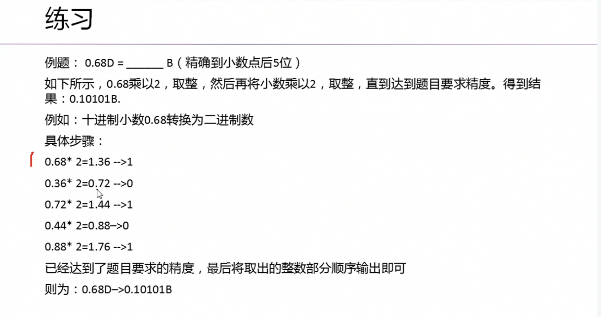

## 1.8 数据在内存中的存储方式  ※

### 1.8.0 前言

在计算机中，任何情况下都只能识别二进制，在底层存储数据的时候，一律存储的是“二进制的补码形式” ------> 补码形式效率最高

### 1.8.1 原码

以8位二进制数为例xxxx xxxx，最高位(第一位)代表符号位，0表示正数，1表示负数

### 1.8.2 反码

正数的反码就是其本身，但负数的反码需要将除符号位以外的所有位置全部取反
如：[x$_1$]$_原$ = 01100110，其[x$_1$]$_反$ = 01100110
[x$_2$]$_原$ = 11100110，[x$_2$]$_反$ = 10011001

### 1.8.3 补码

正数的补码还是其本身，但负数的补码需要将除符号位以外的所有位置全部取反，且最低位+1
如：[x$_1$]$_原$ = 01100110，其[x$_1$]$_补$ = 01100110
[x$_2$]$_原$ = 01100110，其[x$_2$]$_补$ = 10011010

### 1.8.4 计算机采用补码的原因

Q：为什么计算机要采用补码的方式来存储数据？采用原码不是更容易理解吗？

#### 1.8.4.1 采用原码处理数据

假设计算机使用原码来处理数据，此时需要对$1-1$进行计算（要注意计算机不会减法，所以这里是$1+(-1)$）
从十进制的角度来计算，$1-1 = 0$，$1+(-1)=0$
但是从二进制原码的角度来计算，0000 0001+1000 0001 = 1000 0010 = -2 很明显是错误的结论

#### 1.8.4.2 采用反码处理数据

同样的，以1.8.4.1的题为例，从二进制反码的角度进行计算
[0000 0001]$_反$ + [1111 1110]$_反$ = [1111 1111]$_反$ = [1000 0000]$_原$ = -0
乍一看，输出的结果虽然正确了，但是反码对于0的定义就有+0和-0区分，也就是两种表示方式可以表示0，这种用两种方式去表达一个0虽然不会冲突，但并不会使得空间利用率最大化。

#### 1.8.4.3 采用补码处理数据

以1.8.4.1的题为例，从二进制补码的角度进行计算
[0000 0001]$_补$ + [1111 1111]$_补$ = 1 [0000 0000]$_补$ (1溢出，只保留8个低位) = [0000 0000]$_原$ = 0
此时得到最优解，补码能唯一的表示0，同时也代表它比反码能够多表示一个数

注：对于无符号数和有符号数编码的定义，详见《深入理解计算机系统》(第3版) P$_{43}$~P$_{45}$


# Chapter 2 运算符与表达式

## 2.1 算术与赋值运算符

### 2.1.1 算术运算符  ※

| 运算符 | 说明 | 范例       | 结果 |
| :----- | :--- | :--------- | :--- |
| +      | 正号 | +3         | 3    |
| -      | 负号 | -4         | -4   |
| +      | 加法 | 5 + 5      | 10   |
| -      | 减法 | 10 - 5     | 5    |
| *      | 乘法 | 5 * 2      | 10   |
| /      | 整除 | 10 / 3     | 3    |
| %      | 取模 | 10 % 3     | 1    |
| ++     | 自增 | a = 2; a++ | 3    |
| --     | 自减 | a = 2; a-- | 1    |

```Cpp
#include <iostream>
//对"/"运算符进行验证
using namespace std;
int main()
{
	int a = 10, b = 3;//定义两个整型变量，且对其赋值
	int result = 0;//定义结果变量，对其初始化
	float result_f = 0.0;
	result = a / b;
	cout << result << endl;//输出结果，为3
	//为了让result输出小数，可以将一个变量改为浮点数，或者运算过程带浮点数
	result_f = a / (b * 1.0);
	cout << result_f << endl;//输出结果，为3.33333
    
    return 0;
}
```

```cpp
//对“++”“--”的自增自减过程进行理解
#include <iostream>
using namespace std;
int main()
{
	int num = 100;
	cout << num++ << endl;	//此时输出结果为100，但num自增到了101
	cout << num << endl;	//根据上一个自增，此时输出101
	cout << num-- << endl;	//此时输出结果为101，但num自减到了100
	cout << num << endl;	//同理，此时输出100
	return 0;
}
```

### 2.1.2 赋值运算符  ※

| 运算符 | 说明                             | 范例      | 结果      |
| ------ | -------------------------------- | --------- | --------- |
| =      | 将一个表达式的值赋给另一个表达式 | C = A + B | C = A + B |
| +=     | 相加后再赋值                     | C += A    | C = C + A |
| -=     | 相减后再赋值                     | C -= A    | C = C - A |
| *=     | 相乘后再赋值                     | C *= A    | C = C * A |
| /=     | 相除后再赋值                     | C /= A    | C = C / A |
| %=     | 取余后再赋值                     | C %= A    | C = C % A |

### 2.1.3 比较运算符  ※

| 运算符 | 说明     | 范例   | 结果      |
| ------ | -------- | ------ | --------- |
| ==     | 相等     | 4 == 3 | false , 0 |
| !=     | 不等于   | 4 != 3 | true ,1   |
| <      | 小于     | 4 < 3  | false , 0 |
| >      | 大于     | 4 > 3  | true ,1   |
| <=     | 小于等于 | 4 <= 3 | false , 0 |
| >=     | 大于等于 | 4 >= 3 | true ,1   |

### 2.1.4 逻辑运算符  ※

| 运算符 | 说明   | 范例     |
| ------ | ------ | -------- |
| &&     | 逻辑与 | A && B   |
| \|\|   | 逻辑或 | A \|\| B |
| !      | 逻辑非 | !A       |


### 2.1.5 运算符优先级  ▲

| 优先级 |                            运算符                            |  结合律  |                             助记                             |
| :----: | :----------------------------------------------------------: | :------: | :----------------------------------------------------------: |
|   1    |                              ::                              | 从左至右 |                            作用域                            |
|   2    |           a++, a-- , type(), type{}, a(), a[], ->            | 从左至右 |    后缀自增减、函数风格转型<br />函数调用、下标、成员访问    |
|   3    | ! , ~ , ++a , --a , +a , -a<br />(type), sizeof, &a , *a ,<br />new, new[], delete, delete[] | 从右至左 | 逻辑非、按位非、前缀自增减、<br />正负、C风格转型、取大小、取址、<br />指针访问、动态内存分配 |
|   4    |                           .* , ->*                           | 从左至右 |                         指向成员指针                         |
|   5    |                        a*b, a/b, a%b                         | 从左至右 |                          乘除、取模                          |
|   6    |                          a+b , a-b                           | 从左至右 |                             加减                             |
|   7    |                           << , >>                            | 从左至右 |                          按位左右移                          |
|   8    |                       < , <= , > , >=                        | 从左至右 |                           大小比较                           |
|   9    |                           == , !=                            | 从左至右 |                           等价比较                           |
|   10   |                             a&b                              | 从左至右 |                            按位与                            |
|   11   |                              ^                               | 从左至右 |                           按位异或                           |
|   12   |                              `                               | 从左至右 |                                                              |
|   13   |                              &&                              | 从左至右 |                            逻辑与                            |
|   14   |                             \|\|                             | 从左至右 |                            逻辑或                            |
|   15   |        a ? b : c,<br />=, +=, -=, *=, /=, %=, &=, ^=         | 从右至左 |                                                              |
|   16   |                              ,                               | 从左至右 |                             逗号                             |

## 2.2 数据类型转换  ※

### 自动类型转换也叫隐式转换

当不同类型的变量同时运算时就会发生数据类型的自动转换。

- char和int两个类型的变量相加时，就会把char先转换成int再进行加法运算
- 如果是int和double类型进行运算时，就会把int转换成double再进行运算
- 条件判断中，非布尔型自动转换为布尔类型

### 强制转换也叫显式转换

- (typeName) value (C语言的写法)
- typeName (value) (C++的写法)
- static_cast<>可以将值从一种数据类型转换为另外一种数据类型，格式为：`static_cast<typeName>(value)`

# Chapter 3 流程控制

## 3.1 三种流程控制

在程序中，程序运行的流程控制决定程序是如何执行的，主流的程序设计语言一般有三大流程控制语句：分别是顺序控制、分支控制和循环控制。
C++的常用流程控制有`if`、`for`、`while`、`do while`和`switch`。

顺序控制就是程序从上到下逐行的执行，中间没有任何判断和跳转。

## 3.2 if else elif switch语句※

### 3.2.1 if语句 ※

单独的`if`，也叫单分支结构。

语法：

```cpp
if (condition)
{
	//do something
}

int num = 100;
if(num > 0)
{
	cout << "num > 0" << endl;
}
```

### 3.2.2 if-else语句 ※

双分支

语法：

```cpp
if(condition)
{
	//do something_1
}
else
{
	//do something_2
}
int num2 == 1;
if(num2 == 1)
{
	cout << "num2 = 1" << endl;
}
else
{
	cout << "num2 != 1" << endl;
}
```

### 3.2.3 if-elif-elif-else 语句 ※

多分支

语法：

```cpp
if(condition_1)
{
	//do something_1
}
else if(condition_2)
{
	//do something_2
}
else if(condition_3)
{
	//do something_3
}

int num;
if(num3 > 0)
{
	cout << "num3 > 0" << endl;
}
else if(num3 < 0)
{
	cout << "num3 < 0" << endl;
}
else if(num3 == 0)
{
	cout << "num3 = 0" << endl;
}
```

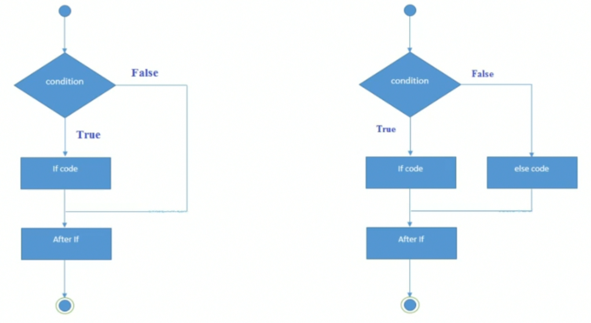

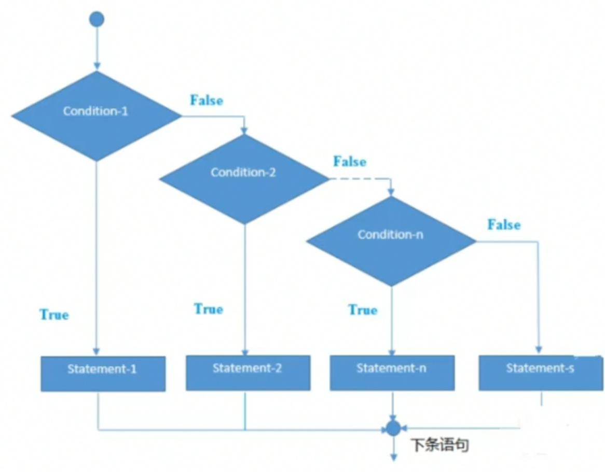

### 3.2.4 if嵌套语句 ※

在C++中，`if`语句、`else if`语句和`else`语句可以进行**<u>任意</u>**的嵌套。

语法

```cpp
if (condition)
{
	if (condition1)
	{
		//do something1
	}
	else if (condition2)
	{
		//do something2
	}
}
else
{
	if(condition3)
	{
		//do something3
	}
	else if(condition4)
	{
		//do something4
	}
	else
	{
		//do something5
	}
}

int a = 1;
int b = 2;
if(a == 1)
{
    if (b == 2)
    {
		cout << "a等于1且a等于2" << endl;
    }
    else
    {
        cout << "b不等于1" << endl;
    }
}
else
{
    cout << "a不等于1" << endl;
}
```

### 3.2.5 switch语句 ※

`switch`语句从多个条件执行一个语句。它就类似于在C++中的多分支结构

语法

```cpp
switch(n)
{
	case constant1:
		//如果n等于constant1，将执行的代码;
		break;
	case constant2:
		//如果n等于constant2，将执行的代码;
		break;
		.
		.
		.
	default:
		//如果n不配任何constant，将执行的代码
        break;
}

int n;
cin >> n;
switch(n)
{
    case 1:
        cout << 1 << endl;
    	break;
    case 2:
        cout << 2 << endl;
    	break;
    case 3:
        cout << 3 << endl;
    	break;
    default:
        cout << "不是1,2,3" << endl;
        break;
}
```

### 3.2.6 switch规则

- `switch`语句中的`expression`必须是一个整型或枚举类型，或者是一个`class`类型，其中`class`有一个单一的转换函数将其转换为整型或枚举类型。
- 在一个`switch`中可以有任意数量的`case`语句。每个`case`后跟一个要比较的值和一个冒号。
- `case`的`constant-expression`必须与`switch`中的变量具有相同的数据类型，且必须是一个常量或字面量。
- 当被测试的变量等于`case`中的常量时，`case`后跟的语句将被执行，直到遇到`break`语句为止。
- 当遇到`break`语句时，`switch`终止，控制流将跳转到`switch`语句后的下一行。
- 不是每一个`case`都需要包含`break`。如果`case`语句不包含`break`，控制流将会继续后续的`case`，直到遇到`break`为止。
- 一个`switch`语句可以有一个可选的`default case`，出现在`switch`的结尾。`default case`可用于在上面所有`case`都不为真时执行一个任务。`default case`，出现在`switch`的结尾。`default case`中的`break`语句不是必需的。

#### 3.2.6.1 案例

输入一个数字，检查等级10, 20, 30.

```cpp
int n;
cin >> n;
switch(n)
{
	case 1:
		cout << 10 << endl;
		break;
	case 2:
		cout << 20 << endl;
		break;
	case 3:
		cout << 30 << endl;
		break;
}
```

## 3.3 条件表达式(三目运算符) ▲

C/C++条件表达式使用三目运算符？：完成，适当条件下可与`if else`语句相互替换。
条件表达式优点在于可直接返回表达式运算的结果。

语法：`条件表达式?值1:值2;	//如条件表达式为ture，返回值1，否则，返回值2`

### 3.3.1 案例

求两个数的差，结果总是为大的数减去小的数

```cpp
int a, b, c;
cin >> a >> b;
c = (a > b) ? a - b : b - a;
cout << c << endl;
```

## 3.4 while循环 ※

有的时候，可能需要多次执行同一块代码。
编程语言提供了允许更为复杂的执行路径的多种控制结构。
循环语句允许多次执行一个语句或语句组。

### 3.4.1 while语句

C++的`while`循环跟if和for语句类似，都是使用{}作为分隔符，要执行的代码块都是相同的缩进形式。

语法

```cpp
while (condition)
{
	//do something
}
```

案例

循环打印0-5的数字

```cpp
int num = 0;
while(num <= 5)
{
	cout << "num=" << endl;
	num++;
}
```

### 3.4.2 do-while循环

C++的`do while`循环跟`while`循环类似，不过，`do while`循环与`while`循环的区别是不管`do while`的条件是否为真，`do while`至少会循环一次。

语法

```cpp
do{
	//do something
}while(condition)
```

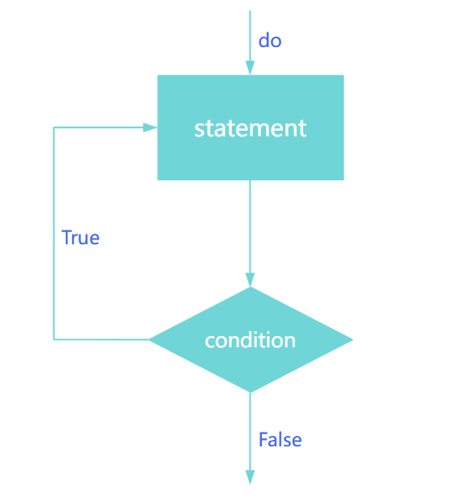

#### 案例

```cpp
int i = 1;
do{
	cout << i++ << endl;
}while(i <= 10);
```

## 3.5 for循环 ※

### 3.5.1 for语句

for循环用于重复程序的一部分几次(或多次)。如果迭代次数是固定的，建议使用`for`循环，其次是`while`和`do while`循环。

语法

```cpp
for (express1;express2;express3)
{
	//statements
}
```

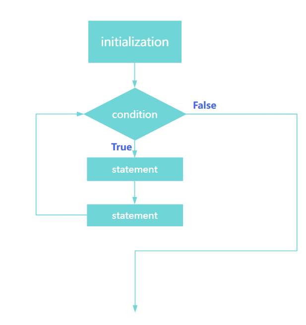

#### 3.5.1.1 案例1

用`for`循环打印从1到10

```cpp
for (int i = 1; i <= 10; i++)
{
	cout << i << endl;
}
```

#### 3.5.1.2 案例2

实现输出以下情况的代码
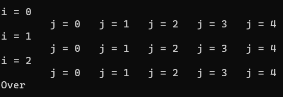

```cpp
for (int i = 0; i < 3; i++) {
		cout << "\ni = " << i << endl;
		for (int j = 0; j < 5; j++) {
			cout << "\tj = " << j;		//\t是制表符等同于Tab的效果
		}
	}
	cout << "\nOver" << endl;
```

## 3.6 break和continue

`break`:语句出现时将立即终止循环
`continue`:

break案例:从1开始打印，遇到第一个能同时被3和4整除的数字时立即终止

```cpp
int num = 1;
while(1){
		if(num % 3 == 0 && num % 4 ==0){
		break;
		}
num++;
}
```

continue案例:打印1-10之间的偶数

```cpp
for (int i = 0; i <= 10; i++){
if (i % 2 == 0){
continue;
}
cout << i << endl;
}
```

do while案例:找出三位数内所有的水仙花数(指一个三位数，它每一位数字的三次幂之和等于它本身)


## 3.7 随机数

rand和srand

C++中没有自带的random函数，要实现随机数的生成就需要使用rand()和srand()，且这两个函数需要头文件<cstdlib>

rand()函数---->伪随机数

rand()会返回一随机数值，范围在0～RAND_MAX之间，RAND_MAX定义在stdlib.h中。

案例:产生一个0～99的随机数

```cpp
#include<iostream>
#include<cstdlib>
using namespace std;
int main(){
cout << rand()%100;
return 0;
}
```

srand (种子)

srand()课用来设置rand()产生随机数时的随机数种子。通过设置不同的种子，我们可以获取不同的随机数序列。

可以利用srand((int)(time(NULL)) （或将NULL改为0）的方法，利用系统时钟，产生不同的随机数种子。需要调用time()函数，此函数被包含在头文件<ctime>中。

time()获取的值是从1970.1.1 00:00:00开始到现在的秒数

案例:输出10个随机数

```cpp
#include<iostream>
#include<cstdlib>
#include<ctime>
#define random(x) rand()%(x)
using namespace std;
int main(){
		srand((int)time(0));//产生随机种子，NULL == 0
		for (int i = 0; i < 10 ; i++){
		cout << rand() % 100 << " "; //也可以用宏定义使得函数的使用更方便和直观
		cout << random(100) << " ";//与上行输出完全一致
		}
return 0;
}
```

其他的随机数的范围通式

要取得[0,n)的随机整数，就是rand()%n，表示从0～n-1的数

要取得[a,b)的随机整数，使用(rand() % (b - a)) + a;

要取得[a,b]的随机整数，使用(rand() % (b - a + 1)) + a;

要取得(a,b]的随机整数，使用(rand() % (b - a)) + a + 1;

通用公式:a + rand() % n；其中的a是起始值，n是整数的范围。

要取得a到b之间的随机整数，另一种表示：a + (int)b * rand() / (RAND_MAX + 1)。

要取得0～1之间的浮点数，可以使用rand() / double(RAND_MAX)。

案例：利用随机数产生一个[0,1)的一位小数

```cpp
srand(time(NULL));
cout << rand() / double (RAND_MAX) << endl;
```

作业：输出一个1～100的随机整数

cout << rand()%100 + 1;即可

综合案例1——猜数字游戏

Part I 在1～100之间取个数字，然后输入数字进行猜测，直到猜对了为止

```cpp
#include <iostream>
#include <cstdlib>
#include <ctime>
using namespace std;
int main(){
    //随机一个1～100之间的整数
    srand((unsigned)time(NULL));
    int guess = rand() % 100 + 1;    
    //输入数字
    int num = 0;
    //不确定多少次能猜对，使用无限循环
    while(1){
        cout << "请输入数字（1-100）: " << endl;
        cin >> num;
        if (num == guess) {
            cout << "恭喜" << endl;
            break;
        }
    }
    return 0;
}
```

注：以下代码均不带头文件 + std命名空间使用 + main()函数框架（包括return 0;）

Part II 在I的基础上，提示猜数字的范围，若小，提示小，若大，提示大，猜对直接退出

```cpp
while(1){
  cout << "请输入数字（1-100）: " << endl;
  cin >> num;
  if (num == guess){
     cout << "恭喜" << endl;
     break;
  }
  else if (num < guess){
      cout << "猜小了" << endl;
  }
  else{
      cout << "猜大了" << endl;
	}
}
```

Part III 加一个难度选择（如普通模式下拥有10次机会，中等为5次，困难为2次）

```cpp
//选择等级
    int level = 0;
    char c = 0;
    cout << "选择等级：（容易a 10次机会；中等b 5次机会；困难c 2次机会）" << endl;
    cin >> c;
    if (c == 'a'){
        level = 10;
    }
    else if (c == 'b'){
        level = 5;
    }
    else if (c == 'c'){
        level = 2;
    }
    //输入数字
    int num = 0;
    int i = 1;
    //不确定多少次能猜对，使用无限循环
    for (; i <= level;i++){
        cout << "请输入数字（1-100）: " << endl;
        cin >> num;
        if (num == guess)
        {
            cout << "恭喜" << endl;
            break;
        }
        else if (num < guess){
            cout << "猜小了" << endl;
        }
        else{
            cout << "猜大了" << endl;
        }
    }
    if (i > level){
        cout << "失败了，你猜的次数已经达到上限了" << endl;
```

Part IV 加一个死循环，能让玩家选择是否重复游玩

```cpp
#include<iostream>
using namespace std;
int main() {
	//随机一个1～100之间的整数
	while (1) {
		srand((unsigned)time(NULL));
		int guess = rand() % 100 + 1;
		//选择等级
		int level = 0;
		char c = 0;
		cout << "选择等级：（容易a 10次机会；中等b 5次机会；困难c 2次机会）" << endl;
		cin >> c;
		if (c == 'a') {
			level = 10;
		}
		else if (c == 'b') {
			level = 5;
		}
		else if (c == 'c') {
			level = 2;
		}
		else {
			cout << "无效输入，退出游戏！" << endl;
		}
		//输入数字
		int num = 0;
		int i = 1;
		//不确定多少次能猜对，使用无限循环
		for (; i <= level; i++) {
			cout << "请输入数字（1-100）: " << endl;
			cin >> num;
			if (num == guess)
			{
				cout << "恭喜" << endl;
				break;
			}
			else if (num < guess) {
				cout << "猜小了" << endl;
			}
			else {
				cout << "猜大了" << endl;
			}
		}
		if (i > level) {
			cout << "失败了，你猜的次数已经达到上限了" << ' ' << guess << endl;
		}
		cout << "你是否要继续游玩Y/N" << endl;
		cin >> c;
		if (c == 'N') {
			break;
		}
		else if (c == 'Y') {
			continue;
		}
		else {
			cout << "无效输入，退出游戏！" << endl;
			break;
		}
	}
	return 0;
}
```

# Chapter 4 数组

## 4.1 一维数组 ※

### 前言

在程序开发的过程中，很多场景，我们需要保存很多的数据，或者说我们需要保存一组数据，使用普通的datatype不能满足我们的需求，C++为开发者提供了数组(array)用来保存一组数据。

在C++中，数组保存的一组数据的类型必须是完全一致的，C++不支持数组保存不同的数据类型。

###4.1.1 一维数组的定义和初始化

定义：

`datatype array[length];`------>`int arr_num[5];`

`int arr_num[5] = {1, 2, 3, 4, 5}; //初始化`

### 4.1.1 数组名要求

1.只能由字数字和下划线组合，但不能数字开头；
2.系统关键字不能作为数组名；
3.同一作用域下不能重名；
4.见其名知其意。

### 4.1.2 数组下标

数组是一组具有连续内存位置的类似类型元素。

在C++中`std::array`是一个封装固定大小数组的容器，数组索引从0开始，可以在C++数组中只存储固定的元素集合。

### 4.1.3 一维数组的数据元素访问

访问数组的元素，使用中括号，即[]加上数组索引即可，要注意，下标从0开始。

因此，如果我们需要访问数组的第一个元素，其索引应该为0，要访问数组的最后一个元素，其索引是数组的长度减1.

`数组名[索引/下标]`

#### a. 直接通过下标进行访问

#### b. 循环访问

```cpp
int arr[5] = {1, 2, 3, 4, 5};
for (int i = 0; i < 5; i++){
	cout << arr[i] << " ";
}
```

#### c. 使用foreach循环遍历

```cpp
int arr[5] = {1, 2, 3, 4, 5};
for (int i:arr)//:之后是容器的变量名，这里指多个值的容器且连续的，int一般可以用auto让编译器自行判断变量类型
{
		cout << i << " ";//这里的i不再是下标，而是数据本身
}
```

#### d. 循环赋值

```cpp
int arr[5];
for (int i = 0; i < 5; i++){
  	cin >> arr[i];
}
```

### 4.1.4 练习1

现有五只小猪，体重分别为764，942，613，476，940。定义一个一维数组，存放五只小猪的体重，找出其中最重的小猪，并输出出来。

```cpp
#include <iostream>
#include <cstdlib>

using namespace std;

int arr[5]
int m;
int main(){
  	for (int i = 0; i < 5; i++){
      	cin >> arr[i];
    }
    m = arr[0];
    for (int i = 1; i < 5; i++){
        if (m < arr[i]){
            m = arr[i];
        }
    }
    cout << m;
}
```

### 4.1.5 练习2

输入n（n <= 100）个数保存到数组中，求n个数的和以及平均值

```cpp
#include <iostream>
#include <cstdlib>

using namespace std;

int arr[103];
int n, sum;
int main(){
    cin >> n;
    for (int i = 0; i < n; i++){
        cin >> arr[i];
    }
    for (int i = 0; i < n; i++){
        sum += arr[i];
    }
    cout << sum << ' ' << sum / n << endl;
}
```

比较两个数组是否相等，不能直接使用比较运算符 == ，需要比较数组的长度和数组中的元素是否一致。

```cpp
#include <iostream>

using namespace std;

int arr1[5],arr2[5];

int main(){
    for (int i = 0; i < 5; i++){
        cin >> arr1[i];
    }
    for (int i = 0; i < 5; i++){
        cin >> arr2[i];
    }
    //比较两个数组的元素个数是否一致，使用sizeof()函数
    int arr1Count = sizeof(arr1) / sizeof(arr1[0]);//用数组的长度除去单个元素的长度，就代表数组中元素的个数
    int arr2Count = sizeof(arr2) / sizeof(arr2[0]);
    if (arr1Count != arr2Count)//数组内元素个数不同这两个数组绝对不相同
    {
        cout << "arr1 != arr2" << endl;
        return 0;
    }
    //判断数组各元素是否一一对应一致（元素数据相同，但位置不同也不是相同的数组）
    for (int i = 0; i < arr1Count; i++){
        if (arr1[i] != arr2[i]){
            cout << "arr1 != arr2" << endl;
            return 0;
        }
    }
    cout << "arr1 == arr2" << endl;
}
```

## 4.2 冒泡排序 ※

在上述数组是否相同的比较中，提到了元素数据相同，但位置不同也不是相同的数组；接下来只需要满足元素相同即可，不需要满足位置也一致。此时就需要使用排序先将各数组的元素先有序排序后在一一比较。

### 4.2.1 冒泡排序的步骤

1.比较相邻的元素。如果第一个元素比第二个元素大，就交换他们两个。

2.对每一对相邻元素做同样的工作，执行完毕后，找到第一个最大值。

3.重复以上的步骤，每次比较次数-1，直到不需要比较。

附：第一趟排序完以后，末尾必定是最大元素。

如：8、7、6、5、4进行冒泡排序，第一趟过程如下图所示

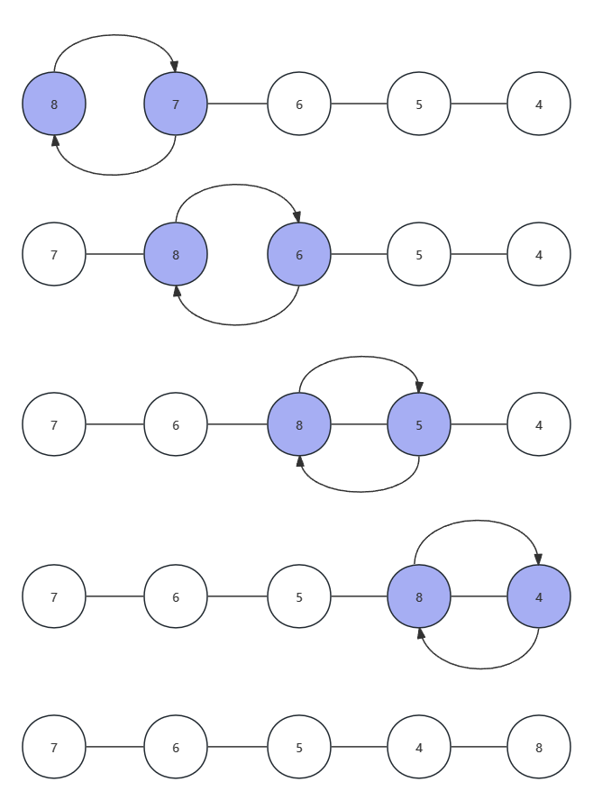


### 4.2.2 交换数据

现有int a = 1; int b = 2; 输出：a = 2  b = 1

#### A.临时变量法

```cpp
int a = 1, b = 2, tmp = 0;
tmp = a;
a = b;
b = tmp;//通过一个tmp变量来保证互换时的数据不丢失
```

#### B.加减法

```cpp
int a = 1, b = 2;
a = a + b;//a = 3
b = a - b;//b = 1
a = a - b;//a = 2
```

#### C.系统函数调用(swap)

swap(x,y);//将x，y两个值互换

### 4.2.3 冒泡排序的实现

```cpp
int arr[5] = {3, 1, 2, 4, 5};
for (int i = 0; i < 5 - 1;i++){//比较趟数
  	for (int j = 0; j < 5 - i -1; j++){//比较次数
      	if (arr[i] > arr[j+1]){
          	swap(arr[j], arr[j + 1]);
        }
    }
}
for (int i = 0; i < n; i++){
  	cout << arr[i] << " ";
}
```

## 4.3 普通查找 ※

根据值顺序查找

比如在给定数组中查找固定的某个值，就可以从下标为0的元素开始顺序对比查找。

### 案例

在长度为N（N <= 100）的数组中，输入m个元素，查找k元素第一次出现的位置（位置从1开始），如果找不到k，输出-1.

input:
5
1 3 5 6 3
3

output:
2

```cpp
#include <iostream>

using namespace std;

int arr[105];
int m, k;

int main(){
    cin >> m;
    for (int i = 1; i <= m; i++){
        cin >> arr[i];
    }
    cin >> k;
    for (int i = 1; i <= m; i++){
        if (k == arr[i]){
            cout << i << endl;
            return 0;
        }
        return -1;
    }
    return 0;
}
```

## 4.4 二分查找 ※

二分查找也叫折半查找(Binary Search)，是一种效率较高的查找方法。

1. 定义两个变量l和r；//left值和right值

2. 用mid（猜的数）保存l和r的中间值；

3. 假如小了，则把l变成mid + 1（将左半部分排除在外）；

4. 假如大了，则把r变成mid - 1（将右半部分排除在外）；

5. 假如正确，return mid;

6. 假如 l > r，则返回-1；

注：用于查找的内容逻辑上来说是需要有序的；查找的数量只能是一个，而不是多个。

过程如下图所示


### 案例1

在数组长度为N（N <= 100）的数组中，输入m个元素（有序），查找k元素的位置（位置从1开始），如果找不到k，输出-1.

input：
5
11 22 33 44 55
22

output：
2

```cpp
#include <iostream>

using namespace std;

int arr[105], m, k;
int main(){
    cin >> m;
    for (int i = 1; i <= m; i++){
        cin >> arr[i];
    }
    cin >> k;
    //定义左下标、右下标、中间标号
    int left = 0,right = m,mid = 0;
    while (left < right){
        mid = (left + right)/2;
        if (arr[mid] == k){
            cout << mid << endl;
            break;
        }
        else if (arr[mid] < k){//所找数据比中间值大，必然在右边，将左标移到中间+1的位置
            left  = mid + 1;
        }
        else{//所找数据比中间值小，必然在左边，将左标移到中间-1的位置
            left = mid - 1;
        }
    }
    
    if (left > right)//当左标大于右标时，说明该元素无法被找到，返回-1
    {
        cout << -1 << endl;
    }
    return 0;
}
```

### 案例2

如案例1所示，一个有序数组中有多个重复的元素，输出这个元素第一次出现的位置（从1开始）

input:
10
11 22 22 22 22 22 22 33 44 55
22

output:
2

```cpp
#include <iostream>

using namespace std;

int arr[105], m, k;
int main(){
    cin >> m;
    for (int i = 1; i <= m; i++){
        cin >> arr[i];
    }
    cin >> k;
    //定义左下标、右下标、中间标号
    int left = 0,right = m,mid = 0;
    while (left < right){
        mid = (left + right)/2;
        if (arr[mid] == k){
            //往mid的左边继续查找是否一样
            while(arr[mid - 1] == k && mid - 1 >= 0){
                mid--;
            }
            cout << mid << endl;
            break;
        }
        else if (arr[mid] < k){//所找数据比中间值大，必然在右边，将左标移到中间+1的位置
            left  = mid + 1;
        }
        else{//所找数据比中间值小，必然在左边，将左标移到中间-1的位置
            left = mid - 1;
        }
    }
    
    if (left > right)//当左标大于右标时，说明该元素无法被找到，返回-1
    {
        cout << -1 << endl;
    }
    return 0;
}
```

### 案例3

如案例1所示，一个有序数组中有多个重复的元素，输出这个元素最后一次出现的位置（从1开始）

input:
10
11 22 22 22 22 22 22 33 44 55
22

output:
7

```cpp
#include <iostream>

using namespace std;

int arr[105], m, k;
int main(){
    cin >> m;
    for (int i = 1; i <= m; i++){
        cin >> arr[i];
    }
    cin >> k;
    //定义左下标、右下标、中间标号
    int left = 0,right = m,mid = 0;
    while (left < right){
        mid = (left + right)/2;
        if (arr[mid] == k){
            //往mid的右边继续查找是否一样
            while(arr[mid + 1] == k && mid + 1 <= m){
                mid++;
            }
            cout << mid << endl;
            break;
        }
        else if (arr[mid] < k){//所找数据比中间值大，必然在右边，将左标移到中间+1的位置
            left  = mid + 1;
        }
        else{//所找数据比中间值小，必然在左边，将左标移到中间-1的位置
            left = mid - 1;
        }
    }
    
    if (left > right)//当左标大于右标时，说明该元素无法被找到，返回-1
    {
        cout << -1 << endl;
    }
    return 0;
}
```

### 案例4

查找元素个数

在一个有序数组中，相同元素一定是挨着的，只需要找到这个元素，在左右寻找，记录个数即可。

在元素个数N（N <= 100）的数组中，输入m个元素（有序），查找k元素的个数，如果找不到，输出0.

input:
10
11 22 22 22 22 22 22 33 44 55
22

output:
6

```cpp
#include <iostream>

using namespace std;

int arr[105], m, k, cnt;
int main(){
    cin >> m;
    for (int i = 1; i <= m; i++){
        cin >> arr[i];
    }
    cin >> k;
    //定义左下标、右下标、中间标号
    int left = 0,right = m,mid = 0;
    while (left < right){
        mid = (left + right)/2;
        if (arr[mid] == k){
            cnt++;
            int left_index = mid - 1;
            int right_index = mid + 1;
            //往mid的左边继续查找是否一样
            while(arr[left_index] == k && left_index >= 0){
                left_index--;
                cnt++;
            }
            //往mid的右边继续查找是否一样
            while(arr[right_index] == k && right_index <= m){
                right_index++;
                cnt++;
            }
            break;
        }
        else if (arr[mid] < k){//所找数据比中间值大，必然在右边，将左标移到中间+1的位置
            left  = mid + 1;
        }
        else{//所找数据比中间值小，必然在左边，将左标移到中间-1的位置
            left = mid - 1;
        }
    }
    cout << cnt << endl;
    
    return 0;
}
```

## 4.5 一维数组修改元素 ※

1.通过下标直接修改
2.先查找，再修改

### 案例1

蛋糕厂有两台包装称重机编号为01与02，以01号包装一块、02号包装一块、01号包装一块，以这样的方式轮流工作。经检查今日02好机器出现故障，每一块小蛋糕都少称m克，已知今日包装了n块小蛋糕，输入修正前n块小蛋糕的重量，输出修正后每块蛋糕的质量。

input:

三行，第一行一个整数n（0 < n <= 10000），第二行为n个浮点数表示修正前小蛋糕的质量，第三行为一个浮点数m表示因机器故障导致每块小蛋糕缺少的质量。
5
50.5 48.2 50.5 47.7 50.2
3.2

output:
50.5 51.4 50.5 50.9 50.2

```cpp
#include <iostream>

using namespace std;

float arr[10005], m;
int n;

int main(){
    cin >> n;
    for (int i = 0; i < n;i++){
        cin >> arr[i];
    }
    cin >> m;
    for (int i = 0; i < n; i++){
        if(i % 2 == 1){
            arr[i] += m;
        }
        cout << arr[i] << " ";
    }
    return 0;
}
```

### 案例2

在一次100m百米跑比赛中，有n（5 <= n <= 10）个同学进行比赛，输入这n个同学的比赛成绩，把第一名和最后一名的同学的位置进行交换，再输出比赛成绩。

input:
5
10.3 9.8 10.6 9.9 11

output:
10.3 11 10.6 9.9 9.8

```cpp
#include <iostream>

using namespace std;

float arr[12];
int n;
int max_index, min_index;
int main(){
    cin >> n;
    for (int i = 0; i < n; i++){
        cin >> arr[i];
    }
    max_index = 0;
    min_index = 0;
    for (int i = 1; i < n; i++){
        max_index = (arr[max_index] < arr[i]) ? i : max_index;
        min_index = (arr[min_index] > arr[i]) ? i : min_index;
    }
    swap(arr[max_index],arr[min_index]);
    for (int i = 0; i < n; i++){
        cout << arr[i] << " ";
    }
    return 0;
}
```

## 4.6 数组元素的添加 ※

### 4.6.1 添加到数组末尾

根据现有的最大下标+1，直接插入

注意：插入的下标一定小于等于数组长度减1

案例

马路前方塞车，目前塞车数量n，输入n辆车的编号，后来又有m辆加入塞车队伍，输出现在所有塞车车辆编号，总车辆（n+m <= 100）.

input:
3
12 15 9
5
10 11 8 19 6

output:
12 15 9 10 11 8 19 6

```cpp
#include <iostream>

using namespace std;

int n, m, arr[102];

int main(){
    cin >> n;
    for (int i = 0; i < n; i++){
        cin >> arr[i];
    }
    cin >> m;
    for (int i = 0; i < m; i++){
        cin >> arr[i + n];
    }
    for (int i = 0; i < n + m; i++){
        cout << arr[i] << " ";
    }
    return 0;
}
```

### 4.6.2 根据要求添加到数组

案例

班里转来一位新同学，班主任老师安排这位同学坐在小张这一组，输出安排新同学座位后，小张所在小组每位同学的学号

input:

共4行，第一行为一个整数n（0 < n < 60）代表小张同学这一组的同学人数，第二行为n个整数代表小张同学所在小组每位学生的学号，第三行为一个整数k代表新来同学的学号，第四行两个整数p, m，若p = 1，则新同学坐在第m个同学的前面，若p = 0，则新同学坐在第m个同学的后面。
5
7 1 3 14 5
56
0 2

output:

一行，新同学安排好后，小张所在小组每位同学的学号
7 1 56 3 14 5

```cpp
#include <iostream>

using namespace std;

int n, arr[62], k, p, m, tmp;

int main(){
    cin >> n;
    for (int i = 1; i <= n; i++){
        cin >> arr[i];
    }
    cin >> k;
    cin >> p >> m;
    tmp = n;
    if (p == 0){
        for( ; n > m; n--){
            arr[n+1] = arr[n];
        }
        arr[m+1] = k;
    }
    else{
        for ( ; n >= m; n--){
            arr[n+1] = arr[n];
        }
        arr[m] = k;
    }
    for (int i = 1; i <= tmp + 1; i++){
        cout << arr[i] << " ";
    }
    return 0;
}
```

## 4.7 一维数组删除元素 ※

案例

小赵在录入n（2 <= n <= 100）个同学的分数，该数组中有个数据是严重错误的分数，找出该分数，删掉后，打印其余正常分数。

input:
5
90 98 87 -100 89

output:
90 98 87 89

```cpp
#include <iostream>

using namespace std;

int point[105];
int n, tmp;

int main(){
    cin >> n;
    for(int i = 0; i < n - tmp; i++){
        cin >> point[i];
        if (point[i] < 0){
            i--;
            tmp++;
        }
    }
    for (int i = 0; i < n - tmp;i++){
        cout << point[i] << " ";
    }
}
```

## 4.8 一维数组元素合并 ※

### 4.8.1 无序合并

案例

给定两个数组arr1和arr2，数组长度不超过100，合并成arr3

input:
4
11 2 13 41
3
100 200 300

output:
11 2 13 41 100 200 300

```cpp
#include <iostream>

using namespace std;

int arr1[105], arr2[105], arr3[205];
int n1,n2;

int main(){
    cin >> n1;
    for(int i = 0; i < n1; i++){
        cin >> arr1[i];
    }
    cin >> n2;
    for(int i = 0; i < n2; i++){
        cin >> arr2[i];
    }
    for(int i = 0; i < n1; i++){
        arr3[i] = arr1[i];
    }
    for(int i = 0; i < n2; i++){
        arr3[i+n1] = arr2[i];
    }
    for(int i = 0; i < n1+n2; i++){
        cout << arr3[i] << " ";
    }
    return 0;
}
```

### 4.8.2 有序合并

要求合并后按降序或升序输出结果

案例

输入两个升序数组num1与num2，将num1与num2合并到num3中，并且删除重复的数，使得num3依旧为一个升序数组（不能先合并后排序）

input:
四行，第一行，先输入一个整数N1（0 < N1 < 100）代表num1数组的元素个数，再输入N1个整数代表num1中的N1个元素值，下两行同理
6
-3 2 5 7 8 12
8
0 1 2 3 10 13 18 20

input:
-3 0 1 2 3 5 7 8 10 12 13 18 20

```cpp
#include <iostream>

using namespace std;

int num1[105], num2[105], num3[205];
int N1, N2;

int main(){
    cin >> N1;
    for(int i = 0; i < N1; i++){
        cin >> num1[i];
    }
    cin >> N2;
    for(int i = 0; i < N2; i++){
        cin >> num2[i];
    }
    int index = 0, i = 0, j = 0;
    for(;i < N1 && j < N2;){
        if (num1[i] < num2[j]){
            num3[index++] = num1[i++];
        }
        else if(num1[i] > num2[j]){
            num3[index++] = num2[j++];
        }
        else{
            num3[index++] = num1[i++];
            j++;
        }
    }
    while (i < N1){
            num3[index++] = num1[i++];
        }
    while (j < N2){
            num3[index++] = num2[j++];
        }
    for(int i = 0; i < index; i++){
            cout << num3[i] << " ";
        }
    return 0;
}
```

练习：定义一个int型的一维数组，包含10个元素，分别赋值为1～10，然后将数组中的元素都向前移一个位置，即a[0] = a[1], a[1] = a[2]...最后一个元素的值是原来第一个元素的值，然后输出这个数组

input:
1 2 3 4 5 6 7 8 9 10

output:
2 3 4 5 6 7 8 9 10 1

```cpp
#include <iostream>

using namespace std;

int arr[10];

int main(){
    for(int i = 0; i < 10; i++){
        cin >> arr[i];
    }
    int temp = arr[0];
    for(int i = 1; i < 10; i++){
        arr[i-1] = arr[i];
    }
    arr[9] = temp;
    for(int i = 0; i < 10; i++){
        cout << arr[i] << " ";
    }
    return 0;
}
```

## 4.9 字符数组 ※

### 4.9.1 字符数组定义与声明 ▲

C++中的字符数组，是用来存放一连串字符的数组，C++的字符数组使用与其他数组基本相同，但初始化时，可以直接使用字符串进行初始化，但初始化时，可以直接使用字符串进行初始化，也就是C语言风格的字符串

语法

`char arrName[count];`
`char arrName[count] = "abcde";`
`char arrName[count] = {'a','b','c','d','e'};`
`char arrName[count] = {"abcde"};`

### 4.9.2 字符和字符串的区别

`char`是字符，也是0～127的无符号整数。通常能用一个`char`表示的被称为ASCII编码。

字符串是以NULL结尾的连续地址。日常生活中常用转义字符 `\0` 表示（如下图所示）

### 4.9.3 字符数组的地址 ▲

`cout`在遇到`char`数组时，会输出整个字符串，直到遇到`\0`，所以就算是普通的`char`单个字符地址，我们也需要`(void*)`来强制转换其类型

注：`void`被翻译为无类型，`void*`为无类型指针，一般称为通用指针或泛指针。

### 4.9.4 字符数组的输入和输出 ※

`cin >>`遇到 ' '和'\n'都会停止输入
`gets(arrc)	//能够直接读取到'\n'`
`puts(arrc)	//打印一串字符直到'\n'`

### 4.9.5 字符数组的操作 ※

在使用字符数组的操作时，需添加从C语言移植的头文件`#include<cstring>`

```cpp
#include <cstring>
strlen(p); 		//取字符串长度
strcpy(p, p1); 	//复制字符串
strncpy(p, p1, n)	//复制指定长度的字符串
strcat(p, p1)	//附加字符串
strncat(p, p1, n)	//附加指定长度的字符串
...
```

#### 4.9.5.1 strlen(p)

p代表字符数组名，通用格式写为strlen(array_name); 其作用是返回字符数组中的元素个数，且'\0'不被包含在内。

```cpp
char arr[10] = 'abc';
int len = strlen(arr);
cout << len << endl;		//输出为3
```

#### 4.9.5.2 strcpy(p1, p2)

将p2复制到p1，再返回p1的值

```cpp
char arr1[10] = "abc";
char arr2[10] = "jkl";
//arr1 = arr2;  不可取，这是一个非法的指令
strcpy(arr1, arr2);		//在VS22中不能使用该函数，被认为unsafe，使用strcpy_s即可
cout << arr1 << endl;	//输出为jkl
```

#### 4.9.5.3 strncpy(p1, p2, n)

将p2前n个字符复制到p1，返回p1的值

```cpp
char arr1[10] = "abc";
char arr2[10] = "jkl";
strncpy(arr1, arr2, 2);	//在VS22中不能使用该函数，被认为unsafe，使用strncpy_s即可
cout << arr1 << endl;	//输出为jk
```

#### 4.9.5.4 strcmp(p1, p2)

通过ASCII码来比较p1和p2的大小，若p1 > p2 $\rightarrow$ return 1; p1 = p2 $\rightarrow$ return 0; p1 < p2 $\rightarrow$ return -1;
注：strcmp是对一个字符一个字符进行比较，而非整体进行对比，详情看下面样例中的arr5、arr6对比

```cpp
char arr1[10] = "abc";
char arr2[10] = "abc";
char arr3[10] = "abb";
char arr4[10] = "abd";
int a = strcmp(arr1, arr2);
int b = strcmp(arr1, arr3);
int c = strcmp(arr1, arr4);
cout << a << endl; 	//输出为0
cout << b << endl;	//输出为1
cout << c << endl;	//输出为-1
char arr5[10] = "ab";
char arr6[10] = "ba";
int d = strcmp(arr5, arr6);
cout << d << endl;	//输出为-1，从第一个字符a的ASCII值小于b的值时就已停止比较
```

#### 4.9.5.5 strncmp(p1, p2, n)

通过ASCII码来比较p1、p2的大小，对前n个字符进行比较。

```cpp
char arr1[10] = "abc";
char arr2[10] = "abb";
int length = 2;		//设定需要比较的字符串长度
int a = strncmp(arr1, arr2, length);
cout << a << endl;	//输出为0
```

#### 4.9.5.6 stricmp/strcasecmp

对于不同的操作系统分成两个函数，stricmp用于Windows平台，strcasecmp则用于MacOS/Linux系统，不区分大小写比较字符串1和字符串2的大小，其结果由函数返回值带回。

但是现在对于stricmp函数为过时的，需要使用ISO C标准，可用`_stricmp`函数代替

```cpp
char c1[10] = "ABCDE";
char c2[10] = "abcde";
int a = _stricmp(c1, c2);
cout << a << endl;		//输出为0

//在不相等时，输出为差值
char c3[10] = "aBCDE";
char c4[10] = "Zbcde";
int b = _stricmp(c3, c4);
cout << b << endl;		//输出为-25
```

#### 4.9.5.7 strnicmp

不区分大小写比较字符串1和字符串2指定位数的大小。

```cpp
char c1[10] = "abc";
char c2[10] = "abd";
int a = _strnicmp(c1, c2, 2);//函数前加下划线理由同stricmp
cout << a << endl;		//输出为0
```

#### 4.9.5.8 strcat(p1, p2)

将p2拼接到p1后(返回p1的值)

```cpp
char c1[100] = "abcde";
char c2[100] = "fghij";
strcat_s(c1, c2);
cout << c1 << endl;		//输出为abcdefghij
```

#### 4.9.5.9 strncat

将字符串2的前n个字符连接到字符串1后边（返回字符串1的值）

```cpp
char c1[100] = "abcde";
char c2[100] = "fghij";
strncat_s(c1, c2, 3);
cout << c1 << endl;		//输出为abcdefgh
```

#### 4.9.5.10 strchr/strrchr

`strchr(char_array name, search for letter)`在字符串中查找指定字符
`strrchr(char_array name, search for letter)`在字符串中**反向**查找指定字符

返回一个指向该字符串中第一次出现该字符的指针，如果字符串中不包含该字符则返回NULL空指针。

```cpp
char c[100] = "aBCDBE";
cout << strchr(c, 'B') << endl;
//输出结果为BCDBE，具体使用返回指针详见指针部分
cout << strrchr(c, 'B') << endl;
//输出结果为BE
```

#### 4.9.5.11 strlwr/strupr

`strlwr(char_array name)`将字符串中的大写字母换成小写字母
`strupr(char_array name)`将字符串中的小写字母换成大写字母

在现在使用中，此函数被认为不安全，需替换成`_strlwr/strupr_s`

```cpp
char c[100] = "asdJKSHjd";
_strlwr_s(c);
cout << c << endl;		//asdjkshjd
_strupr_s(c);
cout << c << endl;		//ASDJKSHJD
```

#### 4.9.5.12 memset

`memset(char_array name, initial value, initial bytes)`

将某一块内存中的内容全部设置为指定的值

```cpp
char c[10];
memset(c, 'a', sizeof(c));
for(int i = 0; i < 10; i++){
	cout << c[i] << ' ';
}
//
int arr[10];
memset(arr, 12, sizeof(arr));	//将12更改为0，输出则为正确，也就相当于清空内存是被允许的。
for(int i = 0; i < 10; i++){
	cout << arr[i] << ' ';		//输出arr是不正确的访问，在memset里是默认一个字节处理，而整型占4个字节，无法处理
}
```


### 4.9.6 字符串到数值类型的转换 ※

`atoi(p)`字符串转换到`int`整型；`atof(p)`字符串转换到`double`浮点数；`atol(p)`字符串转换到`long`整型

```
char c[100] = "131.343";
int n = atoi(c);
cout << n << endl;		//输出为131
double n1 = atof(c);
cout << n1 << endl; 	//输出为131.343
long n2 = atol(c);
cout << n2 << endl;		//输出为131
```


### 4.9.7 字符检查 ※


```cpp
#include<cctype>		//以下函数需要包含此头文件
isalpha(); 		//检查是否为字母字符
isupper(); 		//检查是否为大写字母字符
islower();		//检查是否为小写字母字符
isdigit();		//检查是否为数字
isxdigit();		//检查是否为十六进制数字表示的有效字符
isspace();		//检查是否为空给类型字符
iscntrl();		//检查是否为控制类字符
ispunct();		//检查是否为标点符号
isalnum();		//检查是否为字母和数字
isprint();		//检查是否是可打印字符
isgraph();		//检查是否是图形字符，等效于 isalpha() || ispunct()
```

```cpp
char c = 'A';
char a = '5';
cout << isdigit(a) << endl;		//输出一个非零数即代表True
cout << isupper(c) << endl;		//同上
//其余不再展示
```


### 4.9.8 练习

统计数字字符个数，输入一行字符，统计出其中数字字符的个数。
input: dream abc jlje 2022.  要求其总长度<255
output: 4  输出字符串里面数字字符的个数

```cpp
#include <iostream>
#include <cstring>
using namespace std;
char c[260];
int cnt, n;
int main() {
	gets_s(c);
	n = strlen(c);
	for (int i = 0; i < n; i++) {
        //下部分使用isdigit函数
		if (isdigit(c[i])) {
			cnt++;
		}
         //下部分使用ASCII码对比
        if (c[i] >= 48 && c[i] <= 57){
            cnt++;
        }
	}
	cout << cnt << endl;
	return 0;
}
```

给定一个只包含小写字母的字符串，请你找到第一个仅出现一次的字符。如果没有，输出no
input format: 一个字符串，length < 100000
output format: 输出第一个仅出现一次的字符，没有输出no
input: abcabd
output: c

```cpp
int main() {
	cin >> c;
	n = strlen(c);
	for (int i = 0; i < n; i++) {
		a[c[i] - 97]++;
	}
	for (int i = 0; i < n; i++)
	{
		if (a[c[i] - 97] == 1) {
			cout << c[i] << endl;
			return 0;
		}
	}
	cout << "no" << endl;
	return 0;
}
```


## 4.10 字符串 string类

### 4.10.1 C++中的string类 ▲

C++标准库提供了string类类型，支持`4.9 字符数组`的所有操作，并且还增加了其他更多的功能。

```cpp
#include<iostream>
#include<string>
using namespace std;
int main(){
	string str1 = "Hello";
	string str2 = "World";
	string str3;
	
	//复制str1到str3
	str3 = str1;
	cout << "str3 :" << str3 << endl;
	
	//连接str1和str2
	str3 = str1 + str2;
	cout << "str1 + str2 :" << str3 << endl;
	
	//连接后，str3的长度
	int len = str3.size();
	cout << str3.size() << len << endl;
	
	return 0;
}
```

### 4.10.2 string类几种常见的构造函数

C++中提供了专门的头文件`string`，来支持string类型。string类定义隐藏了字符串的数组性质，让我们可以像处理普通变量那样处理字符串。string对象和字符数组之间的主要区别是：可以将string对象声明为简单变量，而不是数组。

`string(const char *s)`：将string对象初始化为s指向的字符串
`string(size_type n, char c)`：创建一个包含n个元素的string对象，其中每个元素都被初始化为字符c
`string(const string &str)`：将一个string对象初始化为string对象str（复制构造函数）
`string()`：创建一个默认的string对象，长度为0（默认构造函数）

**string类的设计允许程序自动处理string的大小**，上述第四个代码创建了一个长度为0的对象，但是向str中写入数据时，程序会自动调整str的长度、因此，与使用数组相比，使用string对象更方便，也更安全

### 4.10.3 string的常见操作 ※

#### 4.10.3.1 获取string对象的长度

在C语言中，使用strlen函数获取字符串的长度。在C++中，可以使用`string.size()`函数或`string.length()`函数来获得string对象的长度。这两个函数的实现完全一致，并没有区别，`length()`方法是C原因习惯保留的，而`size()`方法则是为了兼容STL容器而引入的。

```cpp
string s = "abcde";
int len = s.size();
cout << len << endl;
```

#### 4.10.3.2 复制string对象

在C语言中，使用strcpy，strncpy函数来实现字符串的复制。在C++中则方便很多，可以直接将一个string对象赋值给另一个string对象

```cpp
string str1 = "Hello World!"
string str2 = str1;
cout << str1 << ' ' << str2 << endl;
```

无须担心长度溢出的情况，string会自行调整大小

#### 4.10.3.3 string对象的拼接和附加

在C语言中，使用strcat、strncat函数来进行字符串拼接操作。在C++中可以使用“+”和“+=”实现拼接和附加操作。
1、使用 + 操作符拼接两个字符串

```cpp
string str1("hello");
string str2("world!");
string str3 = str1 + str2;
cout << str3 << endl;
```

2、使用 += 操作符在字符串后面附加内容
可以使用 += 来在一个string对象后面附加一个string对象、字符以及C风格的字符串

```cpp
string str1("hello");
string str2("world!\n");
str1 += str2;
str1 += "nice job\n";
str1 += 'a';
cout << str1 << endl;
```

3、使用`string.append()`函数
可以使用`string.append()`函数来在一个string对象后面附加一个string对象或C风格的字符串

```cpp
string str1 = "hello,world!";
string str2 = "HELLO,WORLD!";

str1.append(str2);
cout << str1 <<endl;
str1.append("C string");
cout << str1 << endl;
```

4、使用`string.push_back()`函数
可以使``string.push_back()``函数来在一个string对象后面附加一个字符。

```cpp
string str("Hello");
str.push_back("h");		//添加一个字符到str字符串后
cout << str << endl;
```

#### 4.10.3.4 string对象的对比

在C语言中，使用strcmp、strncmp函数来进行字符串的比较。在C++中，由于将string对象声明为了简单变量，直接使用关系运算符（==、!=、<、<=、>、>=）即可

```cpp
string str1("hello");
string str2("hello");

if (str1 == str2){
	cout << "str1 = str2" << endl;
}
else if(str1 < str2){
	cout << "str1 < str2" << endl;
}
else{
	cout << "str1 > str2" << endl;
}
```

也可以使用类似strcmp的函数进行string对象的比较，string类提供的是string.compare()方法，函数原型如下（多态，详见OOP(面向对象编程)）
`int compare(const string& str) const;`
`int compare(size_t pos, size_t len, const string& str) const;`
`int compare(size_t pos, size_t len, const string& str, size_t subpos, size_t sublen) const;`
`int compare(const char* s) const;`
`int compare(size_t pos, size_t len, const char* s) const;`
`int compare(size_t pos, size_t len, const char* s, size_t n) const;`

compare方法的返回值如下：
1）返回0，表示相等；
2）返回结果小于0，表示比较字符串中第一个不匹配的字符比源字符串小，或者所有字符都匹配但是比较字符串比源字符串短；
3）返回结果大于0，表示比较字符串中第一个不匹配的字符比源字符串大，或者所有字符都匹配但是比较字符串比源字符串长。

```cpp
string str1("aBcdef");
string str2("AbcdEf");
string str3("123456");
string str4("123dfg");
//下面是各种比较方法
int m = str1.compare(str2);	//完整的1和2进行比较
int n = str1.compare(1, 5, str2);	//"Bcdef"和"AbcdEf"比较
int p = str1.compare(1, 5, str2, 4, 2);	//"Bcdef"和"Ef"比较
int q = str3.compare(0, 3, str4, 0, 3);	//"123"和"123"比较
cout << m << ' ' << n << ' ' << p << ' ' << q << endl;	//输出+ + - 0
```

#### 4.3.10.5 string对象的查找操作

1、使用`string.find()`方法查找字符，其中npos代表-1，也就是不存在的位置

find方法的函数原型如下：

1. 从字符串的pos位置开始（若找不到pos的值，则默认从索引0开始），查找子字符串str。如果找到，则返回该子字符串首次出现时其首字符的索引；否则，返回`string::npos`
   `size_type find(const string& str, size_type pos = 0) const;`
2. 从字符串的pos位置开始（若不指定pos 的值，则默认从索引0处开始），查找子字符串s。如果找到，则返回该字符串首次出现时其首字符的索引；否则，返回`string::npos`
   `size_type find(const char *s, size_type pos = 0) const;`
3. 从字符串的pos位置开始（若不指定pos的值，则默认从索引0处开始），查找s的前n个字符组成的子字符串。如果找到，则返回该子字符串首次出现时起首字符的索引；否则，返回`string::npos`
   `size_type find(const char *s, size_type pos, size_type n);`
4. 从字符串的pos位置开始（若不指定pos的值，则默认从索引0处开始），查找字符ch。如果找到，则返回该字符首次出现的位置；否则，返回`string::npos`
   `size_type find(char ch, size_type pos = 0)const;`

```cpp
string str("cat,dog,cat,pig,little cat,hotdog,little pig,angry dog");
size_t catPos = str.find("cat",0);

if(catPos == string::npos){
	printf("没有找到字符串\n");
	return 0;
}

while(casPos != string::npos){
	cout << "在索引" << catPos << "处找到字符串" <<endl;
	catPos = str.find("cat", catPos + 1);
}

//以下为4种函数原型的用法
string s = "abc123 ghfhg";
int index = s1.find("123");	//1、2两种函数原型
cout << index << endl;		//输出3

int n = s.find("123", 0, 2);
cout << n << endl;		//输出3

string s1 = "abc12sda1123dfjsw";
int n1 = s1.find("123", 0, 2);	//也就是寻找"12"字符串
cout << n1 <<endl;		//输出3

int n2 = s1.find('c');
cout << n2 << endl;		//输出2
```

从上述发现`size_type pos`参数不输入默认为0，`string.rfind()`只是查找顺序相反，也就是找到其出现的最后一次位置，这里就不再赘述。

2、`string.find_first_of()`

`string.find_first_of()`方法在字符串中从指定位置开始向后（默认从索引0处）查找参数中任何一个字符首次出现的位置。

```cpp
string str("catlsfhiwaknf");
int pos = str.find_first_of("gat");
if(pos == string::npos){
	printf("没有匹配到\n");
	return 0;
}
else{
	cout << "在索引" << pos << "处匹配到" << endl;
	//程序输出的结果是：在索引1处匹配到
}
```

所查找的字符串gat中，第一次出现字符串str中的字符是'a'，该字符在str中的索引是1.

3、`string.find_last_of()`

在字符串中查找参数中任何一个字符最后一次出现的位置（也就是从指定位置开始往前查找，第一个出现的位置）。

4、`string.find_first_not_of()`

在字符串中查找参数中第一个不包含在参数中的位置

5、`string.find_last_not_of()`

在字符串中查找参数中最后一个不包含在参数中的位置

```cpp
string str = "abkd12c kdjf";
cout << str.find_first_of("jkn") << endl;
cout << str.find_last_of("jkn") << endl;
cout << str.find_first_not_of("jkn") << endl;
cout << str.find_last_not_of("jkn") << endl;
```

#### 4.3.10.6 使用string.substr()函数来获取子串

`string substr(size_t pos = 0, size_t len = npos)const;`
其中，pos是子字符串的起始位置（索引，第一个字符的索引为0），len是子串的长度。这个函数的功能是：复制一个string对象中从pos处开始的len个字符到string对象substr中去，并返回str。

```cpp
string str("Hello,World!");
string subStr = str.substr(3, 5);
cout << subStr << endl;		//输出结果为:"lo,Wo".
```

#### 4.3.10.7 访问string字符串的元素

可以像C语言中一样，将string对象当做一个数组，然后使用数组小标的方式来访问字符串中的元素；也可以使用string.at(index)的方式来访问元素（索引号从0开始）

```cpp
string str("Hello,World!");
cout << str[1] << endl;		//使用数组下标的方式访问string字符串的元素
cout << str.at(1) << endl;	//使用at索引访问string字符串的元素
```

#### 4.3.10.8 string对象的插入操作

使用`string.insert()`进行插入操作，函数原型如下
`string &insert(size_t pos, const string &str);	//在位置pos处插入字符串str`
`string &insert(size_t pos, const string &str, size_t subpos, size_t sublen);	//在位置pos处插入字符串str的从位置subpos处开始的sublen个字符`
`string &insert(size_t pos, const char* s)	//在位置pos处插入字符串s;`
`string &insert(size_t pos, const char* s, size_t n)	//在位置pos处插入字符串s的前n个字符`
`string &insert(size_t pos, size_t n, char c);	//在位置pos处插入n个字符c`
`iterator insert(const_iterator p, size_t n, char c);	//在p处插入n个字符c，并返回插入后迭代器的位置`
`iterator insert(const_iterator p, char c);	//在p处插入字符c，并返回插入后迭代器的位置`

其中`const_iterator`代表直接的位置，也就是用`str.begin() //也就是从位置0插入`

begin / end详见迭代器。


## 4.11 案例——点餐系统

```cpp
#include <iostream>

using namespace std;

int main() {
	cout << "-----------------自助点餐系统-----------------" << endl;
	cout << "菜单:" << endl;
	cout << "1火锅 2回锅肉 3宫保鸡丁 4夫妻肺片 5毛血旺 6麻婆豆腐 7东坡肘子 8水煮牛肉" << endl;
	cout << "9龙抄手 10钟水饺 11串串香 12肥肠粉 13担担面" << endl;
	cout << "14可乐 15雪碧 16脉动 17果缤纷 18果粒橙 19营养快线" << endl;
	cout << "套餐A(优惠10元)∶火锅 回锅肉 东坡肘子，任选其一" << endl;
	cout << "龙抄手 钟水饺 串串香，任选其一" << endl;
	cout << "可乐雪碧，任选其一" << endl;
	cout << "套餐B（优惠12元）︰火锅 回锅肉 东坡肘子 水煮牛肉，任选其一" << endl;
	cout << "肥肠粉 担担面，任选其一" << endl;
	cout << "脉动 果缤纷 果粒橙，任选其一" << endl;
	cout << "本店消费满100元，可加1元，换购一种饮料" << endl;

	//选择单点 套餐 结账菜单变量
	char menu;
	int index;//接收编号

	//菜名
	string name[19] = { "火锅","回锅肉","宫保鸡丁","夫妻肺片","毛血旺","麻婆豆腐","东坡肘子","水煮牛肉","龙抄手","钟水饺","串串香","肥肠粉","担担面","可乐","雪碧","脉动","果缤纷","果粒橙","营养快线" };

	//价格数组
	int price[19] = { 30,20,15,45,21,34,22,23,31,16,18,19,11,9,13,10,9,8,6 };
	//数量数组
	int cnt1[19], cnt2[19];
	memset(cnt1, 0, 19 * sizeof(int));
	memset(cnt2, 0, 19 * sizeof(int));
	//总价格、总优惠
	int total = 0, offer = 0;

	while (true) {
		cout << "A单点 B套餐 C结账" << endl;
		cin >> menu;
		if (menu == 'A') {
			cout << "输入编号点餐，输入0结束点餐" << endl;
			while (1) {
				cin >> index;
				if (index == 0) {
					break;
				}
				switch (index) {
				case 1:
					cnt1[0]++;
					break;
				case 2:
					cnt1[1]++;
					break;
				case 3:
					cnt1[2]++;
					break;
				case 4:
					cnt1[3]++;
					break;
				case 5:
					cnt1[4]++;
					break;
				case 6:
					cnt1[5]++;
					break;
				case 7:
					cnt1[6]++;
					break;
				case 8:
					cnt1[7]++;
					break;
				case 9:
					cnt1[8]++;
					break;
				case 10:
					cnt1[9]++;
					break;
				case 11:
					cnt1[10]++;
					break;
				case 12:
					cnt1[11]++;
					break;
				case 13:
					cnt1[12]++;
					break;
				case 14:
					cnt1[13]++;
					break;
				case 15:
					cnt1[14]++;
					break;
				case 16:
					cnt1[15]++;
					break;
				case 17:
					cnt1[16]++;
					break;
				case 18:
					cnt1[17]++;
					break;
				case 19:
					cnt1[18]++;
					break;
				}
			}

			total = 0;
			for (int i = 0; i < 19; i++) {
				if (cnt1[i] != 0) {
					cout << name[i] << price[i] << "元，数量：" << cnt1[i] << " 小计:" << price[i] * cnt1[i] << "元" << endl;
					total += price[i] * cnt1[i];
				}
			}
			cout << "总计：" << total << "元，优惠：" << offer << "元" << endl;
		}
		else if (menu == 'B') {
			while (true)
			{
				cout << "套餐A  套餐B （输入字母确定）" << endl;
				cin >> menu;
				if (menu == 'A') {
					//套餐A
					cout << "1火锅 2回锅肉 7东坡肘子" << endl;
					cin >> index;
					switch (index) {
					case 1:
						cnt2[0]++;
						break;
					case 2:
						cnt2[1]++;
						break;
					case 7:
						cnt2[6]++;
						break;
					}
					cout << "9龙抄手 10钟水饺 11串串香" << endl;
					cin >> index;
					switch (index) {
					case 9:
						cnt2[8]++;
						break;
					case 10:
						cnt2[9]++;
						break;
					case 11:
						cnt2[10]++;
						break;
					}
					cout << "14可乐 15雪碧" << endl;
					cin >> index;
					switch (index) {
					case 14:
						cnt2[13]++;
						break;
					case 15:
						cnt2[14]++;
						break;
					}
					break;
				}
				else if (menu == 'B') {
					//套餐B
					cout << "1火锅 2回锅肉 7东坡肘子 8水煮牛肉" << endl;
					cin >> index;
					switch (index) {
					case 1:
						cnt2[0]++;
						break;
					case 2:
						cnt2[1]++;
						break;
					case 7:
						cnt2[6]++;
						break;
					case 8:
						cnt2[7]++;
						break;
					}
					cout << "12肥肠粉 13担担面" << endl;
					cin >> index;
					switch (index) {
					case 12:
						cnt2[11]++;
						break;
					case 13:
						cnt2[12]++;
						break;
					}
					cout << "16脉动 17果缤纷 18果粒橙" << endl;
					cin >> index;
					switch (index) {
					case 16:
						cnt2[15]++;
						break;
					case 17:
						cnt2[16]++;
						break;
					case 18:
						cnt2[17]++;
						break;
					}
					break;
				}
				else {
					cout << "请输入正确的大写字母！！" << endl;
				}
			}
			total = 0;	//	清零是为了去掉之前点过单的值
			for (int i = 0; i < 19; i++) {
				if (cnt2[i] != 0) {
					cout << name[i] << price[i] << "元，数量:" << cnt2[i] << " 小计:" << price[i] * cnt2[i] << "元" << endl;
					total += price[i] * cnt2[i];
				}
			}
			cout << "总计:" << total << "元，优惠:" << offer << "元" << endl;
		}
		else if (menu == 'C') {
			//结账
			if (total >= 100) {
				cout << "总消费超过100元，请问是否加1元换购饮料(Y/N)" << endl;
				cin >> menu;
				if (menu == 'Y') {
					total += 1;
					cout << "14可乐 15雪碧 16脉动 17果缤纷 18果粒橙 19营养快线" << endl;
					cin >> index;
					switch (index)
					{
					case 14:
						offer += price[13] - 1;
						break;
					case 15:
						offer += price[14] - 1;
						break;
					case 16:
						offer += price[15] - 1;
						break;
					case 17:
						offer += price[16] - 1;
						break;
					case 18:
						offer += price[17] - 1;
						break;
					case 19:
						offer += price[18] - 1;
						break;
					}
				}
			}
			cout << "您总共消费:" << total << "元，优惠了" << offer << "元" << endl;
			break;
		}
		else {
			cout << "请输入正确的大写字母!!" << endl;
		}
	}
	cout << "--------------------欢迎下次光临--------------------" << endl;

	return 0;
}
```


## 4.12 二维数组 ※

### 4.12.1 概述

C++的数组是支持多维的，如果是二维数组，则数组中的每一个元素都是一个一维数组；如果是三维数组，那么每一个元素都是一个二维数组。

### 4.12.2 二维数组的声明与定义

C++的二维数组，也就是数组中的每一个元素都是一个一维数组。
`type arrayName[row][col]	//数据类型 数组名[行数][列数]`

### 4.12.3 二维数组的初始化

1、可在声明之后再赋值进行初始化

2、声明时就进行初始化
`int arrnum[2][2] = {{1,2},{3,4}}	//推荐写法，可快速分清所表达数组`

### 4.12.4 练习

output:{{1,0,0,0,0,1},{0,1,0,0,1,0},{0,0,1,1,0,0},{0,0,1,1,0,0},{0,1,0,0,1,0},{1,0,0,0,0,1}}

```cpp
#include <iostream>
using namespace std;
int main(){
    int arr[6][6];
    for (int i = 0; i < 6; i++){
        for(int j = 0; j < 6; j++){
            if(i == j || i + j == 6){
				arr[i][j] = 1;
            }
            else{
                arr[i][j] = 0;
            }
        }
    }
    return 0;
}
```

### 4.12.5 二维字符数组

二维字符数组其实跟其他类型数组差不多，在初始化时可以被简化，可以看成多个一维字符数组组成了二位字符数组。

`char arr[3][10] = {"Hello","world","C++"};  //每个字符串占一行`
`char arr[][10] = {"Hello","world","C++"}   //同理，第二维的值不能被省略`

### 4.12.6 练习

用1~100的随机数填充一个n行m列的整型数组（n和m均小于100），输出每行每列的和

input:（其中{1,2,3,4,5},{5,2,3,4,1},{6,7,8,1,2}为随机数生成，并非手动输入）
3 5
1 2 3 4 5
5 2 3 4 1
6 7 8 1 2

output:
15 15 24
12 11 14 9 8

```cpp
#include <iostream>
#include <cstdlib>
#include <ctime>
using namespace std;
int arr[100][100];
int row[100];
int col[100];
int main() {
	int n, m, total = 0;
	cin >> n >> m;
	srand((unsigned)time(0));
	//产生随机数
	for (int i = 0; i < n; i++) {
		for (int j = 0; j < m; j++) {
			arr[i][j] = rand() % 100 + 1;
		}
	}
	for (int i = 0; i < n; i++) {
		for (int j = 0; j < m; j++) {
			row[i] += arr[i][j];
			col[j] += arr[i][j];
		}
	}
	for (int i = 0; i < n; i++) {
		cout << row[i] << " ";
	}
	cout << endl;
	for (int i = 0; i < m; i++) {
		cout << col[i] << " ";
	}
	return 0;
}
```


计算矩阵边缘之和：输入一个整数矩阵，计算位于矩阵边缘的元素之和。所谓矩阵边缘的元素，就是第一行和最后一行的元素以及第一列和最后一列的元素，输入第一行分别为矩阵的行数m和列数n（m < 100, n < 100），两者之间以一个空格分开。
接下来输入的m行数据中，每行包含n个整数，整数之间以一个空格分开。输出对应矩阵的边缘元素之和

input:
3 3
3 4 1
3 7 1
2 0 1

output:
15

```cpp
#include <iostream>
using namespace std;
int arr[100][100];
int main() {
	int n, m, total = 0;
	cin >> n >> m;
	for (int i = 0; i < n; i++) {
		for (int j = 0; j < m; j++) {
			cin >> arr[i][j];
		}
	}
	for (int i = 0; i < n; i++) {
		for (int j = 0; j < m; j++) {
			if (i == 0 || j == 0 || i == n - 1 || j == m - 1) {
				total += arr[i][j];
			}
		}
	}
	cout << total << endl;
	return 0;
}
```


对字符串中的所有单词进行倒排。构成单词的字符只有26个大写或小写英文字母，单词与单词间用空格隔开，要求倒排后的单词间隔符以一个空格表示，每个单词最长20个字母。
数据范围:字符串长度不超过100
input: this is c plus plus
output:plus plus c is this

```cpp
#include <iostream>
#include <cstring>
using namespace std;
char c[100][20];
int main() {
	int i = 1;
	while (cin >> c[i++]);
	i--;
	while (--i >= 1) {
		cout << c[i] << " ";
	}
	return 0;
}
```


## 4.13 应用——迷宫

用o表示人物，通过键盘控制人物通过迷宫入口走到迷宫出口，输入wasd来进行↑←↓→操作

```cpp
#include <iostream>
using namespace std;

char map[10][21] = {
	{"##################o#"},
	{"#    ############# #"},
	{"# ## ###########   #"},
	{"# ##          ## ###"},
	{"# #########        #"},
	{"# ##################"},
	{"# ##      ##########"},
	{"#            #######"},
	{"############      ##"},
	{"################# ##"}
};


void showMap();
void showMenu();
char direction;	//存储接收到的方向字符
void move();
bool isSuccess();

bool gameover = 0;//游戏结束的标记
int currentpr = 0, currentpc = 18;
int newpr = currentpr, newpc = currentpc;

int main() {

	while (!gameover) {
		system("cls");//清屏
		showMap();
		showMenu();
		if (isSuccess()) {
			cout << "恭喜你，通关了！" << endl;
			return 0;
		}
		cin >> direction;
		switch (direction)
		{
		case 'w':
			newpr--;
			break;
		case 'a':
			newpc--;
			break;
		case 's':
			newpr++;
			break;
		case 'd':
			newpc++;
			break;
		case 'q':
			cout << "你确定要退出吗？（Y/N）";
			cin >> direction;
			if (direction == 'Y') {
				gameover = 1;
			}
		}
		move();
	}
	return 0;
}

void showMap() {
	for (int i = 0; i < 10; i++) {
		cout << map[i] << endl;
	}
}

void showMenu() {
	cout << "↑：w  ←：a  ↓：s  →：d  exit:q" << endl;
	cout << "请输入方向字符:" << endl;
}

void move() {
	if (map[newpr][newpc] == ' ') {
		map[newpr][newpc] = 'o';
		map[currentpr][currentpc] = ' ';
		currentpr = newpr;
		currentpc = newpc;
	}
	//当撞墙时，回退到移动前的位置
	else {
		newpr = currentpr;
		newpc = currentpc;
	}
}

bool isSuccess() {
	if (map[9][17] == 'o') {
		return 1;
	}
	else {
		return 0;
	}
}
```


# Chapter 5 函数

## 5.1 概述

C++中的函数在其他变成语言中也称为过程或子例程。我们可以创建函数来执行任何任务，一个函数可以被调用多次，函数提供模块化和代码可重用性。

函数有很多的优点，其中<u>提高代码的可重用性</u>和<u>代码优化</u>是较为重要的两部分。
1、提高代码的可重用性：通过在C++中创建函数，可以调用函数多次。所以事先相同的功能不需要重复写一段相同的代码，只需要调用一个函数就可以了（这个过程也被称为封装）
2、代码优化：函数能使代码优化，理由同上。

## 5.2 函数类型

C++中有两种类型的函数：
1、库函数：是在C++头文件中声明的函数，如：`ceil(x)`、`cos(x)`等
2、用户定义的函数：是由C++程序员创建的函数，以便可以多次使用它。它降低了大程序的复杂性并优化了代码。

定义语法

```cpp
type funcName(paramlist){
	//todo
	return value;	//or not
}
```

声明语法：`type funcName(paramlist);`

直接定义函数一般放在main()函数之前，定义完即可使用，优先考虑在main()函数之前声明，将函数放在main()之后定义。

所定义函数没有返回值时，`type`为`void`即可

定义一个函数`change()`，传入一个`int`类型的参数 a，在函数体中，对该函数的参数实现变成2被的操作，调用该函数并传入变量 x，执行完函数之后，再次打印变量 x 的值，发现其值并没有发生改变，还是传入时的值。这是因为在C++中，函数的参数是形式参数，也就是实参的拷贝，修改的是拷贝纸而非实参，故x的值并不会被改变。

## 5.3 引用 ※

引用即为某个已存在的变量取别名，引用变量与被引用变量公用一块内存空间。通过在数据类型后、变量名前添加"&"符号(取地址运算符，在这里可读做引用)来定义引用类型。
`type &name = data;`

```cpp
int num1 = 1;
int &num2 = num;	//num2就是num的别名，也是num的引用
```

- 引用只是别名，不占内存；和它引用的变量公用同一块内存空间；
- 引用仅在定义时带&，使用时和普通变量一样使用即可；
- 引用必须在创建时被初始化，一旦引用被初始化后，就不能改变引用所指向的变量，类似于指针常量
- 引用必须与一个确定的合法内存单元相关联，不存在NULL引用且不可以使用

注：一个变量可以有多个引用。

1、做参数
`void change(int &v1, int &n2);`

2、引用作为返回值
`type& funcName();`
当函数返回一个引用时，则返回一个指向返回值的隐式指针。
当返回一个引用时，要注意被引用的对象不能超出作用域。所以返回一个对局部变量的引用是不合法的，但是，可以返回一个对静态变量的引用。

形参：函数括号里面的变量参数，叫做形式参数 `type funcName(type v1, type v2);`
实参：调用函数时给的实值，叫做实际参数 `funcName(2, 3);`

## 5.4 函数可变参数 ▲

函数可变参数 `type funcName(paramType1 param1, ...)`
可变参数，即函数参数的个数是任意的，最典型的可变参数就是系统内置的scanf函数和printf函数。
可变参数的函数必须至少有一个强制参数，可选参数的类型可以变化。可选参数的数量由强制参数的值决定，或由用来定义可选参数列表的特殊值决定。
对于每一个强制参数来说，函数头部都会显示一个适当的参数，像普通函数声明一样。参数列表的格式是强制性参数在前，后面跟着一个逗号和省略号(...)，这个省略号代表可选参数

可变参数函数要获取可选参数时，必须通过一个类型为`va_list`的对象，它包含了参数信息。这种类型的对象也称为参数指针(argument pointer)，它包含了栈中至少一个参数的位置。
可以使用这个参数指针从一个可选参数移动到下一个可选参数，由此，函数就可以获取所有的可选参数。`va_list`这个类型被定义在头文件`cstrarg`中（C语言的`stdarg.h`）。
当编写支持参数数量可变的函数时，必须用`va_list`类型定义参数指针，以获取可选参数。当我们处理可变参数时，主要涉及到以下几个宏函数

`va_start`:`coid va_start(va_list argptr, lastparam);`
`argptr	//定义好的va_list变量`
`lastparam	//强制参数`

宏va_start使用第一个可选参数的位置来初始化argptr参数指针。该宏的第二个参数必须是该函数最后一个有名称参数的名称。必须先调用该宏，才可以开始使用可选参数

`va_arg`:`type va_arg(va_list argptr, type);`
`argptr	//定义好的va_List变量`
`type	//可变参数的具体类型`

展开宏va_arg会得到当前argptr所引用的可选参数，也会讲argptr移动到列表中的下一个参数。宏va_arg的第二个参数是刚刚被读入的参数的类型。

`va_end`:`void va_end(va_list argptr);`
`argptr	//定义好的va_list变量`

当不再需要使用参数指针时，必须调用宏va_end。如果想使用宏va_start或者宏va_copy来重新初始化一个之前用过的参数指针，也必须先调用宏va_end。

### 5.4.1 案例

用函数可变参数，实现求任意变量的和。

```cpp
#include <cstdio>
#include <cstdarg>	//使用宏va_list/va_start/va_end
#include <iostream>

using namespace std;

//n代表有多少个参数会进入这个函数，...为省略的参数
int mulSum(int n, ...) {
	int sum = 0;
	va_list argptr;	//声明一个对象
	va_start(argptr, n);
	//对每个可选参数，其读取类型为int
	for (int i = 0; i < n; i++) {
		sum += va_arg(argptr, int);	//累加到sum中
	}
	va_end(argptr);
	return sum;
}

int main() {
	int result = mulSum(4, 1, 3, 5, 8);	//这里的第一个4代表后续有四个参数
	cout << "result = " << result << endl;
	return 0;
}
```

注：在VS中可能会出现没有`va_start`或`va_end`，就改成 `__crt_va_start`和 `__crt_va_end`。


## 5.5 函数默认参数 ▲

定义函数时，可以给形参指定一个默认的值，这样调用函数时如果没有给这个形参赋值（没有对应的实参），那么就会使用这个默认值。默认参数指的是当函数调用中省略了实参时自动使用的一个值，这个值就是给形参指定的默认值。

```cpp
void add(int v1, int v2 = 100){		//这里v2就是函数默认参数
    cout << v1 + v2 << endl;
}
int main(){
    add(1);	//输出101
    add(1, 2);	//输出3
}
```


## 5.6 函数返回值 ※

C++中函数可以不返回任何值，也可以返回一个值，但C++的函数不支持返回多个值。同时，C++函数的返回值需要显式的声明其类型。
`return value;`

输入两个整数v1，v2，交换v1和v2的值。

```cpp
void swap(int &v1, int &v2){
	int v3 = v1;
	v1 = v2;
	v2 = v3;
}
```

注：需要使用引用才能使得修改是实际的


## 5.7 函数嵌套调用 ▲

函数可以嵌套调用，即可以在一个函数里面调用另一个函数

函数嵌套调用，实现求阶乘的和（从1开始）

```cpp
#include <iostream>

using namespace std;

int factorial(int num);
int factorialSum(int key);

int main() {
	int Result = factorial(10);
	cout << "Result = " << Result << endl;
	return 0;
}

//实现每一位数的阶乘
int factorial(int num) {
	int result = 1;
	for (int i = 1; i <= num; i++) {
		result *= i;
	}
	return result;
}

//将每一位数的阶乘相加
int factorialSum(int key) {
	int sum = 0;
	for (int i = 1; i <= key; i++) {
		sum += factorial(i);
	}
	return sum;
}
```


## 5.8 递归 ※

函数递归也就是一个函数在函数体内又调用了自己本身，这个过程被称之为递归。

对于递归的理解，对于n次的递归，将前n-1次看做一个整体，第n次只是简单的操作；在n-1次的递归也就是把n-2次递归看做一个整体，第n-1次递归是一个简单的操作；……；以此类推，在第2次递归时就是第1次递归的操作+第2次简单的操作，这个过程也是**递推**，所以当递推到极致时，也就回到了n = 1的最简单的问题上，此时解决掉n = 1时存在的问题，自然，n = 2、3、4、……、n的问题都会被依次解决，这个过程叫做**回归**。当整个过程结束，其整体被称之为**递归**。

1. 执行一个函数时，就创建一个新的受保护的独立空间(新函数栈)
2. 函数的局部变量是独立的，不会相互影响
3. 递归必须向退出递归的条件逼近，否则就是无限递归。
4. 当一个函数执行完毕，或者遇到return，就会返回，遵守谁调用->就会将结果返回给谁，同时当函数执行完毕或者返回时，该函数本身也会被系统销毁。

```cpp
//求1 ~ n的和
int sum(int n){
    int result = 0;
    for(int i = 1; i <= n; i++){
        result += i;
    }
    return result;
}
//用简单算法实现代码（使用等差数列公式）
int sum(int n){
    return (1 + n) * n / 2.0;
}
//用递归实现代码
int sum(int n){
    if (n == 1){
        return 1;
    }
    return sum(n - 1) + n;
}
```

```cpp
//斐波那契数列  fibonacci
int fibonacci(int n){
    if (n <= 2){
        return 1;
    }
    else{
        return fibonacci(n - 1) + fibonacci(n - 2);
    }
}
```


每次移动必须遵守以下规则：

1. 每次只能移动柱子最顶端的一个圆盘
2. 每个柱子上，小圆盘永远要位于大圆盘之上

分析：对于n个圆盘的汉诺塔问题，移动圆盘的过程是：

1. 将起始柱上的$n-1$个圆盘移动到辅助柱上；
2. 将起始柱上遗留的$1$个圆盘移动到目标柱上；
3. 将辅助柱上的所有圆盘移动到目标柱上。

```cpp
//The tower of hanoi
#include <iostream>
using namespace std;
//src->source  tgt->target  sup->support
void hanoi(int num, char src, char tgt, char sup) {
	static int count = 1;	//全局变量
	//如果圆盘的数量只有一个，则直接将其从src移到tgt
	if (num == 1) {
		cout << "第" << count << "次，从" << src << "移动到" << tgt << endl;
		count++;
	}
	else {
		//递归调用hanoi函数，使得n-1个圆盘从src移动到sup上
		hanoi(num - 1, src, sup, tgt);
		//将剩余的最大圆盘从src移动到tgt上
		cout << "第" << count << "次，从" << src << "移动到" << tgt << endl;
		count++;
		//递归调用hanoi函数，使得n-1个圆盘从sup移动到tgt上
		hanoi(num - 1, sup, tgt, src);
	}
}
```


## 5.9 内联函数 ▲

在C语言中，如果一些函数被频繁调用，不断的有函数入栈，会造成栈空间或栈内存的大量消耗。在C++中，为了解决这个问题，引入了`inline`修饰符，表示为内联函数。

栈空间是指放置程序的局部数据，也就是函数内数据的内存空间，在系统中，<u>栈空间是有限的</u>，假如频繁大量的使用就会造成因栈空间不足所造成的程序出错问题，函数的**死循环、递归调用**的最终结果就是导致栈内存空间枯竭。

### 5.9.1 使用场景

函数是一个可以重复使用的代码块，CPU会一条一条的挨着执行其中的代码，CPU在执行主调函数时如果遇到了被调函数，主调函数就会暂停，CPU转而执行被调函数的代码；被调函数执行完毕后再返回到主调函数，主调函数根据刚才的状态继续往下执行。

一个C/C++程序的执行过程可以认为是多个函数之间的相互调用过程，它们形成了一个或简单或复杂的调用链条，这个链条的起点是`main()`，终点也是`main()`。当`main()`调用完了所有的函数，它会返回一个值（例如`return 0;`）来结束自己的生命，从而结束整个程序。

函数调用是有时间和空间开销的，程序在执行一个函数之前需要做一些准备工作，要将实参、局部变量、返回地址以及若干寄存器都压入栈中，然后才能执行函数体中的代码；函数体中的代码执行完毕后还要清理现场，将之前压入栈中的数据都出栈，才能执行函数调用位置以后的代码。

如果函数体代码比较多，需要较长的执行时间，那么函数调用机制占用的时间可以忽略；如果函数只有一两条语句，那么大部分时间都会花费在函数调用机制上，这种时间开销就不容忽视。

为了消除函数调用的时空开销，C++提供一种提高效率的方法，即在编译时将函数调用处用函数体替换，类似于C语言中的宏展开。终止在函数调用处直接嵌入函数体的函数称为内联函数(inline function)，又称内嵌函数或者内置函数。

### 5.9.2 内联函数定义

关键字`inline`必须与函数定义体放在一起才能起作用，只是放在函数声明处是无效定义。

```cpp
inline returntype funcname(paramterType params){
	return [val];
}
```

**使用限制**：`inline`的使用是有所限制的，`inline`只适合函数体内代码简单的函数使用，不能包含复杂的结构控制语句例如`while`、`switch`并且内联函数本身不能是直接递归函数（自己内部还调用自己的函数）

### 5.9.3 案例

判断多个数是否为偶数？

```cpp
#include <iostream>
using namespace std;
inline bool isEven(int num){
	return num % 2 == 0;
}
int main(){
    for(int i = 0; i < 15; i++){
        cout << isEven(i) << endl;
    }
    return 0;
}
```

### 5.9.4 内联函数与普通函数的区别

内联函数和普通函数最大的区别在于**内部的实现方面**，当普通函数在被调用时，系统首先跳跃到该函数的入口地址，执行函数体，执行完成后，再返回到函数调用的地方，函数始终只有一个拷贝。
而内联函数则不需要进行一个寻址的过程，当执行到内联函数时，此函数展开（很类似宏的使用），如果在N个地方调用了此内联函数，则此函数就会**有N个代码段的拷贝**。


## 5.10 函数重载 ※

函数重载是C++允许在同一作用域中声明几个类似的同名函数，这些同名函数的形参列表（参数个数、类型、顺序）必须不同（注：其中一项不同即可），常用来处理实现功能类似但数据类型不同的问题。在C++中不仅函数可以重载，运算符也可以重载。

###  函数重载规则

1. 函数名称必须相同；
2. 参数列表必须不同（个数不同、类型不同、参数排列顺序不同等）；
3. 函数的返回类型可以相同也可以不同；
4. 仅仅返回类型不同不足以成为函数的重载。（见第2条）

```cpp
//此样例展示参数类型不同的函数重载
int sum(int n1, int n2){
	cout << "int";
    return n1 + n2;
}
float sum(float f1, float f2){
    cout << "float";
    return f1 + f2;
}
double sum(double d1, double d2){
    cout << "double";
    return d1 + d2;
}
```

## 5.11 练习

利用函数求出num1~num2之间的所有素数（num1 < num2）注：算法—埃氏筛数法

```cpp
bool isPrime(int num){
    if (num == 1){
        return false;
    }
    bool flag = true;
    for (int i = 2; i <= num / 2 ; i++){
        if (num % i == 0){
            flag = false;
            break;
        }
    }
    return flag;
}
void printPrime(int num1, int num2){
    for(int i = num1; i <= num2; i++){
        if(isPrime(i)){
            cout << i << ' ';
        }
    }
}
int main(){
    int num1, num2;
    cin >> num1 >> num2;
    printPrime(num1, num2);
}
```

求阶乘的和（详见《算法》的高精度部分，这里的n范围为1 < n < 12）
input:5
output:153

```cpp
#include <iostream>
using namespace std;
int n, result;
int factorial(int key) {
	if (key == 1) {
		return 1;
	}
	else {
		return factorial(key - 1) * key;
	}
}
int main() {
	cin >> n;
	for (int i = 1; i <= n; i++) {
		result += factorial(i);
	}
	cout << result << endl;
}
```

# Chapter 6 变量

## 6.1 概念

### 6.1.1 作用域

C++中一个变量或常量在程序中都有一定的作用范围，这个范围称之为作用域。

### 6.1.2 变量的作用

给一段指定的内存空间起名，方便对这段内存进行操作，也相当于给这片内存空间起个别名

## 6.2 typedef声明

`typedef`是在计算机编程语言中为复杂的声明定义一个简单的别名，与宏定义有些许差异。它本身是一种存储类的关键字，与`auto`、`extern`、`mutable`、`static`、`register`等关键字不能出现在一个表达式中。

1. `typedef`可以声明各种类型名，但不能用来定义变量。
2. 用`typedef`只是对已经存在的类型增加一个类型名，并不能创造一个新的类型。
3. 当在不同源文件中用到同一类型数据（尤其是数组、指针、结构体、共用体等类型数据）时，常用`typedef`声明一些数据类型，以提高编程效率。
4. `typedef`有利于程序的通用与移植。有时程序会依赖于硬件特性，用`typedef`便于移植

```cpp
typedef int abc;
abc n = 1;//也就是把abc声明成int，其跟int n = 1完全一致
```

  

## 6.3 局部变量 ※

在函数内部声明/定义的变量叫局部变量，局部变量的作用于仅限于函数内部，同时，在函数内部定义的变量，函数的参数和返回值，if和for结构内部使用的变量都是局部变量。

当存在全局变量和局部变量同名时，在函数内，局部变量会覆盖全局变量。

使用`{}`可以限制变量的作用域。

## 6.4 全局变量 ※

在函数外部声明/定义的变量叫全局变量，C++全局变量作用域在整个文件都有效。

## 6.5 静态变量 ▲

静态存储区的变量是在程序刚开始的时候就会完成初始化，也是整个程序生命周期的唯一一次初始化。静态存储区中一般存储两种变量：<u>`static`变量</u>和<u>全局变量</u>。

static变量在函数内定义局部变量的时候，作用域只在其函数内，但是生存周期为整个源程序。即只可以在定义该变量的函数内进行使用，但是退出该函数后，该变量一直存在，但不可以进行使用。

```cpp
int num = 1;
int func(){
	static int num = 5;	//首次进入函数时，num初始化
    return num--;		//后续在进入函数时，num不会被初始化
}
int main(){
    for( ; num <= 5; num++){
        cout << num << "---" << func() << endl;
    }
    return 0;
}
```

## 6.6 存储类

存储类用于定义C++程序中变量和函数的生命周期和可见性。
寿命是指变量保持活动的时间段，可见性是指可访问变量的程序的模块。
有五种类型的存储类可在C++中使用：自动(Automatic)、寄存器(Register)、静态(Static)、外部(External)、可变(Mutable)

| 存储类 |  关键字  | 生命周期 | 可见性 | 初始值 |
| :----: | :------: | :------: | :----: | :----: |
|  自动  |   auto   |  函数块  |  局部  | 无效值 |
| 寄存器 | register |  函数块  |  局部  | 无效值 |
|  外部  |  extem   | 整个程序 |  局部  |   0    |
|  静态  |  static  | 整个程序 |  全局  |   0    |
|  可变  | mutable  |    类    |  局部  | 无效值 |

### 6.6.1 auto 自动存储类

auto是所有局部变量的默认存储类。auto关键字自动应用于所有局部变量。
`auto int v1;`
`float v2 = 99.1;`
上面的例子定义了两个具有相同存储类的变量，**auto只能在函数中使用。**

### 6.6.2 static 静态存储类

静态变量只初始化一次，直到程序结束。它保留可在多个函数之间调用的值。静态变量由编译器提供的一个默认值：0

```cpp
//多次调用此函数查看static int v1与局部变量int v2的区别
void func(){
    static int v1 = 0;	//static varible
    int v2 = 0;			//local varible
    v1++;
    v2++;
    cout << "v1 = " << v1 << "  v2 = " << v2 << endl;
}
```

### 6.6.3 register 注册存储类

寄存器变量在寄存器中分配存储器而不是RAM。其大小与寄存器的大小相同。它比其他变量具有更快的访问速度。
建议仅使用寄存器变量进行快速访问。
`register int count = 0;`

*注：不能得到寄存器变量的地址！

### 6.6.4 extern 外部存储类

extern变量对所有程序都可见。如果两个或多个文件共享相同的变量或函数就需要使用它。
`extern int v1 = 0;`

### 6.6.5 练习

利用全局变量来统计函数被调用的次数

```cpp
int cnt = 0;
void func() {
	cnt++;
}
int main() {
	for (int i = 0; i < 100; i++) {
		func();
	}
	cout << "func函数被调用的次数为" << cnt << "次" << endl;
	return 0;
}
```


# Chapter 7 多文件编程

## 7.1 什么是多文件编程

为了<u>方便分工或后期</u>的维护，分散代码应遵循一个基本原则：实现相同功能的代码应存储在一个文件中

C++代码文件根据后缀名的不同，大致可以分为如下几类：

- .h：头文件
- .hpp：头文件，head plus plus的缩写，混杂着.h的声明和.cpp的定义，OpenCV采用
- .cpp：源文件，Windows
- .cc：源文件，Unix/Linux

## 7.2 多文件编程详细步骤 ※

注：编者以Microsoft Visual Studio 2022演示

Step 1、在解决方案资源管理器中找到头文件

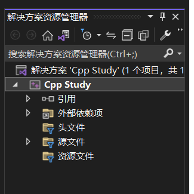

Step 2、在头文件文件夹处右键->添加->新建项（可使用快捷键Ctrl+Shift+A）

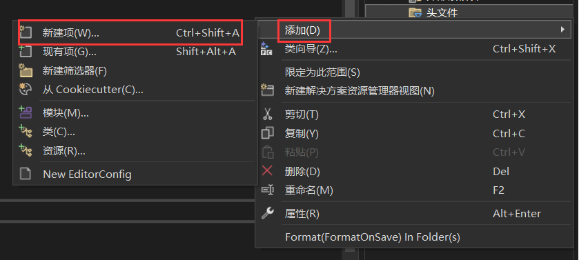

Step 3、选择头文件(.h)新建即可

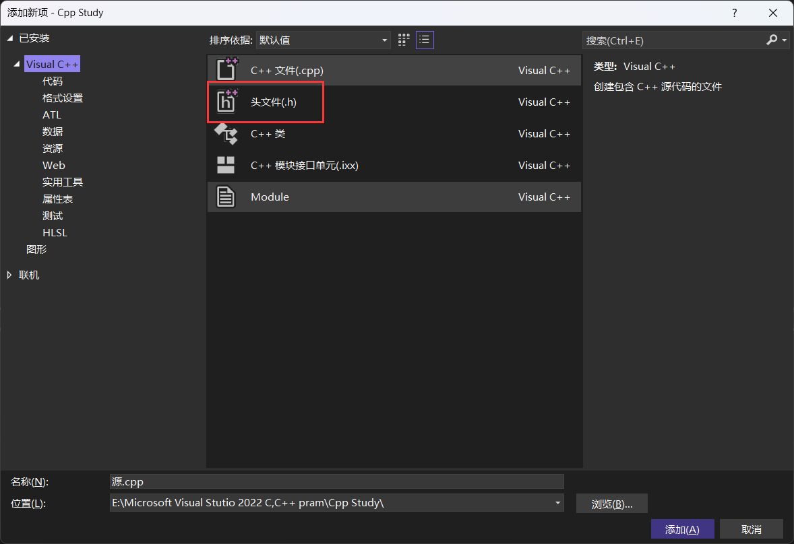

## 7.3 #include<>和#include""的区别 ▲

`#include<>`引用的是编译器的**类库路径里面的头文件**。一般用于引用标准头文件，如stdio.h等

`#include ""`引用的是项目相对路径中的头文件，一般用于引用自定义的头文件，如果使用`#include ""`，首先会在当前项目所在文件夹下寻找是否有对应的头文件，如果没有，还是会到编译器自带头文件目录中查找。

## 7.4 防止头文件重复包含 ※

### 7.4.1 使用宏定义避免重复引入

```cpp
#ifndef _NAME_H
#define _NAME_H
//头文件内容
#endif
```

_NAME_H是宏的名称，必须是独一无二的。

### 7.4.2 使用#pragma once避免重复引入

`#pragma once	//放在文件开头的位置`

`#ifndef`是通过定义独一无二的宏来避免重复引入的，也就意味着每次引入头文件都要进行识别，其效率不高，但其移植性很好。

`#pragma once`不涉及宏定义，当编译器遇到它时就会立刻知道当前文件只引入一次，效率很高，但其兼容性不是很好。

除此之外，`#pragma once`只能作用于某个具体的文件，而无法像`#ifndef`那样仅作用于一段指定的代码。


考虑到编译效率和可移植性，`#pragma once`和`#ifndef`经常被结合使用来避免头文件被重复引入

```cpp
#pragma once
#ifndef _NAME_H
#define _NAME_H
//头文件内容
#endif
```

当编译器可以识别`#pragma once`时，整个文件仅会被编译一次，当无法识别时，此时才用`#ifndef`编译。

（还可使用`_Pargma`关键字避免重复引入）


# Chapter 8 指针

## 8.1 概述

指针，表示的是**内存的地址**，指针变量也就是保存了内存地址的变量。指针也称为定位符或指示符。内存中字节的编号称为**地址**或**指针**。

## 8.2 定义 ▲

使用指针来保存一个变量的地址，在C++中定义指针变量需要在类型和变量名之间加一个\*，要知道一个变量的地址只需要在变量前加上&。使用\*获取一个指针变量所指向的地址的值，也称为指针的间接引用。

```cpp
int num = 100;
int* p = &num;
cout << "num=" << num << ' ' << "&num=" << &num << endl;
cout << "*p=" << *p << ' ' << "p=" << p << endl;
```

output:
`num=100 &num=000000FF5EEFFA04` 
`*p=100 p=000000FF5EEFFA04`

&num和p的值为同一块内存编号，且每运行一次其内存块编号均会发生变化

### 指针运算

指针变量保存的是变量的地址，变量的地址本质上也是一个整数，因此，可以使用运算符对指针变量进行运算。对指针变量进行自增（++）或自减（- -）也叫做指针变量的移动。

## 8.3 二级指针 ▲

一级指针：将指针指向一个普通的数据类型，这个指针就是一级指针，其保存的是变量的地址。
二级指针：当指针指向一个一级指针的时候，这个指针就是二级指针，依此规律，有多级指针的出现，且指针的级数没有限制。

```cpp
int num = 1;
int *p = &num;	//一级指针，p指向num的地址
//如果需要保存一个一级指针的地址，就需要用二级指针来保存其地址
int **ptr = &p;	//二级指针，ptr指向p的地址
```

## 8.4 指针与数组、函数和字符串的关系

### 8.4.1 指针和数组 ※

数组是用来保存同一种类型的一组数据的集合，同时，数组中的所有元素在内存中是连续存放的，每个元素的地址在内存中是连续的。在C++中，可以将数组名看做一个指针，它指向数组的第1个元素，也就是索引为0的元素，在C++中，我们将第一个元素的地址称为数组的首地址。

```cpp
int arr[5] = {1,2,3,4,5};
for (int i = 0; i < 5; i++){
    cout << "a[" << i << "]" << *(arr + i) << " ";
    //cout << "a[" << i << "]" << *（arr++） << " ";  报错，arr是数组名同时也是常量，不能对其进行更改
}
```

使用指针指向数组名 `type *指针名 = 数组名;
int *p = arr;  //定义了一个指针p，指向arr数组，可以直接通过指针的移动来访问数组中的元素。`

```cpp
int arr[5] = {1,2,3,4,5};
int *p = arr;
for (int i = 0; i < 5; i++){
    cout << "a[" << i << "]" << *(p + i) << " ";
    cout << "a[" << i << "]" << *（p++） << " ";  //此时，p是一个指针，是变量，可以对其进行更改
}
```

### 8.4.2 指针和函数 ※

函数的参数不仅可以是基本的数据类型，也可以是指针，用指针变量作为函数的参数可以将函数外部的地址传递到函数内部，使得在函数内部可以操作函数外部的数据，并且这些数据不会随着函数的结束而销毁。当需要在函数内部修改传入的基本类型的参数的值进行修改的话，只能通过指针的方式来传递参数。

```cpp
void func1(int* v1) {
	(*v1)++;	//不使用指针(*v1)，v1虽然会在外部被改为101，但当函数结束后，内部值并没有被修改，输出依旧为100
}
int main() {
	int num = 100;
	cout << num << endl;
	func1(&num);	//指针作为函数参数的时候，需要传入地址，而非变量值
	cout << num << endl;
	return 0;
}
```

当然，函数的返回值同样可以是指针类型，用来返回一个变量的地址，但不可以返回<u>局部变量的变量值</u>，这是因为在函数运行结束后会销毁在它内部定义的所有局部数据，包括局部变量、局部数组和形参。

```cpp
int* func(int* num) {
	*(num) += 100;
	return num;
}
int main() {
	int v1 = 1;
	cout << v1 << endl;
	int* p = func(&v1);
	cout << v1 << endl;
	cout << *p << endl;
	return 0;
}
```

### 8.4.3 指针和字符串 ※

字符串是可以通过字符数组来实现的，因此，关于数组指针的相关操作同样适用于字符串，同时还可以直接通过指针的方式来定义一个字符串。

```cpp
const char* pc = "abc";
cout << pc << endl;		//输出为abc
cout << *pc << endl;	//输出为a
```

通过指针对字符串进行遍历

```cpp
int main() {
	char str[] = "hello world";
	int len = strlen(str);
	char* ptr = str;
	for (int i = 0; i < len; i++) {
		cout << *ptr++;
	}
	return 0;
}
```

## 8.5 NULL指针和void指针 ▲

### 8.5.1 定义

当一个指针不指向任何数据时，称之为空指针，用NULL来表示。注意，NULL是区分大小写的，即NULL不能写成null。在定义指针时或指针使用完毕后不再指向任何数据时，推荐将指针设置为NULL，以表明该指针不再指向任何数据
`#define NULL((void *)0)`
(void *)0表示把数值0强制转换为类型(void *)

在定义指针变量时`int* p;`这种指针定义时不指向任何地址，也就是野指针，建议定义为`int *p = NULL;`
在C++98中，字面常量0的类型既可以是整型，也可以是一个无类型指针(void*)，在某些场景（如：函数重载）的使用中会遇到麻烦，C++11中引入了关键字nullptr来避免二义性，nullptr是一个“指针空值常量”，仅可以被隐式转换为指针类型，故也推荐以下定义方法
`int* p = nullptr;`

void是指**无类型**，void指针也就是**无类型指针**，void指针可以指向任何类型的数据，所以void指针一般被称为<u>通用指针或者泛指针，也可以叫做万能指针</u>。

### 8.5.2 void指针的使用

1. 在C++中，任何时候都可以使用void类型的指针来答题其他类型的指针，void指针可以指向任何数据类型的变量。
2. 如果要通过void指针去获取它所指向的变量值时，需要先将void指针强制类型转换成和变量名类型相匹配的数据类型指针后再进行操作。
3. 任何类型的指针都可以赋值给void指针，无需强制类型转换。

```cpp
int num = 1;
void* p = &num;
cout << "p = " << p << endl;
cout << "*p = " << ((int*)p) << endl;//void指针不能直接使用，必须经过强制类型转换后才能使用
```

## 8.6 指针与引用的区别 ※

指针的本质是一个变量的地址，引用是一个变量的别名。且定义指针值可以不初始化，并且可以定义空指针，但定义引用时必须初始化，且不能为空引用。每一种编程语言都使用指针，只是C++将指针暴露给了用户，Java、C#等则将指针隐藏起来了。

1. 从**现象**上看，指针在运行时可以改变其所指向的值，而引用一旦和某个对象绑定后就不再改变。
2. 从**内存分配**上看，程序为指针变量分配内存区域，而不为引用分配内存区域，因为引用声明时必须初始化，从而指向一个已经存在的对象。引用不能指向空值。
3. 从**编译**上看，程序在编译时分别将指针和引用添加到符号表上，符号表上记录的是变量名及变量所对应的地址。指针变量在符号表上对应的地址值为指针变量的地址值，而引用在符号表上对应的地址值为引用对象的地址值。符号表生成后不会再改，因此指针可以改变指向的对象（指针变量中的值可以改），而引用对象不能改，从某种意义上来说，引用可以被认为是不能改变的指针。
4. 理论上，对于指针的级数没有限制，但是引用只能是一级。

## 8.7 指针常量与常量指针 ※

### 1.const修饰常量（指针常量）

```cpp
int num1 = 1, num2 = 2;
int* const p = &num1;
*p = 5;		//由于p被const修饰，所以p是不能进行更改的，就是指针的值是不能更改的，也就是指针的指向也是不能更改的。
//p = &num2;	//不被允许的行为
```

### 2.const修饰指针（常量指针）

```cpp
int num1 = 1, num2 = 2;
const int *p = &num1;
p = &num2;
//*p = 5;	//由于const修饰的是*p，所以*p不能被修改
```

## 8.8 引用和常量引用

引用的本质是指针常量，即`int* const p = &num;`特点就是，其指向的值能改变，指针的指向不能改变。

## 8.9 练习

实现找出两个数中的最大值

```cpp
void checkMax(int* p1, int* p2, int* pmax) {
	if (*p1 > *p2) {
		*pmax = *p1;
	}
	else {
		*pmax = *p2;
	}
}
int main() {
	int v1 = 5;
	int v2 = 10;
	int max;
	checkMax(&v1, &v2, &max);
	cout << max << endl;
	return 0;
}
```

# Chapter 9 结构体&枚举类型

## 9.1 概念

结构体(struct)是具有相同类型或不同类型的数据构成的数据集合。在C++中，结构体指的是一种数据结构，是C++中聚合数据类型的一类。结构体可以被声明为变量、指针或数组等，用以实现较复杂的数据结构。结构体同时也是一些元素的集合，这些元素称为结构体的成员，且这些成员称为结构体的成员，且这些成员可以为不同的类型，成员一般用名字访问。

```cpp
struct student{
	string name;	//type name1
    int age;		//type name2
    double score;	//type name3
};
```

## 9.2 结构体变量 ※

### 9.2.1 定义

当结构体已经被定义时，可以使用`struct sturctName variableName;`来对变量进行定义，如：`student s1, s2, s3;`。也可以在结构体中定义，在右括号和;之间添加变量名，如：`}s1, s2, s3;`。
在结构体中，除了定义不同类型的数据还可以定义函数，对函数的引用与引用数据一样，使用`structName.funcName`即可。

### 9.2.2 初始化

```cpp
student s1, s2, s3;
//可以单独对每一项初始化，也可以在定义时进行初始化
s1.name = "张三";
s1.age = "21";
s1.score = "99.5";
cout << s1.name << endl;
cout << s1.age << endl;
cout << s1.score << endl;
```

在C++11标准以后，可以直接在定义结构体时给成员赋初始值，在赋值时可以使用`=`或者是`[ ]`对变量赋值。

```cpp
struct student{
  string name = "C++";
  int age[20];
  double score = 99.5;
}
```

### 9.2.3 结构体指针

指针可以存放任意数据类型的地址，同样也能存放结构体地址，这种指针被称为结构体指针。
`struct structName *pName;  //定义了一个结构体指针pName，该指针存放的是结构体structName的地址` 
需要注意在使用结构体指针时，只能通过指针指向运算符"->"来进行访问成员。虽然用`(*struct_ptr)`的方式来访问也是可以的，但需要对其优先级进行改变。`(*ps1).age  //等价于ps1->age`。但还是推荐使用->来进行访问。

```cpp
student s1, *ps1;
ps1 = &s1;
ps1->age = 29;
cout << ps1->age << endl;
```

### 9.2.4 结构体数组

存放结构体的数组，被称为结构体数组。`struct structName arrName[len];  //定义了一个结构体数组arrName，该数组中的每一个元素都是一个structName类型的结构体，数组的长度为len。`

```cpp
student arrstu[3];
for (int i = 0; i < 3; i++){
    cin >> arrstu[i].name >> arrstu[i].age >> arrstu[i].score;
}
for (int i = 0; i < 3; i++){
    cout << arrstu[i].name << " " << arrstu[i].age << " " << arrstu[i].score;
}
```

### 9.2.5 结构体做函数参数

使用结构体变量作为函数的实参时，采用的是值传递，会将结构体变量所占内存单元的内容全部顺序传递给形参，形参必须是同类型的结构体变量。

```cpp
#include <iostream>
#include <string>
using namespace std;
struct student {
	string name;
	int age;
	double score;
};
void printInfo(student s) {
	cout << s.age << endl;
	cout << s.name << endl;
	cout << s.score << endl;
}
//如果是以结构体指针作为函数的参数，则应该写如下函数
/*
void printInfo(student* s){
	cout << s->age << endl;
	cout << s->name << endl;
	cout << s->score << endl;
}
*/
//如果是以结构体数组作为函数的参数，如下所示
/*
void printInfo(student s[],int len){
	for(int i = 0;i < len; i++){
		s[i].printInfo();
	}
}
*/
int main() {
	student s1 = { "王五", 21, 99 };
	printInfo(s1);	//传参应该为&s1
    //使用结构体数组代码如下所示
    /*
    student arrs[3] = { {"A",20,100},{"B",21,99},{"C",22,91} };
	printInfo(arrs, 3);
	*/
	return 0;
}
```

## 9.3 共用体 ▲

共用体可以存放任意数据类型的组合，也可以用来存放任意数据类型的集合；共用体也叫联合体。

```cpp
union unionName{
    Type1 filed1;
    Type2 filed2;
    Type3 filed3;
};
```

```cpp
//该共用体的三个字段是相互影响的，修改其中任何一个字段的值，都会影响其他字段的值。
union person {
	int age;
	float weight;
};
int main() {
	person p1;
	p1.age = 20;
	p1.weight = 50.5;	//共用体成员不能全部一起使用，只能单独的使用其中某一个字段
	cout << p1.age << " " << p1.weight << endl;	//共用体成员间影响内存，输出为1112145920 50.5
	return 0;
}
```

### 共用体与结构体的区别

结构体的各个成员会占用不同的内存，互相之间没有影响，而共用体的所有成员占用同一段内存，修改一个成员会影响其余所有的成员。结构体占用的内存**大于等于**所有成员占用的内存总和（成员之间可能会存在缝隙），共用体占用的内存**等于**最长的成员占用的内存。共用体使用了<u>内存覆盖技术</u>，同一时刻只能保存一个成员的值，如果对新的成员赋值，就会把原来成员的值覆盖掉。

```cpp
//结构体和共用体字节数的查看，这里的student、person均为第9章内已定义好的结构体和共用体
student s;
person p;
int lens = sizeof(s);
int lenp = sizeof(p);
cout << lens << " " << lenp << endl;	//输出为56 8
```

## 9.4 枚举类型 ▲

枚举累型(enamerate)是C++中的一种派生数据类型，它是由用户定义的若干枚举常量的集合。`enum <类型名> {<枚举常量表>};`
枚举常量（枚举成员），是以标识符形式表示的整型量，表示枚举类型的取值。枚举常量表列出枚举类型的所有取值，各枚举常量之间以","间隔，且必须各不相同。取值类型与条件表达式相同。

### 9.4.1 定义

`enum color {red, blue, black, orange};	//定义枚举类型`

枚举常量代表该枚举类型的变量可能取的值，编译系统为每个枚举常量指定一个整数值。在默认状态下，这个整数就是所列举元素的序号，从0开始。可以在定义枚举类型时为部分或全部枚举常量指定整数值，在指定值之前的枚举常量仍按默认方式取值，而指定值之后的枚举常量常量按依次+1的原则取值，需要注意的是<u>各枚举常量的值可以重复</u>。

```cpp
enum week {Sun = 7, Mon = 1, Tue, Wed, Thu, Fri, Sat};	//其值分别诶7,1,2,3,4,5,6
enum color {red, blue, black = 1, orange, white};		//其值分别为0,1,1,2,3
```

枚举常量只能以标识符形式表示，而不能是整型、字符型等文字常量。

```cpp
//以下行为是不被允许的
enum letter{'a', 'b', 'c'};	//枚举常量不能是字符常量
enum year{2022, 2023, 2024, 2025};	//枚举常量不能是整型常量
//下述是被允许的
enum letter{a, b, c};
enum year{Y2022, Y2023, Y2024, Y2025};
```

### 9.4.2 使用枚举变量

```cpp
enum week{Sun, Mon, Tue, Wed, Thu, Fri, Sat};
week w1, w2;
//类型与变量同时定义时，类型名可忽略
enum week{Sun, Mon, Tue, Wed, Thu, Fri, Sat}w1, w2;
//此时对w1，w2赋值需要注意，只能使用枚举常量表内的
w1 = Sun;	//w1 = San错误
```

枚举变量的值只能取枚举常量表中所列的值，就是整型数的一个子集。枚举变量占用内存的大小与整型数相同，其只能参与赋值和关系运算以及输出操作，参与运算时用其本身的整数值。

```cpp
enum week { Sun, Mon, Tue, Wed, Thu, Fri, Sat };
week weekday1, weekday2;
weekday1 = Sun;
weekday2 = Mon;
//只能参与赋值以及关系运算
if (weekday1 < weekday2) {
	cout << "day1 < day2" << endl;
}
cout << weekday1 + weekday2 << endl;
int num = weekday1;	//枚举型可以赋值给整型
cout << num << endl;
```

1. 枚举变量可以直接输出，但不能直接输入。
2. 不能直接将常量赋给枚举变量。
3. 不同类型的枚举变量之间不能相互赋值。
4. 枚举变量的输入输出一般都采用switch语句将其转换为字符或字符串。

## 9.5 typedef ▲

作用是用来给类型起别名 。因为在遇上不同数据类型，尤其是复杂类型。typedef关键字常用来给以下几种类型起别名：1、基本数据类型；2、结构体；3、数组；4、枚举类型；5、指针。

### 9.5.1 基本数据类型

使用typedef给基本数据类型起别名很简单：`//typedef 数据类型 别名`。起了别名以后，别名就相当于原类型名的同义词，能使用原类型的地方就可以使用别名。
`typedef int Myint;	//int a 等价于 Myint a`

### 9.5.2 结构体

和基本数据类型类似，将别名放在结构体之后

```cpp
struct Person{
	string name;
	int age;
};
//typedef 结构体 别名
typedef struct Person P;
//也可以直接在};之间添加别名，如
/*
struct Person{
	string name;
	int age;
}P;
*/
```

### 9.5.3 数组

给数组起别名时，typedef的用法和单个元素有些区别，别名在数组元素类型和数组元素个数之间。

```cpp
//typedef 数组元素类型 别名[数组元素个数]
typedef int C[10];
C t;//t的类型是int[10]，也就是包含10个int类型的数组
```

### 9.5.4 枚举类型

和结构体类似

```cpp
enum Color{red, green, blue} primaryColor;
//typedef 枚举类型 别名
//typedef Color primaryColor;
```

### 9.5.5 指针

```cpp
//typedef 指针 别名
typedef char* String;
String s1 = "name";
```

对指针起别名需要注意的一点是，如果要对别名加const关键字，必须要明白，声明的是一个常量指针，而不能理解为指向常量的指针。

## 9.6 练习

1、利用结构体，输入（2 < n <100）个学生姓名，年龄，和三科成绩，找出总成绩最高的学生，输出该学生的信息。

```cpp
#include <iostream>
#include <string>
using namespace std;

void inInfo(int n);
void Max_value(int n);

struct students {
	string name;
	int age;
	double Chinese;
	double Math;
	double English;
	double total;
}s[100];

int main() {
	int n;//学生数量
	cin >> n;
	inInfo(n);
	Max_value(n);

	return 0;
}

//录入信息
void inInfo(int n) {
	for (int i = 0; i < n; i++) {
		cin >> s[i].name >> s[i].age >> s[i].Chinese >> s[i].Math >> s[i].English;
		s[i].total = s[i].Chinese + s[i].Math + s[i].English;
	}
}

//输出成绩最高者
void Max_value(int n) {
	int max_s = 0;	//依次遍历，保存最高分数
	students stu;	//保存最高分数学生
	//寻找最高分数的学生
	for (int i = 0; i < n; i++) {
		if (s[i].total > max_s) {
			max_s = s[i].total;
			stu = s[i];
		}
	}
	cout << stu.name << " " << stu.age << " " << stu.Chinese << " " <<
		stu.Math << " " << stu.English << " " << stu.total;
}
```

2、输入数字0~6，其中0表示星期日，通过switch和enum实现输出星期对应的汉字表述。
input:0
output:星期日

```cpp
int main() {
	enum Week {Sun,Mon,Tues,Wed,Thur,Fri,Sat};
	int day;
	cin >> day;
	switch (day)
	{
	case Sun:
		cout << "星期日" << endl;
		break;
	case Mon:
		cout << "星期一" << endl;
		break;
	case Tues:
		cout << "星期二" << endl;
		break;
	case Wed:
		cout << "星期三" << endl;
		break;
	case Thur:
		cout << "星期四" << endl;
		break;
	case Fri:
		cout << "星期五" << endl;
		break;
	case Sat:
		cout << "星期六" << endl;
		break;
	}
}
```

# Chapter 10 预处理

## 10.1 预处理概述

预处理是C++的一个重要功能，预处理由预处理程序负责完成。预处理是指在进行编译的第一遍扫描（词法扫描和语法分析）之前所做的工作。当对一个源文件进行编译时，系统把自动引用预处理程序对源程序中的预处理部分作处理，处理完毕后自动进入对源程序的编译。
C++提供了多种预处理功能，例如：**宏定义**、**文件包含**、**条件编译**等。合理地使用预处理功能编写的程序便于**阅读**、**修改**、**移植**和**调试**，还有利于**模块化程序设计**。

`#include <iostream>`就是一个预处理命令，预处理主要是处理以#开头的命令。预处理命令要放在**所有的函数之外**，而且一般都放在源文件的前面。

## 10.2 常用预处理指令 ▲

文件包含类：`#include`  包含一个源文件代码，头文件

宏定义类：`#define`  定义宏      `#undef`    取消已定义的宏

条件编译类：

1. `#if` 		如果给定条件为真，则编译下面代码
2. `#ifdef` 	  如果宏已经定义，则编译下面的代码
3. `#ifndef`	 如果宏没有定义，则编译下面的代码
4. `#elif`	     如果#if条件不为真，当前条件为真，则编译下面的代码
5. `#endif`	   如果#if...到#else条件编译块

## 10.3 宏定义 ※

C++源程序中允许用一个标识符来表示一个字符串，称为“宏”。被定义为宏的标识符称为“宏名”。在编译预处理时，对程序中所有出现的宏名，都用宏定义中的字符串去代换，这称为宏替换或宏展开。

宏定义是由源程序中的宏定义命令完成的，宏替换是由预处理程序自动完成的。在C语言中，宏定义分为有参数和无参数两种。

### 10.3.1 无参数宏定义

`#define identify expression`其中，identify是宏的标识符，也就是宏名；expression为该宏所代表的表达式或者常量值。
`#define PI 3.14	//定义PI的值为3.14`

利用宏定义π，输入半径r，求圆面积

```cpp
#define PI 3.1415926
double >> r;
cin >> r;
cout << PI * r * r << endl;
```

### 10.3.2 带参宏定义

`#define INC(x) x++`  定义一个宏INC，该宏接受一个参数x，该宏实现的功能是将当前x的值自增。

`#define SQR(n) n * n`  定义一个宏SQR，该宏接受一个参数n，实现的功能是将n进行平方计算。

```cpp
#define SQR(n) n * n
int num = 10;
int r1 = SQR(num);
cout << r1 << endl;	//输出100
int r2 = SQR(num + num);
cout << r2 << endl;	//输出120，这是因为计算过程为10+10*10+10=120，所以在对宏定义时，建议对每个参数都要加上括号
```

像函数参数一样，在宏定义中的参数称为形式参数，在宏调用中的参数称为实际参数。

### 10.3.3 宏函数 ※

C++中的宏函数，其实就是带参数的宏。C++的宏函数和普通函数类似，只是宏函数的**参数没有类型**。

利用宏函数，实现判断字符是否是十进制数字

```cpp
#define DIGIT(c) ((c) >= '0' && (c) <= '9')

char ch1 = 'a';
char ch2 = '2';
int d1 = DIGIT(ch1);
int d2 = DIGIT(ch2);
cout << d1 << endl;	//0
cout << d2 << endl;	//1
```

两数相加的宏定义：`#define ADD(a,b) ((a) + (b))`

### 10.3.4 取消宏定义 ※

定义了宏或者宏函数以后，不再需要时可以使用undef取消宏定义或宏函数
`#undef MACRO_NAME`

示例：取消10.3.3中的宏定义，使用`#undef DIGIT`就可以取消宏定义。

## 10.4 条件编译 ※

一般情况下，源程序中所有的行都参加编译。但有时希望对其中一部分内容只在满足一定条件才进行编译，这些条件被称为条件编译。

### 10.4.1 作用

1. 屏蔽跨平台差异：在大规模开发过程中，特别是跨平台和系统的软件里，可以在编译时通过条件编译设置编译环境。
2. 包含程序功能模块：可以使用`#ifdef`实现包含程序的不同的功能模块。
3. 开关调试信息：调试程序时，常常希望输出一些所需的信息以便追踪程序的运行，而在调试完成后不再输出这些信息，可以通过条件编译控制。
4. 防止头文件重复包含：头文件(.h)可以被头文件或CPP文件包含，由于头文件包含可以嵌套，CPP文件就有很多可能多次包含同一个头文件；或者不同的CPP文件都包含同一个头文件，编译时就可能出现重复包含的问题。

### 10.4.2 #ifdef

```cpp
#ifdef identity
	code 1
#else
	code 2
#endif
    //如果标识符identity被定义过了，那么就编译代码Code1，否则就编译Code2。#else不是必要的条件
```

### 10.4.3 #ifndef

```cpp
#ifndef identity
	code 1
#endif
    //如果标识符identity没有被定义过，那么就编译代码Code1，否则就不编译。
```

### 10.4.4 #if

```cpp
#if expression
	code 1
#else
	code 2
#endif
	//当后续表达式为真（非0），则对一段程序进行编译，否则对另一段程序编译。同样的，#else不是必要的。
```

### 10.4.5 #elif

可以跟在#if，#ifdef和#ifndef的后面，但#else必须在其后面。通过调试BA、BN的值来得到输出。

```cpp
int main(){
	cout << "test" << endl;
    #define BY 0
    #define BN 1
    #if BY
    	cout << "BY has define" << endl;
    #elif BN
    	cout << "BN is 1" << endl;
    #endif
    
    return 0;
}
```

### 10.4.6 #error

#error用于在编译期间给出一个错误信息，并终止程序的编译，同时，#error后面的错误信息不需要使用“ ”。
`#error error_message`

## 10.5  练习

利用宏函数，实现返回数组的元素个数。

```cpp
#define Array_num(arr) (sizeof(arr)/sizeof(arr[0]))

using namespace std;

int main() {
    char arr[10];
    cout << Array_num(arr) << endl;

    return 0;
}
```

# Chapter 11 按位运算符

## 11.1 位运算概述

现代计算机中所有的数据都以二进制的形式存储在设备中，即0、1两种状态，计算机对二进制数据进行的运算(+、-、*、/)都叫做位运算，即将符号位共同参与运算的运算。位运算和指针均是C语言重要特色，合理的使用位运算能够**显著的提高**代码在机器上的执行效率。

| 位运算符 |   含义   |  示例  |
| :------: | :------: | :----: |
|    &     |  按位与  |  a&b   |
|    \|    |  按位或  |  a\|b  |
|    ^     | 按位异或 |  a^b   |
|    ~     | 按位取反 |  a~b   |
|    <<    |   左移   | a << 1 |
|    >>    |   右移   | b >> 2 |

注：要区分2.1.4逻辑运算符中的表格。

## 11.2 按位运算符 ※

### 11.2.1 按位取反 ~

参加运算的一个数据，其二进制进行取反运算。对一个运算量取反，也就是1->0, 0->1

用途：使一个数的最低位为0：`a & ~1`
~1的值为1111 1111 1111 1110，再按“与”运算，最低位一定为0，且“~”运算符的优先级比其余运算符都高。

### 11.2.2 按位与 &

参加运算的两个数据，按二进制位进行“与”运算。同1为1，否则为0。

用途：

1. 清零
   如果想将一个单元清零，只需要一个各位均为0的数值相与，其结果为0。
2. 取一个数的指定位
   如要取数X的低4位，只需要使用一个数Y = 0000 1111（保证低4位均为1，其余位为0），将X和Y进行与运算即可得到X的指定位。
3. 判断奇偶
   只要根据最末位是0还是1来决定，为0就是偶数，为1就是奇数。可以用`if((a & 1) == 0)`代替`if(a % 2 == 0)`来判断a是不是偶数。取余运算的时间长于按位与的运算时间。

### 11.2.3 按位或 |

参加运算的两个对象，按二进制位进行“或”运算。同0为0，否则为1

用途：用来对一个数据的某些位设置为1

如要对数X的低4位设置为1，只需要使用一个数Y = 0000 1111，然后将X与Y进行按位或运算即可得到。

### 11.2.4 按位异或 ^

参加运算的两个数据，按二进制位进行“异或”运算。相同为0，不同为1.

用途：

1. 翻转指定位
   如将数X = 1010 1110的低4位进行翻转，只需要另找一个数Y，令Y的低4位为1，其余位为0，即Y = 0000 1111，然后将X与Y进行异或运算即可。
2. 与0相异或值不变
   eg：1010 1100 ^ 0000 0000 = 1010 1110
3. 快速的交换两个数
   a ^= b; b ^= a; a ^= b

### 11.2.5 左移 <<

将一个运算对象的各二进制位全部左移若干位（左边的二进制位丢弃，右边补0），若左移时舍弃的高位不包含1，则每左移一次，相当于该数乘以2。

$m*2^n$可以写成`m << n`

### 11.2.6 右移 >> 

将一个数的各二进制位全部右移若干位，正数左补0，负数左补1，右边丢弃。操作数每右移一次相当于该数除以2，被移数是正左补0，被移数是负则左补1。

## 11.3 练习

输入两个整数num1和num2，利用位运算交换它们的值。

```cpp
int num1 = 100;
int num2 = 200;
num1 ^= num2;
num2 ^= num1;
num1 ^= num2;
cout << num1 << num2 << endl;
```

# Chapter 12 案例——模拟洗牌发牌

以扑克牌为例，作出以下案例。

```cpp
#include <iostream>
#include <cstring>
#include <cstdlib>
#include <ctime>
using namespace std;

//牌的结构体
struct CARD {
    char suit[10];  //花色
    char face[10];
};

char suit[4][10] = {"diamonds", "club", "hearts", "spades"};
char face[13][10] = { "A","2","3","4","5","6","7","8","9","10","J","Q","K" };

void Create_Card(CARD* card);
void shuffleCards(CARD* card);
void dealCards(CARD* card);
void dealCards2(CARD* card);

int main() {
    CARD card[54];
    Create_Card(card);
    shuffleCards(card);
    dealCards2(card);
   /* for (int i = 0; i < 54; i++) {
        cout << card[i].suit << " " << card[i].face << endl;
    }*/
    return 0;
}

//生成54张牌
void Create_Card(CARD* card) {
    int i = 0;
    for (; i < 52; i++) {
        strcpy_s(card[i].suit, suit[i / 13]);
        strcpy_s(card[i].face, face[i % 13]);
    }
    strcpy_s(card[52].suit, "red");
    strcpy_s(card[52].face, "joker");
    strcpy_s(card[53].suit, "black");
    strcpy_s(card[53].face, "joker");
}
//洗牌
void shuffleCards(CARD* card) {
    //循环54次，每次随机一个数字(0~53)来跟i这个下标所对应的牌进行交换
    int i = 0, j;
    CARD tmp;
    srand(time(0));
    for (; i < 54; i++) {
        j = rand() % 54;
        if (i != j) {
            /*tmp = card[i];
            card[i] = card[j];
            card[j] = tmp;*/
            swap(card[i], card[j]);
        }
    }
}

void dealCards(CARD* card) {
    CARD player[3][18], finalCards[3];  //[17]出现数组越界访问的现象，应该都留有一定的空闲空间以防指针越界
    int p1 = 0, p2 = 0, p3 = 0;
    for (int i = 0; i < 54; i++) {
        if (i % 3 == 0) {
            player[0][p1++] = card[i];
        }
        else if (i % 3 == 1) {
            player[1][p2++] = card[i];
        }
        else{
            player[2][p3++] = card[i];
        }
    }
    for (int i = 0; i < 3; i++) {
        finalCards[i] = card[i + 51];
    }
    for (int i = 0; i < 3; i++) {
        cout << "玩家" << (i + 1) << endl;
        for (int j = 0; j < 17; j++) {
            cout << player[i][j].suit << " " << player[i][j].face << endl;
        }
    }

    cout << endl << "底牌为：" << endl;
    for (int i = 0; i < 3; i++) {
        cout << finalCards[i].suit << " " << finalCards[i].face << endl;
    }
}

void dealCards2(CARD* card){
    cout << "玩家1" << "\t\t" << "玩家2" << "\t\t" << "玩家3" << endl;
    for (int i = 0; i < 51; i++) {
        if (i % 3 == 0 && i != 0) {
            cout << endl;
        }
        cout << card[i].suit << " " << card[i].face << "\t";
    }
    cout << endl << "底牌为：" << endl;
    for (int i = 0; i < 3; i++) {
        cout << card[i].suit << " " << card[i].face << "\t";
    }
}
```

# Chapter 13 类与对象

## 13.1 面向对象和面向过程的区别

面向过程就是分析出解决问题所需要的步骤，然后一步一步将其实现的过程。
面向对象是把构成问题事物分解成各个对象，建立对象的目的不是为了完成一个步骤，而是为了描述某个事物在整个解决问题的步骤中的行为。
面向对象编程就是高度实物抽象化编程；面向过程编程就是自顶向下按步骤编程。

eg：实现一个番茄炒鸡蛋
面向对象：告诉厨师想吃番茄炒鸡蛋->厨师->番茄炒鸡蛋
面向过程：买番茄和鸡蛋->洗番茄->搅拌生蛋->生火->炒菜->最终得到

### 13.1.1 面向过程的优缺点

优点：性能比面向对象高，因为类调用时需要实例化，开销比较大，比较消耗资源。而Linux/Unix等一般采用面向过程开发，性能是最重要的因素。
缺点：没有面向对象易维护、易复用、易扩展，可维护性差，不易修改。

### 13.1.2 面向对象的优缺点

优点：易维护、易复用、易扩展。由于面向对象有封装、继承、多态性的特性，可以设计出耦合度低的系统，使系统更加的灵活，更加易于维护。
缺点：性能比面向过程低。

## 13.2 类与对象的基本概念

### 13.2.1 类

具有相同特性（数据元素）和行为（功能）的对象的抽象就是类。因此，对象的抽象是类，类的具体化就是对象，也可以说类的实例是对象，类实际上就是一种数据类型。
类具有属性，它是对象的状态的抽象，用数据结构来描述类的属性。类具有操作，是对象的行为的抽象，用操作名和实现该操作的方法来描述。

### 13.2.2 对象

对象是人们要进行研究的任何事物，它不仅能表示具体的事物，还能表示抽象的规则、计划或事件。对象具有状态，一个对象用数据值来描述它的状态。对象还有操作，用于改变对象的状态，对象及其操作就是对象的行为。
对象实现了数据和操作的结合，使数据和操作封装于对象的统一体中。

## 13.3 class 类 ▲

定义：在C++中，使用class关键字，类名的首字母一般建议大写

```cpp
//类里面的属性列表和函数列表需要使用{}包围，同时，类的最后一定不能忘记;
class ClassName{
PropertyModifier:	//属性修饰符，有public、protected、private
    propertoys		//属性列表
    functions		//函数列表
};
```

定义一个学生类，使其拥有打印自己姓名的方法。

```cpp
class Student{
public:
   	void printName(string name){
        cout << name << endl;
    }
};
```

使用类创建对象的过程，又称为类的实例化
`ClassName classVar(param)	//类名 类对象(参数)`

同13.3中的第二段代码，在main函数中加入 `Student stu;`就是类创建一个stu的对象。

（注：`public`等详见14.1访问限定符）

## 13.4 构造函数和析构函数 ※

### 13.4.1 构造函数

创建一个类的时候，会自动添加一个跟类名一样的函数，该函数没有任何的返回值，且该函数不做任何操作，该函数被称为构造方法（或构造函数）。
构造方法用于创建对象时使用，每当创建一个类的实例对象时，C++解释器都会自动调用它。
可以对这个构造函数进行编辑，下面的代码块显式的给出了这个函数。

```cpp
class Classname{
public:
    Classname(){}
};
```

```cpp
class Student {
public:
    Student() {
        cout << "Student method" << endl;	//不在main引用，会自动调用
    }
    void printName(string name) {
        cout << name << endl;
    }
};
```

### 13.4.2 构造函数参数

C++中的构造函数，默认是没有任何函数参数的，但可以重写该函数，为其设置任意多个和任意类型的参数。如果，我们在构造函数方法里设置了参数，那么我们在实例化类对象的时候，必须要传入相对应的参数。
C++的构造函数，跟普通的函数一样，也可以设置默认参数，如果设置了默认参数，那么在实例化实例时，可以不传该参数，而使用默认值。

```cpp
class Student {
public:
    Student() {
        cout << "test" << endl;
    }
    //重写
    Student(string name) {
        cout << "Student method" << endl;
    }
    void printName(string name) {
        cout << name << endl;
    }
};
int main() {
    Student s1; //默认的找默认的
    Student s2("Zhang San");    //带参数的找带参数的
    return 0;
}
```

```cpp
class Student {
public:
    Student(string name = "xxx") {
        cout << "Student method" << endl;
    }
    void printName(string name) {
        cout << name << endl;
    }
};
int main() {
    Student stu;	//已经给出默认值，无需传参；如果对其传参，就会使用传参值。
    return 0;
}
```

### 13.4.3 拷贝构造函数

拷贝构造函数也叫复制构造函数，它只有一个参数，参数类型是本类的引用(自己)。

参数可以是const引用，也可以是非const引用。一般使用前者，这样既能以常量对象（初始化后值不能改变的对象）作为参数，也能以非常量对象作为参数去初始化其他对象。一个类中写两个复制构造函数，一个的参数是const引用，另一个是非const引用是被允许的。

如果类的设计者不写复制构造函数，编译器就会自动生成复制构造函数。大多数情况下，其作用是<u>实现从源对象到目标对象逐个字节的复制</u>，即使得目标对象的每个成员变量都变得和源对象相等。编译器自动生成的复制构造函数称为“默认复制构造函数”。

注意：默认构造函数（即无参构造函数）不一定存在，但是复制构造函数一定会存在。


使用：

1. 通过使用另一个同类型的对象来初始化新创建的对象。
2. 复制对象把它作为参数传递给函数。
3. 复制对象，并从函数返回这个对象。

```cpp
class Complex {
public:
	double real, imag;
	Complex(double r, double i) {
		real = r;
		imag = i;
	}
    Complex(const Complex& c) {
	real = c.real;
	imag = c.imag;
	cout << "test" << endl;
	//此时编写了复制构造函数，则默认的复制构造函数不存在了
	}
};
int main() {
	Complex c1(1, 2);
	Complex c2(c1);	//可以写成Complex c2 = c1;-->也是这个地方调用Complex(const Complex& c)
	cout << c2.real << " " << c2.imag;	//输出1,2
	return 0;
}
```

### 13.4.4 析构函数

在类被销毁时，系统还提供了一个析构函数，用来做一些清理工作，比如：释放分配的内存、关闭打开的文件等，同样，析构函数，也是系统自动调用。
析构函数(Destructor)也是一种特殊的成员函数，没有返回值，不需要程序员显式调用(程序员也没法显式调用)，而是在销毁对象时自动执行。构造函数的名字和类名相同，而析构函数的名字是在类名前面加一个 ~ 符号。
析构函数**没有参数**，**不能被重载**，因此一个类只能有一个析构函数。如果用户没有定义，编译器会自动生成一个默认的析构函数。

语法：`~Desructor()`

```cpp
class Studentclass Student {
public:
	Student(string name = "zx", int age = 11) {
	}
    //析构函数部分
	~Student() {
		cout << "test ~Student" << endl;
	}
};
int main() {
	Student s;
}
```

## 13.5 动态创建对象 ※

当创建一个C++的对象时，会发生两件事（由系统自动创建）：
1、为对象分配内存
2、调用构造函数来初始化哪块内存

在1中，可以使用几种方式或在可选择的时间发生
① 在静态存储区域，存储空间在程序开始之前就可以分配。
② 无论何时到达一个特殊的执行点（左大括号：{）时，存储单元都可以在栈上被创建。出了执行点（右大括号：}）时，这个存储单元将会自动被释放。
③ 存储单元也可以从一个称为堆（自由存储单元）的地方分配，这被称为动态内存分配。

如果1能保证实现，就需要确保2一定能发生，C++强迫这么做是因为未初始化的对象是程序出错的一个重要原因。

### 13.5.1 C语言的动态内存分配

- 程序员必须确定对象的长度。
- malloc返回一个`void*`指针，C++不允许将`void*`赋值给其他任何指针，必须强转。
- malloc可能申请内存失败，所以必须判断返回值来确保内存分配成功。
- 用户在使用对象之前必须记住对他初始化，构造函数不能显示调用初始化（构造函数是由编译器调用），用户有可能忘记调用初始化函数。

！C的动态内存分配函数太复杂，容易令人混淆，是不可接受的，在C++中推荐使用new和delete。

### 13.5.2 new

C++中解决动态内存分配的方案是把创建一个对象所需要的操作都结合在一个称为new的运算符里。当用new创建一个对象时，它就在堆里为对象分配内存并调用构造函数完成初始化。
它有点类似于C里面的malloc函数：C的标准库中提供了一些函数，malloc以及它的变种calloc和realloc，释放内存的free，这些函数是有效的、但是原始的，需要程序员理解和小心使用。

`Person* person = new Person();`等价于

```c
Person* person = (Person*)malloc(sizeof(Person));
if (person == NULL){
	return 0;
}
person->Init();
```

New操作符能够确定在调用构造函数初始化之前内存分配是成功的，所有的都不用显式确定是否调用成功。

### 13.5.3 delete

delete表达式先调用析构函数，然后释放内存。正如new表达式返回一个指向对象的指针一样，delete需要一个对象的地址。new表达式的反面就是delete表达式。
delete只适用于由new创建的对象。

如果使用一个由malloc/calloc/realloc创建的对象使用delete，这个行为是未定义的。大多数的new和delete的实现机制都使用了malloc和free，所以很可能没有调用析构函数就释放了内存。

如果把正在删除的对象的指针是NULL，那么将不会发生任何事，因此建议在删除指针后，立即把指针赋值为NULL，以免对他进行重复的删除，重复的删除可能会导致一些意想不到的问题。

### 13.5.4 动态创建对象数组

当创建一个对象数组的时候，必须对数组中的每一个对象调用构造函数，除了在栈上可以聚合初始化，必须提供一个默认的构造函数。

```cpp
class Student {
public:
	Student() {	//栈上可以聚合初始化，堆上创建动态对象时必须提供一个默认的构造函数
		cout << "test" << endl;
	}
	Student(string name, int age) {
		cout << name << " " << age << endl;
	}
	void func1() {
		cout << "test func1" << endl;
	}
};
int main() {
	//栈聚合初始化
	Student stu[] = { {"A", 20},{"B",15} };
	//创建堆上对象数组必须要提供构造函数
	Student* pstu = new Student[20];	//删除：delete[] pstu;
	return 0;
}
```

### 13.5.5 new/delete用于普通数组

```cpp
//创建字符数组
char* p1 = new char[50];
//创建整形数组
int* p2 = new int[100];
//创建整形数组并初始化
int* p3 = new int[10]{0,1,2,3,4,5,6,7,8,9};
//释放数组内存
delete[] p1;
delete[] p2;
delete[] p3;
```

注：学习嵌套类和局部类之前，建议先跳过13.6-13.8的内容，将第18章内容学过以后再来学习这一部分，放在这里只是为了与类相对应。

## 13.6 嵌套类 ▲

外围类需要使用嵌套类对象作为底层实现，并且该嵌套类只用于外围类的实现，且同时可以对用户隐藏该底层实现。从作用域的角度看，嵌套类被隐藏在外围类中，该类名只能在外围类中使用，如果在外围类之外的作用域使用该类名时，需要加名字限定。

1. 嵌套类中的成员函数可以在它的类体外定义；
2. 嵌套类的成员函数对外围类的私有成员没有访问权，反之亦然；
3. 嵌套类仅仅只是语法上的嵌入。

！老版本的C++和部分编译器是不能使用这一特性的。

```cpp
class 外围类名{
    class 嵌套类名{  
    };
};
```

### 特点

1. 嵌套类不可以访问外围类的任何成员
2. 外围类可以通过对象访问嵌套类的公有成员，不能访问受保护和私有成员
3. 嵌套类只能由外围类使用

## 13.7 局部类 ▲

类也可以定义在函数体内，这样的类被称为局部类，局部类只在定义它的局部域内可见。局部类的成员函数必须定义在类体中，局部类中不能有静态成员函数，在实际工程中，局部类很少被使用。

```cpp
type funcName(parameter list){
    class 局部类名{
    }
}
```

## 13.8 实例

```cpp
#include <iostream>
using namespace std;
class OuterClass {	//外部类
public:
	class innerClass {	//内部类
	public:
		void func();
	};
public:
	innerClass obj;
	void func() {	//外部类的func方法
		cout << "OuterClass func()" << endl;
		obj.func();
	}
};
void OuterClass::innerClass::func(){	//嵌套类func方法具体实现
	cout << "innerClass func()" << endl;
}

void func() {
	class LocalClass {
	public:
		int num;
		void setNum(int n) {
			num = n;
		}
		void showNum() {
			cout << "num = " << num << endl;
		}
	};
	LocalClass lc;
	lc.setNum(11);
	lc.showNum();
}
int main() {
	OuterClass oc;
	oc.func();
	cout << "------------------" << endl;
	OuterClass::innerClass lc;
	lc.func();
	cout << "------------------" << endl;
	func();
	return 0;
}
```


# Chapter 14 成员变量与成员函数

## 14.1 成员变量 ※

C++类的内部定义的变量被称为成员变量，类的成员变量可以定义0到多个。C++类的普通成员函数是定义在类内部的方法，C++的成员方式与普通函数一样，可以有任意的参数和返回值，同时也支持默认参数和函数重载。

```cpp
class ClassName{
public:
	Type paramter;	//成员变量的访问只能使用对象访问  instance.paramter(实例化)
};
```

```c++
#include <iostream>
#include <cstring>
using namespace std;

class Student {
public:
	void printName() {
		cout << name << endl;
	}
public:
	string name;
	int age;
};

int main() {
	Student s1;
	s1.name = "zhangsan";
	s1.printName();
	return 0;
}
```

## 14.2 静态成员变量与静态成员函数 ※

在C++中，类的静态成员可以实现多个对象之间的数据共享，且使用静态数据成员还不会破坏隐藏的原则，既保证了安全性。因此，静态成员是类的所有对象中共享的成员，而不是某个对象的成员。

使用静态数据成员可以节省内存，因为它是所有对象所公有的，因此，对多个对象来说，静态数据成员只存储一处，供所有对象公用。

静态数据成员的值对每个对象都是一样，但它的值是可以更新的。只要对静态数据成员的值更新一次，保证所有对象存取更新后的相同的值，这样可以提高时间效率。

在访问类的静态成员时，既可以使用类名来访问，也可以使用对象名来访问。

定义：静态数据成员在定义或说明时前面加关键字`static`。

```c++
class ClassName{
public:
	static Type paramter;
    Type ClassName::paramter = value;	//静态成员在被定义后，必须要进行初始化！(其中::叫做类作用域操作符)
};
```

静态成员的引用：`ClassName::paramter`。

```cpp
class Student{
public:
    static string course;
};
string Student::course = "C++";	//注意定义时要在堆栈区外，不能在main()函数内
int main(){
    cout << "Student::course = " << Student::course << endl;	//也可以使用s1.course来访问
    return 0;
}
```

## 14.3 静态成员函数 ※

C++类的静态成员方法都需要使用`static`来修饰，且C++的静态成员方法与静态成员变量类似，静态成员方法不属于任何对象，只属于类。同时，`C++的静态成员函数只能访问静态成员`。

静态成员函数可以通过类来直接调用，编译器不会为它增加形参this，它不需要当前对象的地址，所以不管有没有创建对象，都可以调用静态成员函数。

定义：静态成员函数在定义或说明时前面加关键字`static`。

```cpp
class ClassName{
public:
	static Type funcName(paramterType paramter){      
    }
};
```

## 14.4 静态成员方法调用 ※

定义：C++的静态调用方法有两种，一种是通过“类名::方法名”的方法来调用，另一种是通过“对象.方法名”的方法来调用。
`Classname::funcName(params)` `instance.funcName(params)`

```cpp
class Student{
public:
	Student(){
	}
	static void sayHello(){
	cout << "Hello C++!" << endl;	//注：非静态成员引用必须与特定对象相对
	}
};
int main(){
	Student::sayHello();
	Student stu;
	stu.sayHello();
	return 0;
}
```

## 14.5 const修饰类的成员函数 ▲

在C++中，const关键字除了可以修饰变量和成员变量之外，还可以修饰成员函数，使用const修饰的成员函数，叫做**常成员函数**。

常成员函数需要在声明和定义的时候在函数头部的结尾加上const关键字，常成员函数`可以访问类中的所有的成员变量`，但`不可以修改他们的值`，其主要是为了`保护数据而设置`的。

```cpp
class Student {
public:
	Student(string name, int age) {
		this->m_name = name;
		this->m_age = age;
	}
	void sayHello() const{
		cout << "I am" << this->m_name << "and I am" << this->m_age << "years old!" << endl;
	}
private:
	string m_name;
	int m_age;
};
int main() {
	Student stu("su",11);
	stu.sayHello();
	return 0;
}
```

## 14.6 this指针 ※

在C++中，`this关键字`是一个指针，同时也是一个`const`指针，它指向当前对象（也就是当前正在使用的对象），通过它可以访问当前对象的所有成员。

### 本质

`this`实际上是成员函数的一个形参，在调用成员函数时将对象的地址作为实参传递给`this`。不过`this`的形参是隐式的，并不会出现在代码中，而是在编译阶段由编译器默默地将它添加到参数列表中。

`this`作为隐式形参，本质上是成员函数的局部变量，所以只能用在成员函数的内部，并且只有在通过对象调用成员函数时才给`this`赋值。

`this`是const指针，它的值是不能被修改的，一切企图修改该指针的操作，如赋值、递增、递减等都是不被允许的。

`this`只能在成员函数内部使用，用在其他地方没有意义，也是非法的。只有当对象被创建后`this`才有意义，因此不能在static成员函数中使用。

```cpp
class Student {
public:
	Student(string name, int age) {
		this->m_name = name;
		this->m_age = age;
	}
	void show(){
		cout << "this = " << this << endl;	//输出地址
	}
private:
	string m_name;
	int m_age;
};
int main() {
	Student stu("su", 11);
	stu.show();
	cout << "stu = " << &stu << endl;	//取地址运算符得到地址对比
	Student stu1("li", 22);
	stu1.show();
	cout << "stu1 = " << &stu1 << endl;
	return 0;
}
```

```cpp
output：
this = 000000E9699FF9A8
stu = 000000E9699FF9A8

this = 000000E9699FF9F8
stu1 = 000000E9699FF9F8
//得到地址都在一个位置，this和stu是同一个东西，this和stu1是同一个东西
```

## 14.7 练习

创建一个矩形类，成员变量有长和宽，成员函数有判断是否是正方形和输出矩形的面积；创建实例对象，调用函数判断是否是正方形以及输出其面积。

```cpp
#include <iostream>
#include <cstring>
using namespace std;

class Rect {
private:
	double length, width;	//定义私有的成员变量：长和宽
public:
	//构造函数
	Rect(double width, double length) {
		this->width = width;
		this->length = length;
	}
	bool is_square() {
		return this->width == this->length;	//判断是否是正方形
	}
	void area() {
		cout << this->length * this->width << endl;	//输出矩形面积
	}
};
int main() {
	Rect r1(100, 200);
	bool b = r1.is_square();
	if (b) {
		cout << "r1是正方形" << endl;
	}
	else {
		cout << "r1不是正方形" << endl;
	}
	r1.area();
	return 0;
}
```

# Chapter 15 运算符重载&友元

## 15.1 访问限定符 ※

在C++中，所有的成员变量和成员函数都有访问权限，访问权限就是到底能不能访问该类中的成员变量和成员函数。用来控制访问权限的关键字有`public`、`protected`和`private`，它们分别表示共有的、受保护的和私有的，它们被统称为成员访问限定符。

- `public`：可以被该类中的函数、子类的函数、其友元函数访问，也可以由该类的对象访问。
- `protected`：可以被该类中的函数、子类的函数、其友元函数访问，但不能由该类的对象访问。
- `private`：只能被该类中的函数、其友元函数访问，不能被任何其他访问，该类的对象也不能访问。

（注：子类详见继承，友元函数详见友元）

```cpp
class Test {
public:
	int v1 = 100;
private:
	int v2 = 200;
protected:
	int v3 = 300;
public:
	void func() {
		cout << v1 << endl;
		cout << v2 << endl;
		cout << v3 << endl;
	}
};
int main() {
	Test t1;
	t1.func();
	t1.v1 = 99;
	//t1.v2 = 22;	//E0265	成员 "Test::v2" 不可访问，对象不能访问受保护的成员变量
	//t1.v3 = 11;	//E0265	成员 "Test::v3" 不可访问，对象不能访问私有的成员变量
	t1.func();
	return 0;
}
```

## 15.2 友元类与友元函数 ※

### 15.2.1 友元函数

在C++中，类的私有成员(private)和只能在本类中访问，类的保护成员(protected)只能在本类或者子类中访问，但类的友元函数可以访问类的私有成员和保护成员。

类的友元函数是定义在类外部，但有权访问类的所有私有成员和保护成员。`尽管友元函数的原型又在类的定义中出现过，但是友元函数并不是成员函数`。

使用`friend`修饰的函数，称为友元函数。

```cpp
class ClassName {
public:
	friend void func();	//使用friend定义了一个友元函数func()
};
void func() {
}
```

```cpp
class Student {
public:
	Student(string name, int age) {
		this->name = name;
		this->age = age;
	}
    friend void printName(Student stu);	//添加后非成员函数可访问，不会报错
private:
	string name;
	int age;
};
//非成员函数
void printName(Student stu) {
	cout << stu.name << endl;	//无友元函数时不可访问
}
int main() {
	Student s1("ka", 20);
	printName(s1);
	return 0;
}
```

### 15.2.2 友元类

在C++中，可以将一个类声明为友元类，如果一个类是另一个类的友元类，那么它可以访问类的所有的私有成员。

使用`friend`修饰的类，称为友元类。

```cpp
class ClassName{
public:
	friend class ClassName2;//使用friend定义了一个友元类ClassName2，此时ClassName2就可以访问类的所有的私有成员。
};
class ClassName2{
};
```

```cpp
class Teacher;
class Student {
private:
	string name = "ka";
	int age;
public:
	void stu_print(Teacher& T);
};
class Teacher {
private:
	string name = "ls";
	int age;
public:
	friend class Student;
};
void Student::stu_print(Teacher& T) {
	cout << this->name << endl;
	cout << T.name << endl;
}
int main() {
	Student s;
	Teacher t;
	s.stu_print(t);
	return 0;
}
```

## 15.3 运算符重载 ※

- C++允许在同一作用域中的某个函数和运算符指定多个定义，分别称为函数重载和运算符重载。

- 重载声明是指一个与之前已经在该作用域内声明过的函数或方法具有相同名称的声明，但是他们的参数列表和定义（实现）不相同。
- 当调用一个重载函数或重载运算符时，编译器通过把所使用的参数类型与定义中的参数类型进行比较，决定选用最合适的定义。这个选择最合适的重载函数或重载运算符的过程称为重载决策。

```cpp
class Student {
private:
	string name;
	int age;
public:
	Student(){}
	Student(string name, int age) {
		this->name = name;
		this->age = age;
	}
};

int main() {
	Student s1("aaa", 11), s2("bbb", 22);
	if (s1 > s2) {		//E0349没有与这些操作数相匹配的“>”运算符
		cout << "s1 > s2" << endl;
	}
	return 0;
}
```

运算符重载的`本质为函数重载`，但有一定的规则需要遵循。

1. 重载运算符时，运算符的运算顺序和优先级不变，操作数个数不变。
2. 不能创造新的运算符，只能重载C++中已有的运算符，并且规定有6个运算符不能重载。
3. 运算符重载是针对新类型的实际需求，对原有的运算符进行适当的改造。一般来讲，重载后的运算符的功能应当与运算符的实际意义相符。

| 不能重载的运算符 |       含义       |
| :--------------: | :--------------: |
|        .         |  类属关系运算符  |
|       .**        |  成员指针运算符  |
|        ::        |   作用域运算符   |
|        ?:        |    条件运算符    |
|        #         |  编译预处理符号  |
|      sizeof      | 取数据类型的长度 |

运算符重载形式有两种，重载为类的成员函数和重载为类的友元函数，其语法形式分别为：

```cpp
//重载为类的成员函数
FuncType operator 运算符(形参表){
	函数体;
}
//重载为类的友元函数
friend FuncType operator 运算符(形参表){
	函数体;
}
```

### 15.3.1 赋值运算符的重载

```cpp
class Student {
private:
	string name;
	int age;
public:
	Student(){
		name = "k";
		age = 13;
	}
	Student(string name, int age) {
		this->name = name;
		this->age = age;
	}
	//重载赋值运算符
	void operator = (const Student &t) {
		this->name = t.name;
		this->age = t.age;
	}
	void printInfo() {
		cout << this->name << " " << this->age << endl;
	}
};
int main() {
	Student s1, s2("w", 30);
	s2.printInfo();
	s2 = s1;	//使用重载后的赋值运算符
	s2.printInfo();
	return 0;
}
```

### 15.3.2 算术运算符的重载

```cpp
class complex {
public:
	complex() {
	}
	complex(double r, double i) {
		this->r = r;
		this->i = i;
	}
	complex operator + (complex& c) {
		complex c2;
		c2.r = this->r + c.r;
		c2.i = this->i + c.i;
		return c2;
	}
	complex operator - (complex& c) {
		complex c2;
		c2.r = this->r - c.r;
		c2.i = this->i - c.i;
		return c2;
	}
	void print() {
		cout << this->r << " " << this->i << endl;
	}
private:
	double r, i;
};
int main() {
	complex c1(11, 12), c2(10, 11), c3, c4;
	c3 = c1 + c2;
	c3.print();
	c4 = c1 - c2;
	c4.print();
	return 0;
}
```

### 15.3.3 关系运算符的重载

```cpp
class Student {
private:
	string name;
	int age;
public:
	Student(){}
	Student(string name, int age) {
		this->age = age;
		this->name = name;
	}
	bool operator > (Student &t) {
		if (this->name > t.name) {
			return true;
		}
		else {
			return false;
		}
	}
};
int main() {
	Student s1("aaa", 11), s2("bbb", 22);
	bool b = s2 > s1;
	cout << b << endl;
	return 0;
}
```

### 15.3.4 其他较为特殊的重载

```cpp
const int SIZE = 5;
class Safearr {
private:
	int arr[SIZE];
public:
	Safearr() {
		register int i = 0;
		for (; i < SIZE; i++) {
			arr[i] = i;
		}
	}
	int operator [](int i) {
		if (i >= SIZE) {
			cout << "下标超过最大值" << endl;
			return -1;
		}
		return arr[i];
	}
};
int main() {
	Safearr arr;
	cout << arr[1] << endl;
	cout << arr[10] << endl;
	return 0;
}
```

## 15.4 练习

利用友元函数，重载动物类年龄大小的代码

```cpp
#include <iostream>
#include <cstring>
using namespace std;

class Animal {
private:
	int age;
public:
	Animal() {}
	Animal(int age) {
		this->age = age;
	}
	friend bool operator > (Animal& a1, Animal& a2);
	friend bool operator == (Animal& a1, Animal& a2);
	friend bool operator < (Animal& a1, Animal& a2);

	friend bool operator > (Animal& a1, Animal& a2) {
		if (a1.age > a2.age) {
			return 1;
		}
		else {
			return 0;
		}
	}
	friend bool operator == (Animal& a1, Animal& a2) {
		if (a1.age == a2.age) {
			return 1;
		}
		else {
			return 0;
		}
	}
	friend bool operator < (Animal& a1, Animal& a2) {
		if (a1.age < a2.age) {
			return 1;
		}
		else {
			return 0;
		}
	}
};
int main() {
	Animal a1(10), a2(20), a3(30), a4(20);
	if (a2 == a4) {
		cout << "a2 == a4" << endl;
	}
	if (a1 < a3) {
		cout << "a1 < a3" << endl;
	}
	if (a3 > a4) {
		cout << "a3 > a4" << endl;
	}
}
```

# Chapter 16 继承&派生

## 16.1 继承的使用场景

如果创建的新类与现有的类相似，只是多出若干成员变量或成员函数时，可以使用继承，这样不但会减少代码量，而且新类会拥有基类的所有功能；当需要创建多个类，它们拥有很多相似的成员变量或成员函数时，也可以使用继承。可以将这些类的共同成员提取出来，定义为基类，然后从基类继承，既可以节省代码，也方便后续修改成员。

## 16.2 概念

C++中的继承是类与类之间的关系，`继承`(Inheritance)可以理解为一个类从另一个类获取成员变量和成员函数的过程，假设类B继承于类A，那么B就拥有A的成员变量和成员函数。

在C++中，派生(Derive)和继承是一个概念，只是一个是继承，另一个是被继承(派生)；被继承的类称为父类或基类，继承的类称为子类或派生类。“父类”和“子类”通常放在一起称呼，“基类”和“派生类”通常放在一起称呼。

## 16.3 语法 ▲

`class derived-class:access-specifier base-class`
其中`derived-class`为派生类，即继承自`base-class`创建的新类，`access-specifier`为继承访问修饰符，`base-class`为基类，也就是要被继承的类。

```cpp
class Animal {
public:
	string name;
	int age;
public:
	Animal() {}
	Animal(string name, int age) {
		this->age = age;
		this->name = name;
	}
	void printInfo() {
		cout << "名字叫" << name << ",岁数是" << age << endl;
	}
};
class Dog :public Animal {
public:
	Dog() {}
	Dog(string name, int age, char sex) {
		this->age = age;
		this->name = name;
		this->sex = sex;
	}
public:
	char sex;
};
int main() {
	Dog d1("xg", 2, 'm');
	d1.printInfo();
	return 0;
}
```

## 16.4 继承方式 ※

C++中的继承有三种方式，即`public`、`protected`和`private`，此项是可选项，如果不写出则默认为`private`，也就是成员变量和成员函数默认也是`private`，不同的继承方式会影响基类成员在派生类中的访问权限。

### public继承方式

1. 基类中所有`public`成员在派生类中为public属性；
2. 基类中所有`protected`成员在派生类中为protected属性；
3. 基类中所有`private`成员在派生类中不能使用。

### protected继承方式

1. 基类中所有`public`成员在派生类中为protected属性；
2. 基类中所有`protected`成员在派生类中为protected属性；
3. 基类中所有`private`成员在派生类中不能使用。

### private继承方式

1. 基类中所有`public`成员在派生类中为private属性；
2. 基类中所有`protected`成员在派生类中为private属性；
3. 基类中所有`private`成员在派生类中不能使用。

先创建一个Person类，把name，age和height声明为不同的权限，定义一个派生类Student，其继承自基类Person，使用public继承。

```cpp
class Person {
public:
	string name;
protected:
	int age;
private:
	int height;
public:
	//通过setName方法给name成员变量赋值
	void setName(string name) {
		this->name = name;
	}
	//通过setAge方法给age成员变量赋值
	void setAge(int age) {
		this->age = age;
	}
	//通过setHeight方法给height成员变量赋值
	void setHeight(int height) {
		this->height = height;
	}
	void printInfo() {
		cout << "name is " << this->name << " age = " << this->age << " height = " << this->height << endl;
	}

};
class Student :public Person { };	//定义一个派生类Student，其继承自基类Person，使用public继承
int main() {
	Student s;
    //直接调用Person类里面的方法，此时程序运行正常(方法均为public所以继承后是能调用的)
	s.setName("x");
	s.setHeight(170);
	s.setAge(17);
	s.printInfo();
	return 0;
}
```

现在对派生类修改，使其直接访问基类的成员：

```cpp
class Student :public Person {
public:
    void printInfo(){
        cout << "name is " << this->name << " age = " << this->age << " height = " << this->height << endl;
    }
};
```

此时再调用上述main函数会报错，在编译器中会提示`E0265 不可访问`，这是因为`height`是`private`属性的，不能被访问。

再对派生类进行修改，使之成为`private`继承:`class Student:private Person{}`会出现如下图的情况

这是因为修改为private继承后，此时就不能访问基类里面的任何成员了。

继承方式中的public、protected、private是用来指明基类成员在派生类中的最高访问权限的。不管继承方式如何，基类中的private成员在派生类中始终不能使用（不能在派生类的成员函数中访问或调用）。
如果希望基类的成员能够被派生类继承并且毫无障碍地使用，那么这些成员只能声明为public/protected；不希望在派生类中使用的成员则声明为private。如果希望基类的成员既不向外暴露（不能通过对象访问），还能在派生类中使用，那么只能声明为protected。

## 16.5 继承中的构造和析构 ※

C++中，在使用继承时，子类可以继承所有父类的非private的成员函数和成员变量，但子类不能继承父类的构造函数。构造函数不会被继承，但是在做子类初始化时，很多场景都需要使用到父类的构造函数，此时，可以在子类中调用父类的构造函数。

### 16.5.1 子类调用父类构造函数

`ChildClass::ChildClass(string name,int age,float score):SuperClass(name,age),m_score(score){}`
在子类ChildClass的构造函数中，调用了父类SuperClass的构造函数。

得到下面两段代码完全等同：

```cpp
Person(string name, int age, int height):name(name),age(age),height(height){}
Person(string name, int age, int height) {
	this->name = name;
	this->age = age;
	this->height = height;
}
```

#### 案例

```cpp
class Person {
public:
	Person(string name, int age) {
		this->name = name;
		this->age = age;
	}
	void info() {
		cout << "name = " << this->name << " age = " << this->age << endl;
	}
protected:
	string name;
	int age;
};
//通过public继承方式继承Person（父类）、Student（子类）
class Student :public Person {
public:
    //using Person::Person;	//详见16.1.5.2，把基类构造函数集成到派生类中
    //在子类中调用父类的函数
	Student(string name, int age, float score) :Person(name, age), score(score) {
	}
	void info(){
		cout << "student name is " << this->name << " age = " << this->age << " score = " << this->score << endl;
	}
private:
	float score;
};
int main() {
	Student stu("zs", 21, 134.5);
	stu.info();
	return 0;
}
```

### 16.5.2 通过using来继承基类构造函数

C++11标准中，可通过`using Base::Base`把基类构造函数集成到派生类中，不再需要书写多个派生类构造函数来完成基类的初始化。更为巧妙的是，C++11标准规定，继承构造函数与类的一些默认函数（默认构造、析构、拷贝构造函数等）一样，是隐式声明，如果一个集成构造函数不被相关代码使用，编译器不会为其产生真正的函数代码。见上一段代码的注释部分。

### 16.5.3 构造函数的调用顺序

子类继承父类，当对子类进行实例化时，一定会优先调用父类的构造函数，通过派生类创建对象时必须要调用基类的构造函数。也就是说，定义派生类构造函数时最好指明基类构造函数；如果不指明，就调用基类的默认构造函数（不带参数的构造函数）；如果没有默认构造函数则编译失败。(详见16.5.4代码片段)

### 16.5.4 析构函数的调用顺序

在C++中，使用子类继承父类时，当析构子类时，一定会优先调用子类的析构函数，然后才调用父类的析构函数，正好与构造函数的调用顺序相反。

```cpp
class Animal {
public:
	Animal() {
		cout << "call animal" << endl;
	}
	~Animal() {
		cout << "~call animal" << endl;
	}
};
class Monkey :public Animal {
public:
	Monkey() {
		cout << "call Monkey" << endl;
	}
	~Monkey() {
		cout << "~call Monkey" << endl;
	}
};
class GoldenMonkey :public Monkey {
public:
	GoldenMonkey() {
		cout << "call GoldenMonkey" << endl;
	}
	~GoldenMonkey() {
		cout << "~call GoldenMonkey" << endl;
	}
};
int main() {
	GoldenMonkey m;
	return 0;
}
```

## 16.6 多继承 ※

当派生类只有一个基类时，称为单继承，当一个派生类有多个基类时，则被称为多继承。

`class D: public A, private B, protected C{//类D新增加的成员}	`

```cpp
class Animal {
protected:
	string nickName;
public:
	Animal() {}
	Animal(string name):nickName(name){}
};
class Person {
protected:
	string name;
public:
	Person() {}
	Person(string name):name(name){}
};
class Xtq :public Animal, public Person {
private:
	char sex;
public:
	Xtq(){}
	Xtq(string nickName, string name, char sex):Animal(nickName),Person(name), sex(sex){}
	void printInfo() {
		cout << this->nickName << " " << this->name << " " << this->sex << endl;
	}
};

int main() {
	Xtq x("dog", "xtq",'M');
	x.printInfo();
	return 0;
}
```

在C++中，多继承形式下的构造函数和单继承形式基本相同，只是要在派生类的构造函数中调用多个基类的构造函数。基类构造函数中出现的顺序无关，而是和`声明派生类时基类出现的顺序相同`。

`D(paramlist): A(paramlist1), B(paramlist2), C(paramlist3){}`

```cpp
class Person {
public:
	Person() {
		cout << "call Person" << endl;
	}
};
class Worker {
public:
	Worker() {
		cout << "call Worker" << endl;
	}
};
class Ai :public Worker, public Person {		//调换父类继承顺序后，效果不一样
public:
	Ai() :Person(), Worker() {
		cout << "call Ai" << endl;
	}
};
int main() {
	Ai a;
	return 0;
}
```

### 多继承命名冲突

在C++中，多继承如果多个基类中有相同的成员变量或者成员函数，那么此时就会存在成员名字冲突的问题，如果存在名字冲突，我们在调用的时候就必须显式的声明需要调用的成员。（报错如下图所示）


```cpp
class Person {
public:
	Person(){
		cout << "call Person" << endl;
	}
	void printInfo(){
		cout << "Person info" << endl;
	}
};
class Worker {
public:
	Worker(){
		cout << "call Worker" << endl;
	}
	void printInfo(){
		cout << "Worker info" << endl;
	}
};
class Ai : public Worker, public Person {
public:
	Ai() :Worker(), Person() {
		cout << "call Ai" << endl;
	}
	void func() {
		Person::printInfo();
		Worker::printInfo();
	}
};
int main() {
	Ai a;
	a.func();
	return 0;
}
```

## 16.7 菱形继承 ※

在使用多继承时，如果发生了如果类A派生出类B和类C，类D继承自类B和类C，这时候就发生了菱形继承。如果发生了菱形继承，这个时候类A中的成员变量和成员函数继承到类D中变成了两份，一份来自A->B->D这条路径，另一份来自A->C->D这条路径。


```cpp
class A {
protected:
	int m_a;
};
class B :public A{
protected:
	int m_b;
};
class C :public A{
protected:
	int m_c;
};
class D :public B, public C {
protected:
	int m_d;
public:
	void seta(int a) {
		//this->m_a = a;	//命名冲突
        A::m_a = a;
	}
	void setb(int b) {
		this->m_b = b;
	}
	void setc(int c) {
		this->m_c = c;
	}
	void setd(int d) {
		this->m_d = d;
	}
    void printa(){
        cout << A::m_a << endl;
    }
};
int main() {
	D d;
    d.seta(100);
    d.printa();
}
```

## 16.8 虚继承 ※

在使用多继承时，如果发生了菱形继承，那么就会出现数据冗余的问题，C++提出了虚继承，虚继承使得派生类中只保留一份间接基类的成员。
`class B: virtual public A{}	//虚继承`

```cpp
//注：修改16.7中的代码，按如下修改class B、C，后将A::m_a改为this->m_a，此时不再有命名冲突报错
class B :virtual public A{
protected:
	int m_b;
};
class C :virtual public A{
protected:
	int m_c;
};
```

### 虚继承构造函数

在C++中，普通的继承时，可以在子类直接显式的调用父类的构造函数，在虚继承中，虚基类是由最终的派生类初始化的。最终派生类的构造函数必须要调用虚基类的构造函数，对最终的派生类来说，虚基类是间接基类，而不是直接基类。这跟普通的继承不同，在普通继承中，派生类构造函数中只能调用直接基类的构造函数，不能调用间接基类的。

```cpp
class A {
protected:
	int m_a;
public:
	A(int a) :m_a(a){}
	void printInfo() {
		cout << this->m_a << endl;
	}
};
class B :virtual public A{
protected:
	int m_b;
public:
	B(int a, int b):A(a), m_b(b){}
	void printInfo() {
		cout << this->m_a << " " << this->m_b << endl;
	}
};
class C :virtual public A{
protected:
	int m_c;
public:
	C(int a,int c):A(a), m_c(c){}
	void printInfo() {
		cout << this->m_a << " " << this->m_c << endl;
	}
};
class D :public B, public C {
protected:
	int m_d;
public:
	D(int a, int b, int c, int d) :A(a), B(90, b), C(100, c), m_d(d){}
	void seta(int a) {
		this->m_a = a;
	}
	void setb(int b) {
		this->m_b = b;
	}
	void setc(int c) {
		this->m_c = c;
	}
	void setd(int d) {
		this->m_d = d;
	}
	void printa() {
		cout << this->m_a << endl;
	}
	void printInfo() {
		cout << this->m_a << " " << this->m_b << " " << this->m_c << " " << this->m_d << " " << endl;
	}
};
int main() {
	A a(111);
	a.printInfo();
	B b(112, 222);
	b.printInfo();
	C c(113, 333);
	c.printInfo();
	D d(114, 223, 334, 444);
	d.printInfo();
	return 0;
}
```

## 16.9 练习

定义一个基类Animal，它包含两个私有数据成员，一个是string，存储动物的名称（例如"Fido"或"Yogi"），另一个是整数成员weight，包含该动物的重量（单位是磅）。该类还包含一个公共成员函数who()，它可以显示一个消息，给出Animal对象的名称和重量。把Animal用作公共基类，派生两个类Lion和Aardvark。再编写一个main()函数，创建Lion和Aardvark对象（"Leo"，400磅；"Algernon"，50磅）。为派生类对象调用who()成员，说明who()成员在两个派生类中是继承得来的。

```cpp
class Animal {
private:
	string name;
	int weight;
public:
	Animal(string name, int weight) :name(name), weight(weight){}
	void who() {
		cout << "name is " << this->name << " weight is " << this->weight << endl;
	}
};

class Lion :public Animal {
public:
	Lion(string name, int weight):Animal(name,weight){}
};
class AardVark :public Animal {
public:
	AardVark(string name, int weight) :Animal(name, weight) {}
};

int main() {
	Lion lion("Leo", 400);
	lion.who();
	AardVark a("Algernon", 50);
	a.who();
}
```

# Chapter 17 多态

## 17.1 多态的基本概念

C++面向对象的三大特征为：封装、继承和多态，这三种机制能够有效提高程序的可读性、可扩充性和可重用性。“多态”指的是同一名字的事物可以完成不同的功能。
多态可以分为`编译时的多态`和`运行时的多态`。前者主要是指函数的重载（包括运算符的重载）、对重载函数的调用，在编译时就能根据实参确定应该调用哪个函数，因此叫编译时的多态；后者则和继承、虚函数等概念有关。
`有虚函数时`，基类指针指向基类对象时就是用基类的成员（包括成员函数和成员变量），指向派生类对象时就使用派生类的成员。换句话说，基类指针可以按照基类的方式来做事，也可以按照派生类的方式来做事，它有多种形态，或者说有多种表现方式，这种现象称为多态(Polymorphism)。
C++提供多态的目的是：可以通过基类指针对所有派生类（包括直接派生和间接派生）的成员变量和成员函数`进行“全方位”的访问`，尤其是成员函数。如果没有多态，只能访问成员变量。

## 17.2 构成多态的条件 ※

1. 必须存在继承关系；
2. 继承关系中必须有同名的虚函数，并且它们是覆盖关系（函数原型相同）；
3. 存在基类的指针，通过该指针调用虚函数。

```cpp
class Person
{
public:
	Person(string name,int age):name(name),age(age){}
	void Info() {
		cout << "Call Person Info, Name = " << this->name << " Age = " << this->age << endl;
	}
protected:
	string name;
	int age;
};

class Student : public Person {
public:
	Student(string name,int age, float score):Person(name, age),score(score){}
	void Info() {
		cout << "Call Student Info, Name = " << this->name << " Age = " << this->age << " Score = " << this->score << endl;
	}
protected:
	int score;
};
int main() {
	Person* person = new Person("zs", 20);
	person->Info();
	Student* student = new Student("ww", 21, 710);
	student->Info();
	return 0;
}
```

定义了一个Person类和一个Student类，Student类继承自Person类，接着，在main函数内，分别实例化一个Person对象和一个Student对象。最后分别调用了Person类对象的info方法和Student类对象的info方法，这时发现，它们各自调用了自己的info函数，现在用Student来实例化Person类。（将main函数内改为如下所示）

```cpp
person = new Student("ww", 21, 710);
person->Info();
//output: Call Person Info, Name = ww Age = 21
```

此时的info函数还是调用的Person类的，这不是想要的结果，我们期望的是调用原本的Student类函数。

## 17.3 虚函数(Virtual Function) ※

通过基类指针只能访问派生类的成员变量，并不能访问派生类的成员函数，为了能让基类指针访问派生类的成员函数就要将函数声明为`虚函数`。虚函数的关键字为`virtual`。

在C++中，使用virtual关键字修饰的函数被称为虚函数，虚函数对多态具有决定性的作用，`有虚函数才能构成多态`。

Q：那在什么时候需要将函数声明为虚函数呢？

- 看成员函数所在的类是否会作为基类。然后看成员函数在类的继承后有无可能被更改功能，如果希望更改其功能的，一般应该将它声明为虚函数。
- 如果成员函数在类被继承后功能不需修改，或派生类用不到该函数，则不要把它声明为虚函数。

将上述代码中Person()类中的Info()函数加上虚函数的关键字，此时就能调用原本的Student类函数了。
`virtual void Info(){ ... }`

### 案例

```cpp
//定义一个Animal类，定义一个虚函数eat，再定义一个dog类和cat类继承Animal类，通过多态调用不同的eat函数
class Animal {
public:
	virtual void eat() {
		cout << "Animal eat " << endl;
	}
};
class Dog :public Animal {
public:
	virtual void eat() {
		cout << "Dog eat " << endl;
	}
};
class Cat :public Animal {
public:
	virtual void eat() {
		cout << "Cat eat " << endl;
	}
};

int main() {
	Animal* p = new Animal();
	p->eat();
	p = new Dog();
	p->eat();
	p = new Cat();
	p->eat();
	return 0;
}
```


## 17.4 引用实现多态 ▲

指针和引用很相似，在C++中，实现多态除了可以使用子类的指针指向父类的对象之外，还可以通过引用来实现多态，不过引用不像指针灵活，指针可以随时改变指向，而引用只能指代固定的对象，在多态性方面缺乏表现力。

引用类似于常量，必须在定义的同时对其初始化，并且以后也要从一而终，不能再引用其他数据。

```cpp
//此部分代码与17.3修改后的一致
int main() {
	Person p("swf", 500);
	Student s("bgj", 300, 99);
	Person& pper = p;
	Person& pstu = s;
	pper.Info();
	pstu.Info();
}
```

```cpp
//同17.3案例
int main() {
	Animal a;
	Animal& y1 = a;
	y1.eat();
	Dog d;
	Animal& y2 = d;
	y2.eat();
	Cat c;
	Animal& y3 = c;
	y3.eat();
	return 0;
}
```

## 17.5 虚析构 ※

C++的构造函数不可以被声明为虚函数，但析构函数可以被声明为虚函数，并且有时必须将析构声明为虚函数。用C++开发的时候，用来做基类的类的析构函数一般都是虚函数。

### 虚析构函数的作用

- 虚析构函数是为了避免内存泄漏，而且是当子类中会有指针成员变量时才会使用得到的。也就说虚析构函数使得在删除指向子类对象的基类指针时可以调用子类的析构函数以达到释放子类中堆内存的目的，防止内存泄漏。
- 当父类的析构函数不声明成虚构函数的时候，当子类继承父类，父类的指针指向子类时，delete掉父类的指针，只调动父类的析构函数，而不调动子类的析构函数。
- 当父类的析构函数声明成虚析构函数的时候，当子类继承父类，父类的指针指向子类时，delete掉父类的指针，先调动子类的析构函数，再调动父类的析构函数。

```cpp
class Person
{
public:
	Person(string name, int age) :name(name), age(age) {}
    virtual void Info() {
		cout << "Call Person Info, Name = " << this->name << " Age = " << this->age << endl;
	}
	~Person() {
		cout << "Call ~Person()" << endl;
	}
protected:
	string name;
	int age;
};

class Student : public Person {
public:
	Student(string name, int age, float score) :Person(name, age), score(score) {}
	virtual void Info() {
		cout << "Call Student Info, Name = " << this->name << " Age = " << this->age << " Score = " << this->score << endl;
	}
	~Student() {
		cout << "call ~Student()" << endl;
	}
protected:
	int score;
};
int main() {
	Person* p = new Student("zs", 23, 500);
	p->Info();
	delete p;
}
//output:	Call Student Info, Name = zs Age = 23 Score = 500
//		    Call ~Person()		//只释放了父类的内存，并没有释放子类的
```

此时把上述的`~Person()`声明为虚函数->`virtual ~Person()`，输出为

```cpp
Call Student Info, Name = zs Age = 23 Score = 500
call ~Student()
Call ~Person()
```

用C++开发的时候，用来做基类的类的析构函数一般都是虚函数。

## 17.6 虚函数表 ※

在C++中，多态是由虚函数实现的，而虚函数主要是通过虚函数表(V-Table)来实现的。对象不包含虚函数表，只有虚指针，类才包含虚函数表，派生类会生成一个兼容基类的虚函数表。如果一个类中包含虚函数，那么这个类就会包含一张虚函数表，虚函数表存储的每一项是一个虚函数的地址。

- 虚函数表是一个指针数组，其元素是虚函数的指针，每个元素对应一个虚函数的函数指针。调用普通的函数是不需要经过虚表的，所以虚表的元素并不包括普通函数的函数指针。
- 虚表内的条目，即虚函数指针的赋值是发生在编译器的编译阶段，也就是说在代码的编译阶段，虚表就可以构造出来了。
- 虚表是属于类的，而不是属于某个具体的对象，一个类只需要一个虚表即可，同一个类的所有对象都是使用同一个虚表。

## 17.7 动态绑定 ▲

动态绑定什么时候发生？所有的工作都是由编译器在幕后完成，当我们通过创建一个virtual函数来告诉编译器要进行动态绑定，那么编译器就会根据动态绑定机制来实现我们的要求，不会过早的执行绑定。
编译器如何处理虚函数。当编译器发现类中有虚函数的时候，编译器会创建一张`虚函数表`，把虚函数的函数入口地址放到虚函数表中，并且    在类中秘密增加一个指针，这个指针就是虚指针(`vpointer/vptr`)，这个指针是指向对象的虚函数表。在多态调用时，根据vptr来找到虚函数表以实现动态绑定。
在编译阶段，编译器秘密增加了一个vptr指针，但是此时vptr指针并没有初始化指向虚函数表(vtable)，而是在对象构建时(也就是在对象初始化调用构造函数的时候)指向。编译器首先默认会在我们所编写的每一个构造函数中，增加一些vptr指针初始化的代码。如果没有提供构造函数，编译器会提供默认的构造函数，那么就会在默认构造函数里做此项工作，初始化vptr指针，使之指向本对象的虚函数表。
起初，子类继承基类，子类继承了基类的vptr指针，这个vptr指针是指向基类虚函数表，当子类调用构造函数，使得子类的vptr指针是指向基类虚函数表，当子类调用构造函数，使得子类的vptr指针指向了子类的虚函数表。

### 17.7.1 当子类无重写基类虚函数时


`a->func1()`当程序执行到这里，会去animal指向的空间中寻找vptr指针，通过vptr指针找到func1函数，此时由于子类并没有重写也就是覆盖基类的func1函数，所以调用func1时，仍然调用的是基类的func1。 

```cpp
class Animal
{
public:
	virtual void func1() {
		cout << "Animal func1" << endl;
	}
	virtual void func2() {
		cout << "Animal func2" << endl;
	}
};
class Dog :public Animal
{
public:
	virtual void func3() {
		cout << "Dog func3" << endl;
	}
	virtual void func4() {
		cout << "Dog func4" << endl;
	}
};

int main() {
	Animal* a = new Dog;
	a->func1();
	return 0;
}
```

### 17.7.2 当子类重写基类虚函数时

将17.7.1中的virtual void func4()改为virtual void func1()，由于子类重写了基类的func1()函数，所以在调用func1时，调用的是子类的func1.

## 17.8 抽象基类和纯虚函数 ※

在设计时，常常希望基类仅仅作为其派生类的一个接口。这就是说，仅想对基类进行向上类型转换，使用它的接口，而不希望用户实际地创建一个基类的对象，此时，可以在基类中加入至少一个纯虚函数，来使基类成为抽象类。纯虚函数使用关键字virtual，并且在其后面加上=0.如果某人尝试生成一个抽象类的对象，编译器会制止他，这个工具允许生成特定的设计。

当继承一个抽象类时，必须实现所有的纯虚函数，否则继承出的类也将是一个抽象类。创建一个纯虚函数允许在接口中放置成员函数，而不一定要提供一段可能对这个函数毫无意义的代码。同时，纯虚函数要求出的类对它提供一个定义。纯虚函数总是变成“哑”函数。

建立公共接口，也就是纯虚函数抽象类。它能对于每个不同的子类有不同的表示，它建立一个基本的格式。

`virtual type funcName(plist){} = 0;`

基类中添加了至少一个纯虚函数的基类称为抽象基类。

```cpp
class AbstractDrinking {
public:
	//烧水
	virtual void Boil() = 0;
	//泡茶
	virtual void Brow() = 0;
	//倒入杯子
	virtual void PourlnCup() = 0;
	//辅料
	virtual void PutSomething() = 0;

	//规定流程
	void MakeDrink() {
		Boil();
		Brow();
		PourlnCup();
		PutSomething();
	}
};

//子类制作咖啡
class Coffee : public AbstractDrinking {
public:
	//烧水
	virtual void Boil() {
		cout << "煮山泉" << endl;
	}
	//泡
	virtual void Brow() {
		cout << "泡咖啡" << endl;
	}
	//倒入杯子
	virtual void PourlnCup() {
		cout << "将咖啡倒入杯中" << endl;
	}
	//添加辅料
	virtual void PutSomething() {
		cout << "加牛奶" << endl;
	}
};

//子类制作茶
class Tea : public AbstractDrinking {
public:
	//烧水
	virtual void Boil() {
		cout << "煮山泉" << endl;
	}
	//泡
	virtual void Brow() {
		cout << "泡茶" << endl;
	}
	//倒入杯子
	virtual void PourlnCup() {
		cout << "将茶倒入杯中" << endl;
	}
	//添加辅料
	virtual void PutSomething() {
		cout << "加糖" << endl;
	}
};

//业务函数
void DoBussiness(AbstractDrinking* drink) {
	drink->MakeDrink();
	delete drink;
}

int main() {
	DoBussiness(new Coffee);
	cout << endl;
	DoBussiness(new Tea);

	return 0;
}
```

## 17.9 多态实现——计算器

### 17.9.1 概述

使用多态实现计算器的加减乘除、取余、乘方、开根和次幂计算操作。

### 17.9.2 实现菜单函数

```cpp
void menu() {
	cout << "*************************" << endl
		<< "******   1.加法    ******" << endl
		<< "******   2.减法    ******" << endl
		<< "******   3.乘法    ******" << endl
		<< "******   4.除法    ******" << endl
		<< "******   5.取余    ******" << endl
		<< "******   6.乘方    ******" << endl
		<< "******   7.开根    ******" << endl
		<< "******   8.次幂    ******" << endl
		<< "******   Q.Exit    ******" << endl
		<< "*************************" << endl;
}
```

### 17.9.3 设计基类

```cpp
//抽象计算基类
class AbstractCalculator {
public:
	//写上virtual关键字，方便下面的类继承时的同名函数进行重写，纯虚函数，用来得到计算结果
	virtual double getResult() = 0;
	double num1, num2;
};
```

### 17.9.4 设计子类

```cpp
//子类继承基类
//加法
class AddCalculator :public AbstractCalculator {
public:
	virtual double getResult() {
		return num1 + num2;
	}
};
//减法 Subtraction
class SubCalculator :public AbstractCalculator {
public:
	virtual double getResult() {
		return num1 - num2;
	}
};
//乘法 Multiplication
class MulCalculator :public AbstractCalculator {
public:
	virtual double getResult() {
		return num1 * num2;
	}
};
//除法 Division
class DivCalculator :public AbstractCalculator {
public:
	virtual double getResult() {
		if (num2 == 0) {
			cout << "除数不能为0" << endl;
		}
		else {
			return num1 / num2;
		}
	}
};
//取余 Surplus
class SurCalculator :public AbstractCalculator {
public:
	virtual double getResult() {
		return (int)num1 % (int)num2;	//取余是整数之间取余，使用强制类型转换
	}
};
//乘方 Power
class PowCalculator :public AbstractCalculator {
public:
	virtual double getResult() {
		return num1 * num1;	//只输出num1的乘方
	}
};
//开根
class SqrtCalculator :public AbstractCalculator {
public:
	virtual double getResult() {
		return sqrt(num1);
	}
};
//次幂
class PowpCalculator :public AbstractCalculator {
public:
	virtual double getResult() {
		return pow(num1, num2);//计算num1的num2次方
	}
};
```

### 17.9.5 设计不同的计算方法

```cpp
//加法的实现
void Add(double a,double b){
	cout << "请输入a和b的值（使用空格隔开）:" << endl;
	cin >> a >> b;
	AbstractCalculator* p = new AddCalculator;
	p->num1 = a;
	p->num2 = b;
	cout << p->num1 << " + " << p->num2 << " = " << p->getResult() << endl;
	delete p;
	cout << "请按任意键继续" << endl;
	system("pause");
	system("cls");
}
//减法的实现
void Sub(double a, double b) {
	cout << "请输入a和b的值（使用空格隔开）:" << endl;
	cin >> a >> b;
	AbstractCalculator* p = new SubCalculator;
	p->num1 = a;
	p->num2 = b;
	cout << p->num1 << " - " << p->num2 << " = " << p->getResult() << endl;
	delete p;
	cout << "请按任意键继续" << endl;
	system("pause");
	system("cls");
}
//乘法的实现
void Mul(double a, double b) {
	cout << "请输入a和b的值（使用空格隔开）:" << endl;
	cin >> a >> b;
	AbstractCalculator* p = new MulCalculator;
	p->num1 = a;
	p->num2 = b;
	cout << p->num1 << " * " << p->num2 << " = " << p->getResult() << endl;
	delete p;
	cout << "请按任意键继续" << endl;
	system("pause");
	system("cls");
}
//除法的实现
void Div(double a, double b) {
	cout << "请输入a和b的值（使用空格隔开）:" << endl;
	cin >> a >> b;
	AbstractCalculator* p = new DivCalculator;
	p->num1 = a;
	p->num2 = b;
	cout << p->num1 << " / " << p->num2 << " = " << p->getResult() << endl;
	delete p;
	cout << "请按任意键继续" << endl;
	system("pause");
	system("cls");
}
//取余的实现
void Surplus(double a, double b) {
	cout << "请输入a和b的值（使用空格隔开）:" << endl;
	cin >> a >> b;
	AbstractCalculator* p = new SurCalculator;
	p->num1 = a;
	p->num2 = b;
	cout << p->num1 << " % " << p->num2 << " = " << p->getResult() << endl;
	delete p;
	cout << "请按任意键继续" << endl;
	system("pause");
	system("cls");
}
//乘方的实现
void Pow(double a) {
	cout << "请输入a的值:" << endl;
	cin >> a;
	AbstractCalculator* p = new PowCalculator;
	p->num1 = a;
	cout << p->num1 << " 的平方 " << " = " << p->getResult() << endl;
	delete p;
	cout << "请按任意键继续" << endl;
	system("pause");
	system("cls");
}
//开根的实现
void Sqrt(double a) {
	cout << "请输入a的值:" << endl;
	cin >> a;
	AbstractCalculator* p = new SqrtCalculator;
	p->num1 = a;
	cout << p->num1 << " 的开方 " << " = " << p->getResult() << endl;
	delete p;
	cout << "请按任意键继续" << endl;
	system("pause");
	system("cls");
}
//次幂的实现
void Powp(double a,double b) {
	cout << "请输入a和b的值（使用空格隔开）:" << endl;
	cin >> a >> b;
	AbstractCalculator* p = new PowpCalculator;
	p->num1 = a;
	p->num2 = b;
	cout << p->num1 << "的" << p->num2 << "次方 = " << p->getResult() << endl;
	delete p;
	cout << "请按任意键继续" << endl;
	system("pause");
	system("cls");
}
```

### 17.9.6 main()函数的实现

```cpp
int main() {
	char select;
	double a = 0, b = 0;
	while (1) {
		menu();
		cout << "请输入序号进行选择：";
		cin >> select;
		switch (select)
		{
		case '1':
			Add(a, b);
			break;
		case '2':
			Sub(a, b);
			break;
		case '3':
			Mul(a, b);
			break;
		case '4':
			Div(a, b);
			break;
		case '5':
			Surplus(a, b);
			break;
		case '6':
			Pow(a);
			break;
		case '7':
			Sqrt(a);
			break;
		case '8':
			Powp(a, b);
			break;
		case 'Q':
			cout << "确定退出吗？[Y/N]" << endl;
			cin >> select;
			if (select == 'Y') {
				cout << "欢迎下次使用" << endl;
				return 0;
			}
			break;
		default:
			exit(0);
			break;
		}
		system("pause");
		return 0;
	}
	return 0;
}
```

### 17.9.7 多文件形式的代码

详见7.2 多文件编程，首先建立一个新的头文件`abstrCal.h`


基类：[abstrCal.h](E:\Typora\Typora Note\Computer\Language\Cpp\Files\多态\abstrCal.h)
子类：[chCal.h](E:\Typora\Typora Note\Computer\Language\Cpp\Files\多态\chCal.h)
函数头文件：[myFunc.h](E:\Typora\Typora Note\Computer\Language\Cpp\Files\多态\myFunc.h)
函数具体实现：[myFunc.cpp](E:\Typora\Typora Note\Computer\Language\Cpp\Files\多态\myFunc.cpp)
合并上述头文件：[myCal.h](E:\Typora\Typora Note\Computer\Language\Cpp\Files\多态\myCal.h)
主函数文件：[Test.cpp](E:\Typora\Typora Note\Computer\Language\Cpp\Files\多态\Test.cpp)

# Chapter 18 异常

## 18.1 异常处理概述 ▲

a=1,b=0，输出a/b，此时会抛出异常

C++中的异常处理是处理运行时错误的过程。执行异常处理，以便<u>即使运行时出现错误后也能保持正常的应用程序流转</u>。异常是在运行时抛出的事件或对象。所有异常都派生自`std::exception`类。它是一个可以处理的运行时错误。如果我们不处理异常，它就会打印异常消息并终止程序。

异常提供了一种转移程序控制权的方式，异常处理涉及到三个关键字：try、catch、throw。

- try：try块中的代码标识将被激活的特定异常。它后面通常跟着一个或多个catch块。
- catch：在想要处理问题的地方，通过异常处理程序捕获异常。catch关键字用于捕获异常。
- throw：当问题出现时，程序会抛出一个异常，这是通过使用throw关键字来完成的。

C++提供一系列标准的异常，将其定义在exception中，可以使用这些标准的异常。它们是以父子类层次结构组织起来的。


| 异常                  | 描述                                                         |
| --------------------- | ------------------------------------------------------------ |
| std::exception        | 该异常是所有标准C++异常的父类                                |
| std::bad_alloc        | 该异常可以通过new抛出                                        |
| std::bad_cast         | 该异常可以通过dymanic_cast抛出                               |
| std::bad_typeid       | 该异常可以提供typeid抛出                                     |
| std::bad_exception    | 这在处理C++程序中无法预期的异常时非常有用                    |
| std::logic_error      | 理论上可以通过读取代码来检测到的异常                         |
| std::domain_error     | 当使用了一个无效的数学域时，会抛出该异常                     |
| std::invaild_argument | 当使用了无效的参数时，会抛出该异常                           |
| std::length_error     | 当创建了太长的std::string时，会抛出该异常                    |
| std::out_of_range     | 该异常可以通过方法抛出，例如std::vector和std::bitset< >::operator\[](). |
| std::runtime_error    | 理论上不可以通过读取代码来检测的异常                         |
| std::overflow_error   | 当发生数学上溢时，会抛出该异常                               |
| std::range_error      | 当尝试存储超出范围的值时，会抛出该异常                       |
| std::underflow_error  | 当发生数学下溢时，会抛出该异常                               |

## 18.2 try/catch语句 ※

try块中放置可能抛出异常的代码，try块中的代码被称为保护代码（有可能出错的代码）。如果有一个块抛出异常，捕获异常的方法会使用try和catch关键字。try块在不同的情境下会抛出不同的异常，可以尝试罗列多个catch语句，用于捕获不同类型的异常。

```cpp
try{
	//保护代码
}catch(ExceptionName e1){
	//catch块
}catch(ExceptionName e2){
	//catch块
}catch(ExceptionName e3){
 	//catch块
}
```

```cpp
double Div(double v1, double v2) {
	return v1 / v2;
}
double Add(double v1, double v2) {
	return v1 + v2;
}
int main() {
	int num1 = 200, num2 = 0, num3;
	cout << Div(num1, num2) << endl;
	cout << Add(num1, num2) << endl;
	return 0;
}
```

输出：inf 200

- inf：infinity(linux)等同于#INF:infinity(Windows)
- nan：not a number等同于#IND:indeterminate(Windows)

inf一般是因为得到的数值超出浮点数的表示范围（溢出，即阶码部分超过其能表示的最大值）；而nan一般是因为对浮点数进行了未定义的操作，如对-1开方。

现在对上述代码添加要去，需要在Div函数中判断除数是否为0，如果为0，需要抛出异常。通过使用throw语句在代码块的任何地方抛出异常。throw语句的操作数可以是任意的表达式，表达式的结果的类型决定了抛出的异常的类型。下述代码会出现下图情况。

```cpp
double Div(double num1, double num2){
	if(num2 == 0){
        throw "Division by zero condition!";
    }
    return (num1 / num2);
}
```


当在函数里面抛出异常后，程序还是无法正常运行结束，此时要对异常进行捕获。

## 18.3 捕获异常 ※

catch块跟在try块后面，用于捕获异常，可以指定想要捕捉的异常类型，这是由catch关键字后的括号内的异常声明决定的。

```cpp
try{
	//保护代码
}catch(ExceptionName e){
    //处理ExceptionName异常的代码
}//捕获一个类型为ExceptionName的异常

try{
    //保护代码
}catch(...){
    //能处理任何异常的代码
}//让catch块能够处理try块抛出的任何类型的异常，则必须在异常声明的括号内使用省略号...
```

```cpp
double Div(double v1, double v2) {
	if (v2 == 0) {
		throw "Division by zero condition!";
	}
	return (v1 / v2);
}
double Add(double v1, double v2) {
	return v1 + v2;
}
int main() {
	int num1 = 200, num2 = 0, num3;
	try {
		cout << Div(num1, num2) << endl;
	}
	catch(...){
		cout << "Error!!" << endl;
	}
	cout << Add(num1, num2) << endl;
	return 0;
}
```

此时程序可以正常运行结束了，现在试着输出throw关键字所抛出的异常信息。

```cpp
catch(const char* msg){
	cerr << msg << endl;
}
```

## 18.4 自定义异常 ※

通过继承和重载exception类来定义新的异常。

```cpp
#include <iostream>
#include <exception>
using namespace std;

class MyException :public exception {
public:
	const char* what() const throw() {
		return "my test exception";
	}
};
int add(int v1, int v2) {
	if (v1 > 0) {
		MyException myex;
		throw myex;
	}
	return v1 + v2;
}
int main() {
	int num1 = 100, num2 = 200;
	try {
		cout << add(num1, num2) << endl;
	}
	catch(exception& e){
		cout << e.what() << endl;
	}
	return 0;
}
```

创建一个数组，创建一个函数取数组元素，当数组下标<0，或者数组下标>最大下标时抛出异常。

```cpp
#include <exception> (or #include <stdexcept>)
enum index { underflow, overflow };//枚举
int array_index(int* arr, int n, int index) {
	if (index < 0) {
		throw underflow;
	}
	if (index > n - 1) {
		throw overflow;
	}
	return arr[index];
}
int main() {
	int* arr = new int[5];
	for (int i = 0; i < 5; i++) {
		arr[i] = i + 11;
	}
	try {
		cout << array_index(arr, 5, -2) << endl;
    	cout << array_index(arr, 5, 2) << endl;
    	cout << array_index(arr, 5, 22) << endl;
	}
	catch(index e){
		if (e == underflow) {
			cout << "下标过小" << endl;
		}
		else if (e == overflow) {
			cout << "下标过大" << endl;
		}
	}
	return 0;
}
```

# Chapter 19 模板

## 19.1 概述

有时候在设计程序的时候会遇到这样一种情况：需要设计的几个类，其功能都是一样的，仅仅只是需要操作的数据类型不同。例如需要创建一个数组类，该数组可能是int整型数组，也可能是double类型数组、string类型数组等。解决类似的问题，固然可以将所有的类都设计一遍，但是在C++中，有更好的方法，就是设计一个模版类。

C++提供了多种代码重用机制，在前面介绍派生和继承时，派生类可以继承基类中的成员变量和成员函数。
->模版是另一种代码重用机制
模版是一个非常强大的C++功能，STL的各种组件也是基于模版的。**模板可以提高代码的可用性，减少开发的代码量和工作量。**

## 19.2 函数模板 ※

模板(Templates)使得我们可以生成通用的函数，这些函数能够接受任意数据类型的参数，可返回任意类型的值，而不需要对所有可能的数据类型进行函数重载。这在一定程度上实现了宏(macro)的作用。它们的原型定义可以是下面两种中的任何一个：
`templata <class identifier> function_declaration;`
`templata <typename identifier> function_declaration;`
上面两种原型定义的不同之处在于关键字class或typename的使用。它们实际上是完全等价的，因为两种表达的意思和执行都一模一样。

```cpp
//T代表的是一种类型
//也可以用class来代替typename
template<typename T1, typename T2,...,typename Tn>
returnType Funcname(paramList){
    //函数体
}
```

之前提到，C++的函数重载使得用于交换不同类型变量的函数可以拥有相同的函数名

```cpp
//交换两个整型
void Swap(int &x,int &y){
    int tmp = x;
    x = y;
    y = tmp;
}
//交换两个双精度浮点型
void Swap(double &x, double &y){
    double tmp = x;
    x = y;
    y = tmp;
}
```

重载的多个函数仅仅只是类型不同，代码的复用率比较低，只要出现新的类型需要交换，就需要新增对应的重载函数。代码的可维护性比较低。下面使用模版将上述要求完成：

```cpp
template<typename T>	//或者template<class T>
void Swap(T &x,T &y){
	T tmp = x;
	x = y;
	y = tmp;
}
```

## 19.3 原理 ▲

函数模板本身并不是函数，是编译器用使用方式产生特定具体类型函数的模具。所以其实模板就是将本来应该让程序员做的重复的事情交给了编译器。
在编译器编译阶段，对于函数模板的使用，编译器需要根据传入的实参类型来推演生成对应类型的函数以供调用，彼此的地址也是不同的。比如，当用int类型使用函数模板时，编译器通过对实参类型的推演，将T确定为int类型，然后产生一份专门处理int类型的代码，对于其他类型也是如此。

## 19.4 函数模板的实例化 ※

用不同类型的参数使用模板时，称为模板的实例化。模板实例化分为隐式实例化和显式实例化。隐式实例化：让编译器根据实参推演模板参数的实际类型

```cpp
template<class H>
T add(T& v1, T& v2) {
	return v1 + v2;
}
int main() {
	int n1 = 100, n2 = 200;
	int n3 = add(n1, n2);
	cout << n3 << endl;

	double d1 = 1.23, d2 = 2.34;
	double d3 = add(d1, d2);
	cout << d3 << endl;

	//double d4 = add(n1, d2);	//错误！在模板中，编译器一般不会进行类型转换操作
	//cout << d4 << endl;		//将上面的template加入另一个参数typename H。将v2前的T改为H即可

	return 0;
}
```

```cpp
//交换两个数
template<typename T>
void change(T& x, T& y) {
	T tmp;
	tmp = x;
	x = y;
	y = tmp;
}
int main() {
	int a = 100, b = 200;
	change(a, b);
	cout << a << " " << b << endl;
	double c = 1.112, d = 23.12;
	change(c, d);
	cout << c << " " << d << endl;
	return 0;
}
```

## 19.5 类模板 ※

C++也可以定义类模板(class templates)，使得一个类可以有基于通用类型的成员，而不需要在类生成的时候定义具体的数据类型。

定义的类可以用来存储两个任意类型的元素

```cpp
template <class T>
class Pair{
	T values[2];
public:
    Pair(T first, T second){
        values[0] = first;
        values[1] = second;
    }
}
//类模板实例化需要在类模板名字后面跟<>，然后将实例化的类型放在<>中。
void Output(){
    Pair<int> myInt(1, 2);
    cout << myInt.values[0] << " " << myInt.values[1] << endl;
    Pair<double> myDouble(1.1, 2.2);
    cout << myDouble.values[0] << " " << myDouble.values[1] << endl;
}
```

类模板中的成员函数若是放在类外定义时，需要加模板参数列表

```cpp
template<typename T>
class Test {
	//普通类：类名就是类型
	//类模板：类名不是类型，类型是Test<T>
public:
	Test() {}
		//类里面声明，类外面定义
		void setData(const T& x);
		void showDate();
private:
	T num;
};
template<class T>
void Test<T>::setData(const T& x) {
	num = x;
}
template<class T>
void Test<T>::showDate() {
	cout << num << endl;
}
int main() {
	Test<int> t;
	t.setData(100);
	t.showDate();
	return 0;
}
```

## 19.6 模板别名 ※

在写程序的过程中，总是希望写简短的代码，给一些复杂的名称简化，活着取一个简短的名字，于是又有了类型别名，用来重新定义复杂的名字。不管是模板还是非模板都需要类型别名，可以使用typedef为模板具体化指定别名。

```cpp
typedef Test<int> t;
int main(){
	t t1;	//Test<int> t;
	t1.setData(100);
	t1.showDate();
	return 0;
}
```

如果经常编写类似于上面typedef的代码，如果代码量过大的话，那么你可能会忘记是什么意思，这样的话就不能叫做简化代码了，直接就是给自己找麻烦。所以**C++11新增了一项功能**——使用模板提供一系列别名(模板别名)，如下：

```cpp
template <class T>;
using t = Test<T>;
int main(){
    t<int> t1;	//等价于Test<int> t1; t t1;
    t1.setData(100);
    t1.showDate();
    return 0;
}
```

## 19.7 练习

编写一个函数模板，分别求一个组数里面数据的最大值、最小值和平均值。

```cpp
template<typename T>
void mathHelper(T num[], int size) {
	T Max = num[0], Min = num[0], Total = 0;
	for (int i = 0; i < size; i++) {
		if (num[i] > Max) {
			Max = num[i];
		}
		if (num[i] < Min) {
			Min = num[i];
		}
		Total += num[i];
	}
	cout << "Max = " << Max << endl;
	cout << "Min = " << Min << endl;
	if (size == 0) {
		cout << "average = 0" << endl;
	}
	else {
		cout << "average = " << Total / double(size) << endl;
	}
}
int main() {
	int arr[5] = { 1,2,3,4,5 };
	double darr[5] = { 1.1,2.2,3.3,4.4,5.5 };
	mathHelper<int>(arr, sizeof(arr) / sizeof(arr[0]));
	cout << "-------------------" << endl;
	mathHelper<double>(darr, sizeof(darr) / sizeof(darr[0]));
}
```

# Chapter 20 标准库模板(STL)

Standard Template Library(STL)，一般称它为标准模板库。
C++对模板(Template)支持的很好，STL就是借助模板把常用的数据结构及其算法都实现了一遍，并且做到了数据结构和算法的分离。例如，vector的底层为顺序表(数组)，list的底层为双向链表，deque的底层为循环队列，set的底层为红黑树，hash_set的底层为哈希表。
从根本上说，STL是一些“容器”的集合，这些“容器”有list,vector,set,map...，STL也是算法和其他一些组件的集合。比如\<algorithm>中的sort函数。

## 20.1 STL的基本组成

STL从广义上讲分为三类

1. **容器(Container)**：是一种数据结构，如list、vector和deques，以模板类的方法提供。为了访问容器中的数据，可以使用由容器类输出的迭代器；
2. **迭代器(Iterator)**：提供了访问容器中对象的方法。例如，可以使用一对迭代器指定list或vector中的一定范围的对象。迭代器的本质就像一个“封装过后的指针”的对象。事实上，C++的指针也是一种迭代器。但是，迭代器也可以是那些定义了`operator*()`以及其他类似于指针的操作符方法的类对象；
3. **算法(Algorithm)**：是用来操作容器中的数据的模板函数。例如，STL用sort()来对一个vector中的数据进行排序，用find()来搜索一个list中的对象，函数本身与他们操作的数据的结构和类型无关，因此他们可以在从简单数组到高度复杂容器的任何数据结构上使用。

注：使用迭代器/反向迭代器时，要获取通过迭代器得到的元素值需要使用'*'(dereference)解引用，其作用跟在指针中一模一样，访问某个指针或迭代器所指向对象的值

## 20.2 string容器

用字符数组存放字符串容易发生数组越界的错误，而且往往难以察觉。因此，C++标准模板库设计了string数据类型，专门用于字符串处理。要使用string对象，必须包含头文件\<string>。在用C++编程时，要优先考虑用string对象来处理字符串，因为其用法比字符数组更简单，而且不容易出错。

### 20.2.1 初始化

string对象的初始化和普通类型变量的初始化基本相同，只是string作为类，还有类的一些特性：使用构造函数初始化。

```cpp
string s1;	//默认初始化，一个空字符串s1
string s2(s1);	//s2是s1的副本
string s3 = s1;	//等价于s3(s1)，s3是s1的副本
string s4("hello");	//s4是字面值"hello"
string s5 = "hello";	//等价于上行代码
string s6(n,'a');	//把s6初始化为由连续的n个字符c组成的串
```

调用string的构造函数生成一个临时的string类，再用临时的string类初始化。

```cpp
string s7 = string("hello");
string s8(string("hello"));
```

### 20.2.2 输入

1.cin输入

```cpp
string s;
cin >> s;	//遇到空格终止
```

2.getline读取整行

```cpp
string s;
getline(cin, s);	//在vs中使用getline必须调用string库
```

### 20.2.3 比较大小

string可以直接用>, < ,==等进行比较

```cpp
string s1 = "abc", s2 = "eda";
if (s1 < s2) cout << "s1 < s2" << endl;
```

### 20.2.4 链接

string可以使用"+"来直接链接。

```cpp
string s1 = "hello", s2 = " ", s3 = "world";
string s4 = s1 + s2 + s3;
```

### 20.2.5 获取字符

- 使用C++11新特性的for

```cpp
string s = "abcdefg";
for(auto c:s){
	cout << c << " ";
}
```

- 使用运算符[]+size()

```cpp
string s = "abcdefg";
for (int i = 0; i < s.size(); i++) {
	cout << s[i] << " ";
}
```

- 使用迭代器

```cpp
string s = "hello world";
for (auto i = s.begin(); i != s.end(); i++){
    cout << *i << " ";
}
```

### 20.2.6 拷贝string对象

```cpp
string s(s1, pos);	//将s1从下标pos开始拷贝到结尾。当pos > s1.size()时，拷贝一个空字符
string s(s1, pos, len);	//从下标pos开始拷贝，拷贝len个字符；当pos > s1.size()时，为未定义行为；当pos = s2.size()，拷贝一个空字符

string s1("hello");	
string s2(s1, 1);		//s2为"ello"，长度为4
string s3(s1, 5);		//s3为""，长度为0
string s4(s1, 6);		//错误，未定义的行为，抛出异常
string s5(s1, 1, 3);	//s4为"ell"，长度为3
string s6(s1, 1, 8);	//s5为"ello"，长度为4
string s7(s1, 5, 8);	//s6为""，长度为0
string s8(s1, 6, 1);	//错误，未定义的行为，抛出异常
```

### 20.2.7 substr函数

```cpp
s.substr(pos, n);	//返回一个string对象，返回的对象包含s从pos下标开始的n个字符。pos和n均为可选参数。pos默认下标为0，n默认为s.size() - pos
string s("value");
string s1 = s.substr(2);	//s1为"value"，大小为5
string s2 = s.substr(3); 	//s2为"lue"，大小为3
string s3 = s.substr(5);	//s3为""，大小为0
string s4 = s.substr(6);	//错误，s4的大小为pos = 5，小于s.size()
string s5 = s.substr(1, 2);	//s5为"al"，大小为2
string s6 = s.substr(1, 7);	//s6为"alue"，大小为4
string s7 = s.substr(5, 7);	//s7为""，大小为0
string s8 = s.substr(6, 7);	//错误，s8的大小为pos = 5，小于s.size()
```

### 20.2.8 insert函数

```cpp
iterator insert(iterator pos, CharT ch)
void insert(iterator pos, size_type count, CharT ch)
void insery(iterator pos, InputIterator first, InputIterator last)//将区间[first,last)中的元素插入到pos位置前
```

```cpp
string s("value");
s.insert(s.begin(), 's');	//svalue
s.insert(s.begin(), 3, 's');	//ssssvalue
s.insert(s.begin(), s.begin(), ++s.begin());//sssssvalue，[s.begin(), ++s.begin())是一个只包含第一个元素的区间
s.insert(s.end(), { '1','2' });	//sssssvalue12，插入初始化列表
```

### 20.2.9 erase函数

```cpp
//删除s从pos下标开始的第n个字符，并返回删除后的s。当pos > s.size()时，报错
basic_string & erase (size_type pos = 0, size_type n = npos);
//删除迭代器position位置的字符，并返回下一个字符的迭代器。
iterator erase(const_iterator position);
//删除迭代器[first,last)区间的字符，并返回last字符的迭代器。
iterator erase(const_iteator first, const_iterator last);
```

```cpp
string s1("value");
string s2("value");
string s3("value");
string s4("value");
s1.erase();		//执行后，s1为空
s2.erase(0, 2);	//执行后，s2为"lue"
s3.erase(s3.begin());	//执行后，s3为"alue"
s4.erase(s4.begin(), ++s4.begin());	//执行后，s4为"alue"
```

### 20.2.10 append函数

append是在string对象的末尾进行插入操作。这一点使用+运算符也能做到

```cpp
string s = "C++";
s.append("Program");	//s = "C++Program"
```

### 20.2.11 replace函数

```cpp
string s("I very love China!");
const char* cp1 = "truly";
const char* cp2 = "truly!!!";
string str1 = "really";
string str2 = "really!!!";

//从下标2开始删除4个字符，删除后在下标2处插入cp1
s.replace(2, 4, cp1);		//I truly love China!
//从下标2开始删除5个字符，删除后在下标2处插入cp2的前5个字符
s.replace(2, 5, cp2, 5);	//I truly love China!
//从下标2开始删除5个字符，删除后在下标2处插入str1
s.replace(2, 5, str1);		//I really love China!
//从下标2开始删除6个字符，删除后在下标2处插入str2从下标0开始的6个字符
s.replace(2, 6, str2, 0, 6);//I really love China!
//从下标2开始删除6个字符，删除后在下标2处插入4个‘-’字符
s.replace(2, 6, 4, '-');	//I ---- love China!
```

### 练习 ispunct()

输入一串带有标点符号的字符串，去除字符串中的标点符号。

```cpp
string s;
getline(cin, s);
for (auto c : s) {
	if (!ispunct(c)) {
		cout << c;
	}
}
```

※在string中还有许多的函数，这里就只介绍这么多。

## 20.3 vector容器

C++中，vector是一个十分有用的容器。它能够像容器一样存放各种类型的对象。也就是说，vector是一个能够存放任意类型的动态数组；vector是同一种类型的对象的集合，每个对象都有一个对应的整数索引值。和string对象一样，标准库将负责管理与存储元素相关的内存。把vector称为容器，是因为它可以包含其他对象。一个容器中的所有对象必须是同一种类型的。

※使用vector必须包含头文件\<vector>

vector可以声明各种类型、整型、字符型、字符串等等

```cpp
vector <int> vec = {1,2,3,4,5};
vector <char> vec1 = {'h','e','l','l','o'};
vector <double> vec2 = {1.1, 2.2, 3.3};
```

### 20.3.1 利用构造函数初始化

```cpp
vector();	//创建一个空的vector
vector(int nSize);	//创建一个vector，元素个数为nSize
vector(int nSize, const t& t);	//创建一个vector，元素个数为nSize，且均值为t
vector(const vector&);	//复制构造函数
vector(begin, end);	//复制[begin,end)区间内另一个数组的元素到vector中

vector<int> vec(10);//定义一个含有10个变量的整型数组vec，默认值都为0
vector<int> vec(10, 2);//定义一个含有10个变量的整型数组vec，默认值都为2
vector<int> vec(a);//其中a也是vector，把a整体赋值给vec
vector<int> vec(a.begin(), a.begin + 1);//把a的从开始到第二个赋值给vec
```

### 20.3.2 遍历函数

```cpp
reference at(int pos);//返回pos位置元素的引用
reference front();//返回首元素的引用
reference back();//返回尾元素的引用
iterator begin();//返回向量头指针，指向第一个元素
iterator end();//返回向量尾指针，指向向量最后一个元素的下一个位置
reverse_iterator rbegin();//反向迭代器，指向最后一个元素
reverse_iterator rend();//反向迭代器，指向第一个元素之前的位置
```

```cpp
vector<int> v = {1,2,3,4,5,6};
cout << v.at(1) << endl;	//2
cout << v.front() << endl;	//1
cout << v.back() << endl;	//6
for (auto i = v.rbegin(); i != v.rend(); i++){
    cout << *i << " ";
}
//输出6 5 4 3 2 1
```

### 20.3.3 增加函数

```cpp
//向量尾部增加一个元素x
void push_back(const T& x);
//向量中迭代器指向元素前增加一个元素x
iterator insert(iterator it, const T& x);
//向量中迭代器指向元素前增加n个相同的元素x
iterator insert(iterator it, int n, const T& x);
//向量中迭代器指向元素前插入另一个相同类型向量的[first,last)间的数据
iterator insert(iterator it, const_iterator first, const_iterator last);

vector<int> v = { 1,2 };
vector<int> v2 = { 10,20 };
v.push_back(3);	//1 2 3
v.insert(v.begin(), 11);	//11 1 2 3
v.insert(v.begin() + 1, 3, 22);	//11 22 22 22 1 2 3
v.insert(v.begin(), v2.begin(), v2.end());	//10 20 11 22 22 22 1 2 3
```

### 20.3.4 删除函数

```cpp
iterator erase(iterator it);	//删除向量中迭代器所指向的元素
iterator erase(iterator first, iterator last);	//删除向量中[first,last)中的元素
void pop_back();	//删除向量中最后一个元素
void clear();	//删除向量中的所有元素

vector <int> v = { 1,2,3,4,5,6 };
v.erase(v.begin() + 1);	//1 3 4 5 6
v.erase(v.begin() + 2, v.begin() + 4);	//1 3 6
v.pop_back(); //1 3
v.clear();
```

### 20.3.5 判断函数

`bool empty() const;	//判断向量是否为空，若为空，则向量中无元素`

```cpp
cout << v.empty();	//如果v为空则输出1，不空则输出0
```

### 20.3.6 大小函数

```cpp
int size() const;	//返回向量中元素的个数
int capacity() const;	//返回当前向量所能容纳的最大元素值
int max_size() const;	//返回最大可允许的vector元素数量值

vector<int> v = { 1,2,3,4,5,6 };
cout << v.size() << " " << v.capacity() << " " << v.max_size() << endl;
//6 6 4611686018427387903
```

### 20.3.7 交换、赋值函数

```cpp
void swap(vector&);	//交换两个同类型向量的数据
void assign(int n, const T& x);	//设置向量中前n个元素的值为x
void assign(const_iterator first, const_iterator last);	//向量区间[first,last)中的元素设置成当前向量元素

vector<int> v;
v.assign(4, 2);	//v只含4个元素，且每个元素为2
for (auto i = v.begin(); i != v.end(); i++) {
	cout << *i << " ";	//2 2 2 2
}
cout << endl;
vector<int> v1 = { 1,2,3,4,5 };
vector<int> v2 = { 11,22,33 };
v2.assign(v1.begin(), v1.end());
for (auto i = v2.begin(); i != v2.end(); i++) {
	cout << *i << " ";	//1 2 3 4 5
}
cout << endl;
v2 = { 11,22,33 };
v1.swap(v2);
for (auto i = v1.begin(); i != v1.end(); i++) {
	cout << *i << " ";	//11 22 33
}
cout << endl;
for (auto i = v2.begin(); i != v2.end(); i++) {
	cout << *i << " ";	//1 2 3 4 5
}
```

### 练习

输入n，随机n个1~100的数字，装入vector，找出里面的最大值和最小值。

```cpp
int n;
vector<int> v;
cin >> n;
srand((unsigned)time(0));
for (int i = 1; i <= n; i++) {
	v.push_back(rand() % 100 + 1);
}
int max = v.front(), min = v.front();
for (int i = 0; i < n; i++) {
	cout << v[i] << " ";
}
cout << endl;
for (int i = 0; i < n; i++) {
	if (max < v[i]) {
		max = v[i];
	}
	if (min > v[i]) {
		min = v[i];
	}
}
cout << "max = " << max << " " << "min = " << min << endl;
```

## 20.4 stack容器

stack(栈)容器是一种先进后出的容器，两端只有一个开口，只能从这一个开口插入和删除数据(详见《数据结构与算法》)

使用时包含头文件\<stack>

构造函数`stack <T> stkT;	//采用模板类实现，stack对象的默认构造形式：stack(const stack &stk);//拷贝构造函数`
赋值函数`stack&operator = (const stack &stk);//重载等号操作符`

```cpp
stack<int> s1;	//采用默认构造函数实现
stack<int> s2(s1);	//拷贝构造函数实现
stack<int> s3 = s1;	//赋值函数
```

### 20.4.1 数据存取

```cpp
push(elem);	//向栈顶添加元素
pop();//从栈顶移除第一个元素
top();//返回栈顶元素

stack<int> s;
s.push(1);
s.push(2);
s.push(3);
s.pop();	//弹出3
int n = s.top();	//n = 2
```

### 20.4.2 大小函数

```cpp
empty();//判断堆栈是否为空
size();	//返回堆栈的大小
//上接20.4.1代码
cout << s.empty() << endl;	//0
cout << s.size() << endl;	//3
```

### 案例

输入一个十进制整数，输出其对应的二进制数

```cpp
#include <iostream>
#include <stack>
using namespace std;

int main() {
	int num, tmp;
	stack<int> s;
	cin >> num;
	while (num) {
		tmp = num % 2;
		s.push(tmp);
		num /= 2;
	}
	while (!s.empty()) {
		cout << s.top();
		s.pop();
	}
	return 0;
}
```

十进制转十六进制

```cpp
int num, tmp;
stack<char> s;
cin >> num;
while (num) {
	tmp = num % 16;
	switch (tmp)
	{
	case 0:
		s.push('0');
		break;
	case 1:
		s.push('1');
		break;
	case 2:
		s.push('2');
		break;
	case 3:
		s.push('3');
		break;
	case 4:
		s.push('4');
		break;
	case 5:
		s.push('5');
		break;
	case 6:
		s.push('6');
		break;
	case 7:
		s.push('7');
		break;
	case 8:
		s.push('8');
		break;
	case 9:
		s.push('9');
		break;
	case 10:
		s.push('A');
		break;
	case 11:
		s.push('B');
		break;
	case 12:
		s.push('C');
		break;
	case 13:
		s.push('D');
		break;
	case 14:
		s.push('E');
		break;
	case 15:
		s.push('F');
		break;
	default:
		break;
	}
	num /= 16;
}
while (!s.empty()) {
	cout << s.top();
	s.pop();
}
```

## 20.5 queue容器

queue(队列)是一种先进先出(First In First Out, FIFO)的数据结构(详见《数据结构与算法》)

使用时包含头文件\<queue>

1. 队列容器允许从一端新增元素，从另一端移除元素
2. 队列中只有队头和队尾能被外界使用，队列不允许有遍历的行为
3. 队列中进数据称为入队(push)，出数据称为出队(pop)

`queue<T> queT;	//采用模板类实现，queue对象的默认格式`
`queue(const queue &que);//拷贝构造函数`
赋值函数`queue&operator = (const queue &que);//重载等号操作符`

```cpp
queue<int> q1;	//使用默认构造函数
queue<int> q2(q1);	//使用拷贝构造函数
queue<int> q3 = q1;	//使用赋值函数
```

### 20.5.1 函数

```cpp
push(elem);	//入队：往队尾添加元素
pop();		//出队：从队头移除第一个元素
back();	//返回最后一个元素
front();	//返回第一个元素
empty();	//判断队列是否为空，若为空返回1
size();	//返回队列的大小
```

```cpp
#include <iostream>
#include <queue>
using namespace std;
int main() {
	queue <int> q;
	q.push(111);
	q.push(222);
	q.push(333);
	cout << q.size() << endl;
	int first = q.front();
	int end = q.back();
	q.pop();	//移除队头元素
	while (!q.empty()) {
		cout << q.front() << " ";
		q.pop();
	}
	return 0;
}
```

### 20.5.2 练习

有一堆扑克牌，里面有n张扑克牌。第一次从牌堆顶上拿出一张牌并输出，第二次把牌放回到牌堆底下，重复执行直到牌堆里没牌，也就是奇数张的牌输出，偶数张的牌放回。

```cpp
int main() {
	int num;
	char card;
	queue<char> q;
	cin >> num;
	for (int i = 0; i < num; i++) {
		cin >> card;
		q.push(card);
	}
	bool flag = 1;
	while (!q.empty()) {
		if (flag) {
			cout << q.front() << " ";
			q.pop();
		}
		else {
			q.push(q.front());
			q.pop();
		}
		flag = !flag;
	}
	return 0;
}
```

## 20.6 deque容器

deque队列，可以对头端和尾端进行插入删除操作。

deque队列为一个给定类型的元素进行线性处理，像向量一样，它能够快速地随机访问任何一个元素，并且能够高效地插入和删除容器的尾部元素。但它又与vector不同，deque支持高效插入和删除容器的头部元素。（详见《数据结构与算法》——双向队列）

```cpp
deque<T> deqT;	//默认构造函数
deque(beg, end);	//构造函数将[beg, end]区间中的元素拷贝给本身
deque(n, elem);	//构造函数将n个elem拷贝给本身
deque(const deque &deq);	//拷贝构造函数
```

### 20.6.1 构造函数

```cpp
deque<int> a;	//定义一个int类型的双向队列
deque<int> a(10);	//定义一个int类型的双向队列a，并设置初始大小为10
deque<int> a(10, 1);	//定义一个int类型的双向队列a，并设置初始大小为10且初始值都为1
deque<int> b(a);	//定义并用双端队列a初始化双向队列b
deque<int> b(a.begin(), a.begin() + 3);	//将双向队列a中第0个到第2个元素作为双向队列b的初始值。
```

### 20.6.2 添加函数

```cpp
d.push_front(const T& x);	//头部添加元素
d.push_back(const T& x);	//末尾添加元素
d.insert(iterator it, const T& x);	//任意位置插入一个元素
d.insert(iterator it, int n, const T& x);	//任意位置插入n个相同的元素
d.insert(iterator it, iterator first, iterator last);	//插入另一个向量的[first, last]之间的数据
```

### 20.6.3 删除函数

```cpp
d.pop_front();	//删除头部元素
d.pop_back();	//删除末尾元素
d.erase(iterator it);	//任意位置删除一个元素
d.erase(iterator front, iterator last);	//删除[first, last]之间的元素
d.clear();	//清空所有元素
```

### 20.6.4 访问函数

```cpp
deq[1];	//并不会检查是否越界
deq.at(1);	//at方法访问，at会检查是否越界，越界则抛出out of range异常
deq.front();	//访问第一个元素
deq.back();	//访问最后一个元素
```

```cpp
deque<int> d = { 1,2,3,4,5,6,7,8 };
cout << d[2] << endl;
for (int i = 0; i < d.size(); i++) {
	cout << d[i] << " ";
}
cout << endl;
cout << d.at(4) << endl;
cout << d.front() << " ";
cout << d.back() << endl;
return 0;
```

```cpp
try {
	cout << d.at(40) << endl;
}
catch(exception e){
	cout << e.what() << endl;
}
```

### 20.6.5 容量函数

```cpp
d.size();	//容器大小
d.max_size();	//容器最大容量
d.resize();	//更改容器大小
deq.empty();//容器判空
deq.shrink_to_fit();	//减少容器大小到满足元素所占存储空间的大小
```

```cpp
deque<int> d = { 1,2,3,4,5,6,7,8 };
cout << d.size() << endl;
cout << d.max_size() << endl;
d.resize(0);	//更改队列的元素个数多少
cout << d.size() << endl;
if (d.empty()) {
	cout << "empty" << endl;
}
```

### 20.6.6 多个元素赋值 交换函数

```cpp
//类似于初始化时用数组进行赋值
deq.assign(int nSize, const T& x);	//多个元素赋值
swap(deque&);	//交换两个同类型容器的元素
```

```cpp
deque<int> d1;
d1.assign(3, 1);
deque<int> d2;
d2.assign(3, 2);

//交换两个容器的元素
d1.swap(d2);
cout << "d1:";
for (int i = 0; i < d1.size(); i++)
	cout << d1[i] << " ";
cout << endl;
cout << "d2:";
for (int i = 0; i < d2.size(); i++)
	cout << d2[i] << " ";
cout << endl;
```

### 20.6.7 练习

设计一个排队程序。用户有普通客人和VIP客人之分，VIP客人不排队（即VIP客人在队列头部），请将已有的guest1和guest2放入队列中（guest1在guest2之前），并将bip新增至队列头部。
input:N/A	output:VIP客人姓名 guest1姓名 guest2姓名

```cpp
class Guest {
public:
	string name;
	bool vip;

	Guest(string name, bool vip) {
		this->name = name;
		this->vip = vip;
	}
};

int main() {
	Guest guest1("小明", false);
	Guest guest2("小华", true);
	Guest vipGuest("小张", true);
	deque<Guest> deq;
	deq.push_front(vipGuest);
	deq.push_back(guest1);
	deq.push_back(guest2);

	for (Guest g : deq) {
		cout << g.name << " ";
	}
	return 0;
}
```

## 20.7 list容器

list是一种序列式容器。list容器完成的功能实际上和数据结构中的双向链表是极其相似的，list中的数据元素是通过链表指针串连成逻辑意义上的线性表，也就是list也具有链表的主要优点，在链表的任一位置进行元素的插入、删除操作都是快速的。(详见《数据结构与算法——双向链表》)
使用需包含头文件\<list\>

### 20.7.1 初始化

```cpp
list<int> l1;	//创建一个空链表
list<int> l2(10);//创建一个链表其有10个空元素
list<int> l3(5, 20);	//创建一个链表其有5个元素内容为20
list<int> l4(l3.begin(), l3.end());	//创建一个链表其内容为l3的内容
list<int> l5(l4);	//创建一个链表其内容为l4的内容
```

### 20.7.2 迭代器

遍历元素

```cpp
list<int> l = {1,2,3,4,5,6};
for (list<int>::iterator it = l.begin(); it!= l.end(); it++){
	cout << *it << ' ';
}
//用auto->for(auto i = l.begin(); i != l.end(); i++) 
```

### 20.7.3 常用函数

- `empty()`返回一个bool类型的值，只存在真和假，当链表为空时为真，不为空时为假。

```cpp
if(l.empty(){	//当链表为空时执行
	cout << "is empty()" << endl;
}
else{
    cout << "not empty()" << endl;   
}
```

- `size()`返回链表元素的个数

```cpp
cout << l.size() << endl;
```

- 插入、删除函数

  - `push_front()  //链表最前端插入一个元素	`
- `pop_front()   //链表最前端删除一个元素`
  - `push_back()   //链表最后端插入一个元素`
- `pop_back()    //链表最后端删除一个元素`
- insert

```cpp
//insert() 插入元素到指定位置，通过在元素之前在指定位置插入新元素来扩展向量，从而有效地增加容器大小所插入的元素数量
//插入单一数据到指定位置
iterator insert(iterator position, const value_type& val);
//插入一段数据到指定位置
void insert(iterator posiotion, size_type n, const value_type& val);
//插入一段被的容器的数据到指定位置
template <class InputIterator>
void insert(iterator position, InputIterator first, InputIterator last);
```

```cpp
l.insert(l.begin(), 100);	//在链表最前端插入数据100
l.insert(l.begin(), 3, 200)	//在链表最前端插入3个数据内容为200
list<int> k(2, 50)	//创建你一个新的链表k，其拥有2个元素内容均为50
l.insert(l.begin(), l.begin(), l.end());	//在链表v最前端插入链表上k的全部内容
```

- erase

```cpp
erase() //删除一个元素，或者是一段区间的元素，将会自动缩减空间使用

iterator erase(iterator position);
iterator erase(iterator first, iterator last);

l.erase(l.begin());	//删除指定位置的元素
l.erase(l.begin(), l.begin() + 4);	//删除前4个元素
```

- sort

```cpp
sort()	//让整个链表变成升序状态，或者变成自定义的排序状态
template <class Compare>   void sort (Compare comp);
```

```cpp
//降序排序的辅助函数
int cmp(const int& v1, const int& v2) {
	return v1 > v2;
}  
int main() {
	list<int> lst1 = { 11,2,5,3,1,9 };
  	list<int> lst2(lst1);
	for (auto i = lst1.begin(); i != lst1.end(); i++) {
  		cout << *i << " ";
	}
	lst1.sort();
	cout << endl << "lst1:";
	for (auto i = lst1.begin(); i != lst1.end(); i++) {
  		cout << *i << " ";
	}
	lst2.sort(cmp);
	cout << endl << "lst2:";
	for (auto i = lst2.begin(); i != lst2.end(); i++) {
  		cout << *i << " ";
	}
	return 0;
}
```

- reserve

```cpp
//反转函数，如果是一个升序列表，则使用该函数完成数据降序操作，类似于sort一样直接使用即可。
l.reverse();
```

### 20.7.4 函数列表

```cpp
Lst.assign();	//给list赋值
Lst.back();		//返回最后一个元素
Lst.begin();	//返回指向第一个元素的迭代器
Lst.clear();	//删除所有元素
Lst.empty();	//如果list是空的则返回true
Lst.end();		//返回末尾的迭代器
Lst.erase();	//删除一个元素
Lst.front();	//返回第一个元素
Lst.get_allocator();	//返回list的配置器
Lst.insert();	//插入一个元素到list中
Lst.max_size();	//返回list能容纳的最大元素数量
Lst.merge();	//合并两个list
Lst.pop_back();	//删除最后一个元素
Lst.pop_front();//删除第一个元素
Lst.push_back();//在list的末尾添加一个元素
Lst.push_front();	//在list的头部添加一个元素
Lst.rbegin();	//返回指向第一个元素的逆向迭代器
Lst.remove();	//从list删除元素
Lst.remove_if();//按指定条件删除元素
Lst.rend();		//指向list末尾的逆向迭代器
Lst.resize();	//改变list的大小
Lst.reverse();	//把list的元素倒转
Lst.size();		//返回list中的元素个数
Lst.sort();		//给list排序
Lst.splice();	//合并两个list
Lst.swap();		//交换两个list
Lst.unique();	//删除list中重复的元素
```

### 20.7.5 练习

利用list将Person自定义数据类型进行排序，Person中的属性有姓名、年龄、身高。排序规则：按照年龄进行升序，如果年龄相同则按照身高进行降序。

```cpp
#include <iostream>
#include <list>
using namespace std;
class Person {
public:
	int age;
	string name;
	float height;
public:
	Person(string name, int age, float height) {
		this->age = age;
		this->height = height;
		this->name = name;
	}
};
//自定义比较函数
bool compare(Person& p1, Person& p2) {
	if (p1.age == p2.age) {
		return p1.height > p2.height;
	}
	else {
		return p1.age < p2.height;
	}
}
int main() {
	list<Person> lst;	//创建链表
	Person p1("ts", 100, 190);
	Person p2("swk", 500, 190);
	Person p3("zbj", 300, 180);
	Person p4("ss", 200, 182);
	//把person数据装入lst
	lst.push_back(p1);
	lst.push_back(p2);
	lst.push_back(p3);
	lst.push_back(p4);
	cout << "初始状态：" << endl;
	for (auto i = lst.begin(); i != lst.end(); i++) {
		cout << "Name:" << (*i).name << " Age:" << (*i).age << " Height:" << (*i).height << endl;
	}
	lst.sort(compare);
	cout << "排序后：" << endl;
	for (auto i = lst.begin(); i != lst.end(); i++) {
		cout << "Name:" << (*i).name << " Age:" << (*i).age << " Height:" << (*i).height << endl;
	}
	return 0;
}
```

## 20.8 set/mutiset容器

`set/multiset`属于关联式容器，底层结构使用二叉树实现的（详见《数据结构与算法》——二叉树）其特点是，所有的元素在插入时会自动被排序。使用时需包含头文件\<set\>
`set/multiset`的区别是：set容器中不允许有重复的元素，而multiset允许有重复的元素。

### 20.8.1 构造和赋值

```cpp
set<T> st;	//默认构造函数
set(const set &st);	//拷贝构造函数
set& operator = (const set &st);	//重载等号操作符
```

```cpp
int main() {
	set<int> s1 = { 3,1,5,4,2 };
	for (auto i = s1.begin(); i != s1.end(); i++) {
		cout << *i << " ";
	}
}
```

### 20.8.2 set容器插入与删除

```cpp
insert(elem);	//在容器中插入元素
clear();	//清除所有元素
erase(pos);	//删除pos迭代器所指的元素，返回下一个元素的迭代器
erase(beg, end);//删除区间[beg, end)的所有元素，返回下一个元素的迭代器
erase(elem);	//删除容器中值为elem的元素
```

```cpp
void printSet(set<int>& s) {
	for (auto i = s.begin(); i != s.end(); i++) {
		cout << *i << " ";
	}
}

int main() {
	set<int> s;
	s.insert(20);
	s.insert(10);
	s.insert(50);
	s.insert(80);
	s.insert(30);
	s.insert(60);
	printSet(s);

	s.erase(s.begin());
	printSet(s);
	s.erase(30);
	printSet(s);
	s.erase(s.begin(), --s.end());
	printSet(s);
	s.clear();
	printSet(s);
	return 0;
}
```

### 20.8.3 大小与交换

```cpp
size();	//返回容器中元素的数目
empty();//判断容器是否为空
swap(st);	//交换两个集合容器
```

```cpp
void printSet(set<int>& s) {
	for (auto i = s.begin(); i != s.end(); i++) {
		cout << *i << " ";
	}
	cout << endl;
}

int main() {
	set<int> s = { 1,2,3,5,4,1 };
	if (s.empty()) {
		cout << "s.empty():" << s.empty() << endl;
	}
	else {
		cout << "s.empty():" << s.empty() << endl;
		cout << "s.size():" << s.size() << endl;
	}
	set<int>st = { 11,33,22,55,44 };
	cout << "交换之前：" << endl;
	printSet(s);
	printSet(st);
	s.swap(st);
	cout << "交换之后：" << endl;
	printSet(s);
	printSet(st);
	return 0;
}
```

### 20.8.4 查找与统计

```cpp
find(key);	//查找key是否存在，若存在则返回该键的元素迭代器；若不存在，返回set.end()
count(key);	//统计key的元素个数
```

```cpp
int main() {
	set<int> s = { 3,2,1,5,4 };
	set<int>::iterator pos = s.find(3);
	if (pos != s.end()) {
		cout << "found it!" << endl;
	}
	else cout << "Not found" << endl;

	s.insert(3);
	s.insert(3);
	int cnt = s.count(3);
	cout << cnt << endl;
}
```

### 20.8.5 set与multiset的区别

- multiset是set集合容器的一种，其拥有set的全部内容，在此基础之上，multiset还具备了可以重复保存元素的功能
- multiset容器在执行insert()时，只要数据不是非法数据和空数据，insert就总是能够执行，无论是一个数据还是一段数据。
- multiset容器中的find()函数会返回和参数匹配的第一个元素的迭代器，即使存在多个元素也只返回第一个，如{10,20,20,20}搜索20进行匹配会返回第二个参数，如果没有符合的参数则结束迭代器
- 同理注入lower_bound()等的需要进行一个位置的返回值，则统统返回第一个发现的值。

### 20.8.6 multiset的构造与赋值

```cpp
#include <iostream>
#include <set>

//1.默认构造函数
multiset<int> ms1;
//2.拷贝构造函数
multiset<int> ms2(ms1);
//3.重载
multiset<int> ms3 = ms2;
```

### 20.8.7 Multiset的插入与删除

```cpp
void printMultiset(multiset<int>& ms){
    for(auto i = ms.begin(); i != ms.end(); i++){
        cout << *i << " ";
    }
    cout << endl;
}
//注：Multiset会自动排序！！
multiset<int> ms;

ms.insert(10);
ms.insert(30);
ms.insert(50);
ms.insert(40);
ms.insert(20);

//使用迭代器范围插入
vector<int> vec = { 5,15,25 };
ms.insert(vec.begin(),vec.end());

//删除erase()
auto it = ms.find(20);
if (it != ms.end()){
    ms.erase(it);	//删除迭代器指向的单个元素
}

ms.erase(20);	//删除所有值为20的元素（可能多个）

ms.erase(ms.begin());	//删除第一个元素
ms.erase(ms.begin(), ++ms.begin());	//删除指定范围

ms.clear();		//清空所有元素
```

### 20.8.8 Multiset的大小与交换

```cpp
multiset<int> ms = { 2,3,1,5,4,2,1 };
//size() -> 元素个数
cout << "ms.size():" << ms.size() << endl;
//empty() -> 判空
if(ms.empty()){
    cout << "the ms is empty" << endl;
}
else{
    cout << "the ms is not empty." << endl;
}
multiset<int> ms2 = { 11,33,22,55,44 };
ms.swap(ms2);
cout << "ms:" << endl;
printfMultiset(ms);
cout << "ms2:" << endl;
printfMultiset(ms2);
```

### 20.8.9 Multiset的查找操作

```cpp
//find() -> 查找元素（返回第一个匹配的迭代器）
auto pos = ms.find(20);
if(pos != ms.end()){
	cout << "找到元素：" << pos << endl;	
}

//count() -> 统计特定元素的个数
int num = ms.count(20);	//返回值为20的元素个数

//lower_bound() -> 返回第一个 >= key 的元素迭代器
auto lb = ms.lower_bound(30);

//upper_bound() -> 返回第一个 <= key 的元素迭代器
auto ub = ms.upper_bound(20);

//equal_range()	-> 返回所有包含key的迭代器对
auto range = ms.equal_range(20);
for(auto it = range.first; it != range.second; ++it){
    cout << *it << " ";
}
```

### 20.8.10 Multiset的遍历操作

```cpp
//使用迭代器遍历
cout << "升序遍历：";
for (auto it = ms.begin(); it != ms.end(); ++it){
    cout << *it << " ";
}
//使用反向迭代器
cout << "\n降序遍历：";
for(auto rit = ms.rbegin(); rit != ms.rend(); ++rit){
    cout << *rit << " ";
}

//C++11 范围for循环
for(const auto& elem : ms){
    cout << elem << " ";
}
```

### 20.8.11 Multiset的边界访问

```cpp
if (!ms.empty()){
    int smallest = *ms.begin();		//最小元素
    int largest = *ms.rebegin();	//最大元素
}
```


## 20.9 Pair 队组

### 20.9.1 概念

pair只含有两个元素，可以看做是只有两个元素的结构体。对于成对出现的数据，利用数组可以返回<u>两个</u>数据。其应用：1、代替二元结构体；2、作为map键对进行插入/取出等操作

在创建pair对象时，必须提供两个类型名，两个对应的类型名的类型不必相同，可以在定义时进行成员初始化。

在使用pair对组时，需包含头文件**\<utility\>** （注：除了头文件\<map\>会直接包含该头文件，其余间接包含的(如：\<iostream\>等)都建议显式的包含此头文件）

### 20.9.2 初始化

`template <class T1, class T2> struct pair;`

实际中，我们可以像类似于STL差UN关键新容器一样创建pair也可以直接使用：

```cpp
pair<int, int> p;
pair<int, int> p(10,20);
map<char, int> m;
m.insert(pair<char, int>('a', 10));
```

### 20.9.3 数据访问

```cpp
pair<string, int> p("kazuha", 17);
cout << "姓名：" << p.first << "岁数：" << p.second << endl;	
//和结构体类似，first代表pair中的第一个元素，second代表第二个元素

pair<char, float>p1 = make_pair('pi', 3.14);
cout << "字符：" << p1.first << "小数："  << p1.second << endl;
```

### 20.9.4 make_pair

函数原型 `template pair make_pair(T1 a, T2 b) { return pair(a,b); }`

可以通过make_pair生成我们所需要的pair，对于一般的pair而言，如果需要对其进行赋值，则需要

```cpp
pair<int, int> p;
p.first = 10, p.second = 20;
//使用make_pair方法，则如下
pair<int, int> p;
p = make_pair(10, 20);
```

可以看见，使用make_pair不仅仅让我们免去了对两个变量进行分开来的访问赋值，同时make_pair也只能的接受变量的类型，不需要再度指定，make_pair本身是接受隐式类型转换的，定义的是一个int类型，使用make_pair传入一个float类型的参数，make_pair不会报错，会自动进行类型转换，这样的灵活度更高，但是隐式转换也会有一些不可预知的问题出现。


## 20.10 map/multimap容器

map容器中所有元素都是pair，pair中第一个元素为key（键值），起到索引作用，第二个元素为value（实值）。
同时，所有元素都会根据元素的键值自动排序。
map/multimap属于关联式容器，底层数据结构是用**二叉树**实现的，它的优点就是可<u>根据key值快速找到value值</u>。

- map与multimap的区别：map不允许容器中有重复的key值元素，而multimap允许，类似于set/multiset的关系

### 20.10.1 map容器的构造与赋值

```cpp
map<T, T> m;			//map默认构造函数
map(const map &mp);		//拷贝构造函数
map& operator = (const map &mp);	//重载等号运算符
```

```cpp
#include <iostream>
#include <map>
using namespace std;
void printMap(map<int, int>& m){
    for(auto it = m.begin(); it != m.end(); it++){
        cout << "key = " << it->first << "value = " << it->second << endl;
    }
    cout << endl;
}
int main(){
    //create map vector
    map<int, int> m;
    //插入数据中传入Pair
    m.insert(pair<int, int>(1, 10));	//为匿名二元组，无明确标识；有明确表示的则为具名二元组
    m.insert(pair<int, int>(3, 30));
    m.insert(pair<int, int>(4, 40));
    m.insert(pair<int, int>(2, 20));
    //插入Pair后会根据key的值自动排序
    printMap(m);
    
    //拷贝构造
    map<int, int> m2(m);
    printMap(m2);
    
    //赋值
    map<int, int> m3;
    m3 = m2;
    printMap(m3);
    return 0;
}
```

### 20.10.2 map容器的大小与交换

```cpp
size();		//返回容器中元素的数目
empty();	//判断容器中是否为空
swap(st);	//交换两个集合容器
```

```cpp
//map容器的大小与交换
void printMap(map<int, int>& m){
    for(auto iy = m.begin(); it != m.end(); it++){
        cout << "key = " << it->first << "value = " << it->second << endl;
    }
    cout << endl;
}
```

### 20.10.3 map容器的插入与删除

```cpp
insert(elem);	//在容器中插入元素
clear();	//清除所有元素
erase(pos);	//删除pos迭代器所指的元素，返回下一个元素的迭代器
erase(beg, end);//删除区间[beg, end)的所有元素，返回下一个元素的迭代器
erase(key);	//删除容器中值为key的元素
```

```cpp
map<int, int> m;
m.insert(pair<int, int>(1, 10));	//第一种插入方式
m.insert(make_pair(2, 20));			//第二种插入方式
m.insert(map<int, int>::value_type(3, 30));	//不推荐使用，代码冗余，且C++11中的标准已经可以简化（详见后），但其安全性和显式的类型说明是一个非常优秀的方面，如果需要兼容老版本的
//第四种插入方式，最简单
//[]不建议插入，通过[]可以利用key访问到value
//使用[]插入元素的时候，如果key不存在则会自动创建键对值
m[4] = 40;
printMap(m);

m.erase(m.begin());	//删除
printMap(m);

m.erase(3);	//删除，直接传入key
printMap(m);
//全部删除
m.clear();	//相当于m.erase(m.begin(), m.end())
printMap(m);
return 0;
```

### 20.10.4 map容器的查找与统计

```cpp
find(key);	//查找key是否存在，若存在，则返回该键值的元素的迭代器；若不存在，则返回map.end()
count(key);	//统计key的元素的个数
```

```cpp
//查找
map<int, int> m;
m.insert(pair<int, int>(1, 10));
m.insert(pair<int, int>(3, 30));
m.insert(pair<int, int>(2, 20));
//查找键值为3的键值对
map<int, int>::iterator pos = m.find(3);
if(pos != m.end()){
    cout << "查到了元素：key = " << pos->first << "value = " << pos->second << endl;
}
else{
    cout << "未找到元素" << endl;
}

//统计    由于map容器中key不能重复出现，因此count统计的结果只有0或1
int num = m.count(3);
cout << "num = " << num << endl;
return 0;
```

### 20.10.5 Multimap容器

Multimap是map映射容器中的一种，其拥有了map的全部内容，并在此基础上，multimap还具有的了可以重复保存元素的功能，与Multiset的差不多，任何进行访问单个值的语句访问均只会返回第一个位置。

:question:有没有一种方法，使得一个key值能够对应多个value，产生一种诸如一个学生有多门考试成绩一样的映射。
A: map关联容器是使得一个数据与另一个数据发生映射的容器，通过key得到value产生一一对应，那么multimap在此基础上使得map的元素可以重复，因此这种情况下使用multimap容器。

```cpp
multimap<int, int> m1;		//默认构造函数
multimap<int, int> m2(m1);	//赋值构造函数
multimap<int, int> m3 = m2;	//重载'='
```

其余函数同20.1.1-20.1.4中一致，只是容器变为了multimap而已，这里就不再重复。


## 20.11 STL常用算法

在后续用到常用的STL算法可随时根据自己的要求添加。

算法主要是由头文件**\<algorithm\>\<functional\>\<numeric\>**组成

1. **\<algorithm\>**是所有头文件中最大的一个，范围涉及到比较、交换、查找、遍历操作、复制和修改等等。
2. **\<numeric\>**体积很小，只包括一系列在数值序列上面进行简单数学运算的模板函数。
3. **\<functional\>**定义了一些模板类，用以声明函数对象。

### 20.11.1 常用遍历算法

#### 20.11.1.1 for_each

功能：实现遍历函数

原型：`for_each(iterator beg, iterator end, _func);`，其中beg是开始迭代器，end是结束迭代器，_func是函数或者函数对象。

```cpp
#include<iostream>
#include<vector>
#include<algorithm>

using namespace std;

//normal function
void print_N(int val) {
    cout << val << " ";
}

//仿函数 functor
class print_F{
public:
    void operator()(int val) {
        cout << val << " ";
    }
};

int main() {
    vector<int> v;
    for (int i = 0; i < 10; i++) {
        v.push_back(i);
    }
    for_each(v.begin(), v.end(), print_N);
    cout << "下面是仿函数：" << endl;
    for_each(v.begin(), v.end(), print_F());
    cout << endl;
    return 0;
}
```

#### 20.11.1.2 transform

功能：搬运容器到另一个容器中

原型：`transform(iterator beg1, iterator end1, iterator beg2, _func);`其中beg1为源容器开始迭代器，end1为源容器结束迭代器，beg2为目标容器开始迭代器，_func为函数或者函数对象。

```cpp
class Transform {
public:
	int operator()(int v) {
		return v + 100;
	}
};
class Myprint {
public:
	void operator()(int val) {
		cout << val << " ";
	}
};

int main() {
	vector<int>v;
	for (int i = 0; i < 10; i++) {
		v.push_back(i);
	}
	vector<int>vTarget;	//转移的目标容器
	vTarget.resize(v.size());	//目标容器需要提前开辟空间
	transform(v.begin(), v.end(), vTarget.begin(), Transform());
	for_each(vTarget.begin(), vTarget.end(), Myprint());
	cout << endl;
	return 0;
}
```

### 20.11.2 常用查找算法

#### 20.11.2.1 find

功能：查找指定元素，找到返回指定元素的迭代器，找不到则返回结束迭代器end()

原型：`find(iterator beg, iterator end, value);`

```cpp
vector<int>v;
for (int i = 0; i < 10; i++){
	v.push_back(i);
}
//查找容器中是否有这9个元素
vector<int>::iterator it = find(v.begin(), v.end(), 9);
if(it == v.end()){
    cout << "not found" << endl;
}
else{
    cout << "found: " << *it << endl;
}
```

#### 20.11.2.2 find_if

功能：按条件查找元素

`find_if(iterator beg, iterator end, _Pred);`，按值开始查找元素，返回指定位置的迭代器，找不到则返回结束迭代器的位置，_Pred指函数或者谓词（返回bool类型的仿函数）。

```cpp
class GreaterFive{
public:
    bool operator()(int val){
        return val == 5;
    }
};
int main(){
    vector<int>::iterator it = find_if(v.begin(), v.end(), GreaterFive());
    if(it == v.end()){
        cout << "not found" << endl;
    }
    else{
        cout << "found:" << *it << endl;
    }
    return 0;
}
```

#### 20.11.2.3 adjacent_find

功能：查找相邻重复元素

`adjacent_find(iterator beg, iterator end);`，返回相邻元素的第一个位置的迭代器。

```cpp
vector<int> v ={0,2,2,1,3,4,4};
vector<int>::iterator pos = adjacent_find(v.begin(), v.end());
if(pos == v.end()){
	cout << "not found" << endl;
}
else{
    cout << "found: " << *pos << endl;
}
```

#### 20.11.2.4 binary_search

二分查找，查找元素是否存在。！！使用该方法必须是有序序列！！

`bool binary_search(iterator beg, iterator end, value);`，查询到返回True，查不到则返回False

```cpp
vector<int> v;
for(int i = 0; i < 10; i++){
	v.push_back(i);
}
bool ret = binary_search(v.begin(), v.end(), 9);
if(ret){
	cout << "found" << endl;
}
else{
    cout << "not found" << endl;
}
```

#### 20.11.2.5 count

功能：统计元素个数

`count(iterator beg, iterator end, value);`

#### 20.11.2.6 count_if

功能：按条件统计元素个数

`count_if(iterator beg, iterator end, _Pred);`

```cpp
class Greater_5{
public:
    bool operator()(int val){
        return val > 5;
    }
};

vector<int> v = {1,2,3,4,5,6,7,8,9,10,11,2,3,4};
int num = count_if(v.begin(), v.end(), Greater_5());
cout << "greater than 10's num is:" << num << endl;
```

### 20.11.3 常用排序算法

#### 20.11.3.1 sort

功能：对容器内元素进行排序

`sort(iterator beg, iterator end, _Pred);`

```cpp
void myPrint(int val){
    cout << val << " ";
}
vector<int> v = { 2,5,1,3,4,6 };
//升序
sort(v.begin(), v.end());
for_each(v.begin(), v.end(), myPrint);
cout << endl;

//降序
sort(v.begin(), v.end(), greater<int>());
for_each(v.begin(), v.end(), myPrint);
cout << endl;
```

#### 20.11.3.2 random_shuffle

功能：洗牌，指定范围内的元素随机调整次序

`random_shulffle(iterator beg, iterator end);`

```cpp
void myPrint(int val){
    cout << val << " ";
}
srand((unsigned int)time(NULL));	//在使用srand时需包含头文件<ctime>
vector<int> v = {1,2,3,4,5};

random_shuffle(v.begin(), v.end());
for_each(v.begin(), v.end(), myPrint());
cout << endl;
```

#### 20.11.3.3 merge

功能：使两个容器元素合并，并存储在另一个容器中

`merge(iterator beg1, iterator end1, iterator beg2, iterator end2, iterator dest);`，其中，dest代表目标容器开始迭代器，要注意，**使用merge时两个容器必须是有序的**

```cpp
vector<int> v1 = {1,3,5,9,11};
vector<int> v2 = {2,4,8,12};
vector<int> vTarget;
vTarget.resize(v1.size() + v2.size());

merge(v1.begin(), v1.end(), v2.begin(), v2.end(), vTarget.begin());
for_each(vTarget.begin(), vTarget.end(), myPrint);
cout << endl;
```

#### 20.11.3.4 reverse

功能：将容器内指定范围的元素进行反序

`reverse(iterator beg, iterator end);`

```cpp
vector<int> v = {1,3,5,6,9};
cout << "before reverse: ";
fot_each(v.begin(), v.end(), myPrint);
cout << endl;
cout << "after reverse: ";
reverse(v.begin(), v.end());
for_each(v.begin(), v.end(), myPrint);
cout << endl;
```


### 20.11.4 常用的拷贝和替换算法

#### 20.11.4.1 copy

功能：将容器内指定范围的元素拷贝到另一个容器中。

`copy(iterator beg, iterator end, iterator dest);`

```cpp
vector<int> v = {11,22,33,44,55};
vector<int> vTarget;
vTarget.resize(v.size());
copy(v.begin(), v.end(), vTarget.begin());
for_each(v.begin(), v.end(), myPrint);
cout << endl;
```

#### 20.11.4.2 copy_if

功能：将区间内满足条件的元素，拷贝到另一个容器中

`copy_if(iterator beg1, iterator end, iterator beg2, _Pred);`

#### 20.11.4.3 replace

功能：将容器内指定范围的旧元素替换为新元素

`replace(iterator beg, iterator end, oldvalue, newvalue);`

```cpp
vector<int> v = {10,20,10,30,10,40};
cout << "before replace: " << endl;
for_each(v.begin(), v.end(), myPrint());
cout << endl;
//将10替换成100
replace(v.begin(), v.end(), 10, 100);
cout << "after replace: " << endl;
for_each(v.begin(), v.end(), myPrint());
cout << endl; 
```

#### 20.11.4.4 replace_if

功能：将区间内满足条件的元素，替换成指定元素

`replace_if(iterator beg, iterator end, _Pred, newvalue);`

```cpp
class Greater20{
public:
    bool operator()(int val){
        return val == 20;
    }
}
vector<int> v; = {1,5,10,15,20,25,30};
cout << "before replace: " << endl;
for_each(v.begin(), v.end(), myPrint());
cout << endl;
//将10替换成100
replace_if(v.begin(), v.end(), Greater20(), 100);
cout << "after replace: " << endl;
for_each(v.begin(), v.end(), myPrint());
cout << endl; 
```

#### 20.11.4.5 swap

功能：互换两个容器的元素

`swap(container c1, container c2);`

```cpp
vector<int> v1 = {1,2,3};
vector<int> v2 = {11,22,33};

cout << "before swap: " << endl;
for_each(v1.begin(), v1.end(), myPrint());
cout << endl;
for_each(v2.begin(), v2.end(), myPrint());
cout << endl;
cout << "after swap: " << endl;
for_each(v1.begin(), v1.end(), myPrint());
cout << endl;
for_each(v2.begin(), v2.end(), myPrint());
cout << endl;
```


### 20.11.5 常用的算术生成算法

在使用这些算法之前，请先导入头文件`<numertic>`

#### 20.11.5.1 accumulate

功能：计算区间内的容器元素累计总和

`accumulate(iterator beg, iterator end, startvalue);`，其中startvalue是指起始的累加值。

```cpp
vector<int> v;
for(int i = 1; i <= 100; i++){
    v.push_back(i);
}
int total = accumulate(v.begin(), v.end(), 0);
```

#### 20.11.5.2 fill

功能：向容器中填充指定的元素

`fill(iterator beg, iterator end, value)`，其中value是指填充的值

```cpp
vector<int> v;
v.resize(10);
fill(v.begin(), v.end(), 10);
```


### 20.11.6 常用集合算法

#### 20.11.6.1 set_intersection

功能：求两个容器的交集

`set_intersection(iterator beg1, iterator end1, iterator beg2, iterator end2, iterator dest);`

在使用这个算法时，两个容器必须是有序序列！且目标容器所需的空间为两个容器中容量小的一者。

```cpp
vector<int> v1 = {1,2,3,4,5};
vector<int> v2 = {1,3,6,9};
vector<int> vTarget;
vTarget.resize(min(v1.size(), v2.size()));
//获取交集
vector<int>::iterator itEnd = set_intersection(v1.begin(), v1.end(), v2.begin(), v2.end(), vTarget.begin());
```

#### 20.11.6.2 set_union

功能：求两个容器的并集

`set_union(iterator beg1, iterator end1, iterator beg2, iterator end2, iterator dest);`

在使用这个算法时，两个容器必须是有序序列！且目标容器所需的空间为两个容器的容量相加。

```cpp
vector<int> v1 = {1,2,3};
vector<int> v2 = {4,5,6};
vector<int> vTarget;
vTarget.resize(v1.size() + v2.size());
//获取并集
vector<int>::iterator itEnd = set_union(v1.begin(), v1.end(), v2.begin(), v2.end(), vTarget.begin());
```

#### 20.11.6.3 set_difference

功能：求两个容器的差集

`set_difference(iterator beg1, iterator end1, iterator beg2, iterator end2, iterator dest);`

在使用这个算法时，两个容器必须是有序序列！且目标容器所需的空间为两个容器容量的大者。

```cpp
vector<int> v1 = {1,2,3,4,5};
vector<int> v2 = {2,4,5,6,7,8};
vector<int> vTarget;
vTarget.resize(max(v1.size(), v2.size()));
//获取差集，v1在前和v2在前取得的情况是不一样的
vector<int>::iterator itEnd = set_difference(v1.begin(), v1.end(), v2.begin(), v2.end(), vTarget.begin());
```


### 20.11.7 练习——约瑟夫环问题

题目：共n个人，每次数到第m个人时，这个人会出圈，出圈后会再次从1开始数数，直到所有人都出圈，要求按顺序输出出圈人的编号。

思路：队列，先计数是第几人，在未到第m个人时先读入再弹出，直至到第m个人输出第m个人的编号，再次从头开始计数，如此循环。

```cpp
queue<int> q;   //读入数据
int n, m, num = 1; //n个人，到m出圈，num为报数
cin >> n >> m;
for (int i = 1; i <= n; i++) {
    q.push(i);  //填充数据
}
while (!q.empty()) {    //出队模拟
    if (num == m) {
        cout << q.front() << " ";   //输出数到第m个人
        q.pop();    //第m个人出队
        num = 1;    //重新报数
    }
    else {
        num++;  //继续报数
        q.push(q.front());  //将队首移到队尾
        q.pop();    //队首出队
    }
}
```

题：假设一个表达式有英文小写字母、运算符（+，-，*，/）和左右小括号构成，以"@"作为表达式的结束符，编写一个程序检查表达式中的左右圆括号是否匹配，若匹配，则返回"yes"，否则返回"no"。假设表达式长度小于255，左圆括号少于20个。

input：一行数据（表达式）
output：一行，"yes" 或 "no"
input sample: 2*(x+y)/(1-x)@
output sample: yes

思路：其本意就是检查括号是否匹配，用到栈的LIFO特性

```cpp
#include<iostream>
#include<stack>
#include<string>
using namespace std;

int main(){
    stack<char> s;
    string expr;
    getline(cin, expr);
    
    for(char ch : expr){
        if(ch == '@') break;
        if(ch == '('){
            s.push(ch);	//左括号入栈
        }
        else if(ch == ')'){
            if (s.empty() || s.top != '('){
                cout << "no" << endl;
                return 0;
            }
            s.pop();	//匹配成功，弹出左括号
        }
    }
    cout << (s.empty() ? "yes" : "no") << endl;
    
    return 0;
}
```


### 20.11.x 补充概念

#### 20.11.x.1 仿函数 Functor

仿函数是C++中一种特殊的类或结构体，通过重载函数调用运算符`operator()`，使得对象可以像函数一样被调用、它也被称为**函数对象**（Function Object）。仿函数是C++中将数据和操作封装在一起的强大工具，它既拥有函数的行为，又拥有对象的特性，是连接面向对象编程和泛型编程的重要桥梁。

```cpp
// 现代C++开发建议：
// 1. 简单场景 -> 使用lambda表达式
auto simple = [](int x) { return x * x; };

// 2. 复杂逻辑、需要状态 -> 使用仿函数类
class ComplexOperation {
    // 封装复杂逻辑和状态
};

// 3. 标准操作 -> 使用STL内置仿函数
sort(data.begin(), data.end(), greater<>());

// 4. 需要重用的操作 -> 定义仿函数类
class ReusableTransform {
    // 可以在多个地方重用
};
```


#### 20.11.x.2 谓词 Predicate

谓词指能够返回布尔值（true/false）的可调用对象，用于判断或测试条件。

```cpp
//谓词必须是可调用对象，并返回bool
bool func(T arg);			//函数
struct Functor{				//仿函数
    bool opeartor()(T arg);
};
auto lambda = [](T arg){	//Lambda表达式
    return /* bool */;
};
```

谓词可分为一元谓词（Unary Predicate）和二元谓词（Binary Predicate），一元谓词就是接受一个参数返回

bool，二元谓词就是接受两个参数返回bool。

##### 1、谓词的实现方式

###### I. 函数指针

```cpp
//定义谓词函数
bool isMultipleOfThree(int n){
	return n % 3 == 0;
}
//使用函数指针作为谓词
vector<int> nums = {1,2,3,4,5,6,7,8,9};
int count = count_if(nums.begin(), nums.end(), isMultipleOfThree);
//count = 3 (3, 6, 9)
```

###### II. 仿函数（函数对象）

```cpp
//仿函数可以保存状态
class IsInRange{
private:
    int min_, max_;
public:
    IsInRange(int min, int max) : min_(min), max_(max){}
    bool operator()(int n) const{
        return n >= min_ && n <= max_;
    }
};

//使用仿函数作为谓词
vector<int> nums = {1, 5, 10, 15, 20};
int count = count_if(nums.begin(), nums.end(), IsInRange(5, 15));
//count = 3 (5, 10, 15)
```

###### III. Lambda表达式

```cpp
//在现代C++中推荐，更简洁和方便
vector<int> nums = {1,2,3,4,5,6,7,8,9};
// Lambda捕获外部变量
int threshold = 5;
int count = count_if(nums.begin(), nums.end(),
    [threshold](int n) {  // 按值捕获threshold
        return n > threshold;
    });

// 带捕获列表的复杂Lambda
int minVal = 3, maxVal = 7;
vector<int> result;
copy_if(nums.begin(), nums.end(), back_inserter(result),
    [minVal, maxVal](int n) {
        return n >= minVal && n <= maxVal;
    });
// result: {3, 4, 5, 6, 7}
```

##### 2、谓词设计原则

要注意，在使用谓词的时候要遵循以下原则：

1. 纯函数：不应修改输入参数
2. 无副作用：避免影响外部状态
3. 严格弱序：用于排序的比较谓词必须满足
4. 高效：避免昂贵的操作

##### 3、实现

```cpp
//现代C++推荐使用Lambda表达式
auto predicate = [capture](parameters) -> bool{
    return condition;
};
//复杂的谓词可以封装为仿函数
class ComplexPredicate{
public:
    bool operator()(const T& value) const{
        //complex
        return /* ... */
    }
};
```


# Chapter 21 文件操作

## 21.1 数据流 (data stream)

### 21.1.1 概念

数据流是一组有序，有起点和终点的字节数据序列，包括输入流和输出流。C++通过一种称为流(stream)的机制提供了更为精良的输入和输出方法。流是一种灵活且面向对象的I/O方法。根据操作对象不同分为**文件流**、**字符串流**、**控制台流**。

### 21.1.2 控制台流

C++输入输出操作分别是由istream输入流和ostream输出流这两个类提供的，为了允许双向的输入/输出，istream和ostream派生出了iostream类。

iostream是多继承的，同时从istream和ostream继承，在程序应用中可以只包含头文件iostream。

| 函数 | 功能                                    |         应用         |
| :--: | :-------------------------------------- | :------------------: |
| cin  | 输入(standard input)的istream类对象     |    从设备读入数据    |
| cout | 输出(standard output)的ostream类对象    | 向设备输出或者写数据 |
| cerr | 标准错误(standard error)的ostream类对象 |    屏幕设备写数据    |

上面的'<<'和'>>'操作符，是因为iostream.h头文件中，ostream类对应每个基本数据类型都有其友元函数对左移操作符进行了友元函数的重载。

### 21.1.3 文件流

文件流的输入输出类在fstream头文件被定义，和控制台流继承关系为下图


由于文件设备不像显示器屏幕和键盘那样标准的默认设备，所以我们定义一个流对象。

ofstream类的默认构造函数原型为：`ofstream::ofstream(constchar* filename, int mode = ios::out, int penprot = filebuf::openprot);`

| 参数     | 值来源                          |
| -------- | ------------------------------- |
| filename | 打开的文件名                    |
| mode     | 打开文件的模式(ios::out)        |
| prot     | 打开文件属性(filebuf::openprot) |

#### 21.1.3.1 mode属性表

| 类型           | 解释                                                         |
| -------------- | ------------------------------------------------------------ |
| ios::app       | 追加方式打开文件，新输入的文本不会覆盖掉原有文件的文本       |
| ios::ate       | 文件打开后定位到文件尾，app就包含有此属性                    |
| ios::binary    | 以二进制的方式打开文件，缺省的方式(default mode，默认模式)是文本方式 |
| ios::in        | 文件以输入方式打开(ifstream)                                 |
| ios::out       | 文件以输出方式打开(ofstream)                                 |
| ios::nocreate  | 不建立文件，所以问津不存在时打开失败                         |
| ios::noreplace | 不覆盖文件，打开文件时如果文件存在失败                       |

#### 20.1.3.2 文件属性值

| 类型 | 解释               |
| ---- | ------------------ |
| 0    | 普通文件，打开访问 |
| 1    | 只读文件           |
| 2    | 隐含文件           |
| 4    | 系统文件           |

"或" 或者 "+"把以上属性连接起来，如'3'或者'1|2'就是以只读和隐含属性打开文件。文件使用完后可以使用close成员函数关闭文件。

`ios::app`为追加模式，再使用追加模式的时候同事进行文件状态的判断是一个比较好的习惯。

### 21.1.4 字符串流

字符串流就是能够控制字符串类型对象进行输入输出的类，C++不光可以支持C++风格的字符串流控制，还可以支持C风格的字符串流控制。继承关系如下图：


`istrstream`   C风格的串流的输入操作，字符串数组作为输入。

`ostrstream`   C风格的串流的输出操作，字符串数组作为输出。

`strstream`     支持C风格的串流的输入输出操作。


## 21.2 文件处理

### 21.2.1 简介

C++的文件处理也是看为一个对象，使用文件流的类，使用头文件\<fstream\>，处理的时候有文本文件和二进制文件之分，主要的区别就是存储的形式。

C++通过以下几个类支持文件的输入输出：

1. `ofstream`：写操作（输出）的文件类（由`ostream`引申而来）
2. `ifstream`：读操作（读入）的文件类（由`istream`引申而来）
3. `fstream`：可同时读写操作的文件夹（由`iostream`引申而来）

要在C++中进行文件处理，必须在源代码文件中包含头文件\<iostream\>和\<fstream\>。

文件处理的基本流程：打开文件 -> 处理文件 -> 关闭文件

### 21.2.2 输入与输出

#### 21.2.2.1 打开文件

在从文件读取信息或者向文件写入信息之前，必须先打开文件。`ofstream`和`fstream`对象都可以用来打开文件进行写操作，如果只需要打开文件进行读操作，则使用`ifstream`对象。

下面是`open()`函数的标准语法，`open()`函数是`fstream`、`ifstream`、`ofstream`对象的一个成员。

`void open(const char* filename, ios::openmode mode);`

`open()`成员函数的第一参数指定要打开的文件的名称和位置，第二个参数定义文件被打开的模式。

| 模式标志   | 描述                                                         |
| ---------- | ------------------------------------------------------------ |
| ios::app   | 追加模式。所有写入都追加到文件末尾                           |
| ios::ate   | 文件打开后定位到文件末尾                                     |
| ios::in    | 打开文件用于读取。                                           |
| ios::out   | 打开文件用于写入。                                           |
| ios::trunc | 如果该文件已经存在，其内容将在打开文件之前被截断，即把文件长度设为0。 |

可以把以上两种或两种以上的模式结合使用。例如，如果想要以写入模式打开文件，并希望截断文件，以防文件已存在，那么可以使用下面的语法：

`ofstream outf;`
`outf.open("file.txt", ios::out | ios::trunc);`

如果想要打开一个文件用于读写，可以使用下面的语法：

`fstream file;`
`file.open("file.txt", ios::out | ios::in);`

`ofstream`，`ifstream`和`fstream`所有这些类的成员函数`open`都包含了一个默认打开文件的方式，这三个类的默认方式各不相同：

| 类       | 参数的默认方式         |
| -------- | ---------------------- |
| ofstream | ios::out \| ios::trunc |
| ifstream | ios::in                |
| fstream  | ios::in \| ios::out    |

#### 21.2.2.2 写入与读取

- 写入文件：在C++编程中，可以使用流插入运算符( << )向文件写入信息，就像使用该运算符输出信息到屏幕上一样。唯一不同的是，在这里使用的是`ofstream`或`fstream`对象，而不是`cout`对象。
- 读取文件：在C++编程中，可以使用流提取运算符( >> )从文件读取信息，就像使用该运算符从键盘输入信息一样。唯一不同的是，在这里使用的是`ifstream`或`fstream`对象，而不是`cin`对象。

#### 21.2.2.3 关闭文件

当C++程序终止时，它会<u>**自动关闭刷新所有流**</u>，释放所有分配的内存，并关闭所有打开的文件。但写程序时应该养成一个好习惯，在程序终止前<u>**关闭所有打开的文件**</u>。

下面是`close()`函数的标准语法，`close()`函数是`fstream`、`ifstream`和`ofstream`对象的一个成员。

`void close();`

```cpp
#include <iostream>
#include <fstream>	//头文件
using namespace std;
int main(){
    //创建流对象
    ofstream outf;
    //打开文件
    outf.open("file.txt");	//outf.open("file.txt", ios::out);
    //写入文件
    outf << "    山村咏怀" << endl;
    outf << "     邵雍" << endl;
    outf << "一去二三里，烟村四五家。" << endl;
    outf << "亭台六七座，八九十枝花。" << endl;
    //关闭文件
    outf.close();
    return 0;
}
```

注意：每次运行上述代码都会使得文件内的内容被重写；如果在`outf.open()`指令内加入`ios::out`则不会覆盖原文件内容。

```cpp
#include<iostream>
#include<fstream>
using namespace std;

int main(){
    //char cf[100];	//字符数组
    string cf;	//字符串
    ifstream infile;
    infile.open("file.txt", ios::in); 	//inf.open("file.txt");
    infile >> cf;
    infile.close();
    cout << cf;
}
```

可以发现上述的案例在输出时无法输出完全，在C++中使用ifstream读文件的时候会以空格为分隔符，遇到空格就不读取了。这时候可以调用get函数来读取内容。

```cpp
#include<iostream>
#include<fstream>	//文件流的头文件
using namespace std;
int main(){
    char a;
    ifstream infile;		//定义ifstream类（输入文件流类）对象outfile
    infile.open("file.txt");	//打开文件，使文件流与C++.txt文件建立关联
    while(!infile.eof()){
        infile.get(a);	//依次获取文件中每个字符并输出
        cout << a;
    }
    infile.close();	//关闭文件，使得文件流与C++.txt文件断开关联
}
```

### 21.2.3 二进制文件读写

#### 21.2.3.1 写文件

二进制写文件主要利用流对象调用成员函数write()，函数原型：`ostream& write(const char* buffer, int len);`字符指针buffer指向内存中的一段存储空间，len是读写的字节数。

```cpp
#include<iostream>
#include<fstream>
using namespace std;

class Student {
public:
	Student(){}
	Student(string name, int age):name(name),age(age){}
protected:
	string name;
	int age;
};

int main() {
	ofstream bof;
	Student s1("z3", 100);
	bof.open("student.txt", ios::out | ios::binary);
	bof.write((const char*)&s1, sizeof(Student));
	bof.close();
	return 0;
}
```

#### 21.2.3.2 读文件

二进制读文件主要利用流对象调用成员函数read，函数原型：`istream& read(char* buffer, int len);`字符指针buffer指向内存中的一段存储空间，len是读写的字节数。

```cpp
ifstream bif;
bif.open("student.txt", ios::in | ios::bianry);
if(!bif.is_open()){
	cout << "文件打开失败" << endl;
    return 0;
}
Student s2;
bif.renad((char*)&s2, sizeof(Student));
cout << s2.name << " " << s2.age << endl;
bif.close();
```

### 21.2.4 fstream文件操作

`ifstream`支持 >> 操作，`ofstream`支持 << 操作，fstream同时支持 >> 和 << 操作。

打开文件fstream可以在声明流对象时传入文件名打开文件，也可以使用open()函数打开文件。文件打开后必须关闭，fstream提供close()函数关闭文件。

#### 21.2.4.1 打开文件

使用构造函数声明对象时打开文件：`fstream file(filename, ios::in | ios::out);`
使用open()函数打开文件：`void open(const char* filename, int mode, int access);`

如果只传入文件名，系统会自动根据文件类型选择默认的打开模式，打开文件模式mode如表：

| 打开文件模式   | 说明                                                   |
| -------------- | ------------------------------------------------------ |
| ios::app       | 以追加的方式打开文件                                   |
| ios::ate       | 文件打开后定位到文件尾，ios::app包含此属性             |
| ios::binary    | 以二进制方式打开文件，默认是文本文件                   |
| ios::in        | 以输入方式打开，读出文件内容                           |
| ios::out       | 以输出方式打开，写入文件内容                           |
| ios::nocreate  | 以不创建文件的方式打开文件，如果文件不存在，则打开失败 |
| ios::noreplace | 以不覆盖的方式打开文件，如果文件存在，则打开失败       |
| ios::trunc     | 如果文件存在，清空文件内容                             |

模式和属性可以单独使用，也可以混合使用。混合使用时，用逻辑连接符或'|'连接。
`ios::out`模式默认会清空，即`ios::out | ios::app`，以这种模式打开文件后，数据会以追加的方式写入到文件中。
如果不想清空文件，那么设置读写模式为`ios::out | ios::app`，以这种模式打开文件后，数据会以追加的方式写入到文件。

`fstream`提供的读写操作有： <<、>>、read()、write()、put()、get()、getline()。根据文件类型分为文本文件和二进制文件，根据读写方式可分为逐行读写和整块读写。通常，文件文本文件使用逐行读写的方式，二进制文件使用整块读写的方式。

1、文本文件读写

逐行写入文本文件可以使用操作符 '<<' 。
逐行读取文本文件时可以使用`getline()`函数。

2、二进制文件读写

二进制文件通常整块读取或写入，当然也可以读写单个字符，用到的函数包括：`put()`、`get()`、`read()`、`write()`。通常使用`write()`、`put()`函数写入二进制文件。使用`read()`、`get()`读取二进制文件。

```cpp
#include<iostream>
#include<fstream>
#include<string>
using namespace std;
int main(){
    string str;
    fstream iofile;	//创建对象
    iofile.open("file.txt", ios::out | ios::in | ios::trunc);	//打开文件
    
    iofile << "写入内容测试" << endl;	//写入
    iofile << "this is test." << endl;
    iofile.close();		//关闭文件
    cout << "写入完毕" << endl;
    iofile.open("file.txt", ios::out | ios::in);
    while(getline(iofile, str))	{ //循环读取
       cout << str << endl;
	}
    iofile.close();
    cout << "读取完毕" << endl;
    return 0;
}
```

#### 21.2.4.2 文件定位和大小

C++的文件定位分为读位置和写位置的定位，对应的成员函数分别为`seekg()`和`seekp()`。
seekg()函数设置读位置，seekp()设置写位置。函数原型如下：

```cpp
istream& seekg(streampos pos);		//绝对定位
istream& seekg(streamoff offset, seek_dir origin);	//相对定位
ostream& seekp(streampos pos);		//绝对定位
ostream& seekp(streamoff offset, seek_dir origin);	//相对定位
//其中offset表示偏移量，seek_dir表示移动的基准位置，取值如下
//ios::beg  文件开头
//ios::cur	文件当前位置
//ios::end	文件结尾
//示例：
inFile.seekg(2, ios::beg);	//把文件读指针从开始位置向后移动2个字节
outFile.seekp(2, ios::cur);	//把文件写指针从当前位置向后移动2个字节
//获取文件大小可以使用seekg()和tellg()或者seekp()和tellp()函数结合使用的方式获取文件大小。
inFile.seekg(0, ios::end);	//读文件指针移动到文件末尾
streampos ipos = inFile.tellg();	//返回当前指针的位置，是文件的大小，单位是字节。
```

:question:如何求出一个文件字节的大小

```cpp
long start, end;
ifstream ifile;
ifile.open("test_txt", ios::in | ios::binary);
start = ifile.tellg();
ifile.seekg(0, ios::end);
end = ifile.tellg();
ifile.close;

cout << (end - start) << "bytes.\n";	//文件字节大小
```


###  21.2.5 基于字符串操作

要使用字符串输入输出流，需包含头文件\<sstream\>

#### 21.2.5.1 istringstream（字符串输入流）

功能1：从字符串中提取数据

```cpp
void demo_istringstream(){
	cout << "=== istringstream 演示 ===" << endl;
    //解析逗号所分隔的字符串
    string data = "Cyrene,25,Engineer,100000";
    istringstream iss(data);
    
    string name, job;
    int age;
    double salary;
    
    getline(iss, name, ',');
    iss >> age;
    iss.ignore();
    getline(iss, job, ',');
    iss >> salary;
    
    cout << "Name: " << name << endl;
    cout << "age: " << age << endl;
    cout << "job: " << job << endl;
    cout << "salary: " << salary << endl;
    
    //解析混合数据
    string mixed = "100 apples 3.14 pi true";
    istringstream iss2(mixed);
    
    int count;
    string fruit;
    double pi;
    string symbol;
    bool flag;
    
    iss2 >> count >> fruit >> pi >> symbol;
    iss2 >> boolalpha >> flag;	//使用boolalpha读取布尔值
    
    cout << "\n解析混合数据： " << endl;
    cout << count << " " << fruit << endl;
    cout << pi << " " << symbol << endl;
    cout << boolalpha << flag << endl;
    
    //循环读取所有数据
    string numbers = "10 20 30 40 50";
    istringstream iss3(numbers);
    int num, sum = 0;
    
    cout << "\nnumber list:";
    while (iss3 >> num){
        cout << num << " ";
        sum += num;
    }
    cout << "\n总和：" << sum << endl;
}
```

功能2：类型转换和验证

```cpp
void advanced_istringstream() {
    //字符串转数值
    string strNum = "123.45";
    istringstream iss(strNum);
    double value;
    
    if (iss >> value) {
        cout << "转换成功: " << value * 2 << endl;
    } else {
        cout << "转换失败" << endl;
    }
    
    //验证输入格式
    string date = "2024-01-15";
    istringstream dateStream(date);
    int year, month, day;
    char dash1, dash2;
    
    if (dateStream >> year >> dash1 >> month >> dash2 >> day) {
        if (dash1 == '-' && dash2 == '-' && month >= 1 && month <= 12) {
            cout << "有效日期: " << year << "-" << month << "-" << day << endl;
        } else {
            cout << "无效日期格式" << endl;
        }
    }
    
    //重置流状态和位置
    string text = "Hello World 123";
    istringstream iss2(text);
    
    string word1, word2;
    iss2 >> word1 >> word2;
    cout << "前两个词: " << word1 << " " << word2 << endl;
    
    //重置到开头（先clear清除错误状态，再seekg）
    iss2.clear();                    //清除可能的失败状态
    iss2.seekg(0, ios::beg);         //回到开头
    
    int number;
    iss2 >> word1 >> word2 >> number;
    cout << "重新读取: " << word1 << " " << word2 << " " << number << endl;
}
```

#### 21.2.5.2 ostringstream（字符串输出流）

功能1：构建格式化字符串

```cpp
void demo_ostringstream() {
    //构建格式化字符串
    ostringstream oss;
    
    oss << "姓名: " << "张三" << endl;
    oss << "年龄: " << 25 << endl;
    oss << "工资: $" << fixed << setprecision(2) << 75000.50 << endl;
    oss << "状态: " << boolalpha << true << endl;
    
    string result = oss.str();  // 获取构建的字符串
    cout << "构建的字符串:" << endl;
    cout << result << endl;
    
    //构建CSV格式  csv是表格的一种形式，其全称是逗号分隔符，以纯文本形式存储表格数据
    ostringstream csv;
    csv << "ID,Name,Score" << endl;
    csv << 1 << "," << "Alice" << "," << 95.5 << endl;
    csv << 2 << "," << "Bob" << "," << 88.0 << endl;
    csv << 3 << "," << "Charlie" << "," << 92.5 << endl;
    
    cout << "\nCSV内容:" << endl;
    cout << csv.str() << endl;
    
    //数值转字符串（替代itoa）
    int num = 12345;
    double pi = 3.1415926;
    
    ostringstream numStr;
    numStr << "数字: " << num << ", PI: " << setprecision(4) << pi;
    
    cout << "\n数值转字符串: " << numStr.str() << endl;
}
```

功能2：缓冲和重用

```cpp
void advanced_ostringstream() {
    //重用ostringstream对象
    ostringstream oss;
    
    for (int i = 1; i <= 5; i++) {
        oss.str("");      //清空内容（但保留格式状态）
        oss.clear();      //清除错误状态
        
        oss << "第" << i << "次迭代: " << i * 10;
        cout << oss.str() << endl;
    }
    
    //保存格式状态
    ostringstream formatted;
    
    formatted << hex << showbase << uppercase;  //十六进制、显示基数、大写
    formatted << 255 << endl;                   //输出: 0xFF
    
    formatted << dec << nouppercase;            //切换回十进制
    formatted << 100 << endl;                   //输出: 100
    
    cout << "\n带格式的输出:" << endl;
    cout << formatted.str() << endl;
    
    //构建复杂字符串
    vector<string> items = {"苹果", "香蕉", "橙子", "葡萄"};
    
    ostringstream list;
    list << "购物清单 (" << items.size() << "项):" << endl;
    for (size_t i = 0; i < items.size(); i++) {
        list << i + 1 << ". " << items[i] << endl;
    }
    cout << "\n" << list.str() << endl;
}
```

#### 21.2.5.3 stringstream（字符串输入输出流）

功能：即可读又可写

```cpp
void demo_stringstream() {
    //双向操作
    stringstream ss;
    
    //写入数据
    ss << "Hello World " << 2024 << " " << 3.14;
    
    //从同一个流中读取数据
    string word1, word2;
    int year;
    double pi;
    
    ss >> word1 >> word2 >> year >> pi;
    
    cout << "读取的数据:" << endl;
    cout << word1 << " " << word2 << endl;
    cout << year << endl;
    cout << pi << endl;
    
    //数据转换和验证
    stringstream converter;
    string input = "123.45";
    
    converter << input;      //写入字符串
    double value;
    converter >> value;      //读取为double
    
    if (converter.fail()) {
        cout << "转换失败" << endl;
    } else {
        cout << "\n转换成功: " << value * 2 << endl;
    }
    
    //检查是否还有未读取的数据
    string remaining;
    converter >> remaining;
    if (!converter.fail()) {
        cout << "未读取的数据: " << remaining << endl;
    }
}
```


## 21.3 综合案例——单词计数器

通过使用多文件链接和文件处理的方式，来完成该案例，在visual studio 2022中使用类，在新建项中，如下图中在类名处输入，则会自动同步头文件和源文件。

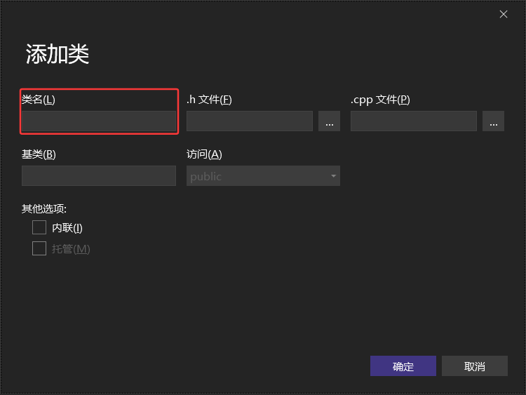

### 21.3.1 Word类

```cpp
//Word.cpp
#include "Word.h"
Word::Word(string s) : s(s){}
string Word::getWord() const {
	return s;
}
bool Word::operator<(const Word& a) const {
	return s < a.getWord();
}
bool Word::operator==(string s) {
	return this->s == s;
}
```

```cpp
//Word.h
#pragma once
#include<iostream>
#include<string>
using namespace std;
//Word单词基础类
class Word{
public:
	Word(string s);
	string getWord()const;
	bool operator < (const Word& a)const;
	bool operator == (string s);
private:
	string s;
};
```

### 21.3.2 WordMap类

```cpp
//WordMap.cpp
#include "WordMap.h"
bool WordMap::wordmap_add(string s) {
	map<Word, int>::iterator it = map_t.find(s);
	//如果找不到该单词，则创建新的pair进行计数
	if (it == map_t.end()) {
		pair<Word, int> p(Word(s), 1);
		map_t.insert(p);
	}
	//如果已有，则计数++
	else {
		it->second++;
	}
	return 1;
}
void WordMap::show() {
	for (map<Word, int>::iterator it = map_t.begin(); it != map_t.end(); it++) {
		cout << it->first.getWord() << ":出现了 " << it->second << "次." << endl;
	}
}
```

```cpp
//WordMap.h
#pragma once
#include <iostream>
#include <map>
#include "Word.h"
//统计单词个数
class WordMap{
private:
	map<Word, int> map_t;
public:
	bool wordmap_add(string s);
	void show();
};
```

### 21.3.3 WordSet类

```cpp
//WordSet.cpp
#include "WordSet.h"
bool WordSet::wordset_add(string s) {
	set_1.insert(Word(s));
	return 1;
}
void WordSet::show() {
	for (auto i = set_1.begin(); i != set_1.end(); i++) {
		cout << i->getWord() << " ";
	}
}
```

```cpp
//WordSet.h
#pragma once
#include <iostream>
#include "Word.h"
#include <set>
using namespace std;
//统计单词种类
class WordSet{
private:
	set<Word> set_1;
public:
	bool wordset_add(string s);
	void show();
};
```

### 21.3.4 mycode类

```cpp
//mycode.cpp
#include "mycode.h"
//建立集合和映射的实例对象
WordSet set_s;
WordMap map_m;
void showData() {
	cout << endl;
	cout << "单词集合为：" << endl;
	set_s.show();
	cout << endl;
	cout << "单词集合及出现次数：" << endl;
	map_m.show();
	cout << endl;
}
//打开文件读入数据，装入集合
void dataProcessing() {
	//打开文件，读取文本
	int pos = 0;
	string s = " ";
	string delimet = ",.?";	//去除符号

	//把data.txt的内容直接展示出来
	ifstream inp;
	inp.open("data.txt", ios::in);
	char c;
	while (inp.peek() != EOF) {
		inp.read(&c, 1);
		cout << c;
	}
	inp.close();
	//把data.txt文件内的单词进行分割，装入set和map
	ifstream in("data.txt", ios::in);
	while (!in.eof()) {
		getline(in, s);	//读取每一行
		if (s == " ") {	//如果是空格，则继续读取下一行
			continue;
		}
		pos = 0;
		while ((pos = s.find_first_of(delimet, pos)) != string::npos) {	//根据delimet所设置的，将符号找出来
			s.replace(pos, 1, " ");		//并将其替换成空格
		}
		istringstream string(s);
		while (!string.eof()) {
			string >> s;
			if (s == " ") {
				continue;
			}
			set_s.wordset_add(s);
			map_m.wordmap_add(s);
		}
	}
	in.close();
}
```

```cpp
//mycode.h
#pragma once
#include "Word.h"
#include "WordMap.h"
#include "WordSet.h"
#include <sstream>
#include <iterator>
#include <fstream>
#include <algorithm>
#include <numeric>
#include <iostream>
using namespace std;

void dataProcessing();
void showData();
```

### 21.3.5 调试部分

```cpp
#include <iostream>
#include "mycode.h"
using namespace std;

int main() {
	dataProcessing();
	showData();

	return 0;
}
```

注：需要在项目文件夹中创建data.txt文件，并在文件中输入相应的内容即可。


# Chapter 22 C++新特性

## 22.1 C++11

### 22.1.1 自动类型推断auto

在C++11之前，auto关键字用来指定存储器。在新标准中，它的功能变为类型推断。auto现在成了一个类型的占位符，通知编译器去根据初始化代码推断所声明变量的真实类型。各种作用域内声明变量都可以用到它。例如，名空间中、程序块中或是for循环的初始化语句中

```cpp
int x = 0;
const auto n = x;
auto f = n;
const auto& r1 = x;
auto& r2 = r1;
```

1. 第2行代码中，n为`const int`，auto被推导为int。
2. 第3行代码中，n为`const int`类型，但是auto被推导为int类型，这说明：当 '=' 右边的表达式带有const属性时，auto不会使用const属性，而是直接推导出`non-const`类型。
3. 第4行代码中，auto被推导为int类型
4. 第5行代码中，r1是`const int &`类型，`auto`也被推导为`const int`类型，这说明：当`const`和引用结合时，`auto`的推导将保留表达式的`const`类型。

总结：

1. 当类型不为引用时，auto的推导结果将不保留表达式的`const`属性；
2. 当类型为引用时，auto的推导结果将保留表达式的`const`属性。

auto除了可以独立使用，还可以和某些具体类型混合使用，这样auto表示的就是"半个"类型，而不是完整的类型：

```cpp
int x = 0;
auto *pt1 = &x;	//pt1为int*, auto推导为int
auto pt2 = &x;	//pt2为int*, auto推导为int*
auto &r1 = x;	//r1为int&, auto推导为int
auto r2 = r1;	//r2为int, auto推导为int
```

:arrow_right:auto的使用限制

1. auto不能在函数的参数中使用；(在C++11的时候不允许，但C++14开始可以让普通函数具备返回值推导)
2. auto不能作用于类的非静态成员变量；(也就是没有static关键字修饰的成员变量)
3. auto不能作用于模板参数；
4. auto不能用于推导数组类型

### 22.1.2 decltype

在C++中，decltype作为操作符，用于查询表达式的数据类型。主要是为泛型编程而设计，以解决泛型编程中，由于有些类型由模板参数决定，而难以（甚至不可能）表示的问题。
decltype关键字是为了解决auto关键字只能对变量进行类型推导的缺陷而出现的。它的用法和sizeof很相似。
在此过程中，编译器分析表达式并得到它的类型，却不实际计算表达式的值。有时候，我们可能需要计算某个表达式的类型。

如果我们想要使用Lambda表达式的类型就需要使用decltype。

```cpp
auto num1 = 100;
auto num2 = 200;
decltype(num1 + num2)num3;	//num3的类型就是num1+num2最终的结果的类型。
cout << typeid(num3).name() << endl;
```

```cpp
template<class R, class T, class U>
R add(T t, U u){
	return t + u;
}
int main(){
    int v1 = 100;
    int v2 = 2.33;
    auto v3 = add<decltype(v1 + v2)>(v1, v2);
    cout << v3 << endl;
    return 0;
}
```

:question:下面这段代码正确吗

```cpp
template <typename T, typename U>
decltype(t + u) add(T t, U u){
	return t + u;
}
```

肯定是不正确的，C++的语法是前置语法，在返回值定义的时候参数变量还不存在，此时报错！
那有没有什么办法使得其变正确呢？:arrow_right:通过使用尾随法，也就是go语言中的方式

```cpp
template <typename T, typename U>
auto add(T t, U u)->decltype(t + u){	//尾随返回类型
	return t + u;
}
//从C++14开始，可以直接写成
template <typename T, typename U>
auto add(T t, U u){
	return t + u;
}
```

### 22.1.3 右值引用&&

在C++98中提出了引用的概念，引用就是别名，引用变量与其引用实体公共同一块内存空间，而引用的底层是通过指针来实现的，因此使用引用，可以提高程序的可读性。

比如交换两个变量的值，消除两个对象交互时不必要的对象拷贝，节省运算存储资源，提高效率。

```cpp
void change(int& num1, int& num2){
	int tmp = num1;
	num1 = num2;
	num2 = tmp;
}
```

为了提高程序运行效率，C++11中引入了右值引用，右值引用也是别名，但其只能对右值引用。

```cpp
int func(int v1, int v2){
    return v1 + v2;
}
int main(){
	const int&& num1 = 10;
    //引用函数返回值，返回值是一个临时变量，是右值
    int&& num2 = func(10, 20);
    cout << num1 << " " << num2 << endl;
}
```

一般认为，左值可以放在赋值符号的左边，右值可以放在赋值符号的右边；或者能够取地址的称为左值，不能取地址的称为右值；左值也能放在赋值符号的右边，但是右值只能放在赋值符号的右边。

```cpp
int num = 100;
//函数的返回值结果为引用
int& returnNum(){
    return num;
}
int main(){
    int num2 = 10;
    int num3 = num2;
    int* p = new int(0);
    //num2和num3, p和*p都是左值，左值既可以放在"="的左侧，也可以放在"="的右侧。
    const int num4 = 30;
    //num4 = num1;
    //特例：num4虽然是左值，但是为const常量，只读不允许被修改
    cout << &num4 << endl;
    //num4可以取地址，所以严格上说，num4也是左值
    //num3 + 2 = 200;
    //Compier Error:因为num3 + 2的结果是一个临时变量，没有具体名称，也不能取地址，因此为右值
    returnNum() = 111;
}
```

### 22.1.4 移动语义

移动语义可以将资源（堆、系统对象等）从一个对象转移到另一个对象，这样可以减少不必要的临时对象的创建、拷贝及销毁。移动语义与拷贝语义是相对的，可以类比文件的剪切和拷贝。在现有C++机制中，自定义的类要实现转移语义，需要定义移动构造函数，还可以定义转移赋值操作符。

```cpp
//以string类的移动构造函数为例
MyString(MyString&& str){
	cout << "move ctor source from" << str.data << str.data << endl;
    len = str.len;
    data = str.data;
    str.len = 0;
    str.data = NULL;
}
```

:arrow_right:和拷贝构造函数类似，需注意：

1. 参数(右值)的符号必须是&&；
2. 参数(右值)不可以是常量，因为需要修改右值
3. 参数(右值)的资源链接和标记必须修改，否则，右值的析构函数就会释放资源，转移到新对象的资源也就无效了

:arrow_right:标准库函数`std::move`可以将左值变成一个右值

编译器只对右值引用才能调用移动构造函数，那么如果已知一个命名对象不再被使用，若此时仍然想调用它的移动构造函数，也就是把一个左值引用当成右值引用来使用，该怎么做呢？就是使用`std::move`，这个函数以非常简单的方式将左值引用转换为右值引用。

### 22.1.5 列表初始化

统一列表初始化的使用：在C++98中，标准允许使用花括号{}对数组元素进行统一的列表初始值设定。比如：
`int arr1[] = {1,2,3,4,5};`
`int arr2[100] = {0};`

但对于一些自定义类型却不行，例如：`vector<int> vc{1,2,3,4,5};`在C++98中是无法编译成功的，只能够定义vector对应之后通过循环进行插入元素达到这个目的。

在C++11扩大了用大括号扩起的列表{初始化列表}的使用范围，使其可用于所有的内置类型和用户自定义类型，使用初始化列表时，可添加等号（=），也可以不添加。

```cpp
#include<iostream>
#include<vector>
#include<map>
using namespace std;
class ClassNum {
public:
	ClassNum(int n1 = 0, int n2 = 0): _x(n1),_y(n2){}
private:
	int _x;
	int _y;
};
int main() {
	int num1 = { 100 };	//定于内置类型
	int num2(3);	//也可以不加=
	//数组
	int arr1[5] = { 1,3,4,5,6 };
	int arr2[] = { 4,5,6,7,8 };
	//STL中的容器
	vector<int> v{ 12,2 };
	map<int, int>mp{ {1,2},{3,4} };
	//自定义类型初始化
	ClassNum p{ 1,2 };
}
```

### 22.1.6 For each

C++11中引入了基于范围的迭代写法，拥有了能够写出想Python类似的简洁的循环语句。

```cpp
vector<int> v1 = {1,2,3,4,5,6};
for(auto i : v1){
    cout << i << " ";
}
```

### 22.1.7 Lambda

Lambda表达式实际上是一个匿名类函数，在编译时会将表达式转换为匿名类函数。

`[capture-list](parameters)mutable -> return-type{ statement }`//\[捕获列表](参数)->返回值{函数体}

①`[capture-list]`：捕捉列表，该列表总是出现在Lambda函数的开始位置，编译器根据[]来判断接下来的代码是否为Lambda函数，捕捉列表能够捕捉上下文中的变量供Lambda函数使用（不能省略）。
②`(paramters)`：参数列表。与普通函数的参数列表一致，如果不需要参数传递，则可以连同"()"一起省略
③`mutable`：默认情况下，Lambda函数总是一个const函数，mutable可以取消其常量性。使用该修饰符时，参数列表不可省略（即使参数为空），mutable放在参数列表和返回值之间。
④`->returntype`：返回值类型。用追踪返回类型形式声明函数的返回值类型，没有返回值时此部分可省略。返回值类型明确情况下，也可以省略，由编译器对返回类型进行推导。
⑤`{statement}`：函数体。在该函数体内，除了可以使用其参数外，还可以使用所有捕获到的变量。（不能省略）

#### 22.1.7.1 捕捉列表说明

捕获列表描述了上下文中哪些数据可以被Lambda使用，以及使用的方式是传值还是传引用。

1. [a, &b]：其中a以复制捕获，而b以引用捕获。
2. [this]：以引用捕获当前对象(*this)。
3. [&]：以引用捕获所有用于Lambda体内的自动变量，若存在，则以引用捕获当前对象。
4. [=]：以复制捕获所有用于Lambda体内的自动变量，若存在，则以复制捕获当前对象。
5. []：不捕获，大部分情况下不捕获就可以了。

在Lambda函数定义中，参数列表和返回值类型都是可选部分，而捕捉列表和函数体可以为空。(在C++11中最简单的Lambda函数是：[]{};但该Lambda函数不能做任何事情，没有意义。)

```cpp
#include<iostream>
void(*FP)();	//函数指针
int main(){
    //最简单的Lambda表达式，无意义
    []{};
    //省略参数列表和返回值类型，返回值类型由编译器推导为int
    int num1 = 3, num2 = 4;
    //省略了返回值类型，无返回值类型
    auto func1 = [&num1, &num2](int num3) {num2 = num1 + num3;};
    func1(100);
    cout << num1 << " " << num2 << endl;
    //捕捉列表可以是Lambda表达式
    auto func = [func1] {cout << "great" << endl;};
    func();
    //各部分都很完善的Lambda函数
    auto func2 = [=, &num2](int num3)->int {return num2 += num1 + num3;};
    cout << func2(10) << endl;
    //复制捕捉x
    int x = 10;
    auto add x = [x](int a)mutable {x *= 2; return a + x;};
    cout << add_x(10) << endl;
    //编译失败-->提示找不到operator=()
	//auto func3 = [&num1, &num2](int num3) {num2 = num1 + num3;};
    //func1 = func3;
    //允许使用一个Lambda表达式拷贝构造一个新的副本
    auto func3(func);
    func();
    //可以将Lambda表达式赋值给相同类型的函数指针
    auto f2 = []{};
    FP = f2;
    FP();
}
```

#### 22.1.7.2 函数对象与Lambda表达式

从使用方式上来看，函数对象与Lambda表达式完全一样。

```cpp
#include<iostream>
using namespace std;
class Rate{
public:
    Rare(double rate) : _rate(rate){}
    double operator()(double money, int year){
        return money * _rate * year;
    }
private:
	double_rate;    
}
int main(){
	//函数对象
    double rate = 0.6;
    Rate r1(rate);
    double rd = r1(20000, 2);
    cout << rd << endl;
    //Lambda
    auto r2 = [=](double monty, int year)->double {return monty * rate * year;};
    double rd2 = r2(20000, 2);
    cout << rd2 << endl;
    return 0;
}
```

#### 22.1.7.3 排序

在C++98中，对一个数据集合中的元素进行排序，可以使用sort方法。

```cpp
#include<iostream>
#include<algorithm>
#include<functional>
using namespace std;
int main(){
	int array[] = {3,6,9,5,4,7,0,8,2,1};
    //默认按照小于比较，排出来结果是升序
    sort(array, array + sizeof(array) / sizeof(array[0]));
    //如果需要降序，需要改变元素的比较规则
    sort(array, array + sizeof(array) / sizeof(array[0]), greater<int>());
    return 0;
}
```

但是如果待排元素为自定义类型，需要用户定义排序时的比较规则

```cpp
#include<iostream>
#include<algorithm>
#include<functional>
using namespace std;
struct Goods{
    string name;
    double price;
};
struct Compare{
    bool operator()(const Goods& gl, const Goods& gr){
        return gl.price <= gr.price;
    }
};

int main(){
    Goods gds[] = {{"apple", 5.1},{"orange", 9.2},{"banana", 3.6},{"pineapple", 9.6}};
    sort(gds, gds + sizeof(gds) / sizeof(gds[0]), Compare());
    for(int i = 0; i < 4; i++){
        cout << gds[i].name << " " << gds[i].price << endl;
    }
    return 0;
}
```

用Lambda表达式，代码如下

```cpp
#include<iostream>
#include<algorithm>
#include<functional>
using namespace std;
struct Goods{
    string name;
    double price;
};
int main(){
    Goods gds[] = {{"apple", 5.1},{"orange", 9.2},{"banana", 3.6},{"pineapple", 9.6}};
     sort(gds, gds + sizeof(gds) / sizeof(gds[0]), [](const Goods& l, const Goods& r)->bool{
         return l.price < r.price;
     });
    for (int i = 0; i < 4; i++){
        cout << gds[i].name << " " << gds[i].price << endl;
    }
    return 0;
}
```

### 22.1.8 智能指针

垃圾回收机制得到了诸多编程语言的支持，例如Java、Python、C#、PHP等。而C++虽然从来没有公开支持过垃圾回收机制，但在C++98/03标准中，支持使用`auto_ptr`智能指针来实现堆内存的自动回收；C++11新标准在废弃`auto_ptr`的同时，新增了`unique_ptr`、`shared_ptr`以及`weak_ptr`这3个智能指针来实现堆内存的自动回收。

所谓智能指针，从字面上的意思理解为"智能"的指针。具体来讲，智能指针和普通指针的用法是相似的，不同之处在于，智能指针可以在适当的时机释放分配的内存。使用智能指针可以很好的避免"忘记释放内存而导致内存泄漏"的问题出现。

#### 22.1.8.1 shared_ptr

智能指针都是以类模板的方式实现的，`shared_ptr<T>`(T表示指针指向的具体数据类型)的定义位于`<memory>`头文件，并位于std命名空间中。
和`unique_ptr`、`weak_ptr`的不同之处在于，多个`shared_ptr`智能指针可以**共同使用同一块堆内存**。并且，由于该类型智能指针在实现上采用的是引用计数机制，即使有一个`shared_ptr`指针放弃了堆内存的"使用权"（引用计数减1），也不会影响其他指向同一堆内存的`shared_ptr`指针（只有引用计数为0时，堆内存才会被自动释放）

- `shared_ptr`的创建

```cpp
//shared_ptr<T>类模板中，提供了多种实用的构造函数
shared_ptr<int> p1;	//不传入任何实参
shared_ptr<int> p2(nullptr);	//传入空指针nullptr
//空的shared_ptr指针，其初始引用计数为0，而不是1。
shared_ptr<int> p(new int(5));	//在构建shared_ptr智能指针，也可以明确其指向
//C++11标准中还提供了std::make_shared<T>模板函数，其可以用于初始化shared_ptr智能指针
shared_ptr<int> p = make_shared<int>(5);

//shared_ptr<T>模板还提供有相应的拷贝构造函数和移动构造函数
shared_ptr<int> p3;
shared_ptr<int> p4(p3);	//调用拷贝函数
shared_ptr<int> p5(move(p4));	//调用移动构造函数
```

在初始化`shared_ptr`智能指针时，还可以自定义所指堆内存的释放规则，这样当堆内存的引用计数为0时，会优先调用自定义的释放规则。
在某些应用场景中，自定义释放规则是很有必要的。比如，对于申请的动态数组来说，`shared_ptr`指针默认的释放规则是不支持释放数组的，只能自定义对应的释放规则，才能正确的释放申请的堆内存。
对于申请的动态数组，释放规则可以使用C++11标准中提供的`default_delete<T>`，我们也可以自定义释放规则

```cpp
#include<iostream>
using namespace std;
void deleteInt(int* p){
	delete[]p;
}
int main(){
    //指定default_delete作为释放规则
    shared_ptr<int> p1(new int[3], default_delete<int[]>());
    //初始化智能指针，并自定义释放规则
    shared_ptr<int> p2(new int[3], deleteInt);
    return 0;
}
```

#### 22.1.8.2 unique_ptr

`unique_ptr`指针也具备<u>在适当时机自动释放堆内存空间</u>的能力，和`shared_ptr`指针最大的不同之处在于，`unique_ptr`指针指向的堆内存无法同其他`unique_ptr`共享，每个`unique_ptr`指针都独自拥有对其所指堆内存空间的所有权。

#### 22.1.8.3 weak_ptr

`shared_ptr`是采用引用计数的智能指针，多个`shared_ptr`实例可以指向同一个动态对象，并维护了一个共享的引用计数器。

对于引用计数法实现的计数，总是避免不了循环引用的问题，`shared_ptr`也不例外。

```cpp
#include <iostream>
using namespace std;
class CB;
class CA{
public:
    CA() { cout << "CA() called!" << endl; }
    ~CA() { cout << "~CA() called!" << endl; }
    void set_ptr(shared_ptr<CB>& ptr) { m_ptr_b = ptr; }
    void b_use_count() { cout << "b use count: " << m_ptr_b.use_count() << endl; }
    void show() { cout << "this is class CA!" << endl; }
private:
    shared_ptr<CB> m_ptr_b;
};
class CB{
public:
    CB() { cout << "CB() called!" << endl; }
    ~CB() { cout << "~CB() called!" << endl; }
    void set_ptr(shared_ptr<CA>& ptr) { m_ptr_a = ptr; }
    void a_use_count() { cout << "a use count: " << m_ptr_a.use_count() << endl; }
    void show() { cout << "this is class CB!" << endl; }
private:
    shared_ptr<CA> m_ptr_a;
};

int main(){
	shared_ptr<CA> ptr_a(new CA());
    shared_ptr<CB> ptr_b(new CB());
    cout << "a use count:" << ptr_a.use_count() << endl;
    cout << "b use count:" << ptr_b.use_count() << endl;
    ptr_a->set_ptr(ptr_b);
    ptr_b->set_ptr(ptr_a);
    cout << "a use count:" << ptr_a.use_count() << endl;
    cout << "b use count:" << ptr_b.use_count() << endl;
    return 0;
}
```

可以看到最后两个类都没有被析构，这个时候，可以用`weak_ptr`来解决问题，可以把两个类中的一个成员变量改为`weak_ptr`对象即可。`weak_ptr`不会增加应用计数，所以引用就构不成环。

将任意一个类中的private内改为`weak_ptr<CB> m_ptr_b;`即可。

### 22.1.9 可变类型模板
